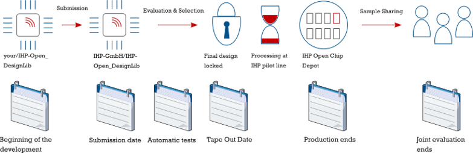

{: .no_toc }
# 1.2 Introduction to the PDKs

{: .no_toc }

<details open markdown="block">
  <summary>
    Table of contents
  </summary>
  {: .text-delta }
- TOC
{:toc}
</details>

## Introduction to PDK

A Process Design Kit (PDK) is a crucial component in the semiconductor industry, used to model a fabrication process for the design tools that are used to create an integrated circuit. The PDK is created by the foundry, which defines a certain technology variation for their processes. It is then passed on to their customers to use in the design process. 

Previously, PDK data is proprietary which is protected behind the non-disclosure agreement. Proprietary PDK data and commercial EDA tools are two main roadblocks in Integrated Circuit Design and Collaboration because it prevents the design to be shared among partners.
<!--
Open-source PDK for Skywater 130nm Technology was released as a result of a collaboration between SkyWater, Efabless, and Google. It’s based on SkyWater’s 130nm CMOS technology. The partnership gave designers worldwide free access to design technology to create new, manufacturable designs. The open-source PDK can be used to share designs and to collaborate among partners. A large number of designs has been published as open-source design using this PDK in Google Open MPW program through Efabless.

The SKY130 PDK is unique because it’s the industry’s first open-source PDK. It has revolutionized technology realization by lowering barriers to IC design. It has also paved a new path for global workforce development.

The SKY130 PDK is targeted at the SKY130 process node. More advanced technology nodes may become available in the future. The SkyWater Open Source PDK documentation can be found at their official website.
-->
The use of open-source PDKs like IHP SG13G2 and SKY130 has significantly reduced the cost of IC design, making it accessible to more people. The Google-sponsored Open Multi Project Wafer, or Open MPW, Shuttle Program has enabled market-relevant designs to be fabricated by people who traditionally would not have had the opportunity to design a chip.

## Contents of a PDK

A typical PDK contains:
- A primitive device library: a collection of basic components that are used in the design process.
- Symbols: graphical representations of the components in the library.
- Device parameters: specific characteristics of the devices in the library.
- PCells or parameterized cells which are circuit elements that can be adjusted based on the needs of the design.
- Verification checks including Design Rule Checking (DRC), Layout Versus Schematic (LVS), Antenna and Electrical rule check.
- Technology data including layers, layer names, layer/purpose pairs, colors, fills, and display attributes.
- Process constraints: the limitations imposed by the fabrication process.
- Technology files for EDA tools.
- Simulation models of primitive devices (SPICE or SPICE derivatives): models used for simulating the behavior of the devices.

The PDK may also include standard cell libraries from the foundry, a library vendor, or developed internally. These libraries can include LEF format of abstracted layout data, symbols, library (.lib) files, and GDSII layout data.

The data in the PDK is specific to the foundry’s process. An accurate PDK will increase the chances of first-pass successful silicon. Therefore, a PDK is a critical tool in IC design, providing the necessary information and resources to design, simulate and verify the design before handing the design back to the foundry to tape out.

## IHP SG13G2 PDK

<!--`open_pdks` is a set of scripts to convert from the technological data provided by the foundry into the formats that can be used with the open-source design tools. Currently, `open_pdks` support Skywater 130nm Technology and Global Foundry 180nm technology.
Skywater 130nm PDK is used in this course.

The current version of Skywater 130nm support two technology flavors which are Sky130A and Sky130B. The main difference between Sky130A and Sky130B is that Sky130A supports resistive memory (ReRAM) devices. By default, Sky130A will be used.

The current version of Open PDK for Skywater 130nm technology support the following tools:
- irsim
- klayout
- magic
- netgen
- openlane
- qflow
- xcircuit
- xschem
-->

- [Github repo](https://github.com/IHP-GmbH/IHP-Open-PDK/)

- [PDK docs](https://ihp-open-pdk-docs.readthedocs.io/en/latest/index.html)

- [Open libraries](https://github.com/IHP-GmbH/IHP-Open-DesignLib)
<!-- 
Tapeouts:

- November 2024: [Link](https://github.com/IHP-GmbH/TO_Apr2025)

- April 2025: [Link](https://github.com/IHP-GmbH/TO_Apr2025)

- Next tapeout: `September 2025`.


-->
### IHP SG13 Options

| **SiGe-HBT**           | SG13S              | SG13G2             | SG13G3Cu           |
|------------------------|--------------------|--------------------|--------------------|
| f<sub>T</sub> / f<sub>max</sub> | 250 / 340 GHz     | 350 / 450 GHz     | 470 / 650 GHz     |
| W<sub>Emitter</sub>    | 170 nm             | 130 nm             | 110 nm             |
| HBT BV<sub>CEO</sub>   | 1.7 V              | 1.6 V              | 1.5 V              |
| **CMOS node**          | **130 nm**         | **130 nm**         | **130 nm**         |
| Active devices         | Schottky diodes, Antenna diodes, PN diodes, ESD | Schottky diodes, Antenna diodes, PN diodes, ESD | Schottky diodes, Antenna diodes, PN diodes, ESD |
| Varactors              | NMOS Varactor      | NMOS Varactor      | NMOS Varactor      |
| Resistors              | Poly-Si, Thin Film | Poly-Si, Thin Film | Poly-Si            |
| MIM Caps               | 1.5 fF / µm² (Al), 2.1 fF / µm² (Cu) | 1.5 fF / µm² (Al), 2.1 fF / µm² (Cu) | 2.1 fF / µm²       |
| Metallization          | 7 Layers AL incl. 2 & 3 µm layers or *Cu: 4 + 2 (3µm), AL: 2 (3µm) | 7 Layers AL incl. 2 & 3 µm layers or *Cu: 4 + 2 (3µm), AL: 2 (3µm) | 7 Layers AL incl. 2 & 3 µm layers or *Cu: 4 + 2 (3µm), AL: 2 (3µm) | *Cu BEOL from X FAB

### PDK Contents

#### PDK tech files for opensource tools

- DRC/LVS with KLayout

- DRC/Extraction with Magic

- Model files for Xyce / NgSpice

- Symbols for Xschem / Qucs-S

- Tech files for digital flow with OpenRoad

- Electromagnetic estimation with OpenEMS

#### IO Cells

#### Primitive cells’ layout

#### Single-port SRAM

#### Standard cells

- HV CMOS

- LV CMOS

```
ihp-sg13g2
├── sg13g2_io
│   ├── cdl
│   ├── doc
│   ├── gds
│   ├── lef
│   ├── lib
│   ├── spice
│   ├── verilog
│   └── xschem
├── sg13g2_pr
│   └── gds
├── sg13g2_sram
│   ├── cdl
│   ├── doc
│   ├── gds
│   ├── lef
│   ├── lib
│   └── verilog
└── sg13g2_stdcell
    ├── cdl
    ├── doc
    ├── gds
    ├── lef
    ├── lib
    ├── spice
    └── verilog
```

```
IHP-Open-PDK / ihp-sg13g2 / libs.tech
.
├── digital @ 9a6e7c9
├── klayout
├── magic
├── netgen
├── ngspice
├── openems
├── openroad
├── qucs
├── verilog-a
├── xschem
└── xyce/models
```

#### Transistor Structure & Metal Scheme

TEM cross section of 1T-1R Test strcture fabricated in 130m CMOS technology of IHP


- Metal scheme


<!-- 
#### Install the PDK (Manually)

Checkout the PDK:

```sh
$ git clone https://github.com/IHP-GmbH/IHP-Open-PDK
```

Install the required tools:

- Python 3.10.12

- openvaf 23.5.0

- ngspice 43

- Xyce 7.8-opensource

- xschem 3.4.5

- qucs-s s24.3.0 (12ddd12b)

- klayout 0.29.2

- openEMS v0.0.35-108-gc651cce

- magic 8.3.508

Build the simulation model 

```sh
$ cd ihp-sg13g2/libs.tech/xschem && ./install.py
```
-->
<!--
### Open PDK folder structure
The following is the PDK structure:

```text
sky130A
├── SOURCES
├── libs.ref
│   ├── sky130_fd_io
│   ├── sky130_fd_pr
│   ├── sky130_fd_sc_hd
│   ├── sky130_fd_sc_hvl
│   ├── sky130_ml_xx_hd
│   └── sky130_sram_macros
└── libs.tech
    ├── irsim
    ├── klayout
    ├── magic
    ├── netgen
    ├── openlane
    ├── qflow
    ├── xcircuit
    └── xschem
```

- `libs.ref` contains the reference data from the foundry and standard cell libraries. It also contains the hard macro for SRAM.
    * `sky130_fd_io` contains the IO libraries
    * `sky130_fd_pr` contains the primitive devices of Skywater 130nm technology
    * `sky130_fd_sc_hd`/`sky130_fd_sc_hvl` are the standard cell libraries which contain the logic gates such as NAND, NOR, AND, OR, Latch, Flip-flops and so on.
    * `sky130_sram_macros` contains some predefined SRAM models generated from OpenRAM memory compilers.
- `libs.tech` contains the technology files to be used with different EDA tools. The subfolder are organized as follows:
    * `openlane` contains the tech files for digital design implementation using `openlane` flow
    * `xschem` contains the configurations for schematic capture in `Xschem`
    * `klayout` has the tech files to layout a circuit and run DRC/LVS on it
    * `magic` contains the configuration files for `Magic` to layout a circuit or perform DRC/Parasitic extraction.
    * `netgen` contains the configuration files to perform LVS in netgen

{: .note-title}
> Note for Klayout
>
> The tech files for `klayout` to layout circuits (as of August 9th 2024) only work with an old version of `gdsfactory==6.33.0` and `pydantic==1.10` with some modifications.
-->
## References

1. [Skywater PDK documentation](https://skywater-pdk.readthedocs.io/en/main/).
2. Tim Ansell, [Google/Skywater-pdk -- Open source manufacturable PDK for Skywater 130nm process node](https://j.mp/rv20-sky130), 2020. [Video](https://youtu.be/N9ovAYC5_QY).
3. Tim Edwards, [Introduction to the SkyWater PDK](https://isn.ucsd.edu/courses/beng207/lectures/Tim_Edwards_2021_slides.pdf), 2021.