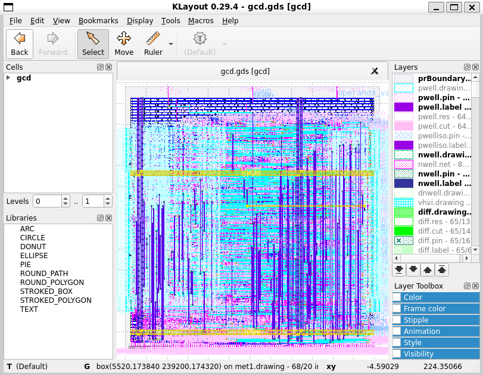

# 2.1 Digital design tools on Linux or WSL using Docker

{: .no_toc }

<details open markdown="block">
  <summary>
    Table of contents
  </summary>
  {: .text-delta }
- TOC
{:toc}
</details>

{: .video}
> <iframe width="700" height="360" src="https://www.youtube.com/embed/PN1tbY9R4Hc" title="2.1 Digital design tools on Linux or WSL using Docker" frameborder="0" allow="accelerometer; autoplay; clipboard-write; encrypted-media; gyroscope; picture-in-picture; web-share" referrerpolicy="strict-origin-when-cross-origin" allowfullscreen></iframe>

## Install and start Docker service

{: .no_toc}
##### 1. Install docker service

Install docker by following the instruction here: https://docs.docker.com/engine/install/ubuntu/

This is the commands to install Docker in Ubuntu 22.04:

{: .shellcmd}
> 
> ```bash
> sudo apt-get install ca-certificates curl gnupg -q -y
> sudo install -m 0755 -d /etc/apt/keyrings
> curl -fsSL https://download.docker.com/linux/ubuntu/gpg | sudo gpg --dearmor -o /etc/apt/keyrings/docker.gpg
> sudo chmod a+r /etc/apt/keyrings/docker.gpg
> echo   "deb [arch="$(dpkg --print-architecture)" signed-by=/etc/apt/keyrings/docker.gpg] https://download.docker.com/linux/ubuntu "$(. /etc/os-release && echo "$VERSION_CODENAME")" stable" | sudo tee /etc/apt/sources.list.d/docker.list > /dev/null
> sudo apt-get update -q
> sudo apt-get install -q -y docker-ce docker-ce-cli containerd.io  docker-buildx-plugin docker-compose-plugin
> ```

{: .cmdout}
> ```
> cass@unic-cass:~$ sudo apt-get install ca-certificates curl gnupg -q -y
> Reading package lists...
> Building dependency tree...
> Reading state information...
> ca-certificates is already the newest version (20230311ubuntu0.22.04.1).
> ca-certificates set to manually installed.
> curl is already the newest version (7.81.0-1ubuntu1.16).
> curl set to manually installed.
> gnupg is already the newest version (2.2.27-3ubuntu2.1).
> gnupg set to manually installed.
> 0 upgraded, 0 newly installed, 0 to remove and 2 not upgraded.
> 
> cass@unic-cass:~$ sudo install -m 0755 -d /etc/apt/keyrings
> cass@unic-cass:~$ curl -fsSL https://download.docker.com/linux/ubuntu/gpg | sudo gpg --dearmor -o /etc/apt/keyrings/docker.gpg
> cass@unic-cass:~$ sudo chmod a+r /etc/apt/keyrings/docker.gpg
> cass@unic-cass:~$ echo   "deb [arch="$(dpkg --print-architecture)" signed-by=/etc/apt/keyrings/docker.gpg] https://download.docker.com/linux/ubuntu "$(. /etc/os-release && echo "$VERSION_CODENAME")" stable" | sudo tee /etc/apt/sources.list.d/docker.list > /dev/null
> 
> cass@unic-cass:~$ sudo apt-get update -q
> Get:1 https://download.docker.com/linux/ubuntu jammy InRelease [48.8 kB]
> Hit:2 http://archive.ubuntu.com/ubuntu jammy InRelease
> Hit:3 http://archive.ubuntu.com/ubuntu jammy-updates InRelease
> Get:4 https://download.docker.com/linux/ubuntu jammy/stable amd64 Packages [36.4 kB]
> Hit:5 http://archive.ubuntu.com/ubuntu jammy-backports InRelease
> Hit:6 http://security.ubuntu.com/ubuntu jammy-security InRelease
> Fetched 85.3 kB in 1s (157 kB/s)
> Reading package lists...
> Reading package lists...
> Building dependency tree...
> Reading state information...
> 
> cass@unic-cass:~$ sudo apt-get install -q -y docker-ce docker-ce-cli containerd.io  docker-buildx-plugin docker-compose-plugin
> The following additional packages will be installed:
>   docker-ce-rootless-extras libslirp0 pigz slirp4netns
> Suggested packages:
>   aufs-tools cgroupfs-mount | cgroup-lite
> The following NEW packages will be installed:
>   containerd.io docker-buildx-plugin docker-ce docker-ce-cli docker-ce-rootless-extras docker-compose-plugin libslirp0 pigz slirp4netns
> 0 upgraded, 9 newly installed, 0 to remove and 2 not upgraded.
> Need to get 122 MB of archives.
> After this operation, 436 MB of additional disk space will be used.
> Get:1 https://download.docker.com/linux/ubuntu jammy/stable amd64 containerd.io amd64 1.7.19-1 [30.5 MB]
> Get:2 http://archive.ubuntu.com/ubuntu jammy/universe amd64 pigz amd64 2.6-1 [63.6 kB]
> ...
> Get:9 https://download.docker.com/linux/ubuntu jammy/stable amd64 docker-compose-plugin amd64 2.29.0-1~ubuntu.22.04~jammy [12.5 MB]
> Fetched 122 MB in 13s (9488 kB/s)
> Selecting previously unselected package pigz.
> (Reading database ... 44296 files and directories currently installed.)
> Preparing to unpack .../0-pigz_2.6-1_amd64.deb ...
> Unpacking pigz (2.6-1) ...
> Selecting previously unselected package containerd.io.
> Preparing to unpack .../1-containerd.io_1.7.19-1_amd64.deb ...
> Unpacking containerd.io (1.7.19-1) ...
> ...
> Selecting previously unselected package slirp4netns.
> Preparing to unpack .../8-slirp4netns_1.0.1-2_amd64.deb ...
> Unpacking slirp4netns (1.0.1-2) ...
> Setting up docker-buildx-plugin (0.16.1-1~ubuntu.22.04~jammy) ...
> Setting up containerd.io (1.7.19-1) ...
> Created symlink /etc/systemd/system/multi-user.target.wants/containerd.service → /lib/systemd/system/containerd.service.
> Setting up docker-compose-plugin (2.29.0-1~ubuntu.22.04~jammy) ...
> ...
> Setting up docker-ce (5:27.1.0-1~ubuntu.22.04~jammy) ...
> Created symlink /etc/systemd/system/multi-user.target.wants/docker.service → /lib/systemd/system/docker.service.
> Created symlink /etc/systemd/system/sockets.target.wants/docker.socket → /lib/systemd/system/docker.socket.
> Processing triggers for man-db (2.10.2-1) ...
> Processing triggers for libc-bin (2.35-0ubuntu3.8) ...
> cass@unic-cass-cass:~$ 
> ```

{: .no_toc}
##### 2. Start the docker service

If you use a real Linux system or a WSL Linux system with Systemd supported, you can start docker by running these commands:

{: .shellcmd}
> ```bash
> sudo systemctl start docker
> sudo systemctl enable docker
> ```

{: .cmdout}
> ```
> cass@unic-cass:~$ sudo systemctl start docker
> cass@unic-cass:~$ sudo systemctl enable docker
> Synchronizing state of docker.service with SysV service script with /lib/systemd/systemd-sysv-install.
> Executing: /lib/systemd/systemd-sysv-install enable docker
> ```

{: .no_toc}
##### 3. Add user to docker group

You will also need to add your user to docker group so that you have permission to pull the docker image as normal users:

{: .shellcmd}
> ```bash
> sudo gpasswd -a $USER docker
> ```

{: .cmdout}
> ```
> cass@unic-cass:~$ sudo gpasswd -a $USER docker
> Adding user cass to group docker
> ```

To get the above command taking effect, you have to log out:

{: .shellcmd}
> ```bash
> exit
> ```

After that, you can open a new shell and continue to the next section.

{: .note-title}
> For WSL users without Systemd support
> 
> If your WSL Ubuntu 22.04 does not have Systemd support, you can still run Docker using System-V init script using the following command: 
> 
> {: .shellcmd}
> > ```bash
> > sudo service docker start
> > ```

## Pull docker image and run a design example

{: .no_toc}
##### 4. Pull the docker image with `openlane` installed

After Docker has been successfully installed, we can use `docker pull` command to download the docker image from the Internet into our computer:

{: .shellcmd}
> ```bash
> docker pull efabless/openlane:latest
> ```

{: .cmdout}
> ```
> cass@unic-cass:~$ docker pull efabless/openlane:latest
> latest: Pulling from efabless/openlane
> 80531649488e: Pull complete
> 62eac020c046: Pull complete
> Digest: sha256:864d0fd6a2ac2e5caf83251dd25161d1049b740c02d16e4bfdfa1af93fc6fdfe
> Status: Downloaded newer image for efabless/openlane:latest
> docker.io/efabless/openlane:latest
> ```

{: .no_toc}
##### 5. Install volare to manage the `PDK`

The Docker image for Openlane does not contain the `PDK`. Therefore, we have to install volare to download and install the PDK. Volare can be installed using the following command:

{: .shellcmd}
> ```bash
> python3 -m pip install --upgrade --no-cache-dir volare
> ```

{: .cmdout}
> ```
> cass@unic-cass:~$ python3 -m pip install --upgrade --no-cache-dir volare
> Defaulting to user installation because normal site-packages is not writeable
> Collecting volare
>   Downloading volare-0.18.1-py3-none-any.whl (35 kB)
> Collecting pcpp<2,>=1.2
>   Downloading pcpp-1.30-py2.py3-none-any.whl (91 kB)
>      ━━━━━━━━━━━━━━━━━━━━━━━━━━━━━━━━━━━━━━━━ 91.1/91.1 KB 4.8 MB/s eta 0:00:00
> Collecting click<9,>=8.0.0
>   Downloading click-8.1.7-py3-none-any.whl (97 kB)
>      ━━━━━━━━━━━━━━━━━━━━━━━━━━━━━━━━━━━━━━━━ 97.9/97.9 KB 10.8 MB/s eta 0:00:00
> Collecting httpx>=0.22.0
>   Downloading httpx-0.27.0-py3-none-any.whl (75 kB)
>      ━━━━━━━━━━━━━━━━━━━━━━━━━━━━━━━━━━━━━━━━ 75.6/75.6 KB 12.1 MB/s eta 0:00:00
> Collecting rich<14,>=12
>   Downloading rich-13.7.1-py3-none-any.whl (240 kB)
>      ━━━━━━━━━━━━━━━━━━━━━━━━━━━━━━━━━━━━━━━━ 240.7/240.7 KB 8.1 MB/s eta 0:00:00
> Collecting zstandard<1,>=0.19.0
>   Downloading zstandard-0.23.0-cp310-cp310-manylinux_2_17_x86_64.manylinux2014_x86_64.whl (5.4 MB)
>      ━━━━━━━━━━━━━━━━━━━━━━━━━━━━━━━━━━━━━━━━ 5.4/5.4 MB 10.4 MB/s eta 0:00:00
> Requirement already satisfied: pyyaml<7,>=5 in /usr/lib/python3/dist-packages (from volare) (5.4.1)
> Collecting sniffio
>   Downloading sniffio-1.3.1-py3-none-any.whl (10 kB)
> Collecting certifi
>   Downloading certifi-2024.7.4-py3-none-any.whl (162 kB)
>      ━━━━━━━━━━━━━━━━━━━━━━━━━━━━━━━━━━━━━━━━ 163.0/163.0 KB 12.6 MB/s eta 0:00:00
> Collecting httpcore==1.*
>   Downloading httpcore-1.0.5-py3-none-any.whl (77 kB)
>      ━━━━━━━━━━━━━━━━━━━━━━━━━━━━━━━━━━━━━━━━ 77.9/77.9 KB 14.2 MB/s eta 0:00:00
> Collecting anyio
>   Downloading anyio-4.4.0-py3-none-any.whl (86 kB)
>      ━━━━━━━━━━━━━━━━━━━━━━━━━━━━━━━━━━━━━━━━ 86.8/86.8 KB 12.4 MB/s eta 0:00:00
> Collecting idna
>   Downloading idna-3.7-py3-none-any.whl (66 kB)
>      ━━━━━━━━━━━━━━━━━━━━━━━━━━━━━━━━━━━━━━━━ 66.8/66.8 KB 19.5 MB/s eta 0:00:00
> Collecting h11<0.15,>=0.13
>   Downloading h11-0.14.0-py3-none-any.whl (58 kB)
>      ━━━━━━━━━━━━━━━━━━━━━━━━━━━━━━━━━━━━━━━━ 58.3/58.3 KB 15.5 MB/s eta 0:00:00
> Collecting pygments<3.0.0,>=2.13.0
>   Downloading pygments-2.18.0-py3-none-any.whl (1.2 MB)
>      ━━━━━━━━━━━━━━━━━━━━━━━━━━━━━━━━━━━━━━━━ 1.2/1.2 MB 10.6 MB/s eta 0:00:00
> Collecting markdown-it-py>=2.2.0
>   Downloading markdown_it_py-3.0.0-py3-none-any.whl (87 kB)
>      ━━━━━━━━━━━━━━━━━━━━━━━━━━━━━━━━━━━━━━━━ 87.5/87.5 KB 12.7 MB/s eta 0:00:00
> Collecting mdurl~=0.1
>   Downloading mdurl-0.1.2-py3-none-any.whl (10.0 kB)
> Collecting typing-extensions>=4.1
>   Downloading typing_extensions-4.12.2-py3-none-any.whl (37 kB)
> Collecting exceptiongroup>=1.0.2
>   Downloading exceptiongroup-1.2.2-py3-none-any.whl (16 kB)
> Installing collected packages: pcpp, zstandard, typing-extensions, sniffio, pygments, mdurl, idna, h11, exceptiongroup, click, certifi, markdown-it-py, httpcore, anyio, rich, httpx, volare
>   WARNING: The script pcpp is installed in '/home/cass/.local/bin' which is not on PATH.
>   Consider adding this directory to PATH or, if you prefer to suppress this warning, use --no-warn-script-location.
>   WARNING: The script pygmentize is installed in '/home/cass/.local/bin' which is not on PATH.
>   Consider adding this directory to PATH or, if you prefer to suppress this warning, use --no-warn-script-location.
>   WARNING: The script markdown-it is installed in '/home/cass/.local/bin' which is not on PATH.
>   Consider adding this directory to PATH or, if you prefer to suppress this warning, use --no-warn-script-location.
>   WARNING: The script httpx is installed in '/home/cass/.local/bin' which is not on PATH.
>   Consider adding this directory to PATH or, if you prefer to suppress this warning, use --no-warn-script-location.
>   WARNING: The script volare is installed in '/home/cass/.local/bin' which is not on PATH.
>   Consider adding this directory to PATH or, if you prefer to suppress this warning, use --no-warn-script-location.
> Successfully installed anyio-4.4.0 certifi-2024.7.4 click-8.1.7 exceptiongroup-1.2.2 h11-0.14.0 httpcore-1.0.5 httpx-0.27.0 idna-3.7 markdown-it-py-3.0.0 mdurl-0.1.2 pcpp-1.30 pygments-2.18.0 rich-13.7.1 sniffio-1.3.1 typing-extensions-4.12.2 volare-0.18.1 zstandard-0.23.0
> ```

By default, volare will be installed into your home directory (`$HOME/.local/bin`). This default path might not be in your program search path yet. Therefore, it is recommended to add `$HOME/.local/bin` into your program search path: 

{: .shellcmd}
> ```bash
> echo 'export PATH=$HOME/.local/bin:$PATH' >> .bashrc
> source .bashrc
> ```

We can test if volare has been successfully installed by running this command:

{: .shellcmd}
> ```bash
> volare --version
> ```

{: .cmdout}
> ```
> cass@unic-cass:~$ echo 'export PATH=$HOME/.local/bin:$PATH' >> .bashrc
> cass@unic-cass:~$ source .bashrc
> cass@unic-cass:~$ volare --version
> volare, version 0.18.1
> ```

{: .no_toc}
##### 6. Set up the environment variables to install the `PDK`

Setup the `PDK_ROOT` and download the `PDK` using volare:

{: .shellcmd}
> ```bash
> export PDK_ROOT=$HOME/unic-cass/pdks
> export PDK=sky130A
> volare ls-remote --pdk sky130
> ```

{: .cmdout}
> ```
> cass@unic-cass:~$ export PDK_ROOT=$HOME/unic-cass/pdks
> cass@unic-cass:~$ export PDK=sky130A
> cass@unic-cass:~$ volare ls-remote --pdk sky130
> Pre-built sky130 PDK versions
> ├── 0fe599b2afb6708d281543108caf8310912f54af (2024.08.17)
> ├── PRE-RELEASE c887119ffa27d48613249b973a66dc667fe6ecd3 (2024.07.04)
> ├── PRE-RELEASE 31f6da2663f392b7472bdba39c1746170d293290 (2024.05.25)
> ├── PRE-RELEASE 4d5af10bfee4dab799566aaf903bb22aee69bac9 (2024.05.07)
> ├── PRE-RELEASE 42cd15c469adc1d303ffca4a7d32c29a4564a737 (2024.04.12)
> ├── 6d4d11780c40b20ee63cc98e645307a9bf2b2ab8 (2024.02.11)
> ├── bdc9412b3e468c102d01b7cf6337be06ec6e9c9a (2024.01.10)
> ├── d7979feb24bf08083dcf5c013be51adec8c0bcef (2024.01.08)
> ├── cd1748bb197f9b7af62a54507de6624e30363943 (2023.12.04)
> ...
> ```

{: .no_toc}
##### 7. Download the latest PDK using volare

The following command will download and install the latest PDK:

{: .shellcmd}
> ```bash
> volare enable --pdk sky130 0fe599b2afb6708d281543108caf8310912f54af
> ```

{: .cmdout}
> ```
> cass@unic-cass:~$ volare enable --pdk sky130 0fe599b2afb6708d281543108caf8310912f54af
> Version 0fe599b2afb6708d281543108caf8310912f54af not found locally, attempting to download…
> Downloading common.tar.zst… ━━━━━━━━━━━━━━━━━━━━━━━━━━━━━━━━━━━━━━━━ 100% 0:00:00
> Downloading sky130_fd_io.tar.zst… ━━━━━━━━━━━━━━━━━━━━━━━━━━━━━━━━━━━━━━━━ 100% 0:00:00
> Downloading sky130_fd_pr.tar.zst… ━━━━━━━━━━━━━━━━━━━━━━━━━━━━━━━━━━━━━━━━ 100% 0:00:00
> Downloading sky130_fd_sc_hd.tar.zst… ━━━━━━━━━━━━━━━━━━━━━━━━━━━━━━━━━━━━━━━━ 100% 0:00:00
> Downloading sky130_fd_sc_hvl.tar.zst… ━━━━━━━━━━━━━━━━━━━━━━━━━━━━━━━━━━━━━━━━ 100% 0:00:00
> Downloading sky130_ml_xx_hd.tar.zst… ━━━━━━━━━━━━━━━━━━━━━━━━━━━━━━━━━━━━━━━━ 100% 0:00:00
> Downloading sky130_sram_macros.tar.zst… ━━━━━━━━━━━━━━━━━━━━━━━━━━━━━━━━━━━━━━━━ 100% 0:00:00
> Version 0fe599b2afb6708d281543108caf8310912f54af enabled for the sky130 PDK.
> ```

## Run an example design

{: .no_toc}
##### 8. Generate the openlane configuration files and download the example design

After the PDK has been installed, now we can start a small example project. In this part, we choose to use a `GCD` design from UC Berkeley. Run the following command to create the Openlane template to implement the `GCD` design:

{: .shellcmd}
> ```bash
> mkdir gcd_example
> cd gcd_example
> docker run -it -v $(pwd):/gcd_example/ -v $PDK_ROOT:$PDK_ROOT \
>     -e PDK_ROOT=$PDK_ROOT -u $(id -u $USER):$(id -g $USER) \
>     efabless/openlane:latest
> cd /gcd_example
> flow.tcl -design gcd -init_design_config
> cd /gcd_example/openlane/gcd
> wget https://unic-cass.github.io/training/files/gcd.tar.gz
> tar xvf gcd.tar.gz
> rm gcd.tar.gz
> exit
> ```

{: .cmdout}
> ```
> cass@unic-cass:~$ mkdir gcd_example
> cass@unic-cass:~$ cd gcd_example
> cass@unic-cass:~/gcd_example$ docker run -it -v $(pwd):/gcd_example/ -v $PDK_ROOT:$PDK_ROOT \
> -e PDK_ROOT=$PDK_ROOT -u $(id -u $USER):$(id -g $USER) \
> efabless/openlane:latest
> OpenLane Container:/openlane% cd /gcd_example
> OpenLane Container:/gcd_example% flow.tcl -design gcd -init_design_config
> OpenLane 
> All rights reserved. (c) 2020-2023 Efabless Corporation and contributors.
> Available under the Apache License, version 2.0. See the LICENSE file for more details.
> 
> [SUCCESS]: openlane/gcd/config.json created with the default configuration. Please update the values as you see fit.
> OpenLane Container:/gcd_example% cd /gcd_example/openlane/gcd
> OpenLane Container:/gcd_example/openlane/gcd% wget https://unic-cass.github.io/training/files/gcd.tar.gz
> OpenLane Container:/gcd_example/openlane/gcd% tar xvf gcd.tar.gz 
> src/
> src/gcd.v
> src/gcd_datapath.v
> src/gcd_control.v
> OpenLane Container:/gcd_example/openlane/gcd% rm gcd.tar.gz
> OpenLane Container:/gcd_example/openlane/gcd% exit
> ```

{: .no_toc}
##### 9. Modify the templates with the design information

After exiting Docker, we need to modify the `config.json` file and add a `pin_order.cfg` file to implement the design. These two files can be created using `gedit` commands as follows:

{: .shellcmd}
```bash
gedit openlane/gcd/config.json
```

The content of `openlane/gcd/config.json`:

```json
{
	"DESIGN_NAME": "gcd",
	"VERILOG_FILES": "dir::src/*.v",
	"CLOCK_PORT": "clk",
	"CLOCK_NET": "ref::$CLOCK_PORT",
	"FP_PIN_ORDER_CFG": "dir::pin_order.cfg",
	"FP_PDN_VOFFSET": 7,
	"FP_PDN_HOFFSET": 7,
	"FP_PDN_SKIPTRIM": true,
	"FP_CORE_UTIL" : 45,
	"CLOCK_PERIOD": 10.0,
	"DESIGN_IS_CORE": true
}
```

Create a new file called `pin_order.cfg` using the following command:

{: .shellcmd}
> ```bash
> gedit openlane/gcd/pin_order.cfg
> ```

Copy and paste the following contents to this file:

```text
#N
clk
reset
operands_val
#S
operands_bits_B.*
#W
operands_bits_A.*
operands_rdy
result_rdy
#E
result_bits_data.*
result_val
```

{: .no_toc}
##### 10. Run the digital implementation flow with openlane

After finishing creating these files, we now can run the implementation flow:

{: .shellcmd}
> ```bash
> docker run -it -v $(pwd):/gcd_example -v $PDK_ROOT:$PDK_ROOT -e PDK=$PDK \
>     -e PDK_ROOT=$PDK_ROOT -u $(id -u $USER):$(id -g $USER) efabless/openlane:latest
> cd /gcd_example/openlane
> flow.tcl -design gcd -ignore_mismatches
> exit
> ```

{: .cmdout}
> ```
> cass@unic-cass-cass:~/gcd_example$ docker run -it -v $(pwd):/gcd_example -v $PDK_ROOT:$PDK_ROOT -e PDK=$PDK -e PDK_ROOT=$PDK_ROOT -u $(id -u $USER):$(id -g $USER) efabless/openlane:latest
> OpenLane Container:/openlane% cd /gcd_example/openlane
> OpenLane Container:/gcd_example/openlane% flow.tcl -design gcd -ignore_mismatches
> OpenLane 
> All rights reserved. (c) 2020-2023 Efabless Corporation and contributors.
> Available under the Apache License, version 2.0. See the LICENSE file for more details.
> 
> [WARNING]: OpenLane may not function properly: The version of open_pdks used in building the PDK does not match the version OpenLane was tested on (installed: 6d4d11780c40b20ee63cc98e645307a9bf2b2ab8, tested: bdc9412b3e468c102d01b7cf6337be06ec6e9c9a)
> This may introduce some issues. You may want to re-install the PDK by invoking `make pdk`.
> [INFO]: Using configuration in 'config.json'...
> [INFO]: Process Design Kit: sky130A
> [INFO]: PDK Root: /home/cass/unic-cass/pdks
> [INFO]: Standard Cell Library: sky130_fd_sc_hd
> [INFO]: Optimization Standard Cell Library: sky130_fd_sc_hd
> [INFO]: Run Directory: /gcd_example/openlane/gcd/runs/RUN_2024.07.23_14.47.18
> [WARNING]: The variable name DESIGN_IS_CORE was renamed to FP_PDN_MULTILAYER. Update your configuration file.
> [INFO]: Saving runtime environment...
> [INFO]: Preparing LEF files for the nom corner...
> [INFO]: Preparing LEF files for the min corner...
> [INFO]: Preparing LEF files for the max corner...
> [WARNING]: PNR_SDC_FILE is not set. It is recommended to write a custom SDC file for the design. Defaulting to BASE_SDC_FILE
> [WARNING]: SIGNOFF_SDC_FILE is not set. It is recommended to write a custom SDC file for the design. Defaulting to BASE_SDC_FILE
> [INFO]: Running linter (Verilator) (log: runs/RUN_2024.07.23_14.47.18/logs/synthesis/linter.log)...
> [INFO]: 0 errors found by linter
> [WARNING]: 2 warnings found by linter
> [STEP 1]
> [INFO]: Running Synthesis (log: runs/RUN_2024.07.23_14.47.18/logs/synthesis/1-synthesis.log)...
> [STEP 2]
> [INFO]: Running Single-Corner Static Timing Analysis (log: runs/RUN_2024.07.23_14.47.18/logs/synthesis/2-sta.log)...
> [STEP 3]
> [INFO]: Running Initial Floorplanning (log: runs/RUN_2024.07.23_14.47.18/logs/floorplan/3-initial_fp.log)...
> [INFO]: Floorplanned with width 233.68 and height 233.92.
> [STEP 4]
> [INFO]: Running IO Placement (log: runs/RUN_2024.07.23_14.47.18/logs/floorplan/4-place_io.log)...
> [STEP 5]
> [INFO]: Running Tap/Decap Insertion (log: runs/RUN_2024.07.23_14.47.18/logs/floorplan/5-tap.log)...
> [INFO]: Power planning with power {VPWR} and ground {VGND}...
> [STEP 6]
> [INFO]: Generating PDN (log: runs/RUN_2024.07.23_14.47.18/logs/floorplan/6-pdn.log)...
> [STEP 7]
> [INFO]: Running Global Placement (log: runs/RUN_2024.07.23_14.47.18/logs/placement/6-global.log)...
> [STEP 8]
> [INFO]: Running Single-Corner Static Timing Analysis (log: runs/RUN_2024.07.23_14.47.18/logs/placement/8-gpl_sta.log)...
> [STEP 9]
> [INFO]: Running Placement Resizer Design Optimizations (log: runs/RUN_2024.07.23_14.47.18/logs/placement/9-resizer.log)...
> [STEP 10]
> [INFO]: Running Detailed Placement (log: runs/RUN_2024.07.23_14.47.18/logs/placement/10-detailed.log)...
> [STEP 11]
> [INFO]: Running Single-Corner Static Timing Analysis (log: runs/RUN_2024.07.23_14.47.18/logs/placement/11-dpl_sta.log)...
> [STEP 12]
> [INFO]: Running Clock Tree Synthesis (log: runs/RUN_2024.07.23_14.47.18/logs/cts/12-cts.log)...
> [STEP 13]
> [INFO]: Running Single-Corner Static Timing Analysis (log: runs/RUN_2024.07.23_14.47.18/logs/cts/13-cts_sta.log)...
> [STEP 14]
> [INFO]: Running Placement Resizer Timing Optimizations (log: runs/RUN_2024.07.23_14.47.18/logs/cts/14-resizer.log)...
> [STEP 15]
> [INFO]: Running Global Routing Resizer Design Optimizations (log: runs/RUN_2024.07.23_14.47.18/logs/routing/15-resizer_design.log)...
> [STEP 16]
> [INFO]: Running Single-Corner Static Timing Analysis (log: runs/RUN_2024.07.23_14.47.18/logs/routing/16-rsz_design_sta.log)...
> [STEP 17]
> [INFO]: Running Global Routing Resizer Timing Optimizations (log: runs/RUN_2024.07.23_14.47.18/logs/routing/17-resizer_timing.log)...
> [STEP 18]
> [INFO]: Running Single-Corner Static Timing Analysis (log: runs/RUN_2024.07.23_14.47.18/logs/routing/18-rsz_timing_sta.log)...
> [STEP 19]
> [INFO]: Running Global Routing (log: runs/RUN_2024.07.23_14.47.18/logs/routing/19-global.log)...
> [STEP 20]
> [INFO]: Writing Verilog (log: runs/RUN_2024.07.23_14.47.18/logs/routing/19-global_write_netlist.log)...
> [STEP 21]
> [INFO]: Running Single-Corner Static Timing Analysis (log: runs/RUN_2024.07.23_14.47.18/logs/routing/21-grt_sta.log)...
> [STEP 22]
> [INFO]: Running Fill Insertion (log: runs/RUN_2024.07.23_14.47.18/logs/routing/22-fill.log)...
> [STEP 23]
> [INFO]: Running Detailed Routing (log: runs/RUN_2024.07.23_14.47.18/logs/routing/23-detailed.log)...
> [INFO]: No Magic DRC violations after detailed routing.
> [STEP 24]
> [INFO]: Checking Wire Lengths (log: runs/RUN_2024.07.23_14.47.18/logs/routing/24-wire_lengths.log)...
> [STEP 25]
> [INFO]: Running SPEF Extraction at the min process corner (log: runs/RUN_2024.07.23_14.47.18/logs/signoff/25-parasitics_extraction.min.log)...
> [STEP 26]
> [INFO]: Running Multi-Corner Static Timing Analysis at the min process corner (log: runs/RUN_2024.07.23_14.47.18/logs/signoff/26-rcx_mcsta.min.log)...
> [STEP 27]
> [INFO]: Running SPEF Extraction at the max process corner (log: runs/RUN_2024.07.23_14.47.18/logs/signoff/27-parasitics_extraction.max.log)...
> [STEP 28]
> [INFO]: Running Multi-Corner Static Timing Analysis at the max process corner (log: runs/RUN_2024.07.23_14.47.18/logs/signoff/28-rcx_mcsta.max.log)...
> [STEP 29]
> [INFO]: Running SPEF Extraction at the nom process corner (log: runs/RUN_2024.07.23_14.47.18/logs/signoff/29-parasitics_extraction.nom.log)...
> [STEP 30]
> [INFO]: Running Multi-Corner Static Timing Analysis at the nom process corner (log: runs/RUN_2024.07.23_14.47.18/logs/signoff/30-rcx_mcsta.nom.log)...
> [WARNING]: VSRC_LOC_FILES was not given a value, which may make the results of IR drop analysis inaccurate. If you are not integrating a top-level chip for manufacture, you may ignore this warning, otherwise, see the documentation for VSRC_LOC_FILES.
> [STEP 31]
> [INFO]: Creating IR Drop Report (log: runs/RUN_2024.07.23_14.47.18/logs/signoff/31-irdrop.log)...
> [STEP 32]
> [INFO]: Running Magic to generate various views...
> [INFO]: Streaming out GDSII with Magic (log: runs/RUN_2024.07.23_14.47.18/logs/signoff/32-gdsii.log)...
> [INFO]: Generating MAGLEF views...
> [INFO]: Generating lef with Magic (/gcd_example/openlane/gcd/runs/RUN_2024.07.23_14.47.18/logs/signoff/32-lef.log)...
> [STEP 33]
> [INFO]: Streaming out GDSII with KLayout (log: runs/RUN_2024.07.23_14.47.18/logs/signoff/33-gdsii-klayout.log)...
> [STEP 34]
> [INFO]: Running XOR on the layouts using KLayout (log: runs/RUN_2024.07.23_14.47.18/logs/signoff/34-xor.log)...
> [INFO]: No XOR differences between KLayout and Magic gds.
> [STEP 35]
> [INFO]: Running Magic Spice Export from LEF (log: runs/RUN_2024.07.23_14.47.18/logs/signoff/35-spice.log)...
> [STEP 36]
> [INFO]: Writing Powered Verilog (logs: runs/RUN_2024.07.23_14.47.18/logs/signoff/36-write_powered_def.log, runs/RUN_2024.07.23_14.47.18/logs/signoff/36-write_powered_verilog.log)...
> [STEP 37]
> [INFO]: Writing Verilog (log: runs/RUN_2024.07.23_14.47.18/logs/signoff/36-write_powered_verilog.log)...
> [STEP 38]
> [INFO]: Running LVS (log: runs/RUN_2024.07.23_14.47.18/logs/signoff/38-lvs.lef.log)...
> [STEP 39]
> [INFO]: Running Magic DRC (log: runs/RUN_2024.07.23_14.47.18/logs/signoff/39-drc.log)...
> [INFO]: Converting Magic DRC database to various tool-readable formats...
> [INFO]: No Magic DRC violations after GDS streaming out.
> [STEP 40]
> [INFO]: Running KLayout DRC (log: runs/RUN_2024.07.23_14.47.18/logs/signoff/40-drc-klayout.log)...
> [INFO]: No KLayout DRC violations after GDS streaming out.
> [STEP 41]
> [INFO]: Running OpenROAD Antenna Rule Checker (log: runs/RUN_2024.07.23_14.47.18/logs/signoff/41-arc.log)...
> [INFO]: Saving current set of views in 'runs/RUN_2024.07.23_14.47.18/results/final'...
> [INFO]: Saving runtime environment...
> [INFO]: Generating final set of reports...
> [INFO]: Created manufacturability report at 'runs/RUN_2024.07.23_14.47.18/reports/manufacturability.rpt'.
> [INFO]: Created metrics report at 'runs/RUN_2024.07.23_14.47.18/reports/metrics.csv'.
> [WARNING]: There are max fanout violations in the design at the Typical corner. Please refer to 'runs/RUN_2024.07.23_14.47.18/reports/signoff/30-sta-rcx_nom/multi_corner_sta.checks.rpt'.
> [INFO]: There are no hold violations in the design at the Typical corner.
> [INFO]: There are no setup violations in the design at the Typical corner.
> [SUCCESS]: Flow complete.
> [INFO]: Note that the following warnings have been generated:
> [WARNING]: The variable name DESIGN_IS_CORE was renamed to FP_PDN_MULTILAYER. Update your configuration file.
> [WARNING]: PNR_SDC_FILE is not set. It is recommended to write a custom SDC file for the design. Defaulting to BASE_SDC_FILE
> [WARNING]: SIGNOFF_SDC_FILE is not set. It is recommended to write a custom SDC file for the design. Defaulting to BASE_SDC_FILE
> [WARNING]: 2 warnings found by linter
> [WARNING]: VSRC_LOC_FILES was not given a value, which may make the results of IR drop analysis inaccurate. If you are not integrating a top-level chip for manufacture, you may ignore this warning, otherwise, see the documentation for VSRC_LOC_FILES.
> [WARNING]: There are max fanout violations in the design at the Typical corner. Please refer to 'runs/RUN_2024.07.23_14.47.18/reports/signoff/30-sta-rcx_nom/multi_corner_sta.checks.rpt'.
> ```

## Install Klayout for viewing GDS and DRC debugging

{: .no_toc}
##### 11. Download and install klayout with the required packages

{: .shellcmd}
> ``` bash
> wget https://www.klayout.org/downloads/Ubuntu-22/klayout_0.29.4-1_amd64.deb
> sudo apt-get install libqt5designer5 libqt5multimedia5 libqt5opengl5 libqt5multimediawidgets5 \
>     libqt5printsupport5 libqt5sql5 libqt5sql5 libqt5xmlpatterns5 libruby3.0 libgit2-1.1
> sudo dpkg -i klayout_0.29.4-1_amd64.deb
> ```

{: .cmdout}
> ```text
> cass@unic-cass:~/gcd_example$ wget https://www.klayout.org/downloads/Ubuntu-22/klayout_0.29.4-1_amd64.deb
> --2024-07-23 22:00:11--  https://www.klayout.org/downloads/Ubuntu-22/klayout_0.29.4-1_amd64.deb
> Resolving www.klayout.org (www.klayout.org)... 178.77.102.107
> Connecting to www.klayout.org (www.klayout.org)|178.77.102.107|:443... connected.
> HTTP request sent, awaiting response... 200 OK
> Length: 62539776 (60M) [application/x-debian-package]
> Saving to: ‘klayout_0.29.4-1_amd64.deb’
> 
> klayout_0.29.4-1_amd64.deb                             100%[==========================================>]  59.64M  8.90MB/s    in 7.4s    
> 
> 2024-07-23 22:00:18 (8.07 MB/s) - ‘klayout_0.29.4-1_amd64.deb’ saved [62539776/62539776]
> 
> cass@unic-cass:~/gcd_example$ sudo apt-get install libqt5designer5 libqt5multimedia5 libqt5opengl5 libqt5multimediawidgets5 \
>     libqt5printsupport5 libqt5sql5 libqt5sql5 libqt5xmlpatterns5 libruby3.0 libgit2-1.1
> [sudo] password for cass:
> Reading package lists... Done
> Building dependency tree... Done
> Reading state information... Done
> The following additional packages will be installed:
>   fonts-lato libdouble-conversion3 libice6 libinput-bin libinput10 libmd4c0 libmtdev1 libpcre2-16-0 libqt5core5a libqt5dbus5 libqt5gui5 libqt5network5 libqt5sql5-sqlite libqt5svg5 libqt5widgets5 libqt5xml5 libsm6      
>   libwacom-bin libwacom-common libwacom9 libxcb-icccm4 libxcb-image0 libxcb-keysyms1 libxcb-render-util0 libxcb-shape0 libxcb-util1 libxcb-xinerama0 libxcb-xinput0 libxcb-xkb1 libxkbcommon-x11-0 qt5-gtk-platformtheme  
>   qttranslations5-l10n rake ruby ruby-net-telnet ruby-rubygems ruby-webrick ruby-xmlrpc ruby3.0 rubygems-integration unzip zip
> Suggested packages:
>   qt5-image-formats-plugins qtwayland5 ri ruby-dev bundler
> The following NEW packages will be installed:
>   fonts-lato libdouble-conversion3 libice6 libinput-bin libinput10 libmd4c0 libmtdev1 libpcre2-16-0 libqt5core5a libqt5dbus5 libqt5designer5 libqt5gui5 libqt5multimedia5 libqt5multimediawidgets5 libqt5network5
>   libqt5opengl5 libqt5printsupport5 libqt5sql5 libqt5sql5-sqlite libqt5svg5 libqt5widgets5 libqt5xml5 libqt5xmlpatterns5 libruby3.0 libsm6 libwacom-bin libwacom-common libwacom9 libxcb-icccm4 libxcb-image0
>   libxcb-keysyms1 libxcb-render-util0 libxcb-shape0 libxcb-util1 libxcb-xinerama0 libxcb-xinput0 libxcb-xkb1 libxkbcommon-x11-0 qt5-gtk-platformtheme qttranslations5-l10n rake ruby ruby-net-telnet ruby-rubygems        
>   ruby-webrick ruby-xmlrpc ruby3.0 rubygems-integration unzip zip
> 0 upgraded, 50 newly installed, 0 to remove and 2 not upgraded.
> Need to get 25.6 MB of archives.
> After this operation, 101 MB of additional disk space will be used.
> Do you want to continue? [Y/n] y
> Get:1 http://archive.ubuntu.com/ubuntu jammy/main amd64 fonts-lato all 2.0-2.1 [2696 kB]
> ...
> Get:50 http://archive.ubuntu.com/ubuntu jammy/main amd64 zip amd64 3.0-12build2 [176 kB]
> Fetched 25.6 MB in 6s (4442 kB/s)
> Extracting templates from packages: 100%
> Selecting previously unselected package fonts-lato.
> (Reading database ... 51612 files and directories currently installed.)
> Preparing to unpack .../00-fonts-lato_2.0-2.1_all.deb ...
> Unpacking fonts-lato (2.0-2.1) ...
> Selecting previously unselected package libdouble-conversion3:amd64.
> ...
> Preparing to unpack .../49-zip_3.0-12build2_amd64.deb ...
> Unpacking zip (3.0-12build2) ...
> Setting up libice6:amd64 (2:1.0.10-1build2) ...
> Setting up libdouble-conversion3:amd64 (3.1.7-4) ...
> ...
> Setting up ruby-rubygems (3.3.5-2) ...
> Processing triggers for man-db (2.10.2-1) ...
> Processing triggers for udev (249.11-0ubuntu3.12) ...
> Processing triggers for fontconfig (2.13.1-4.2ubuntu5) ...
> Processing triggers for libc-bin (2.35-0ubuntu3.8) ...
> cass@unic-cass:~/gcd_example$ sudo dpkg -i klayout_0.29.4-1_amd64.deb
> (Reading database ... 56045 files and directories currently installed.)
> Preparing to unpack klayout_0.29.4-1_amd64.deb ...
> Unpacking klayout (0.29.4-1) over (0.29.4-1) ...
> Setting up klayout (0.29.4-1) ...
> cass@unic-cass:~/gcd_example$ klayout openlane/gcd/runs/RUN_*/results/signoff/gcd.gds -nn $PDK_ROOT/$PDK/libs.tech/klayout/tech/$PDK.lyt -l $PDK_ROOT/$PDK/libs.tech/klayout/tech/$PDK.lyp
> ```

{: .no_toc}
##### 12. Using klayout to open the gds

{: .shellcmd}
> ```bash
> klayout openlane/gcd/runs/RUN_*/results/signoff/gcd.gds \
>     -nn $PDK_ROOT/$PDK/libs.tech/klayout/tech/$PDK.lyt \
>     -l $PDK_ROOT/$PDK/libs.tech/klayout/tech/$PDK.lyp
> ```

This is the output gds in Klayout.



## What's next?

You have completed the digital design setup using the digital flow. Next you can go ahead to section 4 to learn about how to integrate your design into caravel test harness.