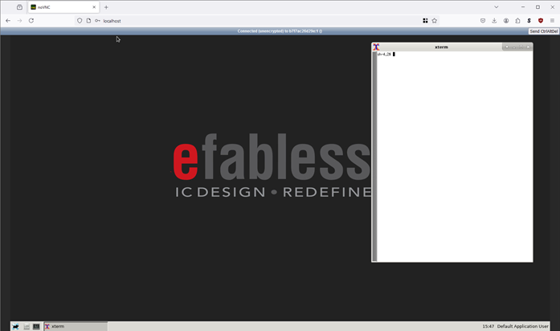
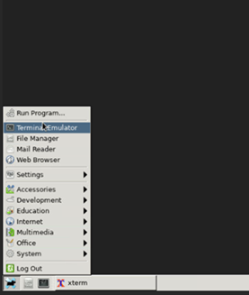
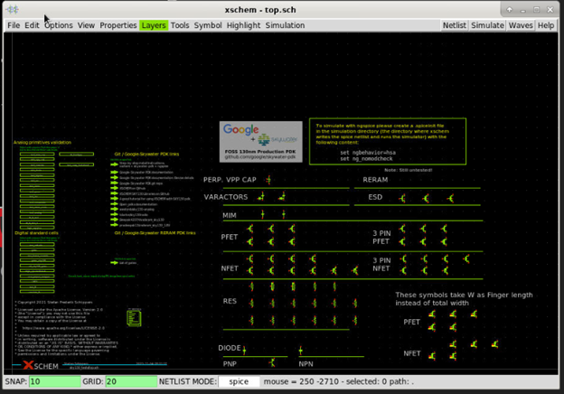
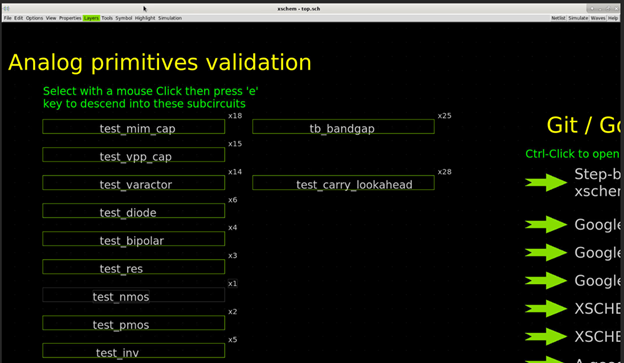
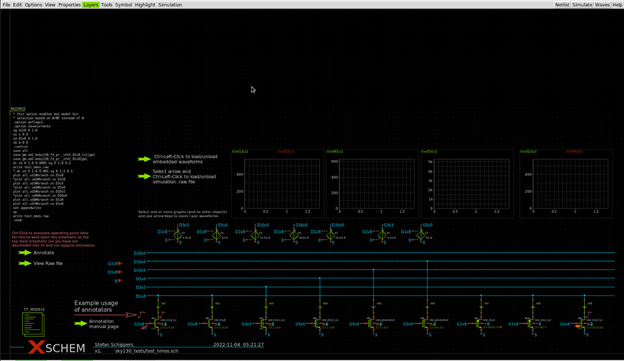
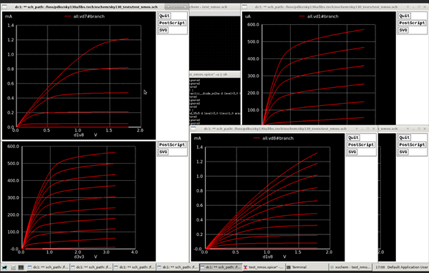
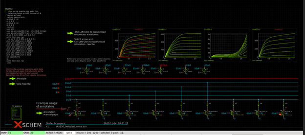

# 2.2 Analog Mixed Signal Design using docker image
{: .no_toc }

<details open markdown="block">
  <summary>
    Table of contents
  </summary>
  {: .text-delta }
- TOC
{:toc}
</details>

## Install and start Docker service

{: .no_toc}
##### 1. Install docker service

Install docker by following the instruction here: https://docs.docker.com/engine/install/ubuntu/

This is the command that I used in Ubuntu 22.04:
```bash
sudo apt-get install ca-certificates curl gnupg -q -y
sudo install -m 0755 -d /etc/apt/keyrings
curl -fsSL https://download.docker.com/linux/ubuntu/gpg | sudo gpg --dearmor -o /etc/apt/keyrings/docker.gpg
sudo chmod a+r /etc/apt/keyrings/docker.gpg
echo   "deb [arch="$(dpkg --print-architecture)" signed-by=/etc/apt/keyrings/docker.gpg] https://download.docker.com/linux/ubuntu "$(. /etc/os-release && echo "$VERSION_CODENAME")" stable" | sudo tee /etc/apt/sources.list.d/docker.list > /dev/null
sudo apt-get update -q
sudo apt-get install -q -y docker-ce docker-ce-cli containerd.io  docker-buildx-plugin docker-compose-plugin
```

*Command output*:
```
cass@unic-cass:~$ sudo apt-get install ca-certificates curl gnupg -q -y
Reading package lists...
Building dependency tree...
Reading state information...
ca-certificates is already the newest version (20230311ubuntu0.22.04.1).
ca-certificates set to manually installed.
curl is already the newest version (7.81.0-1ubuntu1.16).
curl set to manually installed.
gnupg is already the newest version (2.2.27-3ubuntu2.1).
gnupg set to manually installed.
0 upgraded, 0 newly installed, 0 to remove and 2 not upgraded.

cass@unic-cass:~$ sudo install -m 0755 -d /etc/apt/keyrings
cass@unic-cass:~$ curl -fsSL https://download.docker.com/linux/ubuntu/gpg | sudo gpg --dearmor -o /etc/apt/keyrings/docker.gpg
cass@unic-cass:~$ sudo chmod a+r /etc/apt/keyrings/docker.gpg
cass@unic-cass:~$ echo   "deb [arch="$(dpkg --print-architecture)" signed-by=/etc/apt/keyrings/docker.gpg] https://download.docker.com/linux/ubuntu "$(. /etc/os-release && echo "$VERSION_CODENAME")" stable" | sudo tee /etc/apt/sources.list.d/docker.list > /dev/null

cass@unic-cass:~$ sudo apt-get update -q
Get:1 https://download.docker.com/linux/ubuntu jammy InRelease [48.8 kB]
Hit:2 http://archive.ubuntu.com/ubuntu jammy InRelease
Hit:3 http://archive.ubuntu.com/ubuntu jammy-updates InRelease
Get:4 https://download.docker.com/linux/ubuntu jammy/stable amd64 Packages [36.4 kB]
Hit:5 http://archive.ubuntu.com/ubuntu jammy-backports InRelease
Hit:6 http://security.ubuntu.com/ubuntu jammy-security InRelease
Fetched 85.3 kB in 1s (157 kB/s)
Reading package lists...
Reading package lists...
Building dependency tree...
Reading state information...

cass@unic-cass:~$ sudo apt-get install -q -y docker-ce docker-ce-cli containerd.io  docker-buildx-plugin docker-compose-plugin
The following additional packages will be installed:
  docker-ce-rootless-extras libslirp0 pigz slirp4netns
Suggested packages:
  aufs-tools cgroupfs-mount | cgroup-lite
The following NEW packages will be installed:
  containerd.io docker-buildx-plugin docker-ce docker-ce-cli docker-ce-rootless-extras docker-compose-plugin libslirp0 pigz slirp4netns
0 upgraded, 9 newly installed, 0 to remove and 2 not upgraded.
Need to get 122 MB of archives.
After this operation, 436 MB of additional disk space will be used.
Get:1 https://download.docker.com/linux/ubuntu jammy/stable amd64 containerd.io amd64 1.7.19-1 [30.5 MB]
Get:2 http://archive.ubuntu.com/ubuntu jammy/universe amd64 pigz amd64 2.6-1 [63.6 kB]
...
Get:9 https://download.docker.com/linux/ubuntu jammy/stable amd64 docker-compose-plugin amd64 2.29.0-1~ubuntu.22.04~jammy [12.5 MB]
Fetched 122 MB in 13s (9488 kB/s)
Selecting previously unselected package pigz.
(Reading database ... 44296 files and directories currently installed.)
Preparing to unpack .../0-pigz_2.6-1_amd64.deb ...
Unpacking pigz (2.6-1) ...
...
Selecting previously unselected package slirp4netns.
Preparing to unpack .../8-slirp4netns_1.0.1-2_amd64.deb ...
Unpacking slirp4netns (1.0.1-2) ...
Setting up docker-buildx-plugin (0.16.1-1~ubuntu.22.04~jammy) ...
Setting up containerd.io (1.7.19-1) ...
Created symlink /etc/systemd/system/multi-user.target.wants/containerd.service → /lib/systemd/system/containerd.service.
Setting up docker-compose-plugin (2.29.0-1~ubuntu.22.04~jammy) ...
...
Setting up docker-ce (5:27.1.0-1~ubuntu.22.04~jammy) ...
Created symlink /etc/systemd/system/multi-user.target.wants/docker.service → /lib/systemd/system/docker.service.
Created symlink /etc/systemd/system/sockets.target.wants/docker.socket → /lib/systemd/system/docker.socket.
Processing triggers for man-db (2.10.2-1) ...
Processing triggers for libc-bin (2.35-0ubuntu3.8) ...
cass@unic-cass:~$ 
```

{: .no_toc}
##### 2. Start the docker service

If you use a real Linux system or a WSL Linux system with Systemd supported, you can start docker by running this command:

```bash
sudo systemctl start docker
sudo systemctl enable docker
```
*Command output*:
```
cass@unic-cass:~$ sudo systemctl start docker
cass@unic-cass:~$ sudo systemctl enable docker
Synchronizing state of docker.service with SysV service script with /lib/systemd/systemd-sysv-install.
Executing: /lib/systemd/systemd-sysv-install enable docker
```

{: .no_toc}
##### 3. Add user to docker group

You will also need to add your user to docker group so that you have permission to pull the docker image as normal users:

```bash
sudo gpasswd -a $USER docker
```

*Command output*:

```
cass@unic-cass:~$ sudo gpasswd -a $USER docker
Adding user cass to group docker
```

To get the above command taking effect, you have to log out:

```bash
exit
```

After that, you can open a new shell and continue to the next section.

{: .note}
> ### Notes for WSL users without Systemd support
> 
> If your WSL Ubuntu 22.04 does not have Systemd support, you can still run Docker using System-V init script using the following command: 
> ```bash
> sudo service docker start
> ```

## Run the docker image and use the remote desktop through web interface

After having the docker service running on your Linux environment, you can download the docker image with the tools and PDKs preinstalled. The softwares can be accessed through a remote desktop software and even through your web browser.

{: .no_toc}
##### 1. Pull a prebuilt docker image

First, we need to pull the efabless/foss-asic-tools docker image:

```bash
docker pull efabless/foss-asic-tools:latest
```

*Command output*:
```
cass@unic-cass:~$ docker pull efabless/foss-asic-tools:latest
latest: Pulling from efabless/foss-asic-tools
2d473b07cdd5: Pulling fs layer
b8568565c6e7: Pulling fs layer
...
7a6ea57bb9dd: Pulling fs layer 
ca2ea5eb2943: Pull complete
73d74b9d8fd4: Pull complete
...
38f93d923c93: Pull complete
5cf482e610e8: Pull complete
Digest: sha256:59e4a3a814ca6b2e24870130b0bfb3fc43650e7e89b33626084148905ffefcd1
Status: Downloaded newer image for efabless/foss-asic-tools:latest
docker.io/efabless/foss-asic-tools:latest
```

{: .no_toc}
##### 2. Share a folder with the docker image and run the docker container

By default, the software running in docker containers can't access the files in your computer. You can create a directory to share files with the docker container and run it as follows:

```bash
mkdir -p $HOME/unic-cass-example
export DESIGNS=$HOME/unic-cass-example
docker run -it -p 80:80 --user $(id -u):$(id -g) -v $DESIGNS:/foss/designs \
efabless/foss-asic-tools:latest bash
```

*Command outputs*:
```
ass@DESKTOP-QIE8PTM:~$ mkdir -p $HOME/unic-cass-example
cass@unic-cass:~$ export DESIGNS=$HOME/unic-cass-example
cass@unic-cass:~$ docker run -it -p 80:80 --user $(id -u):$(id -g) -v $DESIGNS:/foss/designs \
efabless/foss-asic-tools:latest bash
realpath: '/foss/tools//iverilog/*/bin': No such file or directory
realpath: '/foss/tools//riscv-gnu-toolchain-rv32i/*/bin': No such file or directory
USER_ID: 1000, GROUP_ID: 1000
nss_wrapper location: /usr/lib64/libnss_wrapper.so

------------------ change VNC password  ------------------

------------------ start noVNC  ----------------------------
start vncserver with param: VNC_COL_DEPTH=24, VNC_RESOLUTION=1680x1050
...
start window manager
...
------------------ VNC environment started ------------------

VNCSERVER started on DISPLAY= :1
        => connect via VNC viewer with 172.17.0.2:5901

noVNC HTML client started:
        => connect via http://localhost/?password=abc123

------------------ EXECUTE COMMAND ------------------
Executing command: 'bash'
realpath: ‘/foss/tools//iverilog/*/bin’: No such file or directory
realpath: ‘/foss/tools//riscv-gnu-toolchain-rv32i/*/bin’: No such file or directory
USER_ID: 1000, GROUP_ID: 1000
nss_wrapper location: /usr/lib64/libnss_wrapper.so
bash-4.2$
```

After running the docker image, there will be an instruction to log in the remote desktop environment:

{: .no_toc}
##### 3. Use a web browser to access the remote desktop on the docker container

Open a web browser, enter 'http://localhost' into the address bar and log in with the default password 'abc123' when asked. If you log in successfully, the desktop of the docker image will appear as follow:



{: .no_toc}
##### 4. Configure the resolution to meet your need

You can zoom in and zoom out to fit the window to fit your screen resolution. It is also possible to set the password and change the resolution when running the docker image:

```bash
docker run -it -p 80:80 --user $(id -u):$(id -g) -v $DESIGNS:/foss/designs \
-e VNC_PW=<your password> -e VNC_RESOLUTION=1920x1080 \
efabless/foss-asic-tools:latest bash
```

Next time, if you want to run this docker image, you will need to export the DESIGNS variable, and run ‘docker run’ command again. 
```bash
export DESIGNS=$HOME/unic-cass-example
docker run -it -p 80:80 --user $(id -u):$(id -g) -v $DESIGNS:/foss/designs \
efabless/foss-asic-tools:latest bash
```

## Run the example design

{: .no_toc}
##### 1. Open a shell to run xschem

Inside the remote desktop, open shell to open the example designs:



{: .no_toc}
##### 2. Copy the examples and run xschem

In the terminal, go to `/foss/designs` directory and copy the example design from `/foss/examples`:

```bash
cp -a /foss/examples/test-xschem /foss/designs/example
cd /foss/designs/example
xschem
```

A new window with the test circuits for Skywater 130nm technology will open.



{: .no_toc}
##### 3. Open `test_nmos` in xschem

To open the `test_nmos` example, click on `test_nmos` and press `e`.



The test circuit for `nmos` will appear in the xschem window.



{: .no_toc}
##### 4. Create the netlist and run the simulation

Click on `Netlist` then click `Simulate`. The simulation will run for a while. Then the simulation will show up on the screen.



You can investigate the simulation results throughout these waveforms.

{: .no_toc}
##### 5. Update simulation results in Xschem's window

Another way to view the simulation results in this schematic is to hold the left CTRL button and click on the arrow in the schematic view to load the simulation results into the schematic view.



{: .no_toc}
##### 6. Go back to the top schematic.

To come back to the top-level, you can press `Ctrl + e`.

## What's next?

At this step, you have successfully run the simulation of a test circuit in the skywater 130nm examples. You can try with other examples in the `Xschem` top level design. In addition, there are also other examples in the `/foss/examples` directory such as the `Open_PMIC` design or basic operational amplifier (`basic_opa`) and a ring oscillator (`ringosc`). You can investigate and simulate these designs and learn from them.
