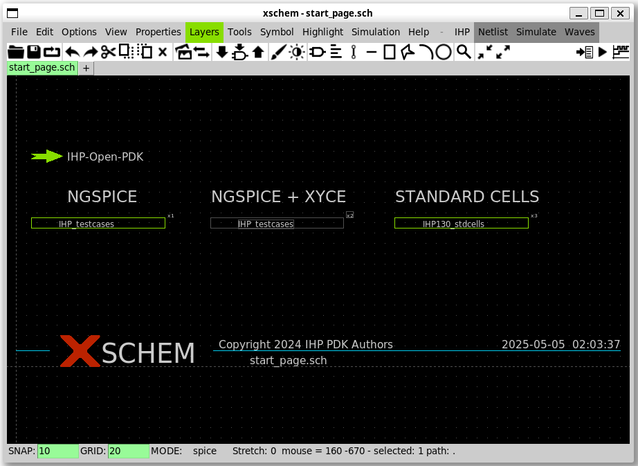
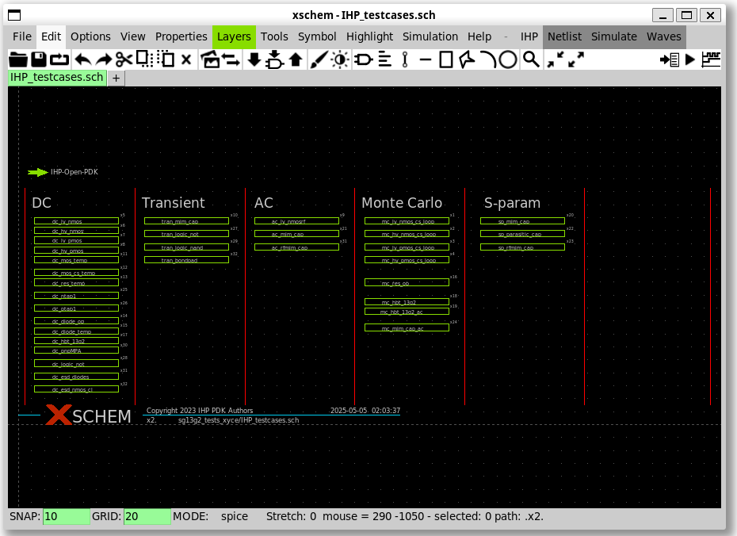
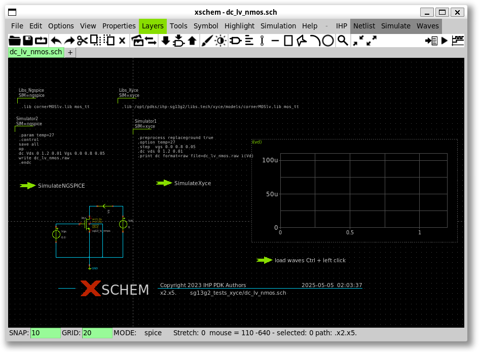
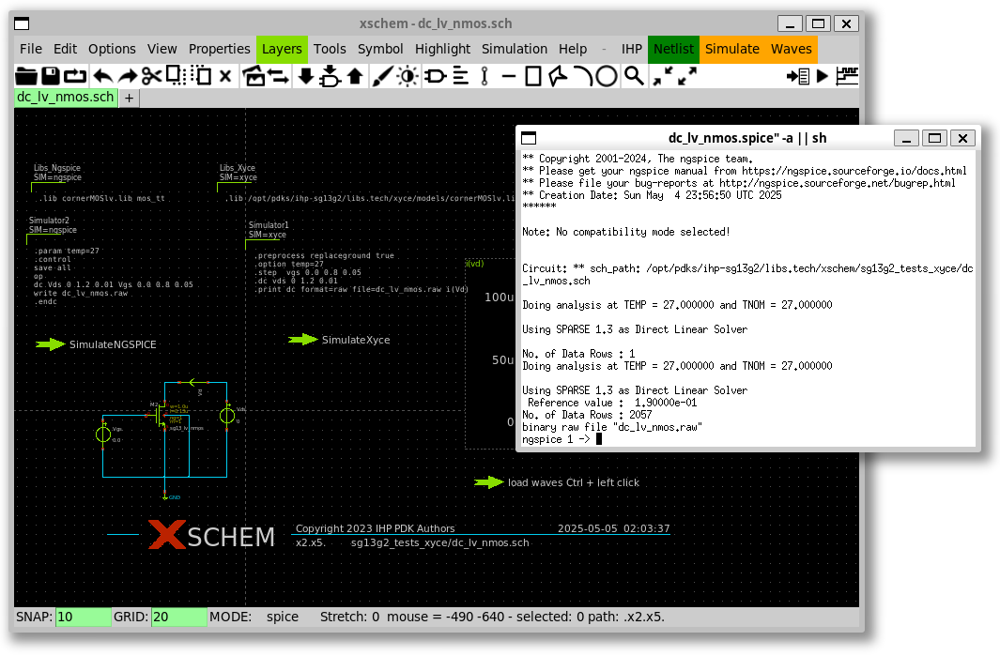
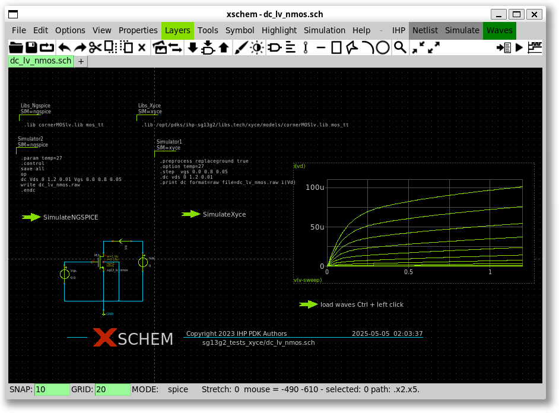

# 2.2 Analog Mixed Signal Design using docker image
{: .no_toc }

<details open markdown="block">
  <summary>
    Table of contents
  </summary>
  {: .text-delta }
- TOC
{:toc}
</details>

{: .video}
> <iframe width="700" height="360" src="https://www.youtube.com/embed/TZz7ZN-JjcQ" title="2.2 Analog Mixed Signal Design using docker image" frameborder="0" allow="accelerometer; autoplay; clipboard-write; encrypted-media; gyroscope; picture-in-picture; web-share" referrerpolicy="strict-origin-when-cross-origin" allowfullscreen></iframe>

## Install and start Docker service

{: .no_toc}
##### 1. Install docker service

Install docker by following the instruction here:
https://docs.docker.com/engine/install/ubuntu/

This is the command that I used in Ubuntu 22.04:

{: .shellcmd}
> ```bash
> sudo apt-get install ca-certificates curl gnupg -q -y
> sudo install -m 0755 -d /etc/apt/keyrings
> curl -fsSL https://download.docker.com/linux/ubuntu/gpg | sudo gpg --dearmor -o /etc/apt/keyrings/docker.gpg
> sudo chmod a+r /etc/apt/keyrings/docker.gpg
> echo   "deb [arch="$(dpkg --print-architecture)" signed-by=/etc/apt/keyrings/docker.gpg] https://download.docker.com/linux/ubuntu "$(. /etc/os-release && echo "$VERSION_CODENAME")" stable" | sudo tee /etc/apt/sources.list.d/docker.list > /dev/null
> sudo apt-get update -q
> sudo apt-get install -q -y docker-ce docker-ce-cli containerd.io  docker-buildx-plugin docker-compose-plugin
> ```

{: .cmdout}
> ```
> cass@unic-cass:~$ sudo apt-get install ca-certificates curl gnupg -q -y
> Reading package lists...
> Building dependency tree...
> Reading state information...
> ca-certificates is already the newest version (20230311ubuntu0.22.04.1).
> ca-certificates set to manually installed.
> curl is already the newest version (7.81.0-1ubuntu1.16).
> curl set to manually installed.
> gnupg is already the newest version (2.2.27-3ubuntu2.1).
> gnupg set to manually installed.
> 0 upgraded, 0 newly installed, 0 to remove and 2 not upgraded.
> 
> cass@unic-cass:~$ sudo install -m 0755 -d /etc/apt/keyrings
> cass@unic-cass:~$ curl -fsSL https://download.docker.com/linux/ubuntu/gpg | sudo gpg --dearmor -o /etc/apt/keyrings/docker.gpg
> cass@unic-cass:~$ sudo chmod a+r /etc/apt/keyrings/docker.gpg
> cass@unic-cass:~$ echo   "deb [arch="$(dpkg --print-architecture)" signed-by=/etc/apt/keyrings/docker.gpg] https://download.docker.com/linux/ubuntu "$(. /etc/os-release && echo "$VERSION_CODENAME")" stable" | sudo tee /etc/apt/sources.list.d/docker.list > /dev/null
> 
> cass@unic-cass:~$ sudo apt-get update -q
> Get:1 https://download.docker.com/linux/ubuntu jammy InRelease [48.8 kB]
> Hit:2 http://archive.ubuntu.com/ubuntu jammy InRelease
> Hit:3 http://archive.ubuntu.com/ubuntu jammy-updates InRelease
> Get:4 https://download.docker.com/linux/ubuntu jammy/stable amd64 Packages [36.4 kB]
> Hit:5 http://archive.ubuntu.com/ubuntu jammy-backports InRelease
> Hit:6 http://security.ubuntu.com/ubuntu jammy-security InRelease
> Fetched 85.3 kB in 1s (157 kB/s)
> Reading package lists...
> Reading package lists...
> Building dependency tree...
> Reading state information...
> 
> cass@unic-cass:~$ sudo apt-get install -q -y docker-ce docker-ce-cli containerd.io  docker-buildx-plugin docker-compose-plugin
> The following additional packages will be installed:
>   docker-ce-rootless-extras libslirp0 pigz slirp4netns
> Suggested packages:
>   aufs-tools cgroupfs-mount | cgroup-lite
> The following NEW packages will be installed:
>   containerd.io docker-buildx-plugin docker-ce docker-ce-cli docker-ce-rootless-extras docker-compose-plugin libslirp0 pigz slirp4netns
> 0 upgraded, 9 newly installed, 0 to remove and 2 not upgraded.
> Need to get 122 MB of archives.
> After this operation, 436 MB of additional disk space will be used.
> Get:1 https://download.docker.com/linux/ubuntu jammy/stable amd64 containerd.io amd64 1.7.19-1 [30.5 MB]
> Get:2 http://archive.ubuntu.com/ubuntu jammy/universe amd64 pigz amd64 2.6-1 [63.6 kB]
> ...
> Get:9 https://download.docker.com/linux/ubuntu jammy/stable amd64 docker-compose-plugin amd64 2.29.0-1~ubuntu.22.04~jammy [12.5 MB]
> Fetched 122 MB in 13s (9488 kB/s)
> Selecting previously unselected package pigz.
> (Reading database ... 44296 files and directories currently installed.)
> Preparing to unpack .../0-pigz_2.6-1_amd64.deb ...
> Unpacking pigz (2.6-1) ...
> ...
> Selecting previously unselected package slirp4netns.
> Preparing to unpack .../8-slirp4netns_1.0.1-2_amd64.deb ...
> Unpacking slirp4netns (1.0.1-2) ...
> Setting up docker-buildx-plugin (0.16.1-1~ubuntu.22.04~jammy) ...
> Setting up containerd.io (1.7.19-1) ...
> Created symlink /etc/systemd/system/multi-user.target.wants/containerd.service → /lib/systemd/system/containerd.service.
> Setting up docker-compose-plugin (2.29.0-1~ubuntu.22.04~jammy) ...
> ...
> Setting up docker-ce (5:27.1.0-1~ubuntu.22.04~jammy) ...
> Created symlink /etc/systemd/system/multi-user.target.wants/docker.service → /lib/systemd/system/docker.service.
> Created symlink /etc/systemd/system/sockets.target.wants/docker.socket → /lib/systemd/system/docker.socket.
> Processing triggers for man-db (2.10.2-1) ...
> Processing triggers for libc-bin (2.35-0ubuntu3.8) ...
> cass@unic-cass:~$ 
> ```

{: .no_toc}
##### 2. Start the docker service

If you use a real Linux system or a WSL Linux system with Systemd
supported, you can start docker by running this command:

{: .shellcmd}
> ```bash
> sudo systemctl start docker
> sudo systemctl enable docker
> ```

{: .cmdout}
> ```
> cass@unic-cass:~$ sudo systemctl start docker
> cass@unic-cass:~$ sudo systemctl enable docker
> Synchronizing state of docker.service with SysV service script with /lib/systemd/systemd-sysv-install.
> Executing: /lib/systemd/systemd-sysv-install enable docker
> ```

{: .no_toc}
##### 3. Add user to docker group

You will also need to add your user to docker group so that you have
permission to pull the docker image as normal users:

{: .shellcmd}
> ```bash
> sudo gpasswd -a $USER docker
> ```

{: .cmdout}
> ```
> cass@unic-cass:~$ sudo gpasswd -a $USER docker
> Adding user cass to group docker
> ```

To get the above command taking effect, you have to log out:

{: .shellcmd}
> ```bash
> exit
> ```

After that, you can open a new shell and continue to the next section.

{: .note}
> If your WSL Ubuntu 22.04 does not have Systemd support, you can still run Docker using System-V init script using the following command: 
> ```bash
> sudo service docker start
> ```


## Download the docker source files and start the UNIC-CASS Docker image

##### 1. Clone the repository:

Open your terminal and execute the following command to clone the
repository to your local machine:

{: .shellcmd}
> ```bash
> git clone https://github.com/unic-cass/uniccass-icdesign-tools.git
> ```

##### 2. Navigate to the repository directory:

Change into the directory created by cloning the repository:

{: .shellcmd}
> ```bash
> cd uniccass-icdesign-tools/
> ```

##### 3. Change the PDK to `ihp-sg13g2`:

Use the `sed` command to modify the PDK setting in the Makefile:

{: .shellcmd}
> ```bash
> sed -i -e 's:PDK=sky130A:PDK=ihp-sg13g2:g' Makefile
> ```

##### 4. Start the docker image by runing make start:

Execute the `make start` command to start the process defined in the
Makefile:

{: .shellcmd}
> ```bash
> make start
> ```

{: .cmdout}
> ```
> cass@unic-cass:~$ git clone https://github.com/unic-cass/uniccass-icdesign-tools.git
> Cloning into 'uniccass-icdesign-tools'...
> remote: Enumerating objects: 571, done.
> remote: Counting objects: 100% (376/376), done.
> remote: Compressing objects: 100% (236/236), done.
> remote: Total 571 (delta 175), reused 283 (delta 95), pack-reused 195 (from 1)
> Receiving objects: 100% (571/571), 71.95 MiB | 3.45 MiB/s, done.
> Resolving deltas: 100% (244/244), done.
> cass@unic-cass:~$ cd uniccass-icdesign-tools/
> cass@unic-cass:~/uniccass-icdesign-tools$ make start
> docker image pull isaiassh/unic-cass-tools:1.0.0
> 1.0.0: Pulling from isaiassh/unic-cass-tools
> 30a9c22ae099: Pull complete
> 9de05c6b613e: Pull complete
> 9bd619e83424: Pull complete
> 01f28496e734: Pull complete
> ea98d491f203: Pull complete
> 1449896d1056: Pull complete
> 87f3830d0385: Pull complete
> 73a54b8cec06: Pull complete
> b6cfa4f96202: Pull complete
> a57233b018b3: Pull complete
> d6a1a31aacec: Pull complete
> 425ae8d789d1: Pull complete
> dfd5c84a6d54: Pull complete
> dd3e74e76b94: Pull complete
> 4795cb3cecb8: Pull complete
> f1252ad9b9eb: Pull complete
> 2d58e9f68adf: Pull complete
> 2d97fb1e98b6: Pull complete
> 07942dd2593b: Pull complete
> 5ba3a85db7fa: Pull complete
> fbff8af1fe8b: Pull complete
> f947fe7bfb5a: Pull complete
> 6eb767da092d: Pull complete
> 4f4fb700ef54: Pull complete
> 28a334f53e17: Pull complete
> 07a4722fdb82: Pull complete
> Digest: sha256:99003c7d13e682476a76bebde8138ea165cf5db45df7f1192e38d27c11a6c8d0
> Status: Downloaded newer image for isaiassh/unic-cass-tools:1.0.0
> docker.io/isaiassh/unic-cass-tools:1.0.0
> docker run -it  --mount type=bind,source=/home/cass/uniccass-icdesign-tools/shared_xserver,target=/home/designer/shared -v /tmp/.X11-unix:/tmp/.X11-unix:ro -v /home/cass/.Xauthority:/root/.Xauthority:rw -v /home/cass/.Xauthority:/home/designer/.Xauthority:rw --net=host -e SHELL=/bin/bash -e PDK=ihp-sg13g2 -e DISPLAY -e LIBGL_ALWAYS_INDIRECT=1 -e XDG_RUNTIME_DIR -e PULSE_SERVER -e USER_ID=1000 -e USER_GROUP=1000 --name usm-vlsi-tools-a1e884fae23b5d710498da8463677bf3 --rm isaiassh/unic-cass-tools:1.0.0
> PDK set to ihp-sg13g2
> designer ~
> $
> ```

## Run the example design

{: .no_toc}
##### 1. Run xschem inside the docker image

{: .shellcmd}
> ```bash
> xschem
> ```

{: .no_toc}
##### 2. Open `IHP testcases` in xschem

To open the `IHP testcases` example, click on `IHP testcases` under
`NGSPICE + XYCE` and press `e`.



The test circuits for `IHP testcases` will appear in the xschem
window.



##### 3. Open `DC lv_nmos` schematic in xschem

To open the `DC lv_nmos` schematic, click on `DC lv_nmos` under `DC`
category and press `e`. The test circuits for `DC lv_nmos` will appear
in the xschem window.



{: .no_toc}
##### 4. Run the simulation

To run the simulation using ngspice, hold `Ctrl` key and click on the
arrow labelled `SimulateNGSPICE`. Then the simulation will show up on
the screen.




{: .note}
You can also click on `Netlist` then click `Simulate`.

{: .no_toc}
##### 5. Update simulation results in Xschem's window

To display the waveform in the xschem window, hold the left CTRL
button and click on the arrow labelled `load waves` in the schematic
view.



{: .no_toc}
##### 6. Go back to the top schematic.

To come back to the top-level, you can press `Ctrl + e`.

## What's next?

At this step, you have successfully run the simulation of a test
circuit in the IHP examples. You can try with other examples in the
`Xschem` top level design. In addition, there are also other examples
that you can investigate, simulate, and learn from them.

## References

1. Efabless, [SKY130 - Start Designing Analog/Digital In 5 minutes - DRAFT CUT](https://youtu.be/EP3ozAtTQDw?list=PLZuGFJzpFksB57YCxIQ50DPkvNFMpfCXd)
