{: .no_toc }
## 3.1 Schematic capture and simulation with Xscheme and NGSpice

{: .no_toc }

<!-- <details open markdown="block">
  <summary>
    Table of contents
  </summary>
  {: .text-delta }
- TOC
{:toc}
</details> -->

This section demonstrates the usage of Xschem and NGSpice opensource tools.

#### 1. Run Xscheme

- Open a Ubuntu 22.04 terminal and run the following commands
  (assuming that you already installed the tools):

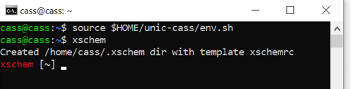

```sh
$ source $HOME/unic-cass/env.sh
$ xschem
```

- The window pops up successfully as follows.


### Source

- [Xscheme Tutorial](https://xschem.sourceforge.io/stefan/xschem_man/tutorial_run_simulation.html).


######  Schematic capture - Create instances

Draw a RLC circuit in Xscheme:

- Create a new instance by selecting `Tools` >> `Insert Symbol` ``(Shift + i)``

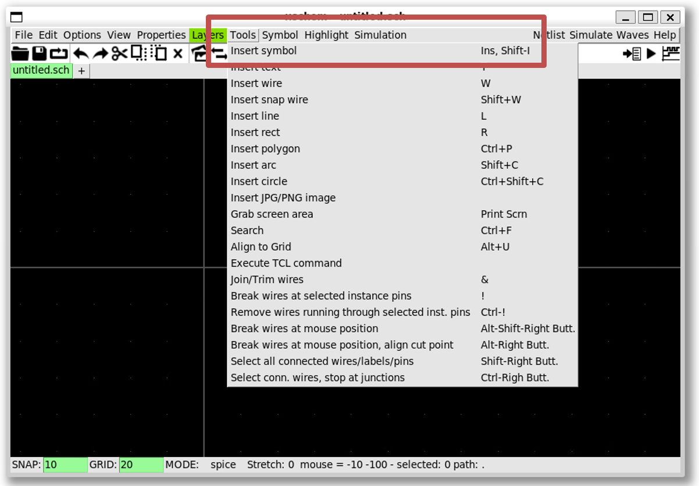

- Create a resistor by `xscheme_library/devices` >> `res.sym` >> `OK` >> Click on the schematic windows


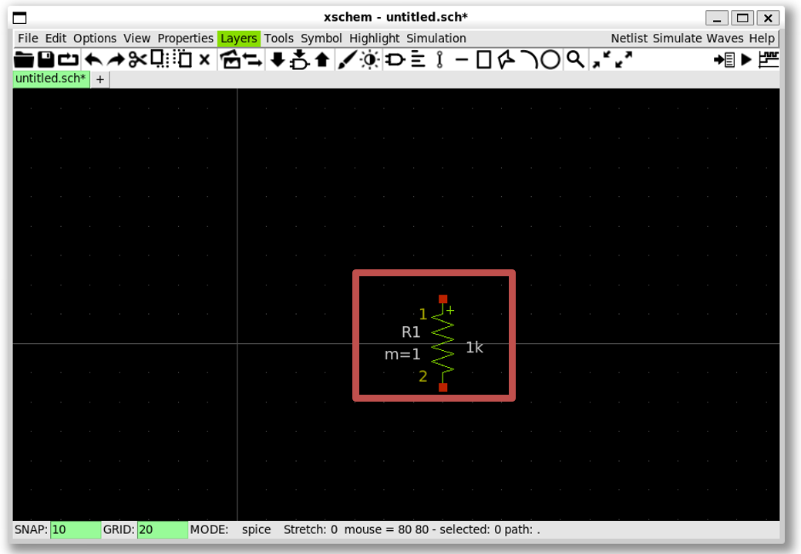

- Create an inductor (``ind.sym``)

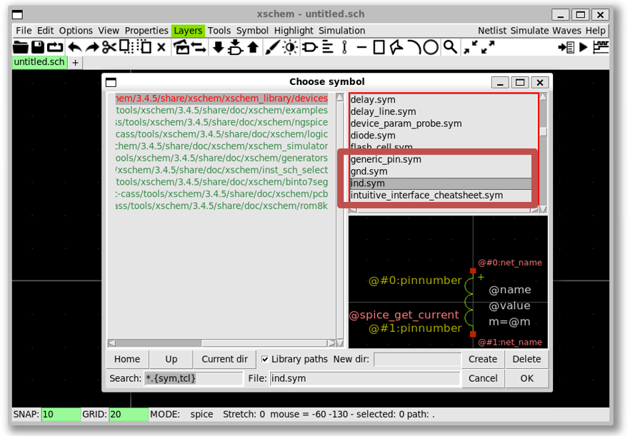

- Create a capacitor (``capa.sym``)

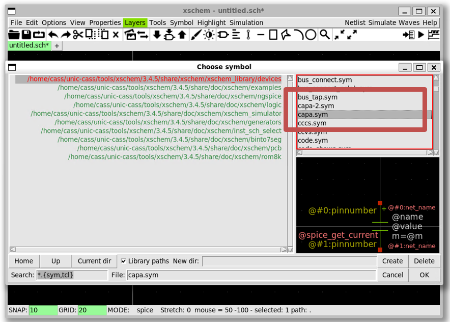

- Create an arithmetic source (``vsource_arith.sym``)

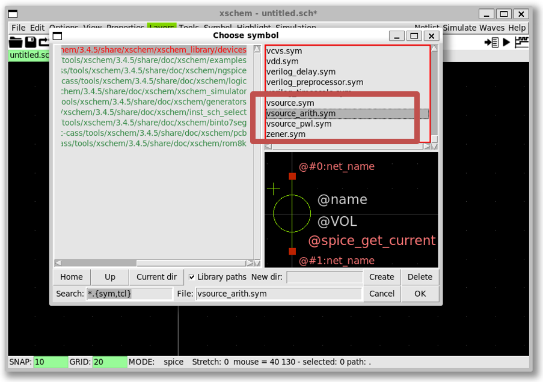

#### 3. Schematic capture - Change the paramters

Change the capacitance to 50nF and the inductance to 10mH

- Click on the `capacitor` and press `q`; change the value of `C1` to `50nF` then press `OK`


- Click on the `inductor` and press `q`; change the value of `L1` to `10mH` then press `OK`


Set the voltage source

- Click on the `voltage source` and press `q`; change the value of `E1` to `" '3*cos(time*time*time*1e11)' "` then press `OK` (note the single and doulbe quotes)


Final view

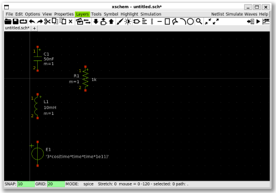

#### 4. Schematic capture - Wiring

To connect the wire, press `w` then use the left-mouse click to create
multiple wire segments

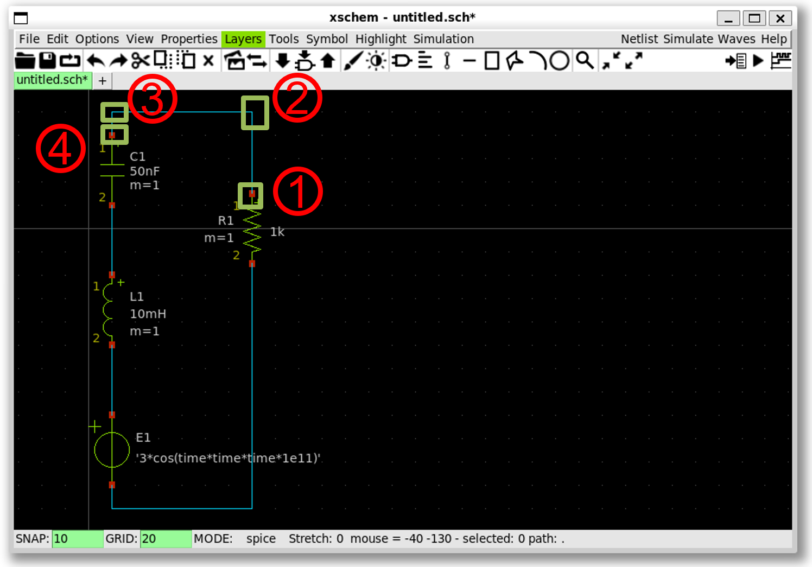

- 1. Put the cursor to the red point, then press `w`

- 2. Move the cursor here and left-mouse click, then press `w` again

- 3. Move the cursor here and left-mouse click, then press `w` again

- 4. Move the cursor here and left-mouse click on the red point to finish wiring


- 1. Put the cursor to the red point, then press `w`

- 2. Move the cursor to the red point, then left-mouse click

#### 5. Schematic capture - Create lab pins

To view the waveform and name the net, insert a `lab_pin` symbol, and change its name

- Create a `lab_pin` by `xscheme_library/devices` >> `lab_pin.sym` >> `OK` >> Click on the net for the `lab_pin`


- Select the `lab_pin` symbol and then press `q` to rename it into `A`


- Similary create the lab pin `B`, `C`, and `0` (ground)


### Note

- You can copy the lab pin `A` by selecting it and press `c`, then move it to the correct net

- Rotate can be done by pressing `Shift+r`

#### 6. Schematic capture - Set up a simulation

To set up the simulation, insert a code symbol and enter the simulation commands

- Create a code symbol by `xscheme_library/devices` >> `code.sym` >> `OK` >> Click on the schematic to place it


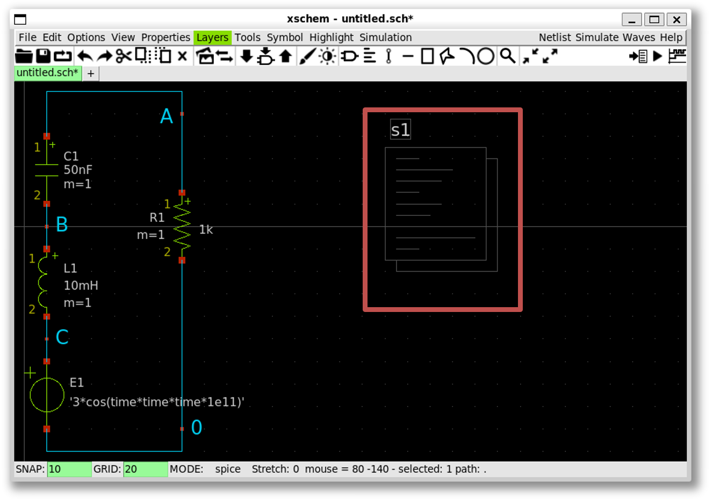

- Select the code symbol and press `q`; change the `name` into `STIMULI` and `value` to:

```spice
".tran 10n 2000u uic
.save all"
```


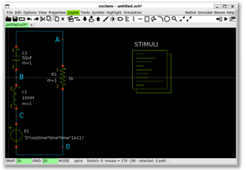

### Note

- The double quote is required

#### 7. Simulate the design using NGSpice 

- Xscheme uses NGSpice as the default simulator

- To create the design's netlist, click `Netlist` button to generate the spice file


- To view the netlist, select `Simulation` >> `Edit netlist`

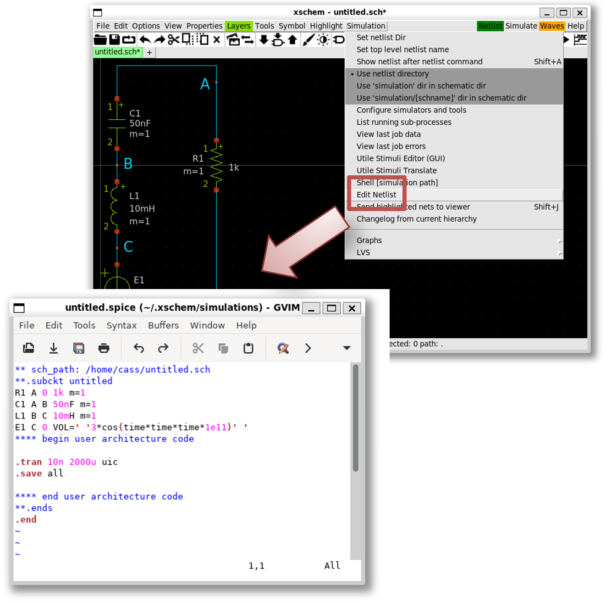

- To simulate, click `Simulate` button to run the simulation


#### 8. Plot the waveform in NGSpice

- Plot the waveform in NGSpice by enter `plot a b c` in NGSpice terminal

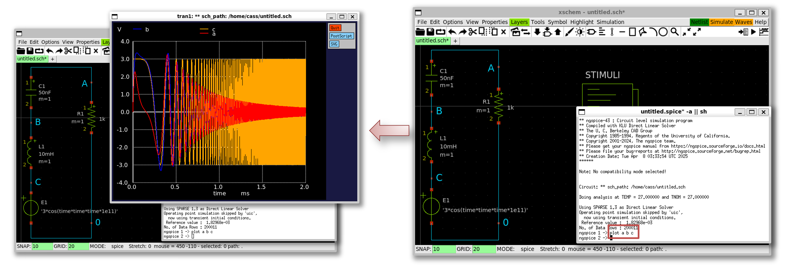

