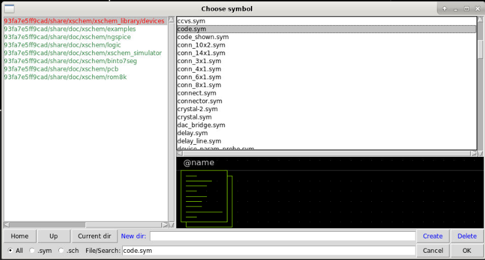

# 3.1.3 An inverter schematic in Xschem with Skywater 130nm
<div style="width: 854px;padding:56.25% 0 0 0;position:relative;"><iframe src="https://player.vimeo.com/video/857488204?h=52f8dfc261&amp;badge=0&amp;autopause=0&amp;player_id=0&amp;app_id=58479" frameborder="0" allow="autoplay; fullscreen; picture-in-picture" style="position:absolute;top:0;left:0;width:100%;height:100%;" title="3.1.3-CMOS Inverter VTC and Transient Simulation Tutorial Using Xschem and Ngspice-(1080p)"></iframe></div><script src="https://player.vimeo.com/api/player.js"></script>


## Prerequisites
- Finish the installation for analog design

## Xschem basics

Keyboard shortcuts for xschem:
- `Shift + i`: insert symbol
- `q`: Edit attributes (when a symbol is selected)
- `Alt + r`: rotate symbols
- `Alt + f`: mirror symbol
- `w`: create wire to connect two points
- `m`: move a selected objects
- `c`: copy the selected object

## Create inverter schematic

1.	Ensure that the environment variable PDK_ROOT and PDK point to the correct directory and pdk folder.
```bash 
echo $PDK_ROOT
echo $PDK
```
If it has not been set yet, you can set it by using the following command in bash shell:
```bash
export PDK_ROOT=$PWD/unic-cass/pdks
export PDK=sky130A
```
2.	Create a new directory named ‘inverter’ and copy xschemrc into this directory
```
cd $HOME
mkdir -p unic-cass/inverter
cd unic-cass/inverter
cp -a $PDK_ROOT/$PDK/libs.tech/xschem/xschemrc .
echo ‘set editor {gedit}’ >> xschemrc # use gedit to edit the netlist
```
*Command output*:
```
TBD
```
3.	Run xschem from the command line inside the ‘inverter directory’

```bash
xschem
```


4. Insert `nfet3_01v08` and `pfet3_01v08` symbol in `Xschem` by selecting `Tools >> Insert Symbol` in the menu (or the keyboard shortcut `Ins` or `Shift + I`) .
 
 

5. Browse to `$PDK_ROOT/$PDK/libs.tech/xschem/sky130_fd_pr` and select `nfet3_01v8` and click `OK` to add the symbol of `nfet3` into the schematic window.


6. Click any place on the schematic window to place the `nfet3` symbol as below:


7. Repeat step 5 and step 6 with `pfet3_01v8` to place the `pfet` into the schematic window.


8. Next, we need to connect the two transistors to form an inverter. This can be done by move your cursor to the pin of one of the transistors pin, then press `w` shortcut and click on the pin that you want to connect as follow:


You should get acquainted with the `w` shortcut to do the wiring.

9. Next, we need some basic components such as `VDD`, `GND` and voltage sources to add to the schematic for simulation. This can be done by repeat the step 4 but selecting the default `xschem_library/devices` and add these devices into your schematic as bellow:


10. Next we need to add a voltage source symbol (`vsource.sym`) into the schematic


11. Next, we will have to edit the voltage source properties by right clicking on the voltage source and selecting “edit attributes” (or selecting the voltage source symbol and press `q`). Change the name to `Vdd` and the value to `1.8` (1.8V is the normalized voltage of skywater 130nm). Then, press `OK`.


12. Next, we need to connect `GND` and `VDD` to the voltage source. The fastest way to do this is to copy the `gnd` symbol and `vdd` symbol by selecting the symbol, pressing `c` (shortcut for copying) and connecting it to the `vsource` symbol.


## Create the testbench
Next, we build the testbench for the inverter circuit in xschem. We will learn how to create the lab pin to connect and monitor the signals during the simulation, using the vsource to create the supply voltage and the dc analysis.

### Create the supply voltage


13. Next, we need to create another voltage source for the input signal. This can be done by copying the previous voltage source and editing its attributes. Use your mouse and select the vsource and GND symbols, press ‘c’ to copy and click to paste it.


Select the vsource symbol that you’ve just created, press ‘q’ to change its attributes as follows:
```
Name: Vin
Value: 0
```
Click `OK`.


### Insert the model library and the simulation corner

14. Next, we need to insert the simulation model into the schematic so that we can simulate the design using Ngspice. Press ‘Shift + i’ to insert the code symbol in the xschem device library then press OK to place it into xschem.



15. Select the newly created symbol, and change its properties as follows and press ‘OK’.
 


### Setup DC analysis
16. Next, we need to add a code_shown symbol and change it properties as follows:
```spice
Name: SPICE
Value: ".dc Vin 0 1.8 0.01
           .save all"
```
Then press `OK`.


### Using lab pin to label net and monitor the simulation results

17.	Next, we have to insert the lab_pin symbol for the input, the output and connect the input to the voltage source Vin. This can be done by pressing `shift + i` and selecting `lab_pin.sym in` the `xschem device library`.


After that, we can attack it to the input by placing it on the input net.


18.	Change the pin name to `Vin` by pressing on the lab_pin symbol, and press `q`. Change the name to `Vin` and press `OK`.


19.	Copy `Vin` lab_pin symbol and connect it to the other end of the vsource symbol by selecting Vin lab_pin symbol, press `c` to copy and place it to the correct location. You can rotate the symbol by pressing `alt + r`


20.	The last step is to copy the `Vin` lab_pin symbol (select `Vin` lab_pin and press `alt + f` to mirror it) and place it on the output net. After that, we named it `Vout`.


21.	Now we can save the schematic into inverter.sch by click on `File >> save as >> interver.sch`


 
## Create design netlist
22.	The schematic is done, next you can generate the netlist by click on netlist button


23.	After the netlist is successfully generated (without warning or error in the info window), we can view our netlist by select `Simulation >> Edit Netlist`
```spice
To-be-included
```
## Configure & run the simulation
24.	The simulation setup can be done by selecting Simulation >> Configure simulators and tools.
-	In the Ngspice section, select `Ngspice batch` to use ngspice batch mode. 
-	In the `Spicewave` section, select `Gaw Viewer`
-	Click on `Accept and Close`. You can also save the simulation option by clicking on `Save Configuration` to file


25.	To simulate the design, click on the Simulate button. If the simulate button is red, the simulator is running. 


When the simulation finishes, a new window will appear with the simulation status. An output file (in this case inverter_vtc.out) is created with the simulation status (warning and errors). You should view this file to see if there is any problem during the simulation.

```
to be included
```

The contents of the output file after simulation are as below.
```
To be included
```
 
## Use Gaw to view the simulation waves
26.	You can view the simulation results by clicking on the Waves button. A Gaw will be displayed with the recorded signals.


To add a signal to the wave viewer, you can click on a panel first, then add the signal in the signal list. For example, I add te Vin and Vout signals to the waveform as follows:


## What’s next?

You’ve just finished the basic tutorials on how to draw schematics in Xschem and run the simulation in NGSpice. In real life, schematics are organized in hierarchy so that they can be easily reused and modified. In the next lesson, you will learn how to create a hierarchical schematic and how to draw a symbol in xschem.

