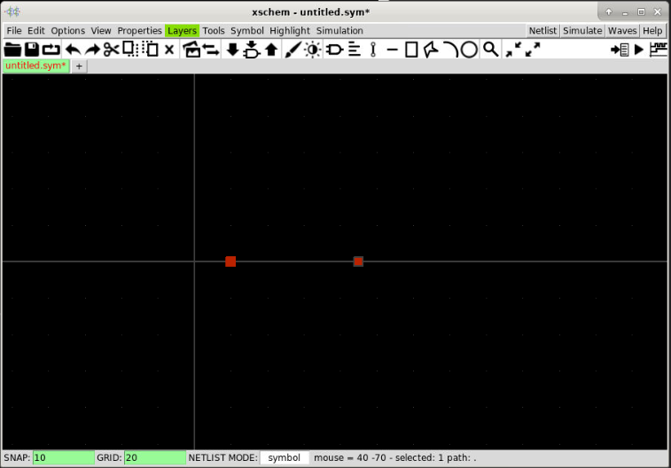
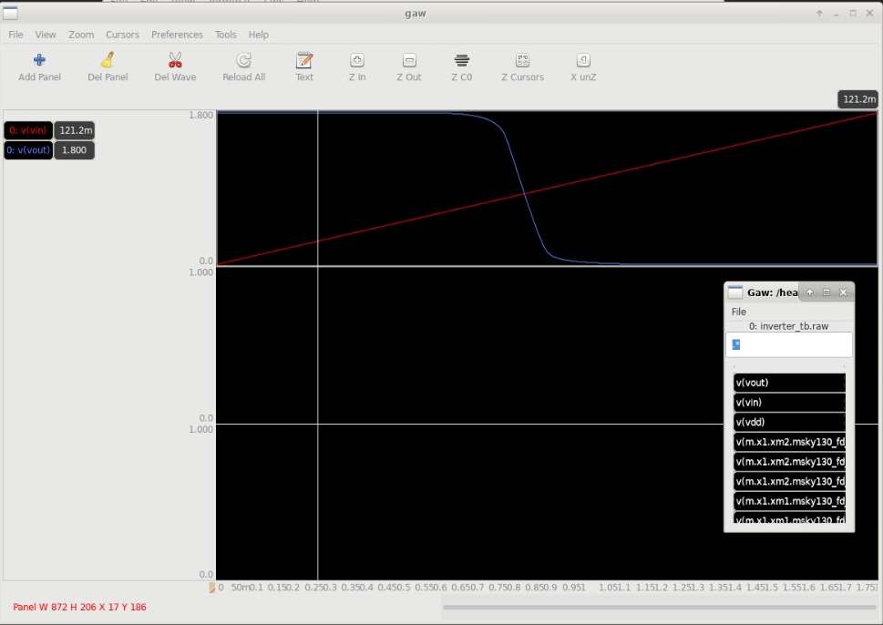

{: .no_toc }
# 3.1.4 Symbol creation in Xschem

{: .no_toc }

<details open markdown="block">
  <summary>
    Table of contents
  </summary>
  {: .text-delta }
- TOC
{:toc}
</details>

{: .video}
> ## Schematic capture 
> See [3.1.3](/training/3.1.3-schematic-capture-inverter.html)
> 
> ## Symbol Creation
> <iframe width="700" height="360" src="https://www.youtube.com/embed/43RqOfI3E7M?si=vNHu6fKui6vl19UI" title="YouTube video player" frameborder="0" allow="accelerometer; autoplay; clipboard-write; encrypted-media; gyroscope; picture-in-picture; web-share" referrerpolicy="strict-origin-when-cross-origin" allowfullscreen></iframe>
> ## Simulation of the inverter
> 
> <iframe width="700" height="360" src="https://www.youtube.com/embed/t8lKKXij97Q" title="3.1 Schematic capture" frameborder="0" allow="accelerometer; autoplay; clipboard-write; encrypted-media; gyroscope; picture-in-picture; web-share" referrerpolicy="strict-origin-when-cross-origin" allowfullscreen></iframe>

## Prerequisites
- Finish the installation for analog designs

### Xschem basics

Keyboard shortcuts for xschem:
- `Shift + i`: insert symbol
- `q`: Edit attributes (when a symbol is selected)
- `Alt + r`: rotate symbols
- `Alt + f`: mirror symbol
- `w`: create wire to connect two points
- `m`: move a selected objects
- `c`: copy the selected object

## Create inverter schematic

{: .no_toc}
##### 1. Set up the environment variables

Ensure that the environment variable `PDK_ROOT` and `PDK` point to the correct directory and pdk folder.

{: .shellcmd}
> ```bash 
> echo $PDK_ROOT
> echo $PDK
> ```

If it has not been set yet, you can set it by using the following command in bash shell:

{: .shellcmd}
> ```bash
> export PDK_ROOT=$PWD/unic-cass/pdks
> export PDK=sky130A
> ```

{: .no_toc}
##### 2. Create the design folder and copy the configuration file

Create a new directory named ‘inverter’ and copy xschemrc into this directory

{: .shellcmd}
> ```bash
> mkdir -p unic-cass/inverter
> cd unic-cass/inverter
> cp -a $PDK_ROOT/$PDK/libs.tech/xschem/xschemrc .
> echo ‘set editor {gedit}’ >> xschemrc # use gedit to edit the netlist
> ```
 
{: .no_toc}
##### 3. Run `xschem` in the terminal

Run `xschem` from the command line inside the `inverter` directory:

{: .shellcmd}
> ```bash
> xschem
> ```


{: .no_toc}
##### 4. Insert a symbol in `xschem`

Insert nfet3_01v08 and pfet3_01v08 symbol in Xschem by selecting `Tools >> Insert Symbol` (or `Ins` or `Shift + I`) in the menu.


{: .no_toc}
##### 5. Browse the device libraries

Browse to `$PDK_ROOT/$PDK/libs.tech/xschem/sky130_fd_pr` and select `nfet3_01v8` and click `OK` to add the symbol of `nfet3` into the schematic window.


{: .no_toc}
##### 6. Place the symbol in `xschem`

Click any place on the schematic window to place the nfet3 symbol as below:


{: .no_toc}
##### 7. Insert and place `pfet3_01v8`

Repeat step 5 and step 6 with `pfet3_01v8` to place the vfet into the schematic window.


{: .no_toc}
##### 8. Connect the device by wiring in `xschem`

Next, we need to connect the two transistors to form an inverter. This can be done by move your cursor to the pin of one of the transistors pin, then press `w` shortcut and click on the pin that you want to connect as follow:
You should get acquainted with the `w` shortcut to do the wiring.


## Create input and output ports

Next, we need to create the input and output port for the inverter. We might also need to create the power supply port and the ground port for it. The input port can be created by inserting the ipin symbol, while the output port can use opin symbol. Finally, the power supply port and ground port can use the ioport symbol. Let’s create these port.

{: .no_toc}
##### 9. Create the input port

Insert the `ipin` symbol by selecting the `Tools >> Insert Symbols` (keyboard shortcut: `shift + i`) and select the `ipn.sym`, press `OK` and place the symbol to the input net as follows.
 


 
{: .no_toc}
##### 10. Rename the input pin

Rename the input pin to `A` by selecting the input pin and press `q`. Set the name to a and press `OK`

 
 

{: .no_toc}
##### 11. Create the output port

We can repeat the above step with `opin.sym` for the output pin `Y`.


{: .no_toc}
##### 12. Create the inout port for power supply

Repeat step 11 with iopin.sym to create the VP port for the power supply. Select `Symbol >> Insert Symbol`, and select `iopin.sym` in the devices library. (In the following image, I create the symbol, modify it attribute and make a wire connection from the `PFET` to the symbol).


{: .no_toc}
##### 13. Create the inout port for ground

Copy VP symbol to create the VN symbol for the ground pin. During copying the symbol, you can use the keyboard shortcut ‘alt + R’ to rotate the symbol so that I can be nicely placed in the schematic window.

 
{: .no_toc}
##### 14. Save the inverter design

The schematic for an inverter is done. Now, we can save it into `inverter.sch` by selecting `File >> Save as`. Enter `inverter.sch` as the name in inverter folder.


### Create the inverter symbol

{: .no_toc}
##### 15. Create a new symbol

Next, we will create the symbol for the inverter that we’ve just created. To create a new symbol, you can select `File >> New Symbol`. A new view to create the symbol will appear. Press `F` (shortcut for zoom full) to have the coordinate in the center as follow:

Please note that the coordinate is important because it can improve usability.


{: .no_toc}
##### 16. Create symbol pins

Next we create the input port, output port and two IO ports by selecting `Symbol >> place symbol pin`, then place it as in the figure below.
 


{: .no_toc}
##### 17. Create the output pin

Repeat step 16 for the output pin `Y`.

 


{: .no_toc}
##### 18. Create the power and ground pins

Repeat The step 17 to create the `VP` and `VN` pin.

 
 


{: .no_toc}
##### 19. Draw a triangle for the inverter symbol

Next, we will draw a triangle for our inverter symbol. Press `L` to draw the line and form a triangle as follows. (you might need to press `L` multiple times). You can also select the drawing and press `M` to move it to the place as you wish.
 


{: .no_toc}
##### 20. Draw a circle for the inverter symbol

Now, we can draw the circle by selecting `Tools >> Insert circles`. Then you have two clicks at two different points to create the circle. If the circle is not as you wish, you can delete it and draw it again. When you have the suitable circle, you can move it to the correct position.


{: .note}
>Hints
>Changing the Snap and Grid can help to move the circles to the correct position. You can use the keyboard shortcut ‘g’ to have the snap in half or ‘shift + g’ to have the snap double.
>

{: .no_toc}
##### 21. Draw lines

To finish our symbol, we have to draw the lines as in the image below. Use the keyboard shortcut `l` to create the line and connect to the appropriate point.


#### Create symbol's attributes

{: .no_toc}
##### 22. Create symbol's attributes

Next, we need to add some attributes to our symbol so that it can generate the correct spice netlist when used. Without any shape selected, press `q` to edit the table attribute. Then, we have to enter the symbol attribute as follows and press `OK`.


X1 is prefix for subcircuits in Ngspice.

{: .no_toc}
##### 23. Create symbol's display name

Next, we need to add the display name to the symbol by selecting `Tools >> Insert text`. Enter ‘@name’ into the text field and change the vsize and hsize to 0.2 and press ‘OK’. After that you can place the text near the symbol.


{: .no_toc}
##### 24. Name a port in Xschem

It is also possible to name the ports so that we will not make mistake. This can be done by selecting `Tools >> Insert text` then put the port name in the text field then move it close to the port as follows:

 

{: .no_toc}
##### 25. Name all the remain ports

Repeat the previous step, until we finish all the port names.


{: .no_toc}
##### 26. Save symbols

Finally, we can save our symbol into the inverter directory by selecting `File >> Save as`.


## Create the inverter testbench

{: .no_toc}
##### 27. Create a schematic to test the inverter

Now we can test our newly created symbol by using the same testbench as in the previous lesson by create a new schematic like this:


{: .no_toc}
##### 28. Save the testbench

Save the schematic as inverter_tb.sch in the inverter folder.


{: .no_toc}
##### 29. Generate the netlist

After that, we can generate the netlist by pressing the netlist button. View the netlist by selecting `Simulation >> Edit netlist`. 

{: .cmdout-title}
> Output netlist
> ```
> ** sch_path: /home/cass/unic-cass/inverter/inverter_tb.sch
> **.subckt inverter_tb
> X1 Vin Vout VDD GND inverter
> Vdd VDD GND 1.8
> Vin Vin GND 0
> **** begin user architecture code
> 
> ** opencircuitdesign pdks install
> .lib /home/cass/eda/unic-cass/share/pdk/sky130A/libs.tech/ngspice/sky130.lib.spice tt_mm
> 
> 
> 
> .dc Vin 0 1.8 0.01
> .save all
> 
> **** end user architecture code
> **.ends
> 
> * expanding   symbol:  inverter.sym # of pins=4
> ** sym_path: /home/cass/unic-cass/inverter/inverter.sym
> ** sch_path: /home/cass/unic-cass/inverter/inverter.sch
> .subckt inverter A Y VP VN
> *.ipin A
> *.opin Y
> *.iopin VP
> *.iopin VN
> XM1 Y A VN GND sky130_fd_pr__nfet_01v8 L=0.15 W=1 nf=1 ad='int((nf+1)/2) * W/nf * 0.29' as='int((nf+2)/2) * W/nf * 0.29' pd='2*int((nf+1)/2) * (W/nf + 0.29)'
> + ps='2*int((nf+2)/2) * (W/nf + 0.29)' nrd='0.29 / W' nrs='0.29 / W' sa=0 sb=0 sd=0 mult=1 m=1
> XM2 Y A VP VDD sky130_fd_pr__pfet_01v8 L=0.15 W=1 nf=1 ad='int((nf+1)/2) * W/nf * 0.29' as='int((nf+2)/2) * W/nf * 0.29' pd='2*int((nf+1)/2) * (W/nf + 0.29)'
> + ps='2*int((nf+2)/2) * (W/nf + 0.29)' nrd='0.29 / W' nrs='0.29 / W' sa=0 sb=0 sd=0 mult=1 m=1
> .ends
> 
> .GLOBAL VDD
> .GLOBAL GND
> .end
> ```

{: .note}
> Notes
> If your netlist is not shown, you need to edit your xschemrc file and set an editor in this file. This can be done by using the following command:
> ```bash
> echo 'set editor {gedit}' >> xschemrc
> ```

### Simulate the design

{: .no_toc}
##### 30. Configure the simulator and tools

After that, we can set the simulator and simulation option by selecting `Simulation >> Configure simulator and tools` and select ngspice batch mode and gaw as waveform viewer. Press `Accept and Close`


{: .no_toc}
##### 31. Run the simulation

Press `Simulate` button to run the simulation. When it finishes, a new dialog will appear. We need to check it to see any warning or error messages.

{: .cmdout-title}
> Simulation output
> ```
> Completed: ngspice -b -r /home/cass/.xschem/simulations/inverter_tb.raw /home/cass/.xschem/simulations/inverter_tb.spice
> data:
> 
> Note: No compatibility mode selected!
> 
> 
> Circuit: ** sch_path: /home/cass/unic-cass/inverter/inverter_tb.sch
> 
> binary raw file "/home/cass/.xschem/simulations/inverter_tb.raw"
> Doing analysis at TEMP = 27.000000 and TNOM = 27.000000
> 
> No. of Data Columns : 12  
> 
> No. of Data Rows : 181
> 
> Total analysis time (seconds) = 0.003
> 
> Total elapsed time (seconds) = 6.382 
> 
> Total DRAM available = 15402.340 MB.
> DRAM currently available = 13981.113 MB.
> Maximum ngspice program size =  153.184 MB.
> Current ngspice program size =  137.941 MB.
> 
> Shared ngspice pages =    9.367 MB.
> Text (code) pages =    5.496 MB.
> Stack = 0 bytes.
> Library pages =  137.031 MB.
> ```


This means that the simulation complete successfully. Next, we can open and view the waveform.

{: .no_toc}
##### 32. View the simulation results

You can view the simulation results by clicking on the Waves button. A Gaw will be displayed with the recorded signals.


To add a signal to the wave viewer, you can click on a panel first, then add the signal in the signal list. For example, I add te Vin and Vout signals to the waveform as follows:



## What’s next?

You’ve just finished the basic tutorials on how to draw the symbol in Xschem. We can use the symbol to reuse the design in a hierarchical design. In the next lesson, we will use the inverter to design a buffer hierachially and simulate it in the time domain.