# 3.1.5 Hierarchical schematic captures in Xschem & time domain simulation

{: .no_toc }

<details open markdown="block">
  <summary>
    Table of contents
  </summary>
  {: .text-delta }
- TOC
{:toc}
</details>

{: .video}
> <iframe width="700" height="360" src="https://www.youtube.com/embed/OBMDphSW0V0?si=RrC2tK7TrnSb8J2e" title="YouTube video player" frameborder="0" allow="accelerometer; autoplay; clipboard-write; encrypted-media; gyroscope; picture-in-picture; web-share" referrerpolicy="strict-origin-when-cross-origin" allowfullscreen></iframe>

## Prerequisites

- Finish the installation for analog designs described in either Lesson 2.2 or Lesson 2.3
- Finish the previous lessons on the simulation of an inverter and creating its symbol.

### PDK setup:

Ensure that the environment variable PDK_ROOT and PDK point to the correct directory and pdk folder.

{: .shellcmd}
> ```bash 
> echo $PDK_ROOT
> echo $PDK
> ```

If it has not been set yet, you can set it by using the following command in bash shell:

{: .shellcmd}
> ```bash
> export PDK_ROOT=$PWD/unic-cass/pdks
> export PDK=sky130A
> ```

Create a new directory named ‘inverter’ and copy xschemrc into this directory

{: .shellcmd}
> ```bash
> mkdir -p unic-cass/inverter
> cd unic-cass/inverter
> cp -a $PDK_ROOT/$PDK/libs.tech/xschem/xschemrc .
> echo ‘set editor {gedit}’ >> xschemrc # use gedit to edit the netlist
> ```

## Create a buffer schematic using two inverters

{: .no_toc}
##### 1. Create a new schematic for buffer design in Xschem

Create a new schematic in `Xschem` by selecting `File >> new schematic`.

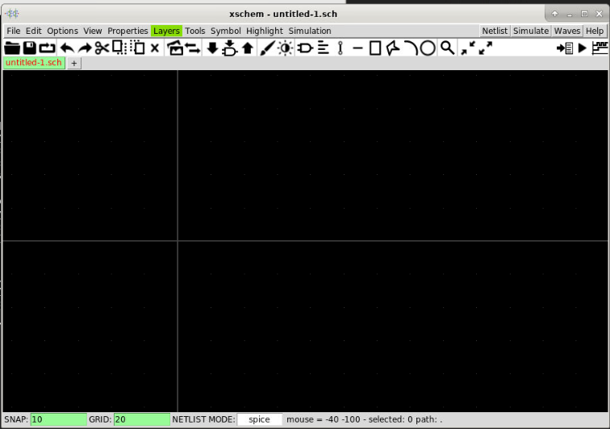

{: .no_toc}
##### 2. Insert the inverter symbol

Insert two inverter symbols by press the keyboard shortcut `Shift + i` or   `Ins` as follows:
 
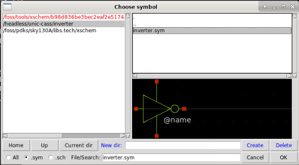

{: .no_toc}
##### 3. Wire two inverter to create a buffer

Now we need to create wires to connect these ports to form a buffer. This can be done by pointing your cursor to the point that you want to create the wire and pressing `w` to make a wire. Move your cursor to the point that you want to end the wire. Then, you can press `w` to make a new wire, and click on the stop. You can repeat this process multiple times until you have a circuit like the following.

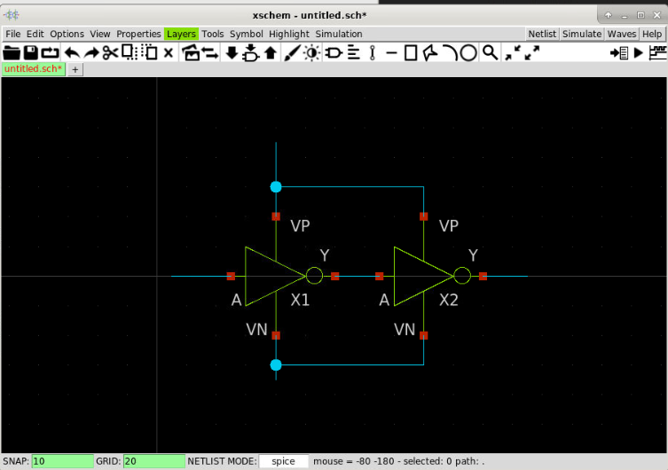

{: .no_toc}
##### 4. Create input, output and inout pins

Next, we create the input pin, output pin and the power supply pins as in the previous lesson. Just to recall, this can be done by inserting the ipin symbol for input pins, or opin symbol for the output pins and iopin symbol for the supply net. Don’t forget to change the name by selecting the pin and press ‘q’ shortcut to modify the name.

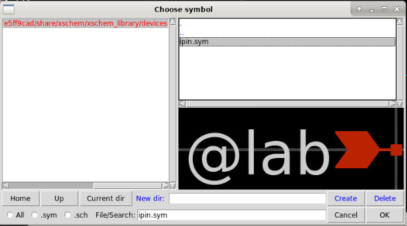
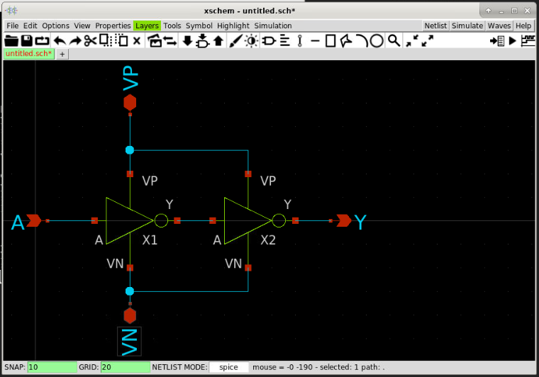

{: .no_toc}
##### 5. Save the buffer schematic

Next, we can save the schematic by selecting `File >> Save as`. Put the filename as `buffer.sch` and save it to the `inverter` directory and press `OK`.

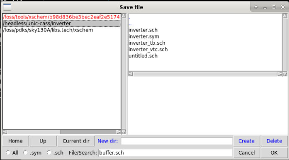

{: .no_toc}
##### 6. Create the buffer symbol

Now, we can create a symbol for the buffer. We take a different approach this time. Create a new symbol by selecting `Symbol >> Make symbol from schematic`. `Xschem` will ask us to change to the symbol view. Press `OK` on the pop-up menu.

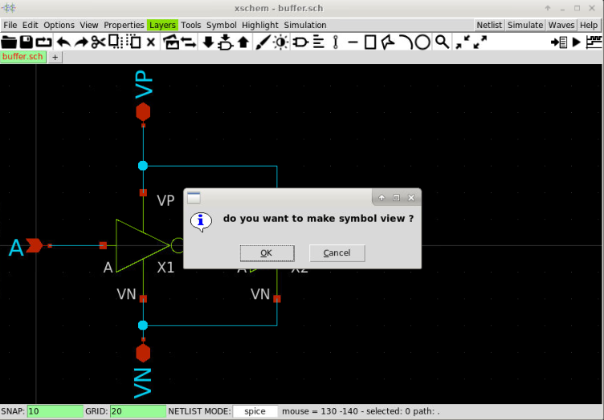

{: .no_toc}
##### 7. Open the automatically generated symbol

`Xschem` will create a new file `buffer.sym` in the same directory with the `buffer.sch`. Now, we can open the symbol and modify it by selecting `File >> Open`. Then, we select `buffer.sym`.


{: .no_toc}
##### 8. Delete the default box to create a new shape

In the symbol windows, we will delete the box by selecting the lines and delete them. 

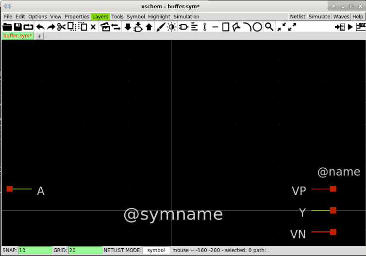

{: .no_toc}
##### 9. Organize the pins

Next, we organize the pin, the remaining line, and the pin text selecting them and move them to the correct position as the followings:

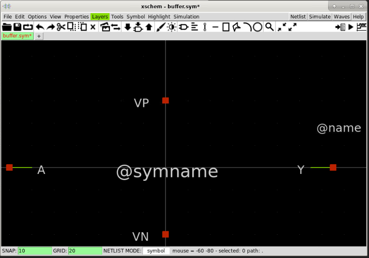

{: .no_toc}
##### 10. Draw a triangle for buffer symbol

Next, we draw the triangle as in the previous lesson.

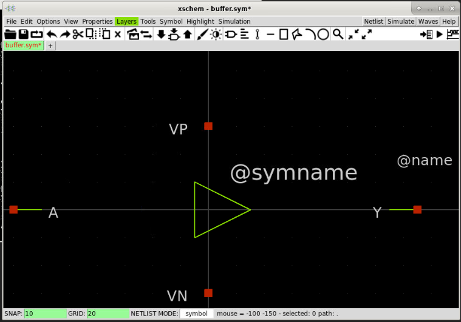

{: .no_toc}
##### 11. Move the pins and texts

Now you can move the pin, and the text by selecting them and press `m` and move the cursor to the desired position.

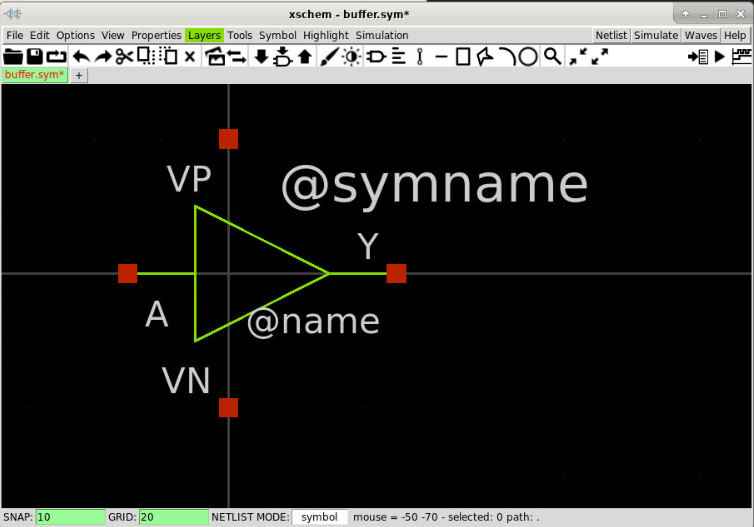

{: .no_toc}
##### 12. Draw lines

Next, we can draw the lines to connect the `VN` pin and `VP` pin to the triangle.

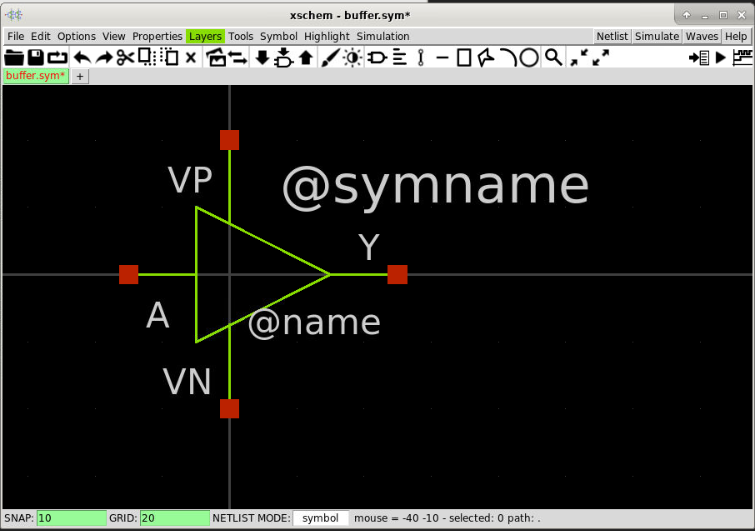

{: .no_toc}
##### 13. Save the symbol

Now, we can save the symbol by selecting `File >> Save`.

### Create the buffer testbench

{: .no_toc}
##### 14. Create a new schematic to test the buffer design

To verify the buffer behavior, we also need to create a testbench for it. In this lesson, we will do a time-domain simulation with the input as a square wave and verify the output. This can be done by creating a new schematic. Select `File >> New schematic` to open a new schematic window.

{: .no_toc}
##### 15. Insert the buffer design into the testbench

In search the buffer symbol by selecting `Tools >> Insert symbol`. Select the `buffer` symbol.

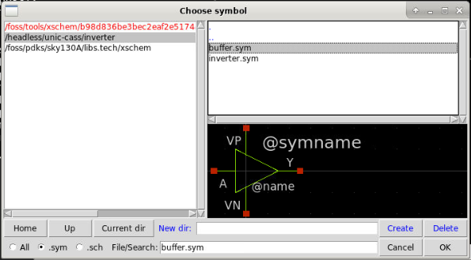

{: .no_toc}
##### 16. Create the power and ground nets

Next, we insert and connect the `VDD` symbol and `GND` symbol. `Select Tools >> Insert symbol` and select the `vdd.sym` and `gnd.sym`. Place them on the pin of the buffer. The results is as follow:

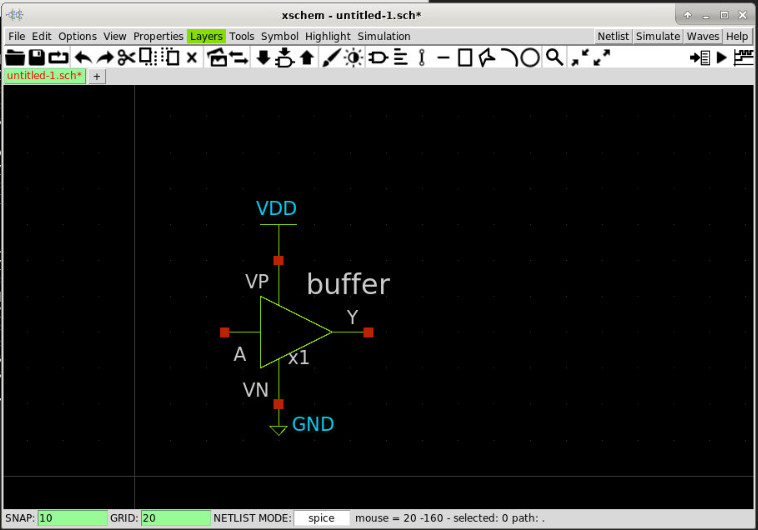

{: .no_toc}
##### 17. Create the voltage sources

Next, we insert the `vsource.sym` and connect `VDD` and `GND` to its terminal to create `1.8V` supply voltage. Please remember to edit the `vsource.sym` attribute to `name=Vdd`, and `value=1.8`.

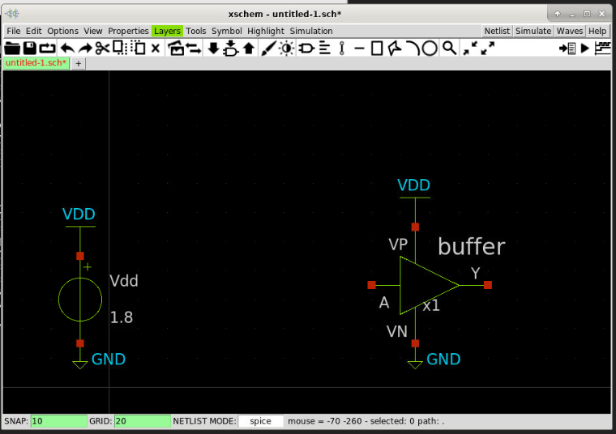

{: .no_toc}
##### 18. Create the input signal

Now, we can copy the voltage source and GND by selecting them and use the keyboard shortcut `c`. Place it in a new place and change it properties as follows:

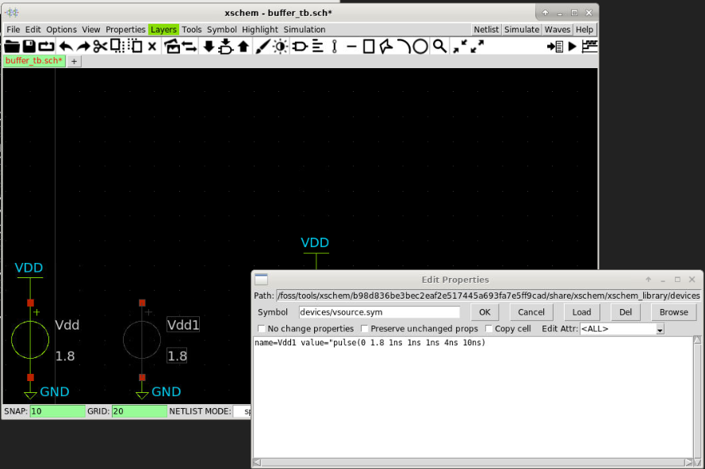
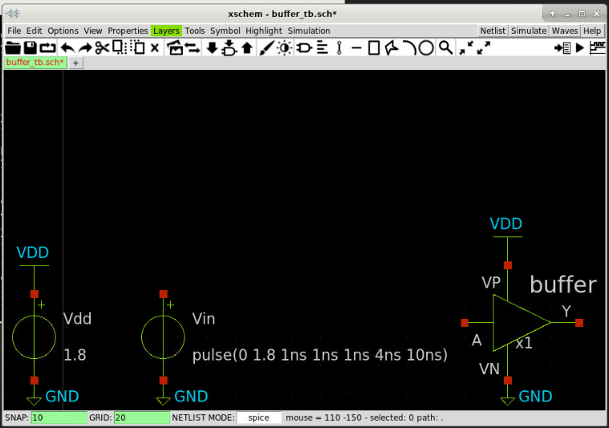

{: .no_toc}
##### 19. Create the lab pins for the input and the output

Next, we create two lab_pins one for the input and one for the output by inserting `lab_pin.sym` and rename it to `Vin` and `Vout`.

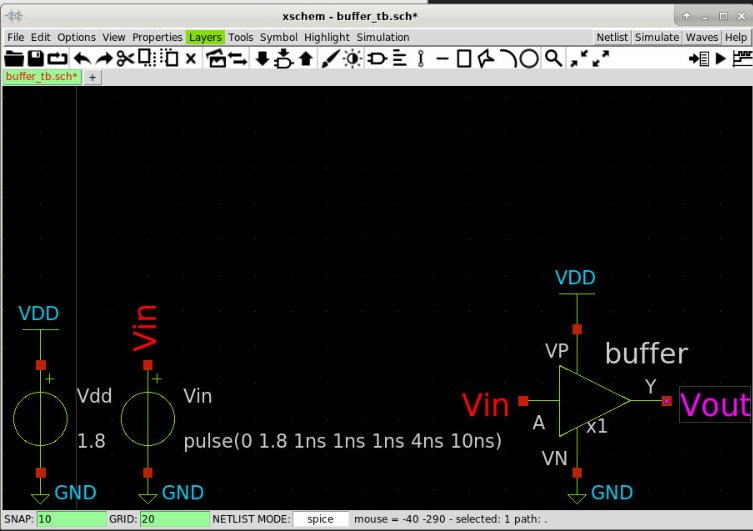

{: .no_toc}
##### 20. Include the model for simulation

Next, we insert the `TT_MODEL` as in the previous lesson.

{: .no_toc}
##### 21. Insert the code symbol

Press `Shift + i` to insert the code symbol in the xschem device library then press OK to place it into xschem.

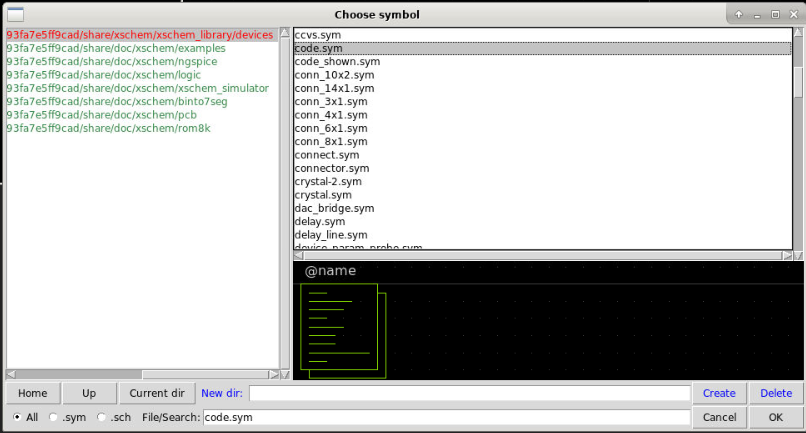

{: .no_toc}
##### 22. Change its properties to include the simulation model

Select the newly created symbol, and change its properties as follows and press `OK`.
 
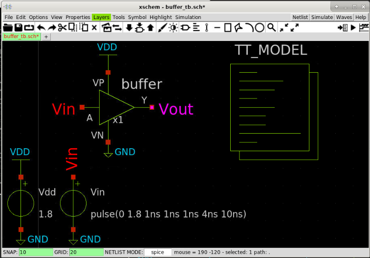

{: .no_toc}
##### 23. Set up analysis using `code_shown` symbol

Next, we need to add a `code_shown` symbol and change it properties as follows:

```spice
Name: SPICE
Value: ".tran 0.01u 1u
           .save all"
```

Then press `OK`.

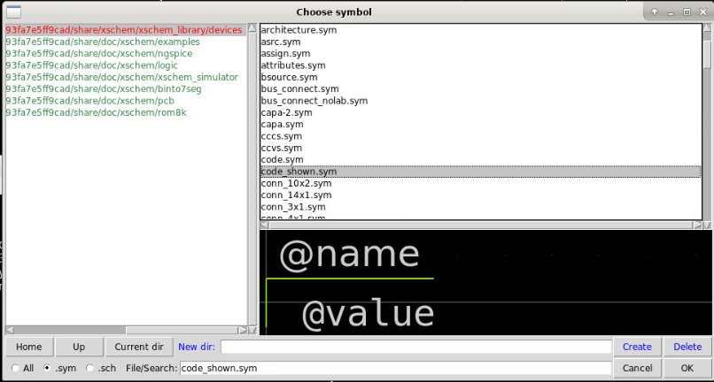
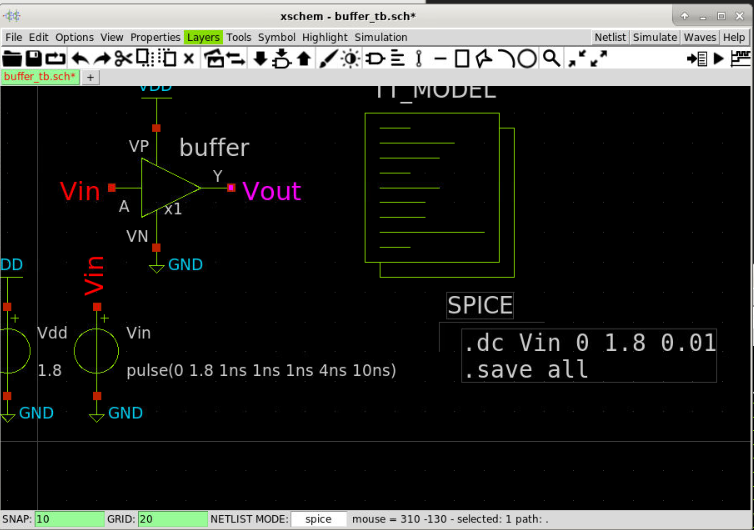

{: .no_toc}
##### 24. Save the schematic

Now we can save the schematic into inverter.sch by click on `File >> save as >> buffer_tb.sch`
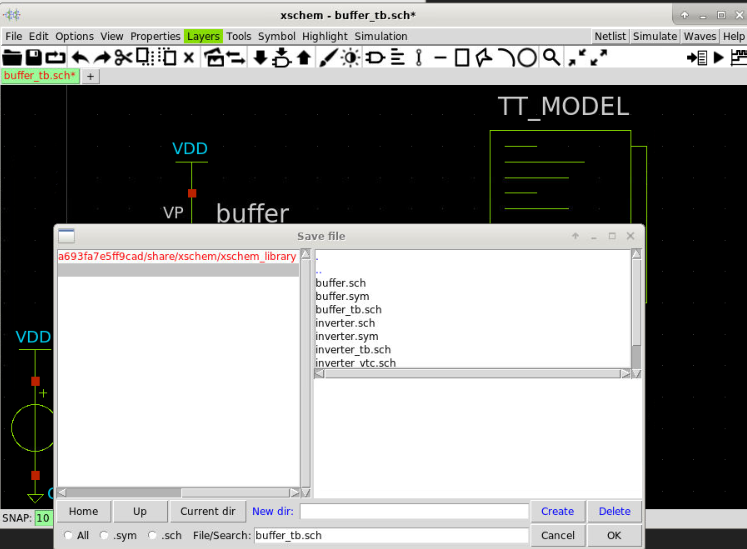

## Create design netlist

{: .no_toc}
##### 25. Generate the testbench netlist

The schematic is done, next you can generate the netlist by click on `netlist` button After the netlist is successfully generated (without warning or error in the info window), we can view our netlist by select `Simulation >> Edit Netlist`.

Output netlist:

{: .cmdout}
> Output netlist
> ```
> ** sch_path: /home/cass/unic-cass/inverter/buffer_tb.sch
> **.subckt buffer_tb
> x1 VDD Vin Vout GND buffer
> Vdd VDD GND 1.8
> Vin Vin GND pulse(0 1.8 1ns 1ns 1ns 4ns 10ns)
> **** begin user architecture code
> 
> ** opencircuitdesign pdks install
> .lib /home/cass/eda/unic-cass/share/pdk/sky130A/libs.tech/ngspice/sky130.lib.spice tt_mm
> 
> 
> 
> .tran 0.01u 1u
> .save all
> 
> **** end user architecture code
> **.ends
> 
> * expanding   symbol:  buffer.sym # of pins=4
> ** sym_path: /home/cass/unic-cass/inverter/buffer.sym
> ** sch_path: /home/cass/unic-cass/inverter/buffer.sch
> .subckt buffer VP A Y VN
> *.ipin A
> *.opin Y
> *.iopin VP
> *.iopin VN
> X1 A net1 VP VN inverter
> X2 net1 Y VP VN inverter
> .ends
> 
> 
> * expanding   symbol:  inverter.sym # of pins=4
> ** sym_path: /home/cass/unic-cass/inverter/inverter.sym
> ** sch_path: /home/cass/unic-cass/inverter/inverter.sch
> .subckt inverter A Y VP VN
> *.ipin A
> *.opin Y
> *.iopin VP
> *.iopin VN
> XM1 Y A VN GND sky130_fd_pr__nfet_01v8 L=0.15 W=1 nf=1 ad='int((nf+1)/2) * W/nf * 0.29' as='int((nf+2)/2) * W/nf * 0.29' pd='2*int((nf+1)/2) * (W/nf + 0.29)'
> + ps='2*int((nf+2)/2) * (W/nf + 0.29)' nrd='0.29 / W' nrs='0.29 / W' sa=0 sb=0 sd=0 mult=1 m=1
> XM2 Y A VP VDD sky130_fd_pr__pfet_01v8 L=0.15 W=1 nf=1 ad='int((nf+1)/2) * W/nf * 0.29' as='int((nf+2)/2) * W/nf * 0.29' pd='2*int((nf+1)/2) * (W/nf + 0.29)'
> + ps='2*int((nf+2)/2) * (W/nf + 0.29)' nrd='0.29 / W' nrs='0.29 / W' sa=0 sb=0 sd=0 mult=1 m=1
> .ends
> 
> .GLOBAL VDD
> .GLOBAL GND
> .end
> ```

## Configure & run the simulation

{: .no_toc}
##### 26. Configure the simulator in xschem

The simulation setup can be done by selecting `Simulation >> Configure simulators and tools`.
- In the `Ngspice` section, select `Ngspice batch` to use ngspice batch mode. 
- In the `Spicewave` section, select `Gaw Viewer`
- Click on `Accept and Close`. You can also save the simulation option by clicking on `Save Configuration to file`.

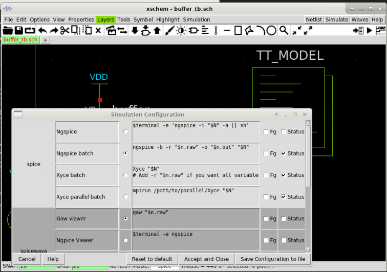

{: .no_toc}
##### 27. Simulate the design

To simulate the design, click on the `Simulate` button. If the `Simulate` button is red, the simulator is running. 

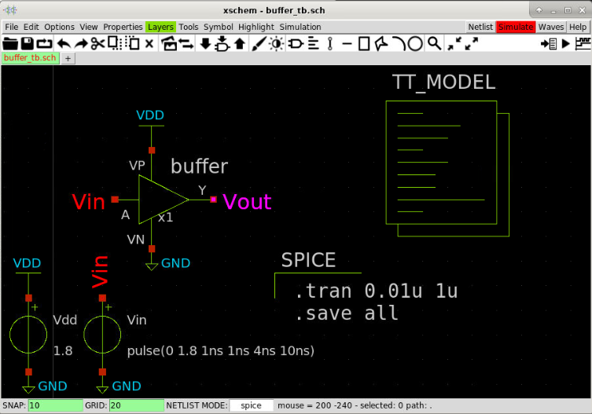

When the simulation finishes, a new window will appear with the simulation status. You should review it to see if there is any problem during the simulation.

{: .cmdout-title}
> Simulation output
> ```
> Completed: ngspice -b -r /home/cass/.xschem/simulations/buffer_tb.raw /home/cass/.xschem/simulations/buffer_tb.spice
> data:
> 
> Note: No compatibility mode selected!
> 
> 
> Circuit: ** sch_path: /home/cass/unic-cass/inverter/buffer_tb.sch
> 
> binary raw file "/home/cass/.xschem/simulations/buffer_tb.raw"
> Doing analysis at TEMP = 27.000000 and TNOM = 27.000000
> 
> No. of Data Columns : 19  
> 
> Initial Transient Solution
> --------------------------
> 
> Node                                   Voltage
> ----                                   -------
> x1.net1                                    1.8
> vin                                          0
> vdd                                        1.8
> vout                               3.20523e-07
> vin#branch                                   0
> vdd#branch                        -4.71778e-10
> 
> 
> No. of Data Rows : 2084
> 
> Total analysis time (seconds) = 0.053
> 
> Total elapsed time (seconds) = 5.651 
> 
> Total DRAM available = 15402.340 MB.
> DRAM currently available = 13993.477 MB.
> Maximum ngspice program size =  153.195 MB.
> Current ngspice program size =  138.066 MB.
> 
> Shared ngspice pages =    9.477 MB.
> Text (code) pages =    5.496 MB.
> Stack = 0 bytes.
> Library pages =  137.043 MB.
> ```

## Use Gaw to view the simulation waves

{: .no_toc}
##### 28. View the transient response

You can view the simulation results by clicking on the Waves button. A Gaw will be displayed with the recorded signals.

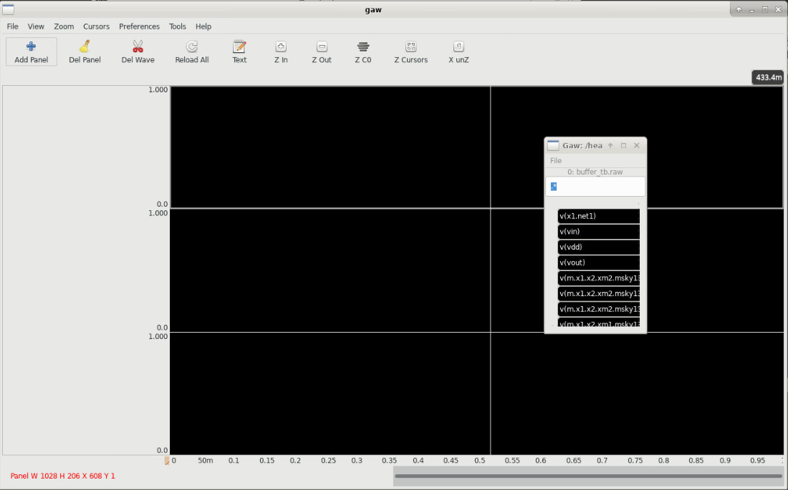

To add a signal to the wave viewer, you can click on a panel first, then add the signal in the signal list. For example, we add the `Vin` and `Vout` signals to the waveform as follows:

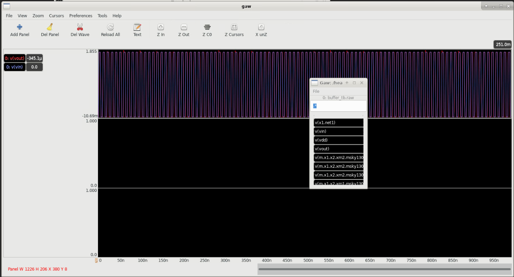

{: .no_toc}
##### 29. Zoom in and out

You can zoom in to see the delay between the input and the output after going through a buffer.

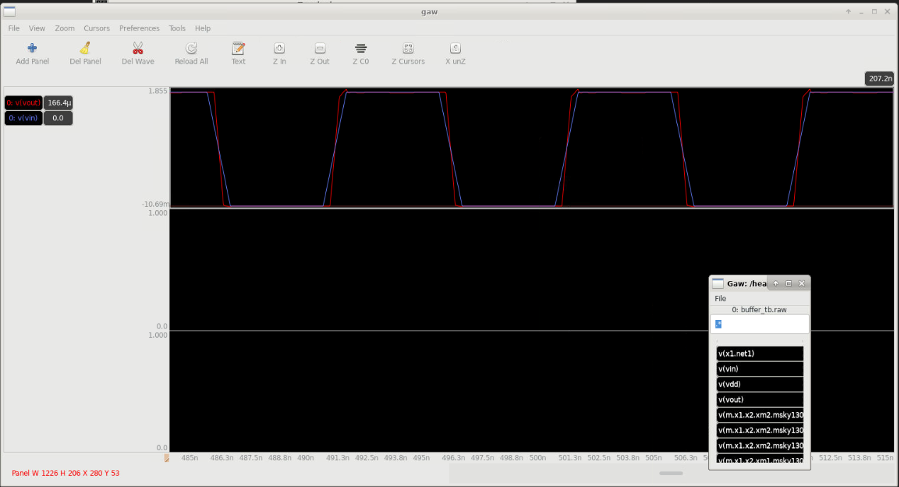 

## What’s next?

You’ve just finished the basic tutorials on how to create a hierarchical design. In the next lesson, we will use magic to create the design layout.
