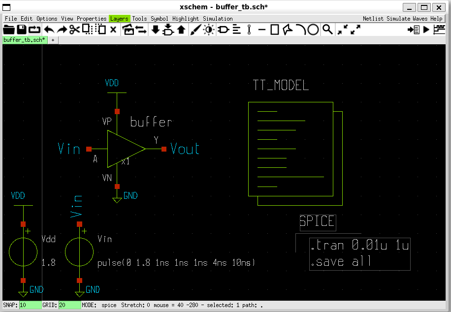

# 3.1.5 Hierarchical schematic captures in Xschem & time domain simulation

<div style="width: 854px;padding:56.25% 0 0 0;position:relative;"><iframe src="https://player.vimeo.com/video/857488415?h=0143779930&amp;badge=0&amp;autopause=0&amp;player_id=0&amp;app_id=58479" frameborder="0" allow="autoplay; fullscreen; picture-in-picture" style="position:absolute;top:0;left:0;width:100%;height:100%;" title="3.1.4 Hierachical schematic captures in Xschem and time-domain simulation"></iframe></div><script src="https://player.vimeo.com/api/player.js"></script>


## Prerequisites
- Finish the installation for analog designs described in either Lesson 2.2 or Lesson 2.3
- Finish the previous lessons on the simulation of an inverter and creating its symbol.
### PDK setup:
Ensure that the environment variable PDK_ROOT and PDK point to the correct directory and pdk folder.
```bash 
echo $PDK_ROOT
echo $PDK
```

If it has not been set yet, you can set it by using the following command in bash shell:
```bash
export PDK_ROOT=$PWD/unic-cass/pdks
export PDK=sky130A
```

Create a new directory named ‘inverter’ and copy xschemrc into this directory
```bash
mkdir -p unic-cass/inverter
cd unic-cass/inverter
cp -a $PDK_ROOT/$PDK/libs.tech/xschem/xschemrc .
echo ‘set editor {gedit}’ >> xschemrc # use gedit to edit the netlist
```

## Create a buffer schematic using two inverters

1.	Create a new schematic in `Xschem` by selecting `File >> new schematic`.


2.	Insert two inverter symbols by press the keyboard shortcut `Shift + i` or   `Ins` as follows:
 


3.	Now we need to create wires to connect these ports to form a buffer. This can be done by pointing your cursor to the point that you want to create the wire and pressing `w` to make a wire. Move your cursor to the point that you want to end the wire. Then, you can press `w` to make a new wire, and click on the stop. You can repeat this process multiple times until you have a circuit like the following.


4.	Next, we create the input pin, output pin and the power supply pins as in the previous lesson. Just to recall, this can be done by inserting the ipin symbol for input pins, or opin symbol for the output pins and iopin symbol for the supply net. Don’t forget to change the name by selecting the pin and press ‘q’ shortcut to modify the name.


5.	Next, we can save the schematic by selecting `File >> Save as`. Put the filename as `buffer.sch` and save it to the `inverter` directory and press `OK`.


6.	Now, we can create a symbol for the buffer. We take a different approach this time. Create a new symbol by selecting `Symbol >> Make symbol from schematic`. `Xschem` will ask us to change to the symbol view. Press `OK` on the pop-up menu.


7.	`Xschem` will create a new file `buffer.sym` in the same directory with the `buffer.sch`. Now, we can open the symbol and modify it by selecting `File >> Open`. Then, we select `buffer.sym`.


8.	In the symbol windows, we will delete the box by selecting the lines and delete them. 


9.	Next, we organize the pin, the remaining line, and the pin text selecting them and move them to the correct position as the followings:


10.	Next, we draw the triangle as in the previous lesson.


11.	Now you can move the pin, and the text by selecting them and press `m` and move the cursor to the desired position.


12.	Next, we can draw the lines to connect the `VN` pin and `VP` pin to the triangle.


13.	Now, we can save the symbol by selecting File >> Save.
14.	To verify the buffer behavior, we also need to create a testbench for it. In this lesson, we will do a time-domain simulation with the input as a square wave and verify the output. This can be done by creating a new schematic. Select File >> New schematic to open a new schematic window.
15.	In search the buffer symbol by selecting `Tools >> Insert symbol`. Select the `buffer` symbol.


16.	Next, we insert and connect the VDD symbol and GND symbol. `Select Tools >> Insert symbol` and select the `vdd.sym` and `gnd.sym`. Place them on the pin of the buffer. The results is as follow:


17.	Next, we insert the `vsource.sym` and connect `VDD` and `GND` to its terminal to create `1.8V` supply voltage. Please remember to edit the `vsource.sym` attribute to `name=Vdd`, and `value=1.8`.


18.	Now, we can copy the voltage source and GND by selecting them and use the keyboard shortcut `c`. Place it in a new place and change it properties as follows:


19.	Next, we create two lab_pins one for the input and one for the output by inserting lab_pin.sym and rename it to Vin and Vout.


20.	Next, we insert the `TT_MODEL` as in the previous lesson.
21.	Press `Shift + i` to insert the code symbol in the xschem device library then press OK to place it into xschem.


22.	Select the newly created symbol, and change its properties as follows and press `OK`.
 


23.	Next, we need to add a code_shown symbol and change it properties as follows:
```
Name: SPICE
Value: ".tran 0.01u 1u
           .save all"
```
Then press `OK`.




24.	Now we can save the schematic into inverter.sch by click on `File >> save as >> buffer_tb.sch`


## Create design netlist
25.	The schematic is done, next you can generate the netlist by click on netlist button After the netlist is successfully generated (without warning or error in the info window), we can view our netlist by select `Simulation >> Edit Netlist`.
Output netlist:
```
TBD
```

## Configure & run the simulation
26.	The simulation setup can be done by selecting `Simulation >> Configure simulators and tools`.
- In the `Ngspice` section, select `Ngspice batch` to use ngspice batch mode. 
- In the `Spicewave` section, select `Gaw Viewer`
- Click on `Accept and Close`. You can also save the simulation option by clicking on `Save Configuration to file`.


27.	To simulate the design, click on the `Simulate` button. If the `Simulate` button is red, the simulator is running. 


When the simulation finishes, a new window will appear with the simulation status. An output file (in this case inverter_vtc.out) is created with the simulation status (warning and errors). You should view this file to see if there is any problem during the simulation.


The contents of the output file after simulation is as below.


## Use Gaw to view the simulation waves
28.	You can view the simulation results by clicking on the Waves button. A Gaw will be displayed with the recorded signals.


To add a signal to the wave viewer, you can click on a panel first, then add the signal in the signal list. For example, we add the `Vin` and `Vout` signals to the waveform as follows:


29.	You can zoom in to see the delay between the input and the output after going through a buffer.

 

## What’s next?
You’ve just finished the basic tutorials on how to create a hierarchical design. In the next lesson, we will use magic to create the design layout.
