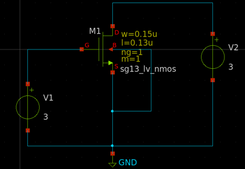
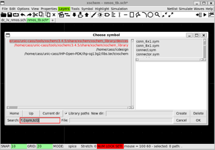
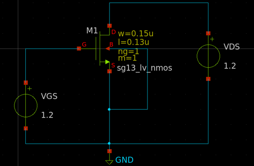
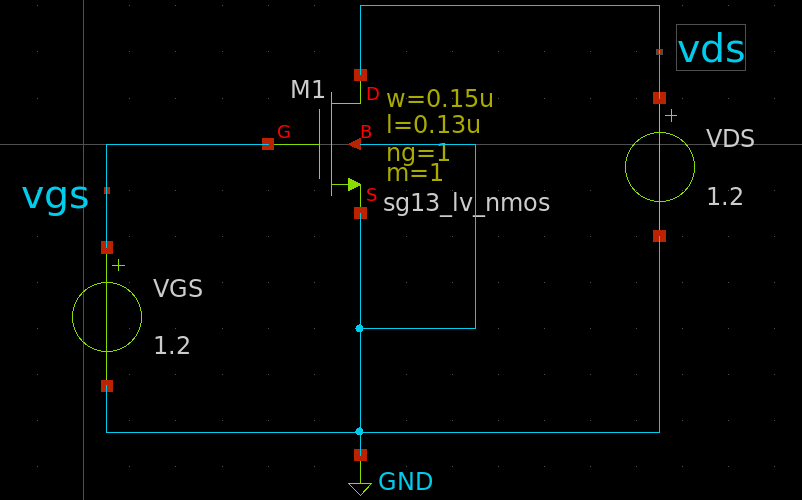
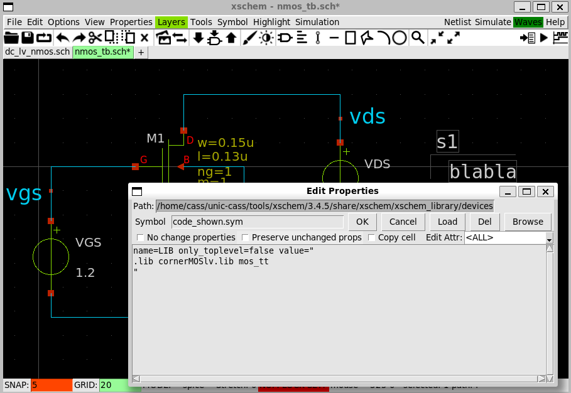
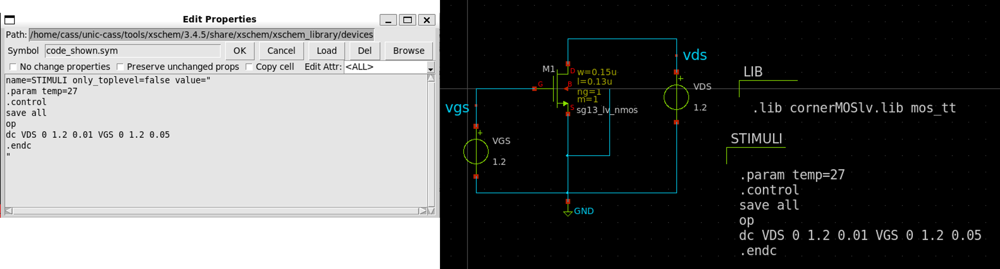

{: .no_toc }
# 3.2 Spice Simulation using IHP SG130 PDK with Xscheme and NGSpice

{: .no_toc }

<!-- <details open markdown="block">
  <summary>
    Table of contents
  </summary>
  {: .text-delta }
- TOC
{:toc}
</details> -->

This section introduces the spice simulation with Xscheme and NGSpice 

## 3.1. IHP Open PDK Simulation Model

Transistor Models are written in Verilog-A

- Compiled by OpenVAF before used

Use corner `.lib` for simulation

- cornerHBT.lib

- MOS model: cornerMOShv/lv.lib

- Resistor models: cornerRES.lib

Abbreviation

- mod: model

- parm: parameter of the model

- stat: statistical model

- mismatch: local statistical model

```
ihp-sg13g2/libs.tech/ngspice
.
├── models
│   ├── capacitors_mod.lib
│   ├── capacitors_stat.lib
│   ├── cornerCAP.lib
│   ├── cornerHBT.lib
│   ├── cornerMOShv/lv.lib
│   ├── cornerRES.lib
│   ├── diodes.lib
│   ├── resistors_mod[_mismatch,stat].lib
│   ├── sg13g2_bondpad.lib
│   ├── sg13g2_esd.lib
│   ├── sg13g2_hbt_mod[_mismatch,stat].lib
│   ├── sg13g2_moshv/lv_mismatch.lib
│   ├── sg13g2_moshv/lv_mod.lib
│   ├── sg13g2_moshv/lv_mod_mismatch.lib
│   ├── sg13g2_moshv/lv_parm.lib
│   ├── sg13g2_moshv/lv_stat.lib
│   ├── sg13g2_svaricaphv_mod.lib
│   ├── sg13g2_svaricaphv_mod_mismatch.lib
└── osdi // compiled models
    ├── mosvar.osdi
    ├── psp103_nqs.osdi
    └── r3_cmc.osdi
```

## 3.2. Create NMOS test circuits in Xscheme

Create the NMOS test circuits with the following components

- `xscheme_library/devices`

>> V1 & V2: vsource.sym

>> GND: gnd.sym

- `sg13g2 devices`

>> M1: sg13_lv_nmos.sym



Change library

- Click on the library name on the left


- Can use `Home/Up/Current_dir` to go back to the default library list or the folder with the symbols



## 3.3. Change the Instances' name

Change the name of each components by selecting it and pressing `q`

- V1 => VGS

- V2 => VDS


Final circuit as follows.



## 3.4. Insert the Lab Pin

This is for displaying the pin signals on the waveform

- Create `lab_pin` symbols for `VDS` and `VGS` signals as follows.



## 3.5. Setup the Library

Use `cornerMOSlv.lib` and `mos_tt` section

- Insert a `code_shown.sym` into the schematic and modify its properties as follows



- Spice syntax:

```spice
.lib <lib_filename> <lib_section>
```


## 3.6. Setup the Simulation

We need to sweep the `VGS` and `VDS` from `0` to `1.2V`

- Insert a `code_shown.sym` and change its properties as follows.



## 3.7. Generate Netlist and Run the Simulation

- Click on `Netlist` button to generate the netlist

- Click on `Simulation` >> `Edit Netlist` to view the netlist

- Click on `Simulate` button to start the simulation


## 3.8. Plot the Waveform

- In `NGSpice` simulation terminal, displaying the nodes in the schematic by enterring `display` command


- NGSpice annotates the current as `<node_name>#branch`

- Plot IDS by enterring `plot-vds#branch` command


