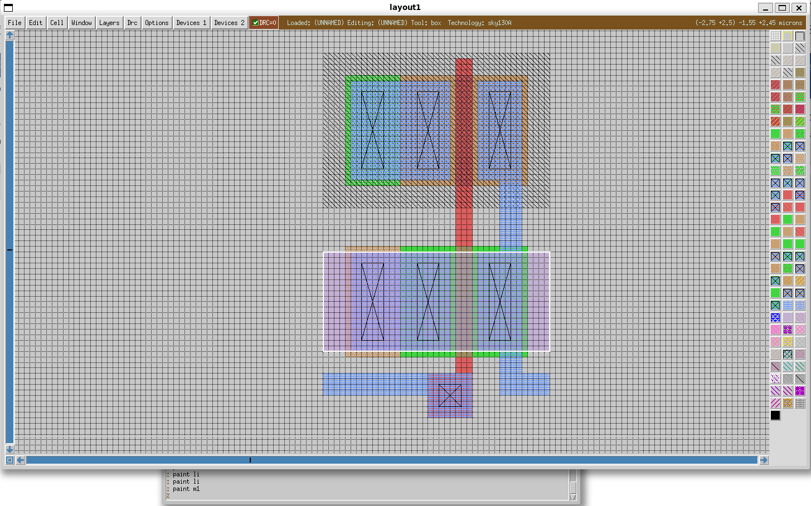

# 3.2 Design layout and design rule check with Magic
<div style="width: 854px;padding:56.25% 0 0 0;position:relative;"><iframe src="https://player.vimeo.com/video/857488925?h=1bbae6f995&amp;badge=0&amp;autopause=0&amp;player_id=0&amp;app_id=58479" frameborder="0" allow="autoplay; fullscreen; picture-in-picture" style="position:absolute;top:0;left:0;width:100%;height:100%;" title="3.2-Creating a Hierarchical Layout in Magic Using the Sky130 PDK-(1080p)"></iframe></div><script src="https://player.vimeo.com/api/player.js"></script>

<!-- ### Lecture notes
<iframe src="https://docs.google.com/document/d/e/2PACX-1vQyaAR7ulvcvuFVwqo_H-B3sIWxMT6CJ_oDpUjsowWgPTXi1Oa0CqkIB5aups4KV9Y5-MnLJXQI-QQw/pub?embedded=true" width="854" height="600"></iframe> -->


## Prerequisites

- Finish the installation for analog designs as described in either [Lesson 2.2](https://docs.google.com/document/u/0/d/1\_voEAtajiMH3X9TRXuH8yyI0D-kbfFbA0WG5Jfd5-Qw/edit) or [Lesson 2.3](https://docs.google.com/document/u/0/d/17KM6zGnZ0eSGLeuYvvp7etcrgcjRfjfNcxlem\_e8irw/edit)  
- (Optional) Finish [the previous lesson](https://docs.google.com/document/u/0/d/11XbuqDkUKHFfK6Agl\_6AYkxCAcNDyV7u4VJWG1srwVI/edit) on creating the hierarchical schematic of a buffer using the inverter.

## PDK setup:

{: .no_toc}
##### Set up the environment variables

Ensure that the environment variables `PDK_ROOT` and `PDK` point to the correct directory and pdk folder.  

```bash
echo $PDK_ROOT
echo $PDK
```

If it has not been set yet, you can set it by using the following command in bash shell with the value from the previous lessons:  

```bash
export PDK_ROOT=$HOME/unic-cass/pdks  
export PDK=sky130A
```

## Skywater 130nm PDK

Before starting doing the layout, we should understand the Skywater 130 technology. You should review [the presentation on Skywater 130nm PDK](https://drive.google.com/file/d/17b5HRGhKP3gaHPBciKv3z-3XCImo7JdK/view?usp=sharing). Full information about the Skywater 130nm technology can be found [here](https://skywater-pdk.readthedocs.io/en/main/index.html).

## Stack diagram

The following image is the stack diagram for Skywater 130nm. It is the guideline for us to create the layout for our design. From the stack diagram, Skywater 130nm technology contains 5 metal layers. The polysilicon and the basic layers are not connected to the metal layer directly. These base layers such as diffusion layers and polysilicon must be first connected to the local interconnect (li) layer using a special via so called `licon`. Local interconnect layer connect to `metal 1` layer using a special via called `mcon`. Then the metal layers can be connected to each other using the metal vias including `via1`, `via2`, `via3`, `via4`.


## Design rules

It is also important to understand the design rule because during the layout process, you might violate the design rule. The full description of the design rules is described in [the PDK documentation](https://skywater-pdk.readthedocs.io/en/main/rules.html). Most of the important rules are automatically checked by Magic. Some special foundry rules which have not been implemented in Magic such as SRAM rules. Therefore, if you use SRAM from the OpenRAM project, you should exclude them from the DRC. 

Here are some common DRC errors that might come up when placing contacts:

| DRC | What the DRC means |
| :---: | :---: |
| (N/P)-diffusion overlap of (N/P)-diffusion \< 0.06um in one direction | *The diffusion extending out from the contact is \< 0.06. Try increasing diffusion area around conWWtact* |
| Diffusion contact to gate \< 0.055um | *The contact is too close to the poly. Move the contact farther away* |
| Local interconnect overlap of (N/P)-diffusion \< 0.06um in one direction | *There is not enough local interconnect metal extending from the top or bottom of the contact. Increase the length of the local interconnect metal on the top or bottom* |
| (N/P)-diffusion contact width \< 0.17um | *The contact is too small. The minimum size for contacts is 0.17um x 0.17um. Increase the size of the contact* |
| Diffusion width \< 0.15um | *The diffusion that was painted is too small. This can happen if a smaller rectangle of diffusion that is less than 0.15um x 0.15um is connected to a larger one. Magic will see the smaller rectangle as being not big enough. Remove the irregular square to make a perfect rectangle* |
| N-diffusion spacing to N-well \< 0.34um | *The N-diffusion needs to be moved further away from the N-well. An easy way to do this is to select the whole bottom half of the design using **a** on the keyboard, then while holding shift, press **w**. This will move the selected area down while extending non-selected things that are connected to it.* |
| Local interconnect spacing \< 0.17um | *Two separate layers of local interconnect are too close to each other* |
| Poly overhang of transistor \< 0.13um | *There must be at least 0.13um of poly that extends away from the diffusion on the top and bottom. Try extending the poly on the side that has the DRC* |

## Magic basics

The following are the main windows of Magic. It contains the drawing area and a TCL console window. You can use your mouse or the command to interact with your design layout.  
The following are the basic things you need to know when working with Magic.

* To draw the box:  
  * Use your left mouse button to mark the start of the box  
  * Use your right mouse button to mark the end of the box  
  * Use your middle mouse button to fill the box with the layer under the current cursor position  
    The middle mouse button helps you to quickly draw the same layer with the existing one in the layout or use the layer panel.  
* Type command:  
  * Press : to start typing the command in the layout windows  
    This enables you to mix between mouse, keyboard shortcuts, and commands in a natural way. You don’t need to switch between the  layout and the TCL console window.

You can customize the keyboard shortcuts and configure Magic by creating a Magic startup file (.magicrc). In this lesson, we use the default magicrc file from the Skywater 130 nm provided by `open_pdks`.


The layer panel contains the colors and textures of different layers in our layout. The image below shows the layer panels and their corresponding names. You can also move the mouse over each layer in the layer panel to see its name in the top right corner of the layout window. The ones in red are the most important ones that will be used in this tutorial and maybe your future layouts.  
The name in the layer panel might be different from the stack diagram. The names are defined in `$PDK_ROOT/$PDK/libs.tech/magic/sky130A.tech`. You can take a look at this file which contains all the names and their aliases. The following is the example for the contacts.

```text
contact  
  pc   	poly   	locali  
  ndc  	ndiff  	locali  
  pdc  	pdiff  	locali  
  nsc  	nsd    	locali  
  psc  	psd    	locali  
  ndic 	ndiode 	locali  
  ndilvtc  ndiodelvt  locali  
  nndic	nndiode	locali  
  pdic 	pdiode 	locali  
  pdilvtc  pdiodelvt  locali  
  pdihvtc  pdiodehvt  locali  
  xpc  	xpc    	locali

  mvndc   mvndiff   locali  
  mvpdc   mvpdiff   locali  
  mvnsc   mvnsd 	locali  
  mvpsc   mvpsd 	locali  
  mvndic  mvndiode  locali  
  mvpdic  mvpdiode  locali

  mcon locali metal1  
  obsmcon obsli metal1

  via1   metal1 metal2  
  via2   metal2 metal3  
  via3   metal3 metal4  
  via4   metal4 metal5  
  stackable

  # MiM cap contacts are not stackable!  
  mimcc  mimcap metal4  
  mim2cc mimcap2 metal5

  padl m1 m2 m3 m4 m5 glass

  mrdlc metal5 mrdl  
  pi2   mrdl ubm  
end  
```


## Layout an Inverter

### Create the inverter layout

{: .no_toc}
##### 1. Run magic and load skywater 130 technology rule.  

```bash
mkdir -p $HOME/unic-cass/inverter/magic  
cd $HOME/unic-cass/inverter/magic  
magic -rcfile $PDK_ROOT/$PDK/libs.tech/magic/sky130A.magicrc
```


{: .no_toc}
##### 2. Press the keyboard shortcut `g` to show the grid lines.


{: .no_toc}
##### 3. Change the grid and enable `snap to grid`

In the tcl cmd window, run command `grid 0.05um 0.05um` to set grid size to 0.05 micrometer. This is a better grid size for Skywater 130nm because the smallest gate length is 0.15um). You can also enable the snap to grid by running the command `snap grid` in the tcl console window.


{: .no_toc}
##### 4. Zoom in and out in Magic 

Press the keyboard shortcut `shift+z` to zoom out and `z` to zoom in the design window.


## Layout a NMOS transistor

{: .no_toc}
##### 5. Draw polysilicon layer

Draw polysilicon layer by selecting an area with the width `l=0.15um` and the height `h=1.05um` (about 3 grid boxes horizontally and 21 grid boxes vertically) and running the command by typing `:paint poly` in Magic main windows.


{: .no_toc}
##### 6. Draw n-diffusion layer

Draw n-diffusion layer by selecting an area with the width l=0.5, and the height h=1.05 on the left of the poly layer and running the command `:paint ndiff`


- Next, move the box to the right hand side of the poly layer by left click on the lower right corner of the poly layer and paint the ndiff layer again as above.


- Similarly, we can draw the ndiff layer under the poly layer by moving the box over the polysilicon layer and pain the n-diffussion layer again. Left click on the lower left corner of the polysilicon shape and paint the n-diffusion layer again.


There are some errors in the DRC check box, don’t worry and follow the next steps.

{: .no_toc}
##### 7. Draw the extension of the polysilicon layer

- Draw the extension of the top and bottom poly layer with size of `l=0.15um` and `h=0.15um` as in the figure below


{: .no_toc}
##### 8. Draw the p-tap

- Draw the local interconnect (li) layer inside the n-diffusion layer (select an area as the following (l=0.4um, h=1.05um) and type `:paint li` or use middle click on the li layer on the layer panel)


- Draw a via connection between the li layer and n-diffusion layer (select an area as the following and run the command `:paint ndc` or use the middle click on the ndc layer in the layer panel)


- Repeat the above steps for the right hand side of the transistor.

  


{: .no_toc}
##### 9. Draw the p-substrate diffusion layer and the substrate connection  

- Draw a p-substrate diffusion layer by select a window with the width `l=0.5um` and the height `h=1.05um` next to the left side of the n-diffusion layer and type `:paint psd` or using a middle click on the p-substrate diffusion layer on the layer panel.


- Draw local li layer


- Draw p-substrate connection, select like this and `:paint psc` or middle click on p-substrate contact on layer panel

  
You can do same procedure to create the pmos transistor (with other layer) or doing faster by following these step

{: .no_toc}
##### 10. Create pmos transistor

It is possible to layout the pmos transistor similar to nmos transistor described above. However, in Magic, there is a faster way to do that. It is possible to copy the nmos and convert it into pmos. In this part, we will try a new way.

- Draw a box over nmos transistor or type the keyboard shortcut `s` to select the top-most cell in the layout.


- Run the command `:select area` to select all layer in the box


- Run the command `:copy n 30` to copy the nmos to the top


{: .no_toc}
##### 10. Draw nwell to convert the nmos to pmos:

- Draw nwell by running the command `:paint nwell` and it has DRC errors related to nwell covering


- Select the area that covers all the DRC error and run the command `:pain nwell`. There is a DRC error because the nwell is too close to the nmos.


- Next, we have to move the pmos up to avoid the DRC error. This can be done by draw a box cover the pmos, and run the command `:select area` to select all the layer of the pmos. Next, we can move the cell by running the command `:move n 1`.


The DRC error is clear. You can repeat the move command by using the key board shortcut ‘.’ (repeat the previous command) and undo by the keyboard shortcut ‘u’

{: .no_toc}
##### 11. Connect two transistors together

- First, we connect the polysilicon layer of the two transistors by draw a box between them and run the command `:paint poly`.


- Next, we connect the two drains of the transistor using local interconnect layer. This can be done by drawing a box between the two drain with the width of 0.2um (4 unit in the grid) and run the command `:paint li`


## Create IO ports for the inverter

{: .no_toc}
##### 12. Create the input and output ports

Create Input port for the inverter by creating the poly contact to the local interconnect. This can be done by first drawing the poly layer for the contact by selecting an area of `0.40umx0.40um` at the bottom of the polysilicon then run the command `:paint poly`.


{: .no_toc}
##### 13. Keep the same box, and run the command `:paint li` to draw the local interconnect layer.


{: .no_toc}
##### 14. Next, draw a small box of `2x2` in the middle to connect the local interconnect layer to the polysilicon layer.


{: .no_toc}
##### 15. Next, we can route the input signal from the border of the cell to the polysilicon by extending the local interconnect layer to the border of the cell.


{: .no_toc}
##### 16. Next, we can draw the output port on the local interconnect layer in a similar way. The idea is to create the input port and the output port in the same horizontal position so that when the two inverters put together can immediately create the buffer.

  


{: .no_toc}
##### 17. Now, we can create the net for VP and VN by drawing the two metal 1 layers over the nmos and pmos. Select a box that extends to the boundary of the nmos and run the command `:paint m1` to draw the `metal 1`.



{: .no_toc}
##### 18. Similarly, place the box over the pmos, and run the command `:paint m1` to draw the metal 1 for the power supply net.


{: .no_toc}
##### 19. Connect the `VP` and `VN`

Now we have to create the connection from metal 1 layer to the local interconnect layer for `VP` and `VN`. Draw the box over the substrate contact and make the connection between local interconnect layer and metal 1 by running the command `:paint mcon`. Repeat for three other contacts.


  


## Create the label and make the IO ports

{: .no_toc}
##### 20. Label ports

Our next task is to create the IO ports and their label. Firstly, focus the select box to a point by left click and then right click at the same spot on the input port. Then, create the label by running the command `:label A w`. A label will be created for the input port A of the inverter.


{: .no_toc}
##### 21. Make the input port

Next, we have to specify that it is a port by running the command `:port make 1`. This creates a port with the index 1.


{: .no_toc}
##### 22. Make the output port

Repeat two steps above to create the output port `Y`. Please remember to change the port index to 2.

  


{: .no_toc}
##### 23. Make ports for `VP` and `VN`

Similarly, we can create the port for `VP` and `VN`. The difference is that we have to specify the layer that we would like to make the port.

  


{: .no_toc}
##### 24. Save the layout

Now the layout of the inverter is completed. We can save the cell as `inverter.mag` by running the command `:save inverter`


## Layout the buffer design

{: .no_toc}
##### 25. Create a new cell view for the bufer design

Create a new cell by selecting `Cell >> New` and enter the name `buffer` and press `OK`.

  


{: .no_toc}
##### 26. Load the inverter cell to the new cell view

Now, we can load the inverter cell by running the command `:getcell inverter`. The inverter cell will be inserted into the layout.


{: .no_toc}
##### 27. Display the underlying layers

A new cell instance `inverter_0` is created as a box. To display its underlying layers, press the keyboard shortcut `x`.


{: .no_toc}
##### 28. Create the second inverter

Now, we create the second inverter by moving the box to the right next to the first inverter and run the command `:getcell inverter`. A second instance of the inverter design is created with the name `inverter_1`.


{: .no_toc}
##### 29. Display the layers of the new inverter

We can show the layout of `inverter_1` by pressing the keyboard shortcut `x`. It is clear that the two inverters are placed together nicely.


{: .no_toc}
##### 30. Create the IO ports

Next, to create the IO ports for the buffer, we need to draw some shape for the input, output and the IOs. First, select the input port on the left, and draw a small box and run the command `:paint li` to create the local interconnect layer.


{: .no_toc}
##### 31. Create the local interconnect for the output

Similarly, we need to draw the local interconnect layer for the output.


{: .no_toc}
##### 32. Draw Metal1 for `VP` and `VN`

Next we draw two metal 1 layers for `VP` and `VN` port on the left side by draw a box on metal 1 layer of the pmos and run the command `:paint m1`. Repeat these steps for nmos.

  


{: .no_toc}
##### 33. Hide the inverters layers

We now can verify these drawings by hiding the details of the two inverters. Select the inverter cell and press the keyboard shortcut `shift + x` or select `cell >> unexpand`.


{: .no_toc}
##### 34. Label the input, output and inout ports

Next we label the input, output and the IOs by repeating the steps in [the above section](#create-the-label-and-make-the-io-ports). Please note that, in this example, we will not make them ports. We can skip the make port commands.

  
  
  


{: .no_toc}
##### 35. Save the cells

Now, we can save the cell and we can export the design by running the following commands:  
```tcl
save  
extract all  
```


{: .no_toc}
##### 36. Export the netlist

We can also export the spice netlist for the next step by running the following command:  

```tcl
ext2spice hierarchy on  
ext2spice scale off  
ext2spice
```


Magic will export the spice netlist as follows:

```log
File: buffer.spice  
01: * SPICE3 file created from buffer.ext - technology: sky130A  
02:  
03: .subckt inverter A Y VP VN  
04: X0 Y A VP VP sky130_fd_pr__pfet_01v8 ad=0.5 pd=3 as=0.5 ps=3 w=1 l=0.15  
05: X1 Y A VN VN sky130_fd_pr__nfet_01v8 ad=0.5 pd=3 as=0.5 ps=3 w=1 l=0.15  
06: .ends  W
07:  
08: .subckt buffer  
09: Xinverter_0 A inverter_1/A VP VN inverter  
10: Xinverter_1 inverter_1/A Y VP VN inverter  
11: .ends
```

## What’s next?

You’ve just finished the basic tutorial on how to do layout and design rule check with Magic. The next step is to verify the identical between the layout and schematic by performing Layout-Versus-Schematic check using netgen.
