{: .no_toc }
## 3.4 Creating the Inverter's Subcircuit and Symbol in Xschem

{: .no_toc }

<!-- 

  

    Table of contents
  

  {: .text-delta }
- TOC
{:toc}

 -->

This section introduces how to create the inverter as a subcircuit and make its symbol with Xschem.

#### 1. Inverter as Subcircuit

Create an inverter schematic in Xcheme

- Input: `A` (`ipin.sym`)

- Output: `Y` (`opin.sym`)

- Power supply: `VDD` (`iopin.sym`)

- Ground: `VSS` (`iopin.sym`)

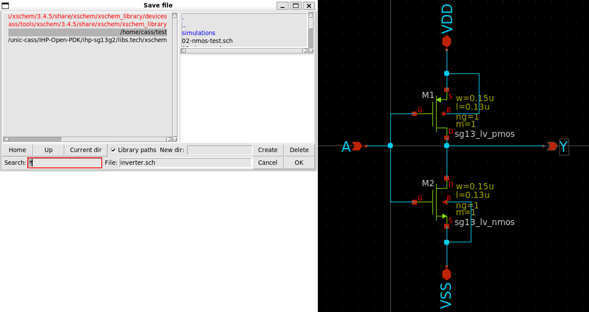

Save the schematic by selecting `File` >> `Save As` >> `inverter.sch`

Next, we create the symbol for the inverter.

#### 2. Create Symbol

Create a symbol by selecting `Symbol` >> `Make symbol from schematic`

- Click `OK` on the dialog `Do you want to make symbol view`

- A new file named `inverter.sym` will be create in the same directory

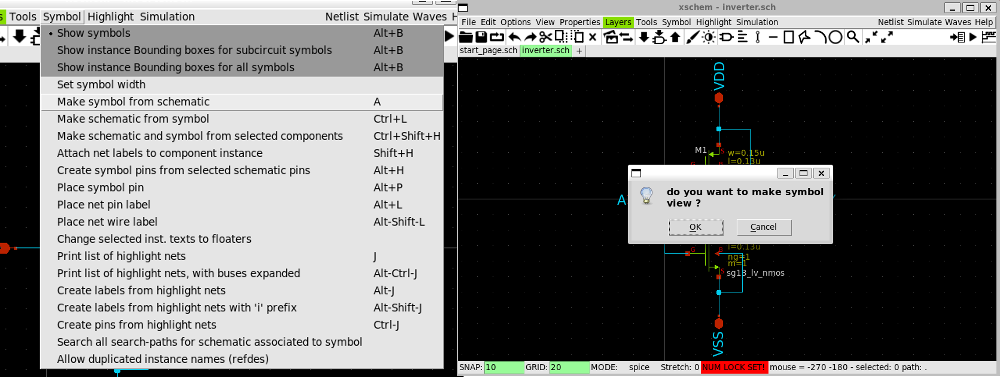

The next step is to edit this symbol file.

#### 3. Edit the Symbol

Click on `File` >> `Open` then select `inverter.sym` in the open dialog

- You might need to choose the correct directory containing the symbol file first

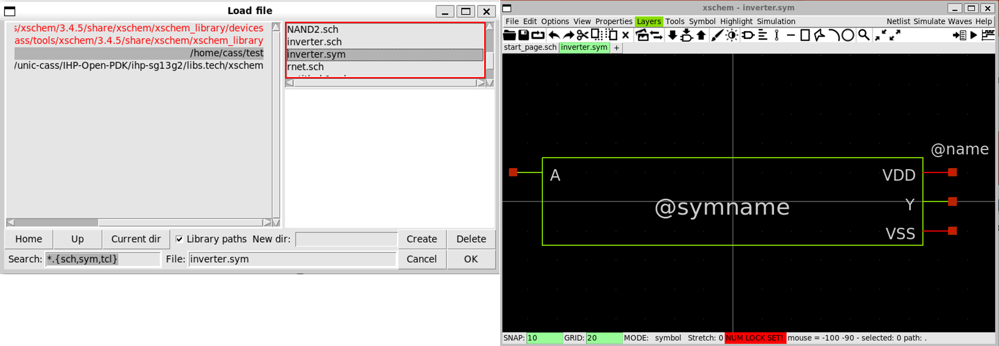

#### 4. Make the Inverter Shape

- Delete the rectangle by selecting the lines and press `delete`.

- Move the pins including `A`, `Y`, `VDD`, `VSS` as the following (Please note the center of the drawing, this is important.)

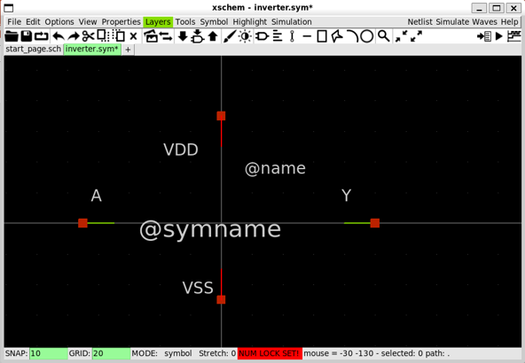

- Press `L` multiple times to draw the triangle shape for the inverters as follows.

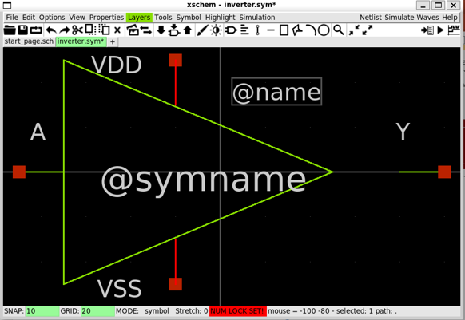

- Move `VDD` and `VSS` pins toward the triangle.

- In this step, we might need to change the snape size. Change the snape size by pressing `g` to decrease or `Shift+g` to increase its size.

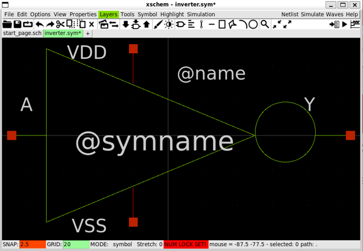

- Draw the triangle by clicking on two points and size the circle as you want

- Move the circle and other component if necessary

- Click on save when done.

#### 5. Create a Testbench for Inverter

- Create a new schematic by selecting `File` >> `Create new window/tab`

- Insert a new instance by selecting `Tools` >> `Insert Symbol` and selecting the folder with the `inverter.sym`

- Create a new schematic as follows.

>> `VDD`, `VIN`: `vsource.sym`

>> `vdd`, `vin`, `vout`: `lab_pin.sym`

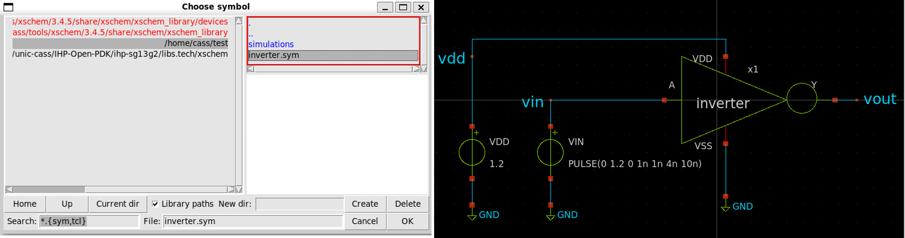

- Next, setup the library and simulation options as follows.

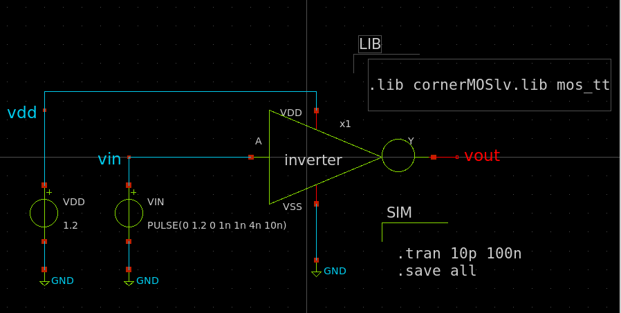

#### 6. Run NGSpice in Batch Mode

- Click on `Simulation` >> `Configure simulators & tools`, selecting `Ngspice batch` and `Gaw viewer`, then click on `Accept, no Save and Close`.

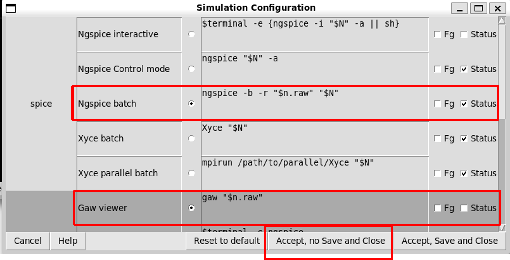

#### 7. Generate Netlist and Simulate

- Click on `Netlist` button to generate the netlist

- Click on `Simulation` >> `Edit Netlist` to view the netlist

- Click on `Simulate` button to start the simulation

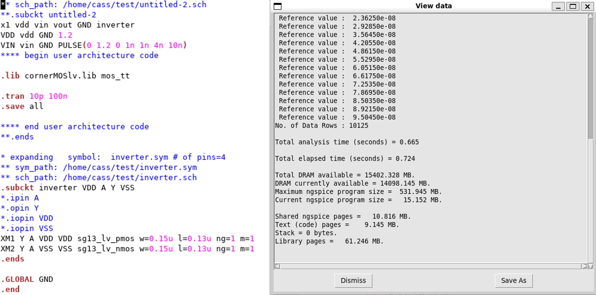

#### 8. View the Waveform

We use `Xscheme-GAW` to view the waveform.

- Click on `Waves` button and select `External viewer`

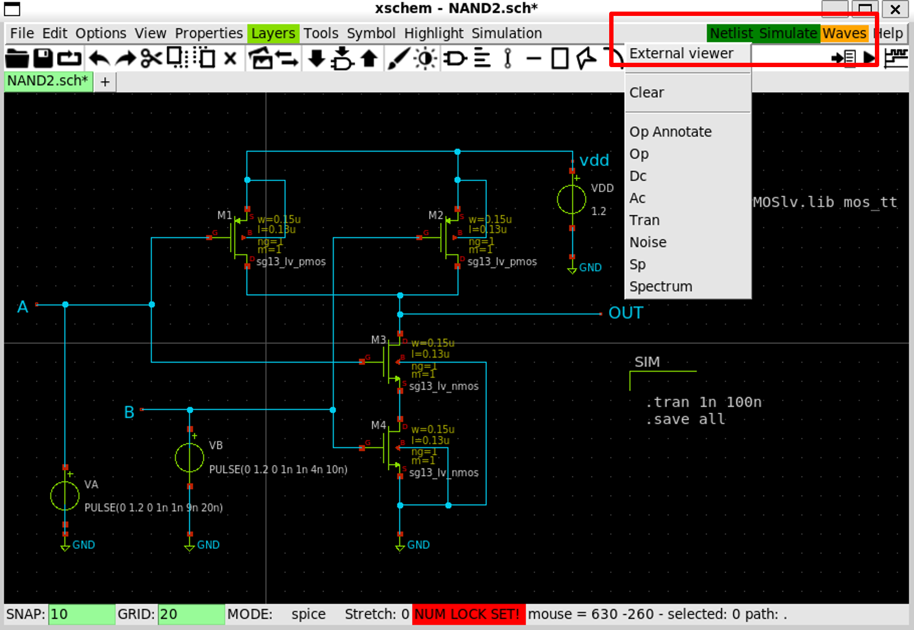

- In `GAW GUI` opened, click on a panel first, then click on the signal you want to display

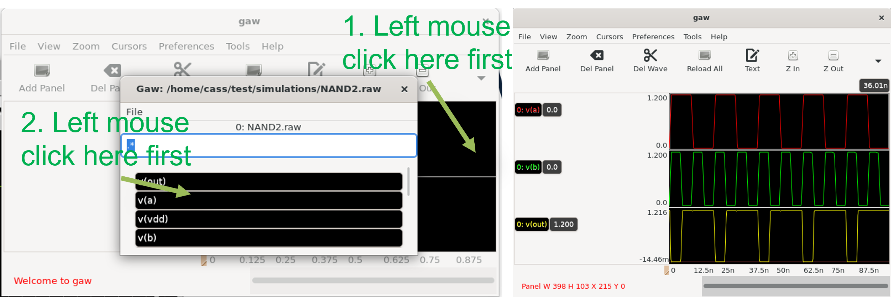

