## 3.5 Layout-Versus-Schematic using Netgen
<div style="width: 854px;padding:56.25% 0 0 0;position:relative;"><iframe src="https://player.vimeo.com/video/857489396?h=fdf886af26&amp;badge=0&amp;autopause=0&amp;player_id=0&amp;app_id=58479" frameborder="0" allow="autoplay; fullscreen; picture-in-picture" style="position:absolute;top:0;left:0;width:100%;height:100%;" title="3.5 Layout-Versus-Schematic using Netgen"></iframe></div><script src="https://player.vimeo.com/api/player.js"></script>

<!-- ### Lectue notes

<iframe src="https://docs.google.com/document/d/e/2PACX-1vQLNKjoYWVwf0E4-bvVM1ZpNmLP-t5yk5ePLgg8W3iKOhirogEHgfB43_QVrFX2Rd30u8x7f7NPNd_1/pub?embedded=true" width="854" height="600"></iframe> -->

## Prerequisites

- It is assumed that you have finished the lessons on [creating the schematic with Xschem](https://docs.google.com/document/d/11XbuqDkUKHFfK6Agl_6AYkxCAcNDyV7u4VJWG1srwVI/edit) and [the layout of the buffer with magic](https://docs.google.com/document/d/12I22RU0HmEfE7QRR4IqTfQruXK1AneM1IFiNhZEUd6s/edit#heading=h.695pkcy4vxoz).

## Introduction to Layout-Versus-Schematic (LVS) check

LVS is a process to check if your layout and your original schematic are similar. We need to do this check because when transforming from schematic to layout, you might make different mistakes, for example, a short circuit. The connection and the terminal in the layout are different from the schematic. LVS is an important step in analog design flow to ensure that your layout is identical to your schematic.

In this lesson, we will use Netgen to check if our schematic and the layout are identical. The inputs to LVS are a netlist from the schematic and a netlist extracted from the layout. The layout tool such as magic supports extracting the netlist for LVS. Netgen will compare these two files to decide if the two netlists are identical. If it is not identical, we have to identify the differences and change the layout and/or the netlist so that they are identical. The identical layout and schematic also ensures somewhat that the circuit will work as expected. 

## Prepare the design for LVS

To do LVS, we will need a netlist from the schematic tools such as xschem and a netlist from the layout tool such as magic. Therefore, we have to use xschem and magic to generate the netlist ready for LVS.

1. First, we change the directory to the folder that we already have the netlist and create a new directory to run the LVS.

```bash
cd $SHOME
cd unic-cass/inverter
mkdir netgen
```

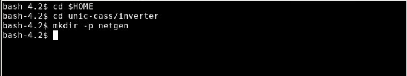

2. Next we have to open the schematic and export the netlist. If your setup is correct, xschem will open the schematic of the buffer that we designed.

```bash
xschem buffer.sch
```


3. Next, we need to set up the folder for the netlist by selecting `Simulation >> Set netlist Dir`. Then, we select the netgen directory that we’ve just created and press OK.


4. After setting up the netlist directory, we can press the `Netlist` button to generate the netlist. A new file named buffer.spice should be created in the netgen directory.


5. We can view the netlist by selecting `Simulation >> Edit Netlist`. An editor window will appear with our netlist. Do not close this window, we can use it to compare the xschem netlist with the magic netlist.

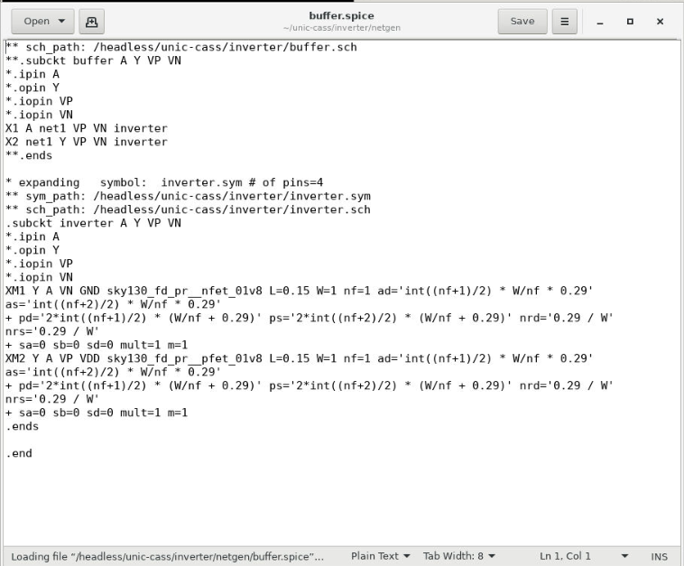

*Note*: if the window does not appear, you might need to set up the editor in xschemrc.

6. Next we have to open our layout in magic. We can close the xschem window and go to the terminal to open magic.

```bash
cd magic 
magic -rcfile $PDK_ROOT/$PDK/libs.tech/magic/sky130A.magicrc
```


7. Then, we can open our design by selecting `File >> Open`. Select `buffer.mag` and press `open`


8. Then the design of the buffer from two inverters will be open. To view the full hierarchy, select `Cell >> Expand`


9. We can display all the layers of the two inverters by selecting `Cell >> Expand` multiple times.


10. Next, we can extract the netlist by typing the following command in the magic console.
```tcl
ext
ext2spice lvs
ext2spice
```

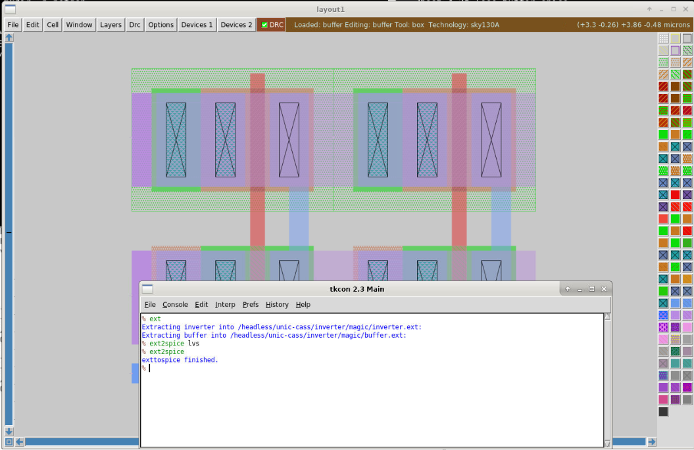

- The first command `ext` is to do the extraction of the layout to create the `buffer.ext` and `inverter.ext`
- The second command `ext2spice lvs` is used to set the extraction for LVS
- The third command does the extraction. After this step, you will have the netlist for the LVS.

11. When it finishes successfully, we can close magic and open the generated netlist.

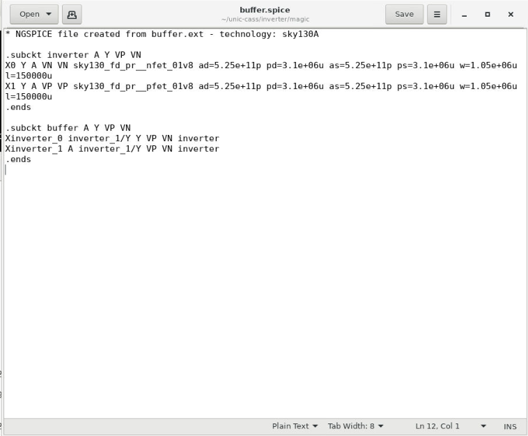

12. Next, we save this file into the netgen directory with a new name called `buffer_layout.spice` and click save.

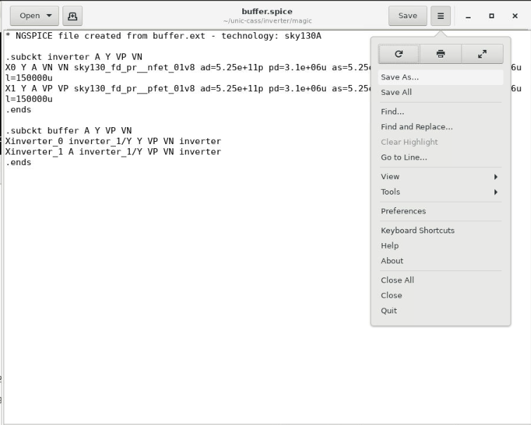


13. We can compare the two files with our own eyes. They look similar or different? Different right? Let’s use `netgen` to check if they are identical or different. Close the `gedit` to run netgen in the terminal.

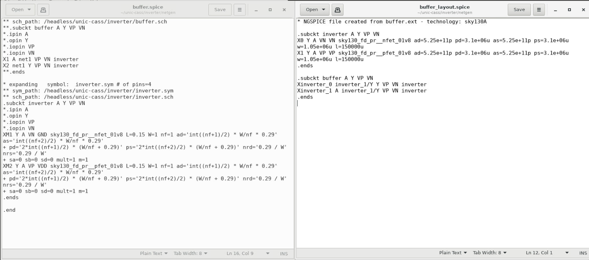

## LVS first run

14. Running LVS with netgen is very simple, you just need to run netgen with three arguments. The first one and the second one are the two netlists that we created. The third argument is a configuration file that is already available from the PDK. You might have a look at `\$PDK_ROOT/$PDK/libs.tech/netgen/setup.tcl`. It is the netgen setup for `sky130A` ready to use.

```bash
gedit $PDK_ROOT/$PDK/libs.tech/netgen/setup.tcl
```

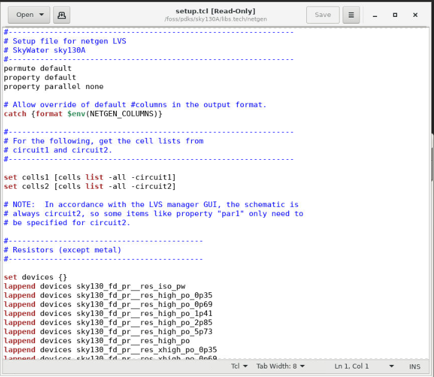

15. Now, we can close `gedit` and start running the LVS check by using the following command:

```bash
cd $HOME/unic-cass/inverter/negen
netgen -batch lvs buffer.spice buffer_layout.spice \
    $PDK_ROOT/$PDK/libs.tech/netgen/setup.tcl
```

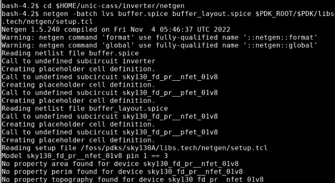
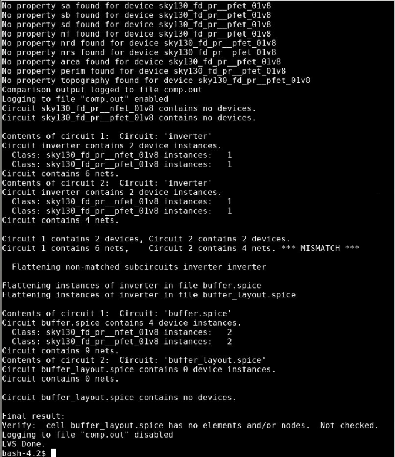

*Command output*:

```log
TBD
```

We can see that the two circuits are not matching. Netgen said that circuit 1 has 6 nets, while circuit 2 has only 4 nets. Now we need to look into the details to see what happens.

16. Open the comp.out file in the netgen directory to see the details of the LVS.

```bash
gedit comp.out
```

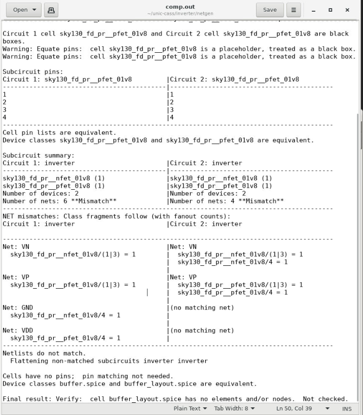

Looking at the detailed report from netgen it is easily noticed that the circuit 1 (the one generated by xschem) has the GND net and VDD net while there are no matching nets in the layout. Net GND and VDD are connected to pin 4 of the nfet and pfet. In the layout, there are the pin 4 of the nfet and pfet connected to VN and VP.

The problem is that we are using nfet3 and pfet3 in xschem and by default the pin 4 in nfet3 and pfet3 symbols are connected to GND and VDD (two global nets) respectively. However, in the layout, we connect the subtract (pin 4) of the translators nfet and pfet to the port VN and VP respectively. Obviously, the two circuits are mismatched.

17. There are two possible solutions.

First, you can modify the inverter netlist by using the nfet and pfet instead of nfet3 and pfet3. Then you explicitly connect the subtract to the corresponding VN and VP terminal. This is an exercise for you.
The second solution is to set the body of these transistors to the correct terminal. We show this solution in the following steps

## LVS second run

18. We have to open the schematic in xschem again by this command: 

```bash
cd $HOME/unic-cass/inverter
xschem buffer.xschem
```


19. Next, you click on one of the inverters then press the keyboard shortcut `e` to go to the inverter schematic. 


20. Next, we select the pfet and press the keyboard shortcut q to change its attributes. Add the line `body=VP` as the following and click `OK`.


21. We repeat the previous step with the nfet and the body should be VN.


22. Then we can save the schematic and go back to the buffer design by pressing `ctrl + e`.


23. In the buffer design, we generate the netlist by clicking on the netlist. We check if our changes have been reflected by selecting `Simulation >> Edit Netlist`.

*Note*: Please remember to change the netlist directory by `Simulation >> Set Netlist Dir` to the negen directory before generating the netlist.

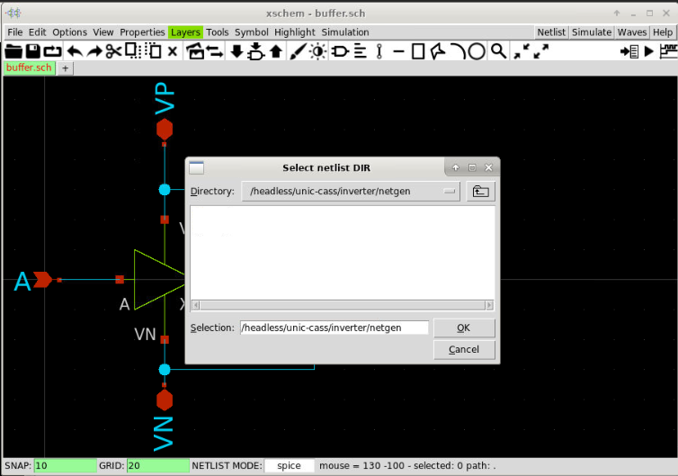

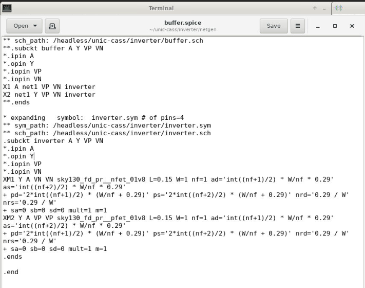

24. We run the LVS again using the following command:

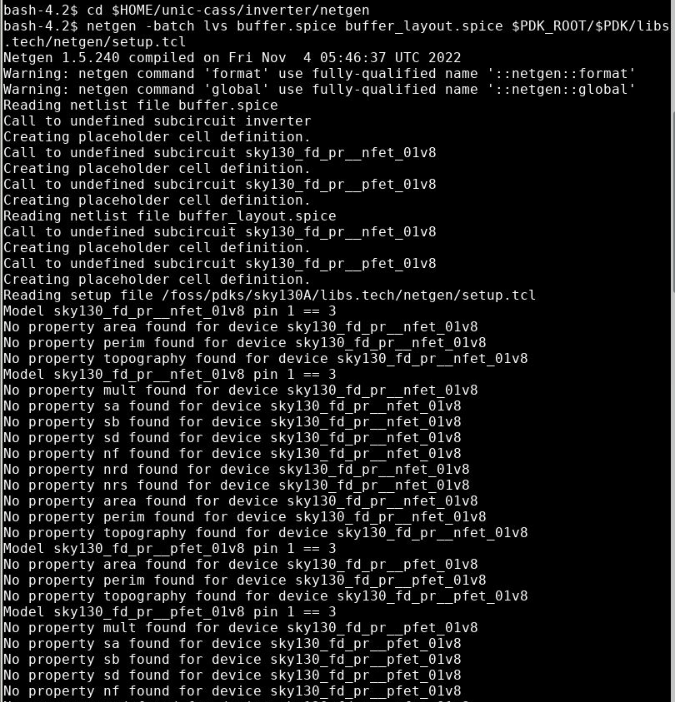


25. Clearly, there is no mismatch as before. We can confirm by viewing the detailed reports from netgen.

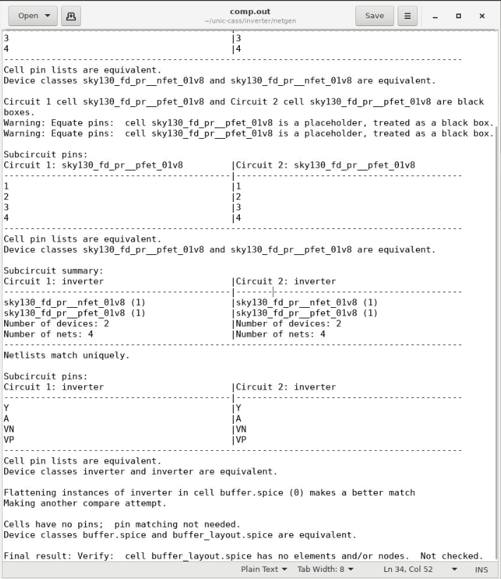

26. Voila! The report tells us that the two devices are equivalent. 

## What's next?

LVS passed is a good sign that your schematic and your layout are equivalent. However, it might not tell you about the important characteristics in analog design. You should run the post layout spice simulation with the parasitic extraction to verify that the parasitic after layout do not affect your design very much.
