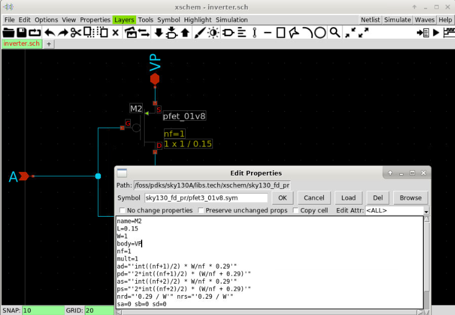

{: .no_toc }
# 3.5 Layout-Versus-Schematic using Netgen

{: .no_toc }

<details open markdown="block">
  <summary>
    Table of contents
  </summary>
  {: .text-delta }
- TOC
{:toc}
</details>

{: .video}
><iframe width="700" height="360" src="https://www.youtube.com/embed/Uv3FKipFKaA?si=taVOLpd_mqgGwNXV" title="YouTube video player" frameborder="0" allow="accelerometer; autoplay; clipboard-write; encrypted-media; gyroscope; picture-in-picture; web-share" referrerpolicy="strict-origin-when-cross-origin" allowfullscreen></iframe>

## Prerequisites

- It is assumed that you have finished the lessons on [creating the schematic with Xschem](https://docs.google.com/document/d/11XbuqDkUKHFfK6Agl_6AYkxCAcNDyV7u4VJWG1srwVI/edit) and [the layout of the buffer with magic](https://docs.google.com/document/d/12I22RU0HmEfE7QRR4IqTfQruXK1AneM1IFiNhZEUd6s/edit#heading=h.695pkcy4vxoz).

## Introduction to Layout-Versus-Schematic (LVS) check

LVS is a process to check if your layout and your original schematic are similar. We need to do this check because when transforming from schematic to layout, you might make different mistakes, for example, a short circuit. The connection and the terminal in the layout are different from the schematic. LVS is an important step in analog design flow to ensure that your layout is identical to your schematic.

In this lesson, we will use Netgen to check if our schematic and the layout are identical. The inputs to LVS are a netlist from the schematic and a netlist extracted from the layout. The layout tool such as magic supports extracting the netlist for LVS. Netgen will compare these two files to decide if the two netlists are identical. If it is not identical, we have to identify the differences and change the layout and/or the netlist so that they are identical. The identical layout and schematic also ensures somewhat that the circuit will work as expected. 

## Prepare the design for LVS

To do LVS, we will need a netlist from the schematic tools such as xschem and a netlist from the layout tool such as magic. Therefore, we have to use xschem and magic to generate the netlist ready for LVS.

{: .no_toc}
##### 1. Create the netgen folder

First, we change the directory to the folder that we already have the netlist and create a new directory to run the LVS.

{: .shellcmd}
> ```bash
> mkdir -p $HOME/unic-cass/inverter/netgen
> cd $HOME/unic-cass/inverter
> ```

{: .cmdout}
```text
(base) cass@unic-cass:~$ mkdir -p $HOME/unic-cass/inverter/netgen
(base) cass@unic-cass:~$ cd $HOME/unic-cass/inverter
(base) cass@unic-cass:~/unic-cass/inverter$ 
```


{: .no_toc}
##### 2. Open the schematic in Xschem

Next we have to open the schematic and export the netlist. If your setup is correct, xschem will open the schematic of the buffer that we designed.

{: .shellcmd}
> ```bash
> xschem buffer.sch
> ```


{: .no_toc}
##### 3. Set up the netlist directory

Next, we need to set up the folder for the netlist by selecting `Simulation >> Set netlist Dir`. Then, we select the netgen directory that we’ve just created and press OK.


{: .no_toc}
##### 4. Generate the schematic netlist

After setting up the netlist directory, we can press the `Netlist` button to generate the netlist. A new file named buffer.spice should be created in the netgen directory.


{: .no_toc}
##### 5. View the schematic netlist

We can view the netlist by selecting `Simulation >> Edit Netlist`. An editor window will appear with our netlist. Do not close this window, we can use it to compare the xschem netlist with the magic netlist.

{: .cmdout-title}
> Spice netlist
> ```text
> ** sch_path: /home/cass/unic-cass/inverter/buffer.sch
> .subckt buffer VP A Y VN
> *.PININFO A:I Y:O VP:B VN:B
> X1 A net1 VP VN inverter
> X2 net1 Y VP VN inverter
> .ends
> 
> * expanding   symbol:  inverter.sym # of pins=4
> ** sym_path: /home/cass/unic-cass/inverter/inverter.sym
> ** sch_path: /home/cass/unic-cass/inverter/inverter.sch
> .subckt inverter A Y VP VN
> *.PININFO A:I Y:O VP:B VN:B
> XM1 Y A VN sky130_fd_pr__nfet_01v8 L=0.15 W=1 nf=1 m=1
> XM2 Y A VP sky130_fd_pr__pfet_01v8 L=0.15 W=1 nf=1 m=1
> .ends
> 
> .end
> ```

{: .note}
> Note
> If the window does not appear, you might need to set up the editor in xschemrc.

{: .no_toc}
##### 6. Run Magic

Next we have to open our layout in magic. We can close the xschem window and go to the terminal to open magic.

{: .shellcmd}
> ```bash
> cd magic 
> magic -rcfile $PDK_ROOT/$PDK/libs.tech/magic/sky130A.magicrc
> ```


{: .no_toc}
##### 7. Open the layout in magic

Then, we can open our design by selecting `File >> Open`. Select `buffer.mag` and press `open`


{: .no_toc}
##### 8. Check the design

Then the design of the buffer from two inverters will be open. To view the full hierarchy, select `Cell >> Expand`


{: .no_toc}
##### 9. View the design in full hierarchy

We can display all the layers of the two inverters by selecting `Cell >> Expand` multiple times.


{: .no_toc}
##### 10. Extract the netlist for LVS

Next, we can extract the netlist by typing the following command in the magic console.

{: .command-title}
> Magic shell
> ```tcl
> ext all
> ext2spice lvs
> ext2spice
> ```

- The first command `ext` is to do the extraction of the layout to create the `buffer.ext` and `inverter.ext`
- The second command `ext2spice lvs` is used to set the extraction for LVS
- The third command does the extraction. After this step, you will have the netlist for the LVS.

{: .cmdout-title}
> Magic shell output
> ```
> % ext all
> Cell inverter read from current working directory
> Scaled magic input cell inverter geometry by factor of 2
> Extracting inverter into inverter.ext:
> Extracting buffer into buffer.ext:
> % ext2spice lvs
> % ext2spice
> exttospice finished.
> % 
> ```

{: .no_toc}
##### 11. Open the generated netlist

When it finishes successfully, we can close magic and open the generated netlist by running the following command:

{: .shellcmd}
> ```bash
> cat buffer.spice
> ```

{: .cmdout-title}
> Extracted netlist
> ```
> * NGSPICE file created from buffer.ext - technology: sky130A
> 
> .subckt inverter A Y VP VN
> X0 Y A VP VP sky130_fd_pr__pfet_01v8 ad=0.5 pd=3 as=0.5 ps=3 w=1 l=0.15
> X1 Y A VN VN sky130_fd_pr__nfet_01v8 ad=0.5 pd=3 as=0.5 ps=3 w=1 l=0.15
> .ends
> 
> .subckt buffer A Y VP VN
> Xinverter_0 A inverter_1/A VP VN inverter
> Xinverter_1 inverter_1/A Y VP VN inverter
> .ends
> ```

{: .no_toc}
##### 12. Save the post-layout netlist into `netgen` directory

Next, we copy this file into the `netgen` directory with a new name called `buffer_layout.spice` by running this command:

{: .shellcmd}
> ```bash
> cp -a buffer.spice ../netgen/buffer_layout.spice
> ```

{: .no_toc}
##### 13. Comapare the netlist 

We can compare the two files with our own eyes. They look similar or different? Different right? Let’s use `netgen` to check if they are identical or different. Close the `gedit` (if any) to run `netgen` in the terminal.

<style type="text/css">
.tg  {border-collapse:collapse;border-spacing:0;margin:0px auto;}
.tg td{border-color:black;border-style:solid;border-width:1px;font-family:Arial, sans-serif;font-size:14px;
  overflow:hidden;padding:10px 5px;word-break:normal;}
.tg th{border-color:black;border-style:solid;border-width:1px;font-family:Arial, sans-serif;font-size:14px;
  font-weight:normal;overflow:hidden;padding:10px 5px;word-break:normal;}
.tg .tg-c3ow{border-color:inherit;text-align:center;vertical-align:top}
.tg .tg-0pky{border-color:inherit;text-align:left;vertical-align:top}
</style>
<table class="tg"><thead>
  <tr>
    <th class="tg-c3ow">Schematic netlist (buffer.spice)</th>
    <th class="tg-c3ow">Extracted netlist (buffer_layout.spice)</th>
  </tr></thead>
<tbody>
  <tr>
    <td class="tg-0pky">** sch_path: /home/cass/unic-cass/inverter/buffer.sch<br>.subckt buffer VP A Y VN<br>*.PININFO A:I Y:O VP:B VN:B<br>X1 A net1 VP VN inverter<br>X2 net1 Y VP VN inverter<br>.ends<br><br>* expanding   symbol:  inverter.sym # of pins=4<br>** sym_path: /home/cass/unic-cass/inverter/inverter.sym<br>** sch_path: /home/cass/unic-cass/inverter/inverter.sch<br>.subckt inverter A Y VP VN<br>*.PININFO A:I Y:O VP:B VN:B<br>XM1 Y A VN sky130_fd_pr__nfet_01v8 L=0.15 W=1 nf=1 m=1<br>XM2 Y A VP sky130_fd_pr__pfet_01v8 L=0.15 W=1 nf=1 m=1<br>.ends<br>.end</td>
    <td class="tg-0pky">* NGSPICE file created from buffer.ext - technology: sky130A<br><br>.subckt inverter A Y VP VN<br>X0 Y A VP VP sky130_fd_pr__pfet_01v8 ad=0.5 pd=3 as=0.5 ps=3 w=1 l=0.15<br>X1 Y A VN VN sky130_fd_pr__nfet_01v8 ad=0.5 pd=3 as=0.5 ps=3 w=1 l=0.15<br>.ends<br><br>.subckt buffer<br>Xinverter_0 A inverter_1/A VP VN inverter<br>Xinverter_1 inverter_1/A Y VP VN inverter<br>.ends</td>
  </tr>
</tbody></table>

## LVS first run

{: .no_toc}
##### 14. View the negen configuration file for Skywater 130nm technology

Running LVS with netgen is very simple, you just need to run netgen with three arguments. The first one and the second one are the two netlists that we created. The third argument is a configuration file that is already available from the PDK. You might have a look at `$PDK_ROOT/$PDK/libs.tech/netgen/setup.tcl`. It is the netgen setup for `sky130A` ready to use.

{: .shellcmd}
> ```bash
> gedit $PDK_ROOT/$PDK/libs.tech/netgen/setup.tcl
> ```

{: .cmdout-title}
> libs.tech/netgen/setup.tcl
> ```tcl
> #---------------------------------------------------------------
> # Setup file for netgen LVS
> # SkyWater sky130A
> #---------------------------------------------------------------
> permute default
> property default
> property parallel none
> 
> # Allow override of default #columns in the output format.
> catch {format $env(NETGEN_COLUMNS)}
> 
> #---------------------------------------------------------------
> # For the following, get the cell lists from
> # circuit1 and circuit2.
> #---------------------------------------------------------------
> 
> set cells1 [cells list -all -circuit1]
> set cells2 [cells list -all -circuit2]
> 
> #-------------------------------------------
> # Resistors (except metal)
> #-------------------------------------------
> 
> set devices {}
> lappend devices sky130_fd_pr__res_iso_pw
> lappend devices sky130_fd_pr__res_high_po_0p35
> lappend devices sky130_fd_pr__res_high_po_0p69
> lappend devices sky130_fd_pr__res_high_po_1p41
> lappend devices sky130_fd_pr__res_high_po_2p85
> lappend devices sky130_fd_pr__res_high_po_5p73
> lappend devices sky130_fd_pr__res_high_po
> lappend devices sky130_fd_pr__res_xhigh_po_0p35
> lappend devices sky130_fd_pr__res_xhigh_po_0p69
> lappend devices sky130_fd_pr__res_xhigh_po_1p41
> lappend devices sky130_fd_pr__res_xhigh_po_2p85
> lappend devices sky130_fd_pr__res_xhigh_po_5p73
> lappend devices sky130_fd_pr__res_xhigh_po
> lappend devices sky130_fd_pr__res_generic_nd
> lappend devices sky130_fd_pr__res_generic_pd
> lappend devices sky130_fd_pr__res_generic_nd__hv
> lappend devices sky130_fd_pr__res_generic_pd__hv
> lappend devices mrdn_hv mrdp_hv
> 
> foreach dev $devices {
>     if {[lsearch $cells1 $dev] >= 0} {
>         permute "-circuit1 $dev" 1 2
>         property "-circuit1 $dev" series enable
>         property "-circuit1 $dev" series {w critical}
>         property "-circuit1 $dev" series {l add}
>         property "-circuit1 $dev" parallel enable
>         property "-circuit1 $dev" parallel {l critical}
>         property "-circuit1 $dev" parallel {w add}
>         property "-circuit1 $dev" parallel {value par}
>         property "-circuit1 $dev" tolerance {l 0.01} {w 0.01}
>         # Ignore these properties
>         property "-circuit1 $dev" delete mult
>     }
>     if {[lsearch $cells2 $dev] >= 0} {
>         permute "-circuit2 $dev" 1 2
>         property "-circuit2 $dev" series enable
>         property "-circuit2 $dev" series {w critical}
>         property "-circuit2 $dev" series {l add}
>         property "-circuit2 $dev" parallel enable
>         property "-circuit2 $dev" parallel {l critical}
>         property "-circuit2 $dev" parallel {w add}
>         property "-circuit2 $dev" parallel {value par}
>         property "-circuit2 $dev" tolerance {l 0.01} {w 0.01}
>         # Ignore these properties
>         property "-circuit2 $dev" delete mult
>     }
> }
> ...
> ```

{: .no_toc}
##### 15. Run netgen with two netlist files

Now, we can close `gedit` and start running the LVS check by using the following command:

{: .shellcmd}
> ```bash
> cd $HOME/unic-cass/inverter/netgen
> netgen -batch lvs "buffer.spice buffer" "buffer_layout.spice buffer" \
>     $PDK_ROOT/$PDK/libs.tech/netgen/setup.tcl
> ```

The above command will compare the `buffer` subcircuit in `buffer.spice` with the `buffer` subcircuit extracted by magic in `buffer_layout.spice`

{: .cmdout}
> ```log
> (base) cass@unic-cass:~/unic-cass/inverter/netgen$ netgen -batch lvs "buffer.spice buffer" "buffer_layout.spice buffer" $PDK_ROOT/$PDK/libs.tech/netgen/setup.tcl
> Netgen 1.5.272 compiled on Tue Mar  5 23:16:53 UTC 2024
> Warning: netgen command 'format' use fully-qualified name '::netgen::format'
> Warning: netgen command 'global' use fully-qualified name '::netgen::global'
> Reading netlist file buffer.spice
> Call to undefined subcircuit inverter
> Creating placeholder cell definition.
> Call to undefined subcircuit sky130_fd_pr__nfet_01v8
> Creating placeholder cell definition.
> Call to undefined subcircuit sky130_fd_pr__pfet_01v8
> Creating placeholder cell definition.
> Reading netlist file buffer_layout.spice
> Call to undefined subcircuit sky130_fd_pr__pfet_01v8
> Creating placeholder cell definition.
> Call to undefined subcircuit sky130_fd_pr__nfet_01v8
> Creating placeholder cell definition.
> 
> Reading setup file /home/cass/eda/unic-cass/share/pdk/sky130A/libs.tech/netgen/setup.tcl
> 
> Model sky130_fd_pr__nfet_01v8 pin 1 == 3
> No property as found for device sky130_fd_pr__nfet_01v8
> No property ad found for device sky130_fd_pr__nfet_01v8
> No property ps found for device sky130_fd_pr__nfet_01v8
> No property pd found for device sky130_fd_pr__nfet_01v8
> No property mult found for device sky130_fd_pr__nfet_01v8
> No property sa found for device sky130_fd_pr__nfet_01v8
> No property sb found for device sky130_fd_pr__nfet_01v8
> No property sd found for device sky130_fd_pr__nfet_01v8
> No property nrd found for device sky130_fd_pr__nfet_01v8
> No property nrs found for device sky130_fd_pr__nfet_01v8
> No property area found for device sky130_fd_pr__nfet_01v8
> No property perim found for device sky130_fd_pr__nfet_01v8
> No property topography found for device sky130_fd_pr__nfet_01v8
> Model sky130_fd_pr__nfet_01v8 pin 1 == 3
> No property mult found for device sky130_fd_pr__nfet_01v8
> No property sa found for device sky130_fd_pr__nfet_01v8
> No property sb found for device sky130_fd_pr__nfet_01v8
> No property sd found for device sky130_fd_pr__nfet_01v8
> No property nf found for device sky130_fd_pr__nfet_01v8
> No property nrd found for device sky130_fd_pr__nfet_01v8
> No property nrs found for device sky130_fd_pr__nfet_01v8
> No property area found for device sky130_fd_pr__nfet_01v8
> No property perim found for device sky130_fd_pr__nfet_01v8
> No property topography found for device sky130_fd_pr__nfet_01v8
> Model sky130_fd_pr__pfet_01v8 pin 1 == 3
> No property as found for device sky130_fd_pr__pfet_01v8
> No property ad found for device sky130_fd_pr__pfet_01v8
> No property ps found for device sky130_fd_pr__pfet_01v8
> No property pd found for device sky130_fd_pr__pfet_01v8
> No property mult found for device sky130_fd_pr__pfet_01v8
> No property sa found for device sky130_fd_pr__pfet_01v8
> No property sb found for device sky130_fd_pr__pfet_01v8
> No property sd found for device sky130_fd_pr__pfet_01v8
> No property nrd found for device sky130_fd_pr__pfet_01v8
> No property nrs found for device sky130_fd_pr__pfet_01v8
> No property area found for device sky130_fd_pr__pfet_01v8
> No property perim found for device sky130_fd_pr__pfet_01v8
> No property topography found for device sky130_fd_pr__pfet_01v8
> Model sky130_fd_pr__pfet_01v8 pin 1 == 3
> No property mult found for device sky130_fd_pr__pfet_01v8
> No property sa found for device sky130_fd_pr__pfet_01v8
> No property sb found for device sky130_fd_pr__pfet_01v8
> No property sd found for device sky130_fd_pr__pfet_01v8
> No property nf found for device sky130_fd_pr__pfet_01v8
> No property nrd found for device sky130_fd_pr__pfet_01v8
> No property nrs found for device sky130_fd_pr__pfet_01v8
> No property area found for device sky130_fd_pr__pfet_01v8
> No property perim found for device sky130_fd_pr__pfet_01v8
> No property topography found for device sky130_fd_pr__pfet_01v8
> Comparison output logged to file comp.out
> Logging to file "comp.out" enabled
> Circuit sky130_fd_pr__nfet_01v8 contains no devices.
> Circuit sky130_fd_pr__pfet_01v8 contains no devices.
> 
> Contents of circuit 1:  Circuit: 'inverter'
> Circuit inverter contains 2 device instances.
>   Class: sky130_fd_pr__nfet_01v8 instances:   1
>   Class: sky130_fd_pr__pfet_01v8 instances:   1
> Circuit contains 6 nets.
> Contents of circuit 2:  Circuit: 'inverter'
> Circuit inverter contains 2 device instances.
>   Class: sky130_fd_pr__nfet_01v8 instances:   1
>   Class: sky130_fd_pr__pfet_01v8 instances:   1
> Circuit contains 4 nets.
> 
> Circuit 1 contains 2 devices, Circuit 2 contains 2 devices.
> Circuit 1 contains 6 nets,    Circuit 2 contains 4 nets. *** MISMATCH ***
> 
>   Flattening non-matched subcircuits inverter inverter
> 
> Flattening instances of inverter in file buffer.spice
> Flattening instances of inverter in file buffer_layout.spice
> 
> Contents of circuit 1:  Circuit: 'buffer'
> Circuit buffer contains 4 device instances.
>   Class: sky130_fd_pr__nfet_01v8 instances:   2
>   Class: sky130_fd_pr__pfet_01v8 instances:   2
> Circuit contains 9 nets.
> Contents of circuit 2:  Circuit: 'buffer'
> Circuit buffer contains 4 device instances.
>   Class: sky130_fd_pr__nfet_01v8 instances:   2
>   Class: sky130_fd_pr__pfet_01v8 instances:   2
> Circuit contains 5 nets.
> 
> Circuit 1 contains 4 devices, Circuit 2 contains 4 devices.
> Circuit 1 contains 9 nets,    Circuit 2 contains 5 nets. *** MISMATCH ***
> 
> 
> Final result:
> Netlists do not match.
> Logging to file "comp.out" disabled
> LVS Done.
> ```

We can see that the two circuits do not match. `Netgen` said that `Circuit 1` has 9 nets, while `Circuit 2` has only 5 nets. Now we need to look into the details to see what happens.

{: .no_toc}
##### 16. Review the outputs

Open the `comp.out` file in the `netgen` directory to see the details of the LVS.

{: .shellcmd}
> ```bash
> gedit comp.out
> ```

Looking at the detailed report from `netgen`, it is easily noticed that the `Circuit 1` (generated by xschem) the `pfet` and `nfet` only have three pins while the ones in the layout have four pins. 

The problem is that we are using `nfet3` and `pfet3` in `xschem` and by default the pin 4 in `nfet3` and `pfet3` symbols are not connected. However, in the layout, we connect the subtrate (pin 4) of the transistors `nfet` and `pfet` to the port `VN` and `VP` respectively. Obviously, the two circuits are mismatched.

{: .no_toc}
##### 17. Two possible solutions for the above LVS violations

First, you can modify the inverter netlist by using the `nfet` and `pfet` instead of `nfet3` and `pfet3`. Then you explicitly connect the subtract to the corresponding `VN` and `VP` terminal. This is an exercise for you.
The second solution is to set the body of these transistors to the correct terminal. We show this solution in the following steps

## LVS second run

{: .no_toc}
##### 18. Open the schematic in Xschem

We have to open the schematic in xschem again by this command: 

{: .shellcmd}
> ```bash
> cd $HOME/unic-cass/inverter
> xschem buffer.xschem
> ```


{: .no_toc}
##### 19. Go to the inverter schematic

Next, you click on one of the inverters then press the keyboard shortcut `e` to go to the inverter schematic. 


{: .no_toc}
##### 20. Set the body of `pfet` to connect to `VP`

Next, we select the `pfet` and press the keyboard shortcut q to change its attributes. Add the line `body=VP` as the following and click `OK`.



{: .no_toc}
##### 21. Set the body of `nfet` to connect to `VN`

We repeat the previous step with the nfet and the body should be VN.


{: .no_toc}
##### 22. Save the inverter schematic and go to the buffer schematic

Then we can save the schematic and go back to the buffer design by pressing `ctrl + e`.


{: .no_toc}
##### 23. Generate new netlist

In the buffer design, we generate the netlist by clicking on the `netlist` button. We check if our changes have been reflected by selecting `Simulation >> Edit Netlist`.

{: .note}
> Note
> Please remember to change the netlist directory by `Simulation >> Set Netlist Dir` to the negen directory before generating the netlist.

{: .cmdout-title}
> Xschem spice netlist: bufffer.spice
> ```
> ** sch_path: /home/cass/unic-cass/inverter/buffer.sch
> .subckt buffer VP A Y VN
> *.PININFO A:I Y:O VP:B VN:B
> X1 A net1 VP VN inverter
> X2 net1 Y VP VN inverter
> .ends
> 
> * expanding   symbol:  inverter.sym # of pins=4
> ** sym_path: /home/cass/unic-cass/inverter/inverter.sym
> ** sch_path: /home/cass/unic-cass/inverter/inverter.sch
> .subckt inverter A Y VP VN
> *.PININFO A:I Y:O VP:B VN:B
> XM1 Y A VN VN sky130_fd_pr__nfet_01v8 L=0.15 W=1 nf=1 m=1
> XM2 Y A VP VP sky130_fd_pr__pfet_01v8 L=0.15 W=1 nf=1 m=1
> .ends
> 
> .end
> ```

{: .no_toc}
##### 24. Re-run the LVS

We run the LVS again using the following command:

{: .shellcmd}
> ```bash
> netgen -batch lvs "buffer.spice buffer" "buffer_layout.spice buffer" \
>     $PDK_ROOT/$PDK/libs.tech/netgen/setup.tcl
> ```

{: .cmdout}
> ```
> Netgen 1.5.272 compiled on Tue Mar  5 23:16:53 UTC 2024
> Warning: netgen command 'format' use fully-qualified name '::netgen::format'
> Warning: netgen command 'global' use fully-qualified name '::netgen::global'
> Reading netlist file buffer.spice
> Call to undefined subcircuit inverter
> Creating placeholder cell definition.
> Call to undefined subcircuit sky130_fd_pr__nfet_01v8
> Creating placeholder cell definition.
> Call to undefined subcircuit sky130_fd_pr__pfet_01v8
> Creating placeholder cell definition.
> Reading netlist file buffer_layout.spice
> Call to undefined subcircuit sky130_fd_pr__pfet_01v8
> Creating placeholder cell definition.
> Call to undefined subcircuit sky130_fd_pr__nfet_01v8
> Creating placeholder cell definition.
> 
> Reading setup file /home/cass/eda/unic-cass/share/pdk/sky130A/libs.tech/netgen/setup.tcl
> 
> Model sky130_fd_pr__nfet_01v8 pin 1 == 3
> No property as found for device sky130_fd_pr__nfet_01v8
> No property ad found for device sky130_fd_pr__nfet_01v8
> No property ps found for device sky130_fd_pr__nfet_01v8
> No property pd found for device sky130_fd_pr__nfet_01v8
> No property mult found for device sky130_fd_pr__nfet_01v8
> No property sa found for device sky130_fd_pr__nfet_01v8
> No property sb found for device sky130_fd_pr__nfet_01v8
> No property sd found for device sky130_fd_pr__nfet_01v8
> No property nrd found for device sky130_fd_pr__nfet_01v8
> No property nrs found for device sky130_fd_pr__nfet_01v8
> No property area found for device sky130_fd_pr__nfet_01v8
> No property perim found for device sky130_fd_pr__nfet_01v8
> No property topography found for device sky130_fd_pr__nfet_01v8
> Model sky130_fd_pr__nfet_01v8 pin 1 == 3
> No property mult found for device sky130_fd_pr__nfet_01v8
> No property sa found for device sky130_fd_pr__nfet_01v8
> No property sb found for device sky130_fd_pr__nfet_01v8
> No property sd found for device sky130_fd_pr__nfet_01v8
> No property nf found for device sky130_fd_pr__nfet_01v8
> No property nrd found for device sky130_fd_pr__nfet_01v8
> No property nrs found for device sky130_fd_pr__nfet_01v8
> No property area found for device sky130_fd_pr__nfet_01v8
> No property perim found for device sky130_fd_pr__nfet_01v8
> No property topography found for device sky130_fd_pr__nfet_01v8
> Model sky130_fd_pr__pfet_01v8 pin 1 == 3
> No property as found for device sky130_fd_pr__pfet_01v8
> No property ad found for device sky130_fd_pr__pfet_01v8
> No property ps found for device sky130_fd_pr__pfet_01v8
> No property pd found for device sky130_fd_pr__pfet_01v8
> No property mult found for device sky130_fd_pr__pfet_01v8
> No property sa found for device sky130_fd_pr__pfet_01v8
> No property sb found for device sky130_fd_pr__pfet_01v8
> No property sd found for device sky130_fd_pr__pfet_01v8
> No property nrd found for device sky130_fd_pr__pfet_01v8
> No property nrs found for device sky130_fd_pr__pfet_01v8
> No property area found for device sky130_fd_pr__pfet_01v8
> No property perim found for device sky130_fd_pr__pfet_01v8
> No property topography found for device sky130_fd_pr__pfet_01v8
> Model sky130_fd_pr__pfet_01v8 pin 1 == 3
> No property mult found for device sky130_fd_pr__pfet_01v8
> No property sa found for device sky130_fd_pr__pfet_01v8
> No property sb found for device sky130_fd_pr__pfet_01v8
> No property sd found for device sky130_fd_pr__pfet_01v8
> No property nf found for device sky130_fd_pr__pfet_01v8
> No property nrd found for device sky130_fd_pr__pfet_01v8
> No property nrs found for device sky130_fd_pr__pfet_01v8
> No property area found for device sky130_fd_pr__pfet_01v8
> No property perim found for device sky130_fd_pr__pfet_01v8
> No property topography found for device sky130_fd_pr__pfet_01v8
> Comparison output logged to file comp.out
> Logging to file "comp.out" enabled
> Circuit sky130_fd_pr__nfet_01v8 contains no devices.
> Circuit sky130_fd_pr__pfet_01v8 contains no devices.
> 
> Contents of circuit 1:  Circuit: 'inverter'
> Circuit inverter contains 2 device instances.
>   Class: sky130_fd_pr__nfet_01v8 instances:   1
>   Class: sky130_fd_pr__pfet_01v8 instances:   1
> Circuit contains 4 nets.
> Contents of circuit 2:  Circuit: 'inverter'
> Circuit inverter contains 2 device instances.
>   Class: sky130_fd_pr__nfet_01v8 instances:   1
>   Class: sky130_fd_pr__pfet_01v8 instances:   1
> Circuit contains 4 nets.
> 
> Circuit 1 contains 2 devices, Circuit 2 contains 2 devices.
> Circuit 1 contains 4 nets,    Circuit 2 contains 4 nets.
> 
> 
> Contents of circuit 1:  Circuit: 'buffer'
> Circuit buffer contains 2 device instances.
>   Class: inverter              instances:   2
> Circuit contains 5 nets.
> Contents of circuit 2:  Circuit: 'buffer'
> Circuit buffer contains 2 device instances.
>   Class: inverter              instances:   2
> Circuit contains 5 nets.
> 
> Circuit 1 contains 2 devices, Circuit 2 contains 2 devices.
> Circuit 1 contains 5 nets,    Circuit 2 contains 5 nets.
> 
> 
> Final result: 
> Circuits match uniquely.
> .
> Logging to file "comp.out" disabled
> LVS Done.
> ```


{: .no_toc}
##### 25. LVS runs successfully

Clearly, there is no mismatch as before. We can confirm by viewing the detailed reports from `netgen` in `comp.out`.

{: .cmdout-title}
> File: comp.out
> ```
> 
> Circuit 1 cell sky130_fd_pr__nfet_01v8 and Circuit 2 cell sky130_fd_pr__nfet_01v8 are black boxes.
> Warning: Equate pins:  cell sky130_fd_pr__nfet_01v8 is a placeholder, treated as a black box.
> Warning: Equate pins:  cell sky130_fd_pr__nfet_01v8 is a placeholder, treated as a black box.
> 
> Subcircuit pins:
> Circuit 1: sky130_fd_pr__nfet_01v8         |Circuit 2: sky130_fd_pr__nfet_01v8         
> -------------------------------------------|-------------------------------------------
> 1                                          |1                                          
> 2                                          |2                                          
> 3                                          |3                                          
> 4                                          |4                                          
> ---------------------------------------------------------------------------------------
> Cell pin lists are equivalent.
> Device classes sky130_fd_pr__nfet_01v8 and sky130_fd_pr__nfet_01v8 are equivalent.
> 
> Circuit 1 cell sky130_fd_pr__pfet_01v8 and Circuit 2 cell sky130_fd_pr__pfet_01v8 are black boxes.
> Warning: Equate pins:  cell sky130_fd_pr__pfet_01v8 is a placeholder, treated as a black box.
> Warning: Equate pins:  cell sky130_fd_pr__pfet_01v8 is a placeholder, treated as a black box.
> 
> Subcircuit pins:
> Circuit 1: sky130_fd_pr__pfet_01v8         |Circuit 2: sky130_fd_pr__pfet_01v8         
> -------------------------------------------|-------------------------------------------
> 1                                          |1                                          
> 2                                          |2                                          
> 3                                          |3                                          
> 4                                          |4                                          
> ---------------------------------------------------------------------------------------
> Cell pin lists are equivalent.
> Device classes sky130_fd_pr__pfet_01v8 and sky130_fd_pr__pfet_01v8 are equivalent.
> 
> Subcircuit summary:
> Circuit 1: inverter                        |Circuit 2: inverter                        
> -------------------------------------------|-------------------------------------------
> sky130_fd_pr__nfet_01v8 (1)                |sky130_fd_pr__nfet_01v8 (1)                
> sky130_fd_pr__pfet_01v8 (1)                |sky130_fd_pr__pfet_01v8 (1)                
> Number of devices: 2                       |Number of devices: 2                       
> Number of nets: 4                          |Number of nets: 4                          
> ---------------------------------------------------------------------------------------
> Netlists match uniquely.
> 
> Subcircuit pins:
> Circuit 1: inverter                        |Circuit 2: inverter                        
> -------------------------------------------|-------------------------------------------
> Y                                          |Y                                          
> A                                          |A                                          
> VP                                         |VP                                         
> VN                                         |VN                                         
> ---------------------------------------------------------------------------------------
> Cell pin lists are equivalent.
> Device classes inverter and inverter are equivalent.
> 
> Subcircuit summary:
> Circuit 1: buffer                          |Circuit 2: buffer                          
> -------------------------------------------|-------------------------------------------
> inverter (2)                               |inverter (2)                               
> Number of devices: 2                       |Number of devices: 2                       
> Number of nets: 5                          |Number of nets: 5                          
> ---------------------------------------------------------------------------------------
> Netlists match uniquely.
> 
> Subcircuit pins:
> Circuit 1: buffer                          |Circuit 2: buffer                          
> -------------------------------------------|-------------------------------------------
> VP                                         |VP                                         
> VN                                         |VN                                         
> A                                          |A                                          
> Y                                          |Y                                          
> ---------------------------------------------------------------------------------------
> Cell pin lists are equivalent.
> Device classes buffer and buffer are equivalent.
> 
> Final result: Circuits match uniquely.
> ```

Voila! The report tells us that the two devices are equivalent. 

## What's next?

LVS passed is a good sign that your schematic and your layout are equivalent. However, it might not tell you about the important characteristics in analog design. You should run the post layout spice simulation with the parasitic extraction to verify that the parasitic after layout do not affect your design very much.
