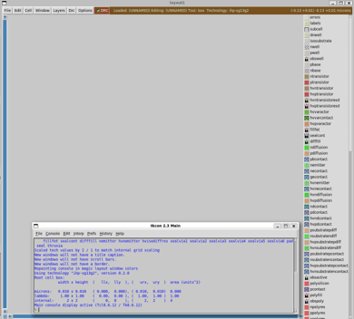

{: .no_toc }
## 3.6 Parasitic Extraction with Magic

{: .no_toc }

<!-- <details open markdown="block">
  <summary>
    Table of contents
  </summary>
  {: .text-delta }
- TOC
{:toc}
</details> -->

This section shows how to extract parasitic of the layout with `Magic`.

#### 1. Extraction using Magic

- Run the `Magic` with the technology file from `IHP-SG13G2` in the same folder with `inverter.gds`

```sh
$ source $HOME/unic-cass/env.sh
$ magic -rcfile ~/unic-cass/IHP-Open-PDK/ihp-sg13g2/libs.tech/magic/ihp-sg13g2.magicrc
```



- Run the following commands in the `Magic` shell

```tcl
% gds read inverter.gds
% load inverter
% cellname rename inverter inverter_h
% flatten inverter
% load inverter
% select top cell
% extract do local
% extract all
% ext2sim labels on
% ext2sim
% extresist tolerance 10
% extresist
% ext2spice lvs
% ext2spice cthresh 0
% ext2spice extresist on
% ext2spice
```

- A new `inverter.spice` will be extracted


#### 2. Extracted Netlist

```spice
* NGSPICE file created from inverter.ext - technology: ihp-sg13g2
.subckt inverter Y A VDD VSS
X0 Y.t0 A.t0 VSS.t1 VSS.t0 sg13_lv_nmos ad=0.1005p pd=1.34u as=0.1005p ps=1.34u w=0.15u l=0.13u
X1 Y.t1 A.t0 VDD.t1 VDD.t0 sg13_lv_pmos ad=0.1005p pd=1.34u as=0.1005p ps=1.34u w=0.15u l=0.13u
R0 A A.t0 15.067
R1 VSS.n0 VSS.t0 1031.32
R2 VSS.n0 VSS.t1 17.326
R3 VSS VSS.n0 0.146809
R4 Y.n0 Y.t1 17.7464
R5 Y.n0 Y.t0 17.0005
R6 Y Y.n0 0.089875
R7 VDD.n0 VDD.t1 17.3409
R8 VDD.n0 VDD.t0 11.3734
R9 VDD VDD.n0 0.134225
C0 a_183_n128# VDD 7.13e-21
C1 Y A 0.040768f
C2 A VDD 0.07647f
C3 Y VDD 0.049249f
C4 Y VSS 0.115102f
C5 A VSS 0.217577f
C6 VDD VSS 0.137668f
C7 a_183_n128# VSS 5.14e-20 $ **FLOATING
.ends
```
