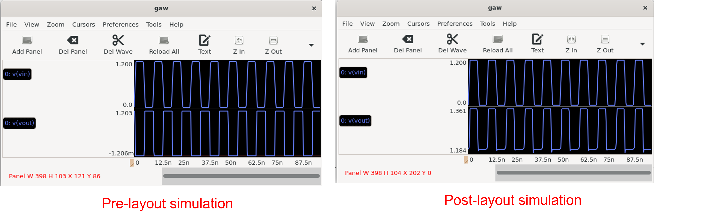

{: .no_toc }
## 3.7 Post-Layout Simulation

{: .no_toc }

<!-- 

  

    Table of contents
  

  {: .text-delta }
- TOC
{:toc}

 -->

This section shows how to setup the post-layout simulation.

#### 1. Change the Symbol Type

- Open the `inverter.sym`

- Press `q` in the symbol to change its type from `subcircuit` into `primitive` and press `OK`

- Select `File` >> `Save`

#### 2. Open the Testbench

- In `Xscheme`, open the `inverter_tb.sch`

- Insert a `code_shown.sym` with the following properties.

#### 3. Compare Post-layout and Pre-layout Simulation

- The different is because of the parasitic resistance and capacitance

