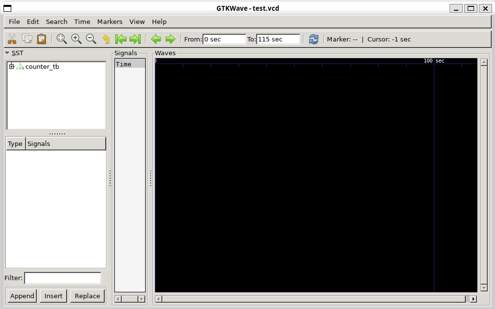
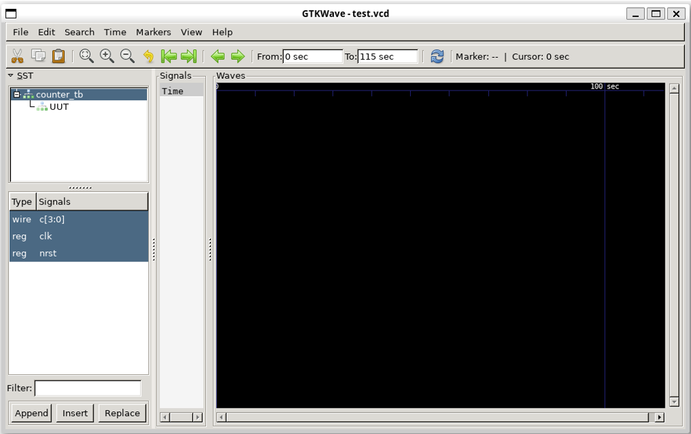
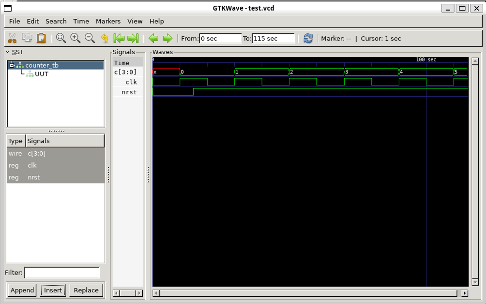
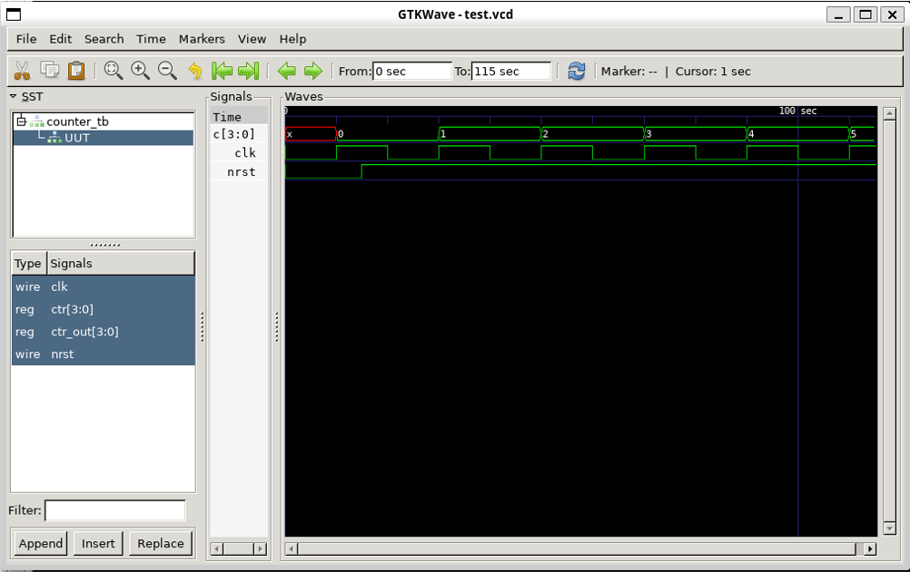
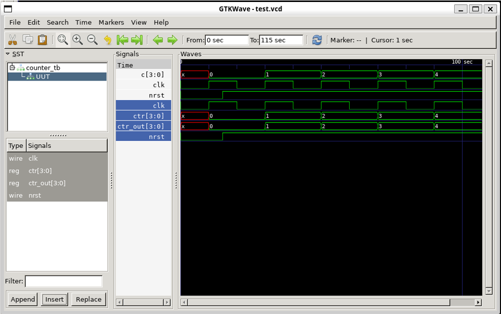

{: .no_toc }
## 4.1 Create a simple counter design and simulation

{: .no_toc }

<!-- <details open markdown="block">
  <summary>
    Table of contents
  </summary>
  {: .text-delta }
- TOC
{:toc}
</details> -->

### 0. Prerequisite
It is assumed that you already install the opensource design tools [using docker](/training/2.2-AMS-docker-remote.html).

### 1. Run the UNIC-CASS Docker image

Open a terminal and change the directory to the uniccass-design-tools as s described in (Installing design tools using docker)(/training/2.2-AMS-docker-remote.html), and run `make start`:

{: .shellcmd}
```sh
$ cd $HOME/projects/uniccass-design-tools
$ make start
```

### 2. Writing the Verilog files

We first need to write some verilog files: a digital circuit and its testbench.

Create `counter.v` and `counter_tb.v` by running the following command in the `uniccas-design-tools` docker shell:

{: .shellcmd}
```bash
wget https://unic-cass.github.io/training/files/counter.v
wget https://unic-cass.github.io/training/files/counter_tb.v
```

```verilog
module counter(
    input clk, nrst,
    output reg [3:0] ctr_out
);

reg [3:0] ctr;

always@(posedge clk) begin
    if (!nrst)
        ctr <= 0;
    else
        ctr <= ctr + 4'b1;
end

always@(*)
    ctr_out <= ctr;

endmodule
```

```verilog
module counter_tb;

reg nrst,clk;
wire [3:0] c;

counter UUT(.ctr_out(c),.clk(clk),.nrst(nrst));

always begin
    #10
    clk = ~clk;
    $display("Counter value:%b @ time %f",c,$time);
end

initial begin
$dumpfile("test.vcd");
$dumpvars(0,counter_tb);

// we have to start somewhere
clk = 0;
nrst = 0;

#15
nrst = 1;

#100

$finish;
end

endmodule
```

### 3. Behavioral Simulation

Next, we can run iverilog to compile the verilog code into something readable by the `vvp` simulator. In general, the `iverilog` command can be run in the following syntax:

`iverilog -o <output_file_name> <design_file_1> <design_file_2> ... <design_file_n>`

The following command is used to compile the counter example and its testbench into the executable file `counter_tb`.

{: .shellcmd}
> ```bash
> iverilog -o counter_tb counter_tb.v counter.v
> ```

Finally, we can pass the `iverilog` output to the `vvp` simulator to produce the output waveforms in `.vcd` format. In general, the `vvp` command can be run with the following syntax:

{: .shellcmd}
> ```bash
> vvp counter_tb # or ./counter_tb
> ```

{: .cmdout}
> ```
> designer ~
> $ iverilog -o counter_tb counter_tb.v counter.v
> designer ~
> $ vvp counter_tb
> VCD info: dumpfile test.vcd opened for output.
> Counter value:xxxx @ time 10.000000
> Counter value:0000 @ time 20.000000
> Counter value:0000 @ time 30.000000
> Counter value:0001 @ time 40.000000
> Counter value:0001 @ time 50.000000
> Counter value:0010 @ time 60.000000
> Counter value:0010 @ time 70.000000
> Counter value:0011 @ time 80.000000
> Counter value:0011 @ time 90.000000
> Counter value:0100 @ time 100.000000
> Counter value:0100 @ time 110.000000
> counter_tb.v:27: $finish called at 115 (1s)
> designer ~
> ```

You will see that the `$display` directive in verilog testbenches are passed to the output during the `vvp` command call.

### 4. View the simulation waveform

The simulation waveform was dumped into `test.vcd` file. This file can be viewed by using GTKwave. Open GTKWave to view the waveform by this command:

{: .shellcmd}
> ```bash
> gtkwave test.vcd
> ```

A new window will pop up with the data from the simulation.



### 5. Add the signals to the waveform viewer
- Click on `counter_tb` on the left pannel. You will see the list of signal on the second pannel on the left.
- Select all of them as in the figure.



- Click on `Insert` button at the end of the left pannel to insert the signal into the waveform.



### 6. Repeat the above procedure to add the signals inside the counter design into the waveform viwer

- Click on `UUT` on the left pannel. You will see the list of signal on the second pannel on the left.
- Select all of them as in the figure.



- Click on `Insert` button at the end of the left pannel to insert the signal into the waveform.



### 7. The design should work as expected

You have to check if the design works as expected. Otherwise, you will have to debug and fix it.

### What's next?

