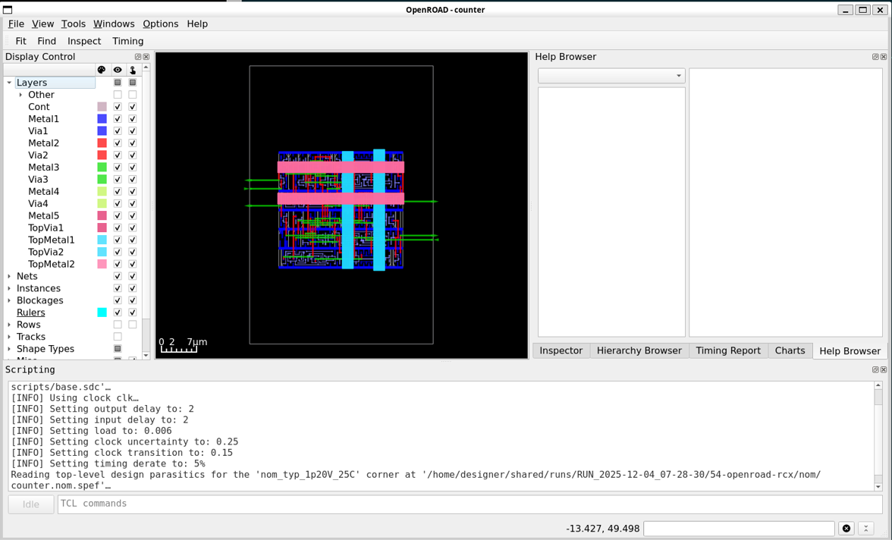
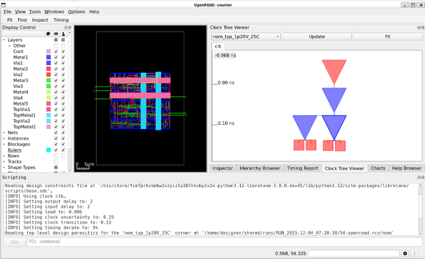
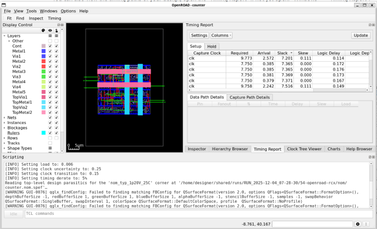
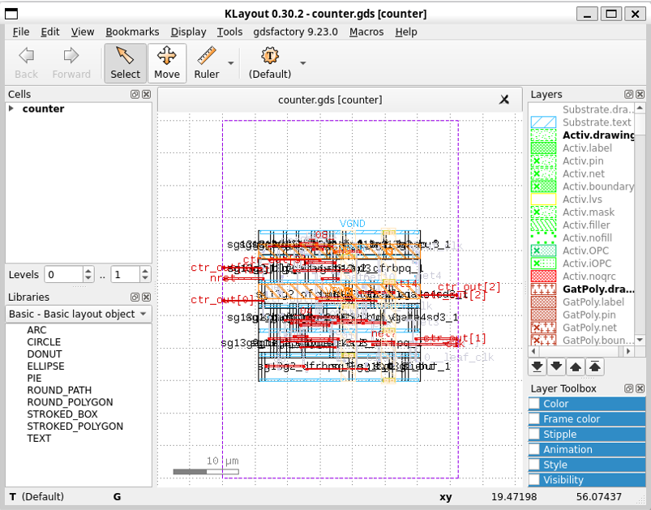
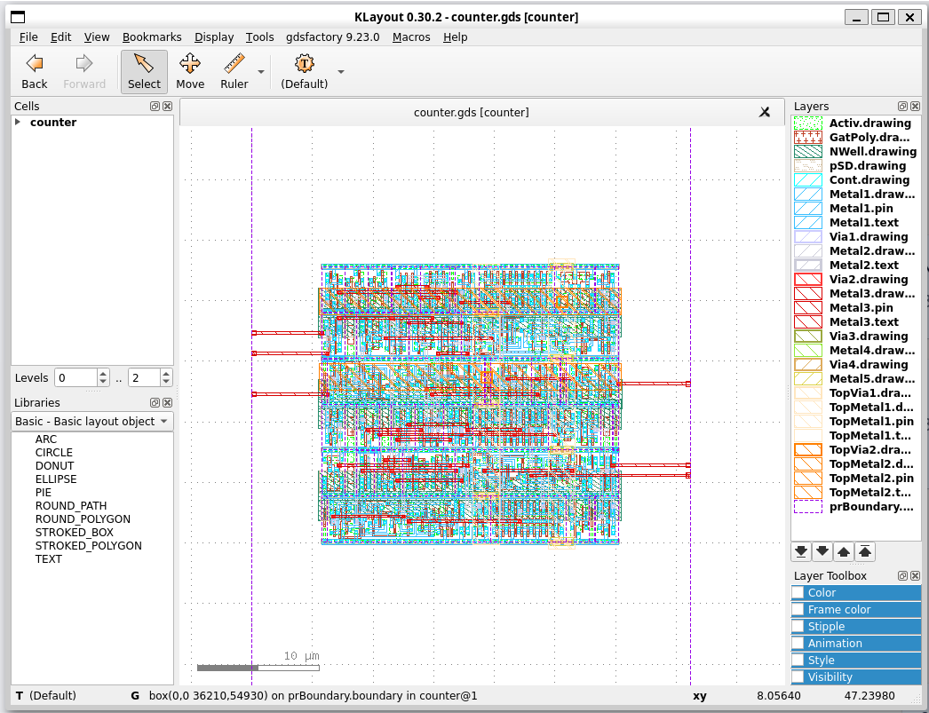

{: .no_toc }
## 4.2 Implementation with LibreLane
{: .no_toc }

<!-- <details open markdown="block">
  <summary>
    Table of contents
  </summary>
  {: .text-delta }
- TOC
{:toc}
</details> -->

### 0. Prerequisite
It is assumed that you already install the opensource design tools [using docker](/training/2.2-AMS-docker-remote.html).

### 1. Run the UNIC-CASS Docker image

- Open a terminal and change the directory to the uniccass-design-tools as s described in (Installing design tools using docker)(/training/2.2-AMS-docker-remote.html), and run `make start`:

{: .shellcmd}
> ```bash
> cd $HOME/projects/uniccass-design-tools
> make start
> ```

### 2. Writing the Verilog files

We first need to write some verilog files: a digital circuit and its testbench.

Below is the same code you will see in the [IVerilog & GTKWave tutorial](https://cidr.up-microlab.org/index.php/IVerilog_GTKWave_Tutorial#Viewing_the_output_VCD_using_GTKWave) page.

Create the counter.v and counter_tb.v by running the following command in the uniccas-design-tools docker shell:

```verilog
module counter(
    input clk, nrst,
    output reg [3:0] ctr_out
);

reg [3:0] ctr;

always@(posedge clk) begin
    if (!nrst)
        ctr <= 0;
    else
        ctr <= ctr + 4'b1;
end

always@(*)
    ctr_out <= ctr;

endmodule
```

```verilog
module counter_tb;

reg nrst,clk;
wire [3:0] c;

counter UUT(.ctr_out(c),.clk(clk),.nrst(nrst));

always begin
    #10
    clk = ~clk;
    $display("Counter value:%b @ time %f",c,$time);
end

initial begin
$dumpfile("test.vcd");
$dumpvars(0,counter_tb);

// we have to start somewhere
clk = 0;
nrst = 0;

#15
nrst = 1;

#100

$finish;
end

endmodule
```

### 3. Create `config.yaml` file for the counter design

To implement the design in LibreLane, we have to create a configuration file (often called config.yaml) to tell LibreLane what is the design/entity/module name (`DESIGN_NAME`), verilog source files (`VERILOG_FILES`), clock signal (`CLOCK_PORT`) and the clock period (`CLOCK_PERIOD`). These variables are the most essential variable for the flow. You can also set other variable in the flow. 

```yaml
DESIGN_NAME: counter
VERILOG_FILES: dir::counter.v
CLOCK_PORT: clk
CLOCK_PERIOD: 10 # 10ns = 100MHz
```
### 4. Run the implementation flow

{: .shellcmd}
> ```bash
> librelane --pdk ihp-sg13g2 config.yaml
> ```

If the flow runs successfully, you should see that all the checks are passed. Otherwise, you will have to debug to see what is wrong.

{: .cmdout}
> ```
> * Antenna
> Passed ✅
> 
> * LVS
> Passed ✅
> 
> * DRC
> Passed ✅
> 
> [07:29:29] INFO     Saving views to '/home/designer/shared/runs/RUN_2025-12-04_07-28-30/final'…             state.py:209
> [07:29:29] INFO     Flow complete.
> ```

The results are stored in runs directory. You can find the Openroad database for each step in this directory and also the GDSII file.

### 5. View Your Design in Openroad

To view the results in Openroad, run the following command:

{: .shellcmd}
> ```bash
> librelane --pdk ihp-sg13g2 config.yaml --last-run --flow OpenInOpenROAD
> ```



It is a good way to view and/or debug the design using the Openroad GUI because Openroad is used for the backend flow. 
For example, to view the clock tree, click on `Windows` >> `Clock Tree Viewer`. In the clock tree viewer tab on the right pannel, click on `Update` button.



You can also view the timing report by selecting `Timing report` tab, then click on `Update` button.



### 6. View the GDSII file in Klayout

To view the results in Openroad, run the following command:

{: .shellcmd}
> ```bash
> librelane --pdk ihp-sg13g2 config.yaml --last-run --flow OpenInKLayout
> ```

This is the default view of the output GDSII in Klayout.



With some customizations such as right-clicking on the layer pannel and selecting `Hide Empty Layers`, clicking on `View` and deselect `Show Texts`, and clicking on `Display` and selecting `Full Hierarchy`, you can see the layout of the design with all the used layers as follows.




### what's next

You can learn more on how to use the LibreLane using [the tutorial in Heichip workshop 2025](https://github.com/FPGA-Research/heichips25-workshop)