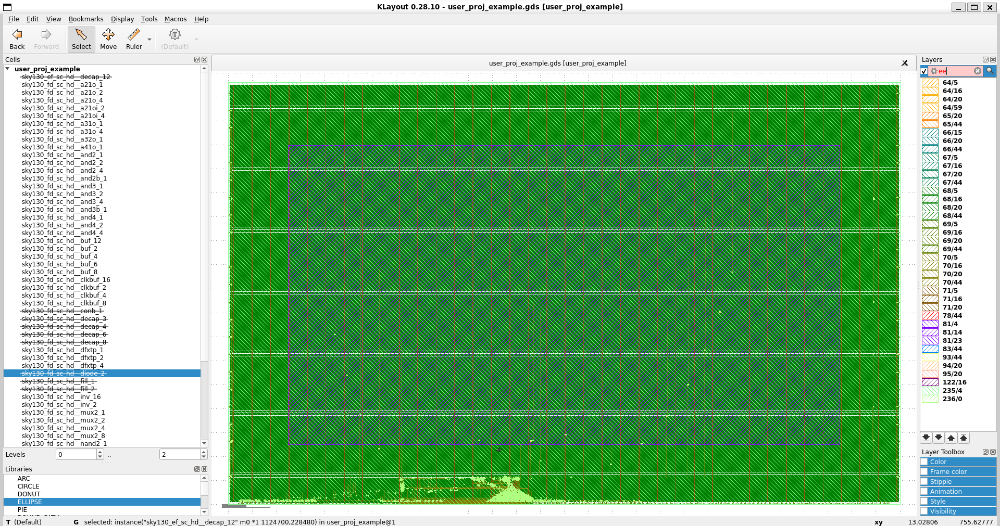
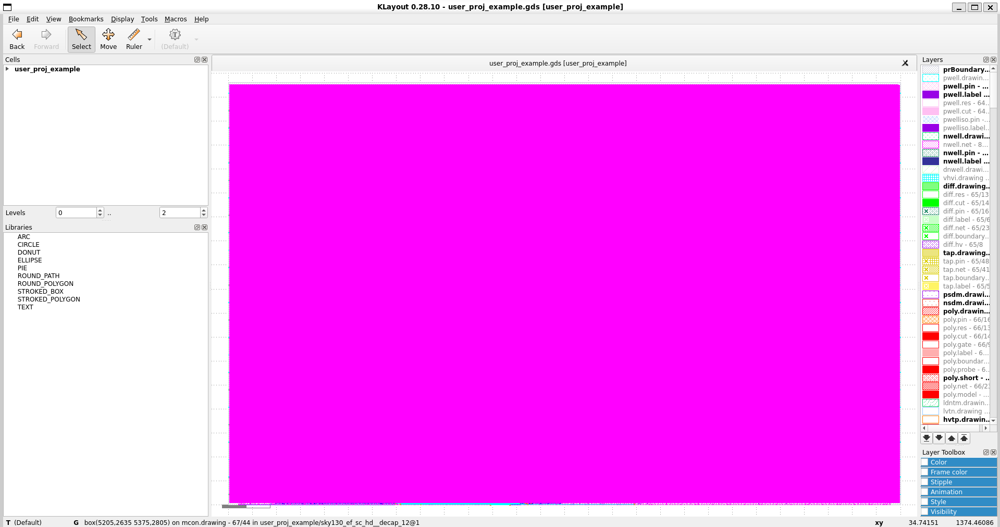
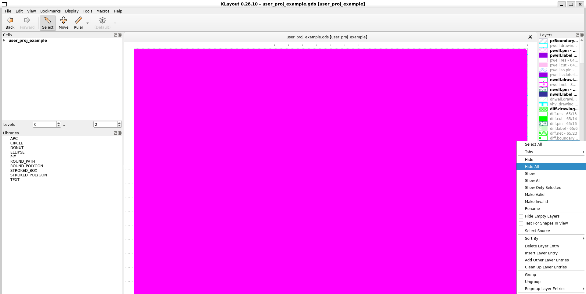
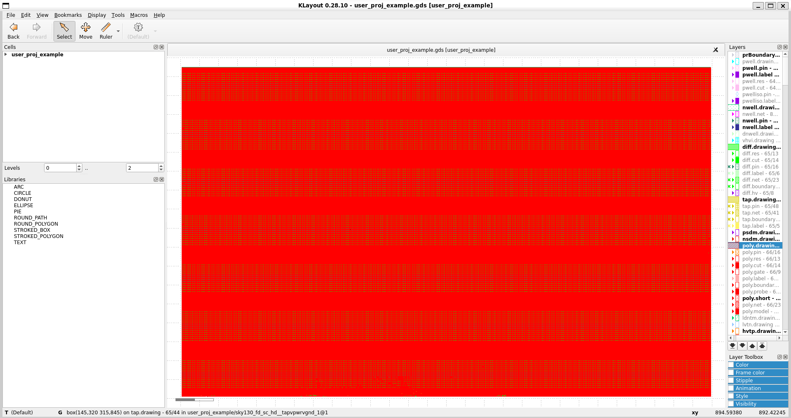
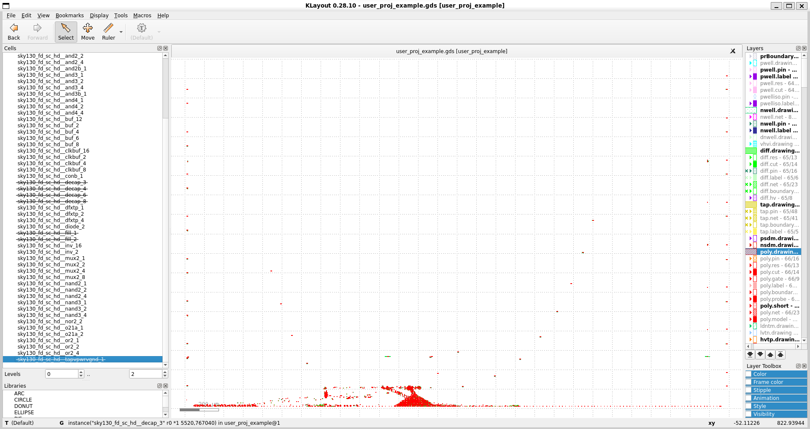
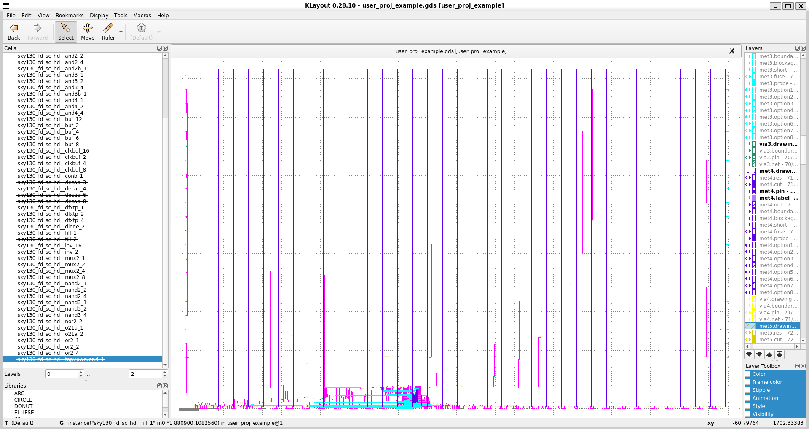
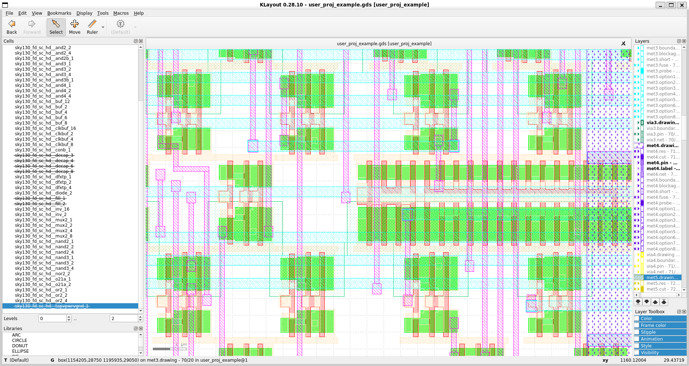
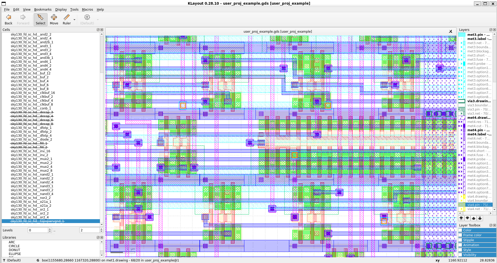

# 4.4 Running example design from Caravel_user_project
<div style="width: 854px;padding:56.25% 0 0 0;position:relative;"><iframe src="https://player.vimeo.com/video/857490582?h=777b35f6ca&amp;badge=0&amp;autopause=0&amp;player_id=0&amp;app_id=58479" frameborder="0" allow="autoplay; fullscreen; picture-in-picture" style="position:absolute;top:0;left:0;width:100%;height:100%;" title="4.4 Running the example projects"></iframe></div><script src="https://player.vimeo.com/api/player.js"></script>

# Lecture notes
<iframe src="https://docs.google.com/document/d/e/2PACX-1vRAQfTswCa9NwAAiqDdCNsBcgYg0lCiL6npblKDLR6pHwNedZLCWTZudsBOG9RT7KIkTSr5Vrjte0iw/pub?embedded=true" width="854" height="600"></iframe>

# Running example design from Caravel_user_project

## Prerequisites
To follow this lesson, you need to finish Lesson 4.3 before.
You also need to setup the `PDK` environment variable to the correct value as specified during the previous lesson.
```bash
export PDK=sky130A
```

## Investigating the example projects
1. In the caravel_user_project, there is an example project called user_proj_example. We can use this example to check if the setup is good or not. You might take a look at the source file and configuration in the openlane directory
```
openlane
├── Makefile
├── user_proj_example
│   ├── base_user_proj_example.sdc
│   ├── config.json
│   └── pin_order.cfg
└── user_project_wrapper
    ├── base_user_project_wrapper.sdc
    ├── config.json
    ├── fixed_dont_change
    │   ├── default_wrapper_cfgs.tcl
    │   ├── drc_exclude.cells
    │   ├── fixed_wrapper_cfgs.tcl
    │   ├── no_synth.cells
    │   ├── user_project_wrapper.def
    │   └── user_project_wrapper_gf180mcu.def
    ├── macro.cfg
    ├── pin_order.cfg
    └── vsrc
        ├── upw_vccd1_vsrc.loc
        ├── upw_vccd2_vsrc.loc
        ├── upw_vdda1_vsrc.loc
        ├── upw_vdda2_vsrc.loc
        ├── upw_vssa1_vsrc.loc
        ├── upw_vssa2_vsrc.loc
        ├── upw_vssd1_vsrc.loc
        └── upw_vssd2_vsrc.loc

```
2. The first file that you should look into is the `config.json`. This file defines the design name, the RTL source code, the clock signal and its periods. There are also pin config file (`pin_order.cfg`), DRC exclude cells, the timing constraint file (.sdc) and parameters related to the physical implementation. You can find out more about the meaning of these parameters in the openlane documentation.

The content of `openlane/user_proj_example/config.json`:
```json
{
    "DESIGN_NAME": "user_proj_example",
    "DESIGN_IS_CORE": 0,
    "VERILOG_FILES": [
        "dir::../../verilog/rtl/defines.v",
        "dir::../../verilog/rtl/user_proj_example.v"
    ],
    "CLOCK_PERIOD": 25,
    "CLOCK_PORT": "wb_clk_i",
    "CLOCK_NET": "counter.clk",
    "FP_SIZING": "absolute",
    "DIE_AREA": "0 0 2800 1760",
    "FP_PIN_ORDER_CFG": "dir::pin_order.cfg",
    "MAX_TRANSITION_CONSTRAINT": 1.0,
    "MAX_FANOUT_CONSTRAINT": 16,
    "PL_TARGET_DENSITY": 0.55,
    "PL_RESIZER_SETUP_SLACK_MARGIN": 0.4,
    "GLB_RESIZER_SETUP_SLACK_MARGIN": 0.2,
    "GLB_RESIZER_HOLD_SLACK_MARGIN": 0.2,
    "PL_RESIZER_HOLD_SLACK_MARGIN": 0.4,
    "MAGIC_DEF_LABELS": 0,
    "SYNTH_BUFFERING": 0,
    "RUN_HEURISTIC_DIODE_INSERTION": 1,
    "HEURISTIC_ANTENNA_THRESHOLD": 110,    
    "GRT_REPAIR_ANTENNAS": 1,
    "VDD_NETS": [
        "vccd1"
    ],
    "GND_NETS": [
        "vssd1"
    ],
    "IO_SYNC": 0,
    "BASE_SDC_FILE": "dir::base_user_proj_example.sdc",
    "RUN_CVC": 1,
    "pdk::sky130*": {
        "FP_CORE_UTIL": 45,
        "RT_MAX_LAYER": "met4",
        "scl::sky130_fd_sc_hd": {
            "CLOCK_PERIOD": 25
        },
        "scl::sky130_fd_sc_hdll": {
            "CLOCK_PERIOD": 10
        },
        "scl::sky130_fd_sc_hs": {
            "CLOCK_PERIOD": 8
        },
        "scl::sky130_fd_sc_ls": {
            "CLOCK_PERIOD": 10,
            "SYNTH_MAX_FANOUT": 5
        },
        "scl::sky130_fd_sc_ms": {
            "CLOCK_PERIOD": 10
        }
    },
    "pdk::gf180mcuC": {
        "STD_CELL_LIBRARY": "gf180mcu_fd_sc_mcu7t5v0",
        "CLOCK_PERIOD": 24.0,
        "FP_CORE_UTIL": 40,
        "RT_MAX_LAYER": "Metal4",
        "SYNTH_MAX_FANOUT": 4,
        "PL_TARGET_DENSITY": 0.45
    }
}
```

3. The pin_order.cfg sets the position of the pins according to the orientation of the design.
The content of `openlane/user_proj_example/pin_order.cfg`:
```tcl
#BUS_SORT

#S
wb_.*
wbs_.*
la_.*
irq.*

#E
io_in\[0\]
io_out\[0\]
io_oeb\[0\]
io_in\[1\]
io_out\[1\]
io_oeb\[1\]
io_in\[2\]
io_out\[2\]
io_oeb\[2\]
io_in\[3\]
io_out\[3\]
io_oeb\[3\]
io_in\[4\]
io_out\[4\]
io_oeb\[4\]
io_in\[5\]
io_out\[5\]
io_oeb\[5\]
io_in\[6\]
io_out\[6\]
io_oeb\[6\]
io_in\[7\]
io_out\[7\]
io_oeb\[7\]

#WR
io_in\[8\]
io_out\[8\]
io_oeb\[8\]
io_in\[9\]
io_out\[9\]
io_oeb\[9\]
io_in\[10\]
io_out\[10\]
io_oeb\[10\]
io_in\[11\]
io_out\[11\]
io_oeb\[11\]
io_in\[12\]
io_out\[12\]
io_oeb\[12\]
io_in\[13\]
io_out\[13\]
io_oeb\[13\]
io_in\[14\]
io_out\[14\]
io_oeb\[14\]
io_in\[15\]
io_out\[15\]
io_oeb\[15\]
```
4. The `base_user_proj_example.sdc` contains the timing constraints for the design. This file is important for the timing driven placement & route and for the static timing analysis. These topics will be mentioned in the advanced part of this microlearning course.

The content of `openlane/user_proj_example/base_user_proj_example.sdc`:
```tcl
# generated by get_cup_sdc.py
# Date: 2023/06/20

### Note:
# - input clock transition and latency are set for wb_clk_i port.
#   If your design is using the user_clock2, update the clock constraints to reflect that and use usr_* variables.
# - IO ports are assumed to be asynchronous. If they're synchronous to the clock, update the variable IO_SYNC to 1.
#   As well, update in_ext_delay and out_ext_delay with the required I/O external delays.

#------------------------------------------#
# Pre-defined Constraints
#------------------------------------------#

# Clock network
if {[info exists ::env(CLOCK_PORT)] && $::env(CLOCK_PORT) != ""} {
	set clk_input $::env(CLOCK_PORT)
	create_clock [get_ports $clk_input] -name clk -period $::env(CLOCK_PERIOD)
	puts "\[INFO\]: Creating clock {clk} for port $clk_input with period: $::env(CLOCK_PERIOD)"
} else {
	set clk_input __VIRTUAL_CLK__
	create_clock -name clk -period $::env(CLOCK_PERIOD)
	puts "\[INFO\]: Creating virtual clock with period: $::env(CLOCK_PERIOD)"
}
if { ![info exists ::env(SYNTH_CLK_DRIVING_CELL)] } {
	set ::env(SYNTH_CLK_DRIVING_CELL) $::env(SYNTH_DRIVING_CELL)
}
if { ![info exists ::env(SYNTH_CLK_DRIVING_CELL_PIN)] } {
	set ::env(SYNTH_CLK_DRIVING_CELL_PIN) $::env(SYNTH_DRIVING_CELL_PIN)
}

# Clock non-idealities
set_propagated_clock [all_clocks]
set_clock_uncertainty $::env(SYNTH_CLOCK_UNCERTAINTY) [get_clocks {clk}]
puts "\[INFO\]: Setting clock uncertainity to: $::env(SYNTH_CLOCK_UNCERTAINTY)"
set_clock_transition $::env(SYNTH_CLOCK_TRANSITION) [get_clocks {clk}]
puts "\[INFO\]: Setting clock transition to: $::env(SYNTH_CLOCK_TRANSITION)"

# Maximum transition time for the design nets
set_max_transition $::env(MAX_TRANSITION_CONSTRAINT) [current_design]
puts "\[INFO\]: Setting maximum transition to: $::env(MAX_TRANSITION_CONSTRAINT)"

# Maximum fanout
set_max_fanout $::env(MAX_FANOUT_CONSTRAINT) [current_design]
puts "\[INFO\]: Setting maximum fanout to: $::env(MAX_FANOUT_CONSTRAINT)"

# Timing paths delays derate
set_timing_derate -early [expr {1-$::env(SYNTH_TIMING_DERATE)}]
set_timing_derate -late [expr {1+$::env(SYNTH_TIMING_DERATE)}]
puts "\[INFO\]: Setting timing derate to: [expr {$::env(SYNTH_TIMING_DERATE) * 100}] %"

# Reset input delay
set_input_delay [expr $::env(CLOCK_PERIOD) * 0.5] -clock [get_clocks {clk}] [get_ports {wb_rst_i}]

# Multicycle paths
set_multicycle_path -setup 2 -through [get_ports {wbs_ack_o}]
set_multicycle_path -hold 1  -through [get_ports {wbs_ack_o}]
set_multicycle_path -setup 2 -through [get_ports {wbs_cyc_i}]
set_multicycle_path -hold 1  -through [get_ports {wbs_cyc_i}]
set_multicycle_path -setup 2 -through [get_ports {wbs_stb_i}]
set_multicycle_path -hold 1  -through [get_ports {wbs_stb_i}]

#------------------------------------------#
# Retrieved Constraints
#------------------------------------------#

# Clock source latency
set usr_clk_max_latency 4.57
set usr_clk_min_latency 4.11
set clk_max_latency 5.57
set clk_min_latency 4.65
set_clock_latency -source -max $clk_max_latency [get_clocks {clk}]
set_clock_latency -source -min $clk_min_latency [get_clocks {clk}]
puts "\[INFO\]: Setting clock latency range: $clk_min_latency : $clk_max_latency"

# Clock input Transition
set usr_clk_tran 0.13
set clk_tran 0.61
set_input_transition $clk_tran [get_ports $clk_input]
puts "\[INFO\]: Setting clock transition: $clk_tran"

# Input delays
set_input_delay -max 1.87 -clock [get_clocks {clk}] [get_ports {la_data_in[*]}]
set_input_delay -max 1.89 -clock [get_clocks {clk}] [get_ports {la_oenb[*]}]
set_input_delay -max 3.17 -clock [get_clocks {clk}] [get_ports {wbs_sel_i[*]}]
set_input_delay -max 3.74 -clock [get_clocks {clk}] [get_ports {wbs_we_i}]
set_input_delay -max 3.89 -clock [get_clocks {clk}] [get_ports {wbs_adr_i[*]}]
set_input_delay -max 4.13 -clock [get_clocks {clk}] [get_ports {wbs_stb_i}]
set_input_delay -max 4.61 -clock [get_clocks {clk}] [get_ports {wbs_dat_i[*]}]
set_input_delay -max 4.74 -clock [get_clocks {clk}] [get_ports {wbs_cyc_i}]
set_input_delay -min 0.18 -clock [get_clocks {clk}] [get_ports {la_data_in[*]}]
set_input_delay -min 0.3  -clock [get_clocks {clk}] [get_ports {la_oenb[*]}]
set_input_delay -min 0.79 -clock [get_clocks {clk}] [get_ports {wbs_adr_i[*]}]
set_input_delay -min 1.04 -clock [get_clocks {clk}] [get_ports {wbs_dat_i[*]}]
set_input_delay -min 1.19 -clock [get_clocks {clk}] [get_ports {wbs_sel_i[*]}]
set_input_delay -min 1.65 -clock [get_clocks {clk}] [get_ports {wbs_we_i}]
set_input_delay -min 1.69 -clock [get_clocks {clk}] [get_ports {wbs_cyc_i}]
set_input_delay -min 1.86 -clock [get_clocks {clk}] [get_ports {wbs_stb_i}]
if { $::env(IO_SYNC) } {
	set in_ext_delay 4
	puts "\[INFO\]: Setting input ports external delay to: $in_ext_delay"
	set_input_delay -max [expr $in_ext_delay + 4.55] -clock [get_clocks {clk}] [get_ports {io_in[*]}]
	set_input_delay -min [expr $in_ext_delay + 1.26] -clock [get_clocks {clk}] [get_ports {io_in[*]}]
}

# Input Transition
set_input_transition -max 0.14  [get_ports {wbs_we_i}]
set_input_transition -max 0.15  [get_ports {wbs_stb_i}]
set_input_transition -max 0.17  [get_ports {wbs_cyc_i}]
set_input_transition -max 0.18  [get_ports {wbs_sel_i[*]}]
set_input_transition -max 0.38  [get_ports {io_in[*]}]
set_input_transition -max 0.84  [get_ports {wbs_dat_i[*]}]
set_input_transition -max 0.86  [get_ports {la_data_in[*]}]
set_input_transition -max 0.92  [get_ports {wbs_adr_i[*]}]
set_input_transition -max 0.97  [get_ports {la_oenb[*]}]
set_input_transition -min 0.05  [get_ports {io_in[*]}]
set_input_transition -min 0.06  [get_ports {la_oenb[*]}]
set_input_transition -min 0.07  [get_ports {la_data_in[*]}]
set_input_transition -min 0.07  [get_ports {wbs_adr_i[*]}]
set_input_transition -min 0.07  [get_ports {wbs_dat_i[*]}]
set_input_transition -min 0.09  [get_ports {wbs_cyc_i}]
set_input_transition -min 0.09  [get_ports {wbs_sel_i[*]}]
set_input_transition -min 0.09  [get_ports {wbs_we_i}]
set_input_transition -min 0.15  [get_ports {wbs_stb_i}]

# Output delays
set_output_delay -max 0.7  -clock [get_clocks {clk}] [get_ports {user_irq[*]}]
set_output_delay -max 1.0  -clock [get_clocks {clk}] [get_ports {la_data_out[*]}]
set_output_delay -max 3.62 -clock [get_clocks {clk}] [get_ports {wbs_dat_o[*]}]
set_output_delay -max 8.41 -clock [get_clocks {clk}] [get_ports {wbs_ack_o}]
set_output_delay -min 0    -clock [get_clocks {clk}] [get_ports {la_data_out[*]}]
set_output_delay -min 0    -clock [get_clocks {clk}] [get_ports {user_irq[*]}]
set_output_delay -min 1.13 -clock [get_clocks {clk}] [get_ports {wbs_dat_o[*]}]
set_output_delay -min 1.37 -clock [get_clocks {clk}] [get_ports {wbs_ack_o}]
if { $::env(IO_SYNC) } {
	set out_ext_delay 4
	puts "\[INFO\]: Setting output ports external delay to: $out_ext_delay"
	set_output_delay -max [expr $out_ext_delay + 9.12] -clock [get_clocks {clk}] [get_ports {io_out[*]}]
	set_output_delay -max [expr $out_ext_delay + 9.32] -clock [get_clocks {clk}] [get_ports {io_oeb[*]}]
	set_output_delay -min [expr $out_ext_delay + 2.34] -clock [get_clocks {clk}] [get_ports {io_oeb[*]}]
	set_output_delay -min [expr $out_ext_delay + 3.9]  -clock [get_clocks {clk}] [get_ports {io_out[*]}]
}

# Output loads
set_load 0.19 [all_outputs]
```
5. The two other files are the `drc_exclude.cells` and `no_synth.cells`. These files contain the standard cells that will be excluded from the DRC run and the synthesis. If you want to bypass some DRC checks (because you know it works), you can use these files and set the corresponding variables in the `config.json`. One of the examples of these cells are the OpenRAM cells. By default, it uses special DRC rules that have not been implemented in Magic. You can disable the DRC check for the SRAM cells using this file.

## Run the example project
1. To harden the user_proj_example, we can simply run the following command. It will run the whole Digital design flow from the synthesis till the gds generation.
```bash
export PDK=sky130A
make user_proj_example
```
You can run this command in the top-level directory or in the `openlane` folder. The `user_proj_example` is the name of the folder which contains the configuration file.

The output of this command is as follows: 
```
cass@DESKTOP-QIE8PTM:~/uniccass_example$ export PDK=sky130A
cass@DESKTOP-QIE8PTM:~/uniccass_example$ make user_proj_example
make -C openlane user_proj_example
make[1]: Entering directory '/home/cass/uniccass_example/openlane'
# user_proj_example
mkdir -p ./user_proj_example/runs/24_07_24_19_54
rm -rf ./user_proj_example/runs/user_proj_example
ln -s $(realpath ./user_proj_example/runs/24_07_24_19_54) ./user_proj_example/runs/user_proj_example
docker run -it -u $(id -u $USER):$(id -g $USER) -v $(realpath /home/cass/uniccass_example/..):$(realpath /home/cass/uniccass_example/..) -v /home/cass/uniccass_example/dependencies/pdks:/home/cass/uniccass_example/dependencies/pdks -v /home/cass/uniccass_example/caravel:/home/cass/uniccass_example/caravel -v /home/cass/uniccass_example/dependencies/openlane_src:/openlane -v /home/cass/uniccass_example/mgmt_core_wrapper:/home/cass/uniccass_example/mgmt_core_wrapper -e PDK_ROOT=/home/cass/uniccass_example/dependencies/pdks -e PDK=sky130A -e MISMATCHES_OK=1 -e CARAVEL_ROOT=/home/cass/uniccass_example/caravel -e OPENLANE_RUN_TAG=24_07_24_19_54 -e MCW_ROOT=/home/cass/uniccass_example/mgmt_core_wrapper  \
        efabless/openlane:2023.07.19-1 sh -c "flow.tcl -design $(realpath ./user_proj_example) -save_path $(realpath ..) -save -tag 24_07_24_19_54 -overwrite -ignore_mismatches"
OpenLane 30ee1388932eb55a89ad84ee43997bfe3a386421
All rights reserved. (c) 2020-2022 Efabless Corporation and contributors.
Available under the Apache License, version 2.0. See the LICENSE file for more details.

[INFO]: Using configuration in '../home/cass/uniccass_example/openlane/user_proj_example/config.json'...
[INFO]: PDK Root: /home/cass/uniccass_example/dependencies/pdks
[INFO]: Process Design Kit: sky130A
[INFO]: Standard Cell Library: sky130_fd_sc_hd
[INFO]: Optimization Standard Cell Library: sky130_fd_sc_hd
[INFO]: Run Directory: /home/cass/uniccass_example/openlane/user_proj_example/runs/24_07_24_19_54
[INFO]: Saving runtime environment...
[INFO]: Preparing LEF files for the nom corner...
[INFO]: Preparing LEF files for the min corner...
[INFO]: Preparing LEF files for the max corner...
[INFO]: Running linter (Verilator) (log: ../home/cass/uniccass_example/openlane/user_proj_example/runs/24_07_24_19_54/logs/synthesis/linter.log)...
[INFO]: 0 errors found by linter
[WARNING]: 9 warnings found by linter
[STEP 1]
[INFO]: Running Synthesis (log: ../home/cass/uniccass_example/openlane/user_proj_example/runs/24_07_24_19_54/logs/synthesis/1-synthesis.log)...
[STEP 2]
[INFO]: Running Single-Corner Static Timing Analysis (log: ../home/cass/uniccass_example/openlane/user_proj_example/runs/24_07_24_19_54/logs/synthesis/2-sta.log)...
[STEP 3]
[INFO]: Running Initial Floorplanning (log: ../home/cass/uniccass_example/openlane/user_proj_example/runs/24_07_24_19_54/logs/floorplan/3-initial_fp.log)...
[INFO]: Floorplanned with width 2788.52 and height 1738.08.
[STEP 4]
[INFO]: Running IO Placement (log: ../home/cass/uniccass_example/openlane/user_proj_example/runs/24_07_24_19_54/logs/floorplan/4-place_io.log)...
[STEP 5]
[INFO]: Running Tap/Decap Insertion (log: ../home/cass/uniccass_example/openlane/user_proj_example/runs/24_07_24_19_54/logs/floorplan/5-tap.log)...
[INFO]: Power planning with power {vccd1} and ground {vssd1}...
[STEP 6]
[INFO]: Generating PDN (log: ../home/cass/uniccass_example/openlane/user_proj_example/runs/24_07_24_19_54/logs/floorplan/6-pdn.log)...
[STEP 7]
[INFO]: Running Global Placement (log: ../home/cass/uniccass_example/openlane/user_proj_example/runs/24_07_24_19_54/logs/placement/7-global.log)...
[STEP 8]
[INFO]: Running Single-Corner Static Timing Analysis (log: ../home/cass/uniccass_example/openlane/user_proj_example/runs/24_07_24_19_54/logs/placement/8-gpl_sta.log)...
[STEP 9]
[INFO]: Running Placement Resizer Design Optimizations (log: ../home/cass/uniccass_example/openlane/user_proj_example/runs/24_07_24_19_54/logs/placement/9-resizer.log)...
[STEP 10]
[INFO]: Running Detailed Placement (log: ../home/cass/uniccass_example/openlane/user_proj_example/runs/24_07_24_19_54/logs/placement/10-detailed.log)...
[STEP 11]
[INFO]: Running Single-Corner Static Timing Analysis (log: ../home/cass/uniccass_example/openlane/user_proj_example/runs/24_07_24_19_54/logs/placement/11-dpl_sta.log)...
[STEP 12]
[INFO]: Running Clock Tree Synthesis (log: ../home/cass/uniccass_example/openlane/user_proj_example/runs/24_07_24_19_54/logs/cts/12-cts.log)...
[STEP 13]
[INFO]: Running Single-Corner Static Timing Analysis (log: ../home/cass/uniccass_example/openlane/user_proj_example/runs/24_07_24_19_54/logs/cts/13-cts_sta.log)...
[STEP 14]
[INFO]: Running Placement Resizer Timing Optimizations (log: ../home/cass/uniccass_example/openlane/user_proj_example/runs/24_07_24_19_54/logs/cts/14-resizer.log)...
[STEP 15]
[INFO]: Running Global Routing Resizer Design Optimizations (log: ../home/cass/uniccass_example/openlane/user_proj_example/runs/24_07_24_19_54/logs/routing/15-resizer_design.log)...
[STEP 16]
[INFO]: Running Single-Corner Static Timing Analysis (log: ../home/cass/uniccass_example/openlane/user_proj_example/runs/24_07_24_19_54/logs/routing/16-rsz_design_sta.log)...
[STEP 17]
[INFO]: Running Global Routing Resizer Timing Optimizations (log: ../home/cass/uniccass_example/openlane/user_proj_example/runs/24_07_24_19_54/logs/routing/17-resizer_timing.log)...
[STEP 18]
[INFO]: Running Single-Corner Static Timing Analysis (log: ../home/cass/uniccass_example/openlane/user_proj_example/runs/24_07_24_19_54/logs/routing/18-rsz_timing_sta.log)...
[STEP 19]
[INFO]: Running Heuristic Diode Insertion (log: ../home/cass/uniccass_example/openlane/user_proj_example/runs/24_07_24_19_54/logs/routing/19-diodes.log)...
[STEP 20]
[INFO]: Running Detailed Placement (log: ../home/cass/uniccass_example/openlane/user_proj_example/runs/24_07_24_19_54/logs/routing/20-diode_legalization.log)...
[STEP 21]
[INFO]: Running Global Routing (log: ../home/cass/uniccass_example/openlane/user_proj_example/runs/24_07_24_19_54/logs/routing/21-global.log)...
[INFO]: Starting OpenROAD Antenna Repair Iterations...
[STEP 22]
[INFO]: Writing Verilog (log: ../home/cass/uniccass_example/openlane/user_proj_example/runs/24_07_24_19_54/logs/routing/21-global_write_netlist.log)...
[STEP 23]
[INFO]: Running Single-Corner Static Timing Analysis (log: ../home/cass/uniccass_example/openlane/user_proj_example/runs/24_07_24_19_54/logs/routing/23-grt_sta.log)...
[STEP 24]
[INFO]: Running Fill Insertion (log: ../home/cass/uniccass_example/openlane/user_proj_example/runs/24_07_24_19_54/logs/routing/24-fill.log)...
[STEP 25]
[INFO]: Running Detailed Routing (log: ../home/cass/uniccass_example/openlane/user_proj_example/runs/24_07_24_19_54/logs/routing/25-detailed.log)...
[INFO]: No DRC violations after detailed routing.
[STEP 26]
[INFO]: Checking Wire Lengths (log: ../home/cass/uniccass_example/openlane/user_proj_example/runs/24_07_24_19_54/logs/routing/26-wire_lengths.log)...
[STEP 27]
[INFO]: Running SPEF Extraction at the min process corner (log: ../home/cass/uniccass_example/openlane/user_proj_example/runs/24_07_24_19_54/logs/signoff/27-parasitics_extraction.min.log)...
[STEP 28]
[INFO]: Running Multi-Corner Static Timing Analysis at the min process corner (log: ../home/cass/uniccass_example/openlane/user_proj_example/runs/24_07_24_19_54/logs/signoff/28-rcx_mcsta.min.log)...
[STEP 29]
[INFO]: Running SPEF Extraction at the max process corner (log: ../home/cass/uniccass_example/openlane/user_proj_example/runs/24_07_24_19_54/logs/signoff/29-parasitics_extraction.max.log)...
[STEP 30]
[INFO]: Running Multi-Corner Static Timing Analysis at the max process corner (log: ../home/cass/uniccass_example/openlane/user_proj_example/runs/24_07_24_19_54/logs/signoff/30-rcx_mcsta.max.log)...
[STEP 31]
[INFO]: Running SPEF Extraction at the nom process corner (log: ../home/cass/uniccass_example/openlane/user_proj_example/runs/24_07_24_19_54/logs/signoff/31-parasitics_extraction.nom.log)...
[STEP 32]
[INFO]: Running Multi-Corner Static Timing Analysis at the nom process corner (log: ../home/cass/uniccass_example/openlane/user_proj_example/runs/24_07_24_19_54/logs/signoff/32-rcx_mcsta.nom.log)...
[STEP 33]
[INFO]: Running Single-Corner Static Timing Analysis at the nom process corner (log: ../home/cass/uniccass_example/openlane/user_proj_example/runs/24_07_24_19_54/logs/signoff/33-rcx_sta.log)...
[WARNING]: Module sky130_fd_sc_hd__tapvpwrvgnd_1 blackboxed during sta
[WARNING]: Module sky130_ef_sc_hd__decap_12 blackboxed during sta
[WARNING]: Module sky130_fd_sc_hd__fill_1 blackboxed during sta
[WARNING]: Module sky130_fd_sc_hd__fill_2 blackboxed during sta
[STEP 34]
[INFO]: Creating IR Drop Report (log: ../home/cass/uniccass_example/openlane/user_proj_example/runs/24_07_24_19_54/logs/signoff/34-irdrop.log)...
[WARNING]: VSRC_LOC_FILES is not defined. The IR drop analysis will run, but the values may be inaccurate.
[STEP 35]
[INFO]: Running Magic to generate various views...
[INFO]: Streaming out GDSII with Magic (log: ../home/cass/uniccass_example/openlane/user_proj_example/runs/24_07_24_19_54/logs/signoff/35-gdsii.log)...
[INFO]: Generating MAGLEF views...
[INFO]: Generating lef with Magic (/home/cass/uniccass_example/openlane/user_proj_example/runs/24_07_24_19_54/logs/signoff/35-lef.log)...
[STEP 36]
[INFO]: Streaming out GDSII with KLayout (log: ../home/cass/uniccass_example/openlane/user_proj_example/runs/24_07_24_19_54/logs/signoff/36-gdsii-klayout.log)...
[STEP 37]
[INFO]: Running XOR on the layouts using KLayout (log: ../home/cass/uniccass_example/openlane/user_proj_example/runs/24_07_24_19_54/logs/signoff/37-xor.log)...
[INFO]: No XOR differences between KLayout and Magic gds.
[STEP 38]
[INFO]: Running Magic Spice Export from LEF (log: ../home/cass/uniccass_example/openlane/user_proj_example/runs/24_07_24_19_54/logs/signoff/38-spice.log)...
[STEP 39]
[INFO]: Writing Powered Verilog (logs: ../home/cass/uniccass_example/openlane/user_proj_example/runs/24_07_24_19_54/logs/signoff/39-write_powered_def.log, ../home/cass/uniccass_example/openlane/user_proj_example/runs/24_07_24_19_54/logs/signoff/39-write_powered_verilog.log)...
[STEP 40]
[INFO]: Writing Verilog (log: ../home/cass/uniccass_example/openlane/user_proj_example/runs/24_07_24_19_54/logs/signoff/39-write_powered_verilog.log)...
[STEP 41]
[INFO]: Running LVS (log: ../home/cass/uniccass_example/openlane/user_proj_example/runs/24_07_24_19_54/logs/signoff/41-lvs.lef.log)...
[STEP 42]
[INFO]: Running Magic DRC (log: ../home/cass/uniccass_example/openlane/user_proj_example/runs/24_07_24_19_54/logs/signoff/42-drc.log)...
[INFO]: Converting Magic DRC database to various tool-readable formats...
[INFO]: No DRC violations after GDS streaming out.
[STEP 43]
[INFO]: Running OpenROAD Antenna Rule Checker (log: ../home/cass/uniccass_example/openlane/user_proj_example/runs/24_07_24_19_54/logs/signoff/43-arc.log)...
[STEP 44]
[INFO]: Running Circuit Validity Checker ERC (log: ../home/cass/uniccass_example/openlane/user_proj_example/runs/24_07_24_19_54/logs/signoff/44-erc_screen.log)...
[INFO]: Saving current set of views in '../home/cass/uniccass_example/openlane/user_proj_example/runs/24_07_24_19_54/results/final'...
[INFO]: Saving current set of views in '../home/cass/uniccass_example'...
[INFO]: Saving runtime environment...
[INFO]: Generating final set of reports...
[INFO]: Created manufacturability report at '../home/cass/uniccass_example/openlane/user_proj_example/runs/24_07_24_19_54/reports/manufacturability.rpt'.
[INFO]: Created metrics report at '../home/cass/uniccass_example/openlane/user_proj_example/runs/24_07_24_19_54/reports/metrics.csv'.
[WARNING]: There are max fanout violations in the design at the typical corner. Please refer to '../home/cass/uniccass_example/openlane/user_proj_example/runs/24_07_24_19_54/reports/signoff/33-rcx_sta.checks.rpt'.
[INFO]: There are no hold violations in the design at the typical corner.
[INFO]: There are no setup violations in the design at the typical corner.
[SUCCESS]: Flow complete.
[INFO]: Note that the following warnings have been generated:
[WARNING]: 9 warnings found by linter
[WARNING]: Module sky130_fd_sc_hd__tapvpwrvgnd_1 blackboxed during sta
[WARNING]: Module sky130_ef_sc_hd__decap_12 blackboxed during sta
[WARNING]: Module sky130_fd_sc_hd__fill_1 blackboxed during sta
[WARNING]: Module sky130_fd_sc_hd__fill_2 blackboxed during sta
[WARNING]: VSRC_LOC_FILES is not defined. The IR drop analysis will run, but the values may be inaccurate.
[WARNING]: There are max fanout violations in the design at the typical corner. Please refer to '../home/cass/uniccass_example/openlane/user_proj_example/runs/24_07_24_19_54/reports/signoff/33-rcx_sta.checks.rpt'.

make[1]: Leaving directory '/home/cass/uniccass_example/openlane'
```
The run finishes without critical errors. Setup and Hold violation or any DRC, LVS errors are the things that you should look at carefully if any. There is a max fanout violations. You can take a look at the file `openlane/user_proj_example/runs/24_07_24_19_54/reports/signoff/33-rcx_sta.checks.rpt` to investigate it. However, we ignore it for now

2. To view the results, we can open the GDS file, we can use Klayout as follows. 
```bash
klayout `find openlane/user_proj_example/runs -iname "*.gds" | grep 'final.*\.gds' | head -n 1`
```



You can disable all the filler cells such as the `decap` , `fill_1`, `fill_2`, `tapvpwrvgnd_1` cells. You can disable text display by selecting `View >> unselect Show texts`.

3. Load the GDS file with the technology data

You can also load the design with the layer definition for Skywater 130nm technology. To do that you can run the following command:

```bash
export PDK_ROOT=$HOME/uniccass_example/dependencies/pdks
klayout `find openlane/user_proj_example/runs -iname "*.gds" | grep 'final.*\.gds' | head -n 1` \
    -nn $PDK_ROOT/$PDK/libs.tech/klayout/tech/$PDK.lyt \
    -l $PDK_ROOT/$PDK/libs.tech/klayout/tech/$PDK.lyp
```



In the newly opened windows, you can disable all the layers, and just display the layers that you are interested in by right clicking on the right panel and selecting hide all layers. Then we will have an empty display.



Next, we can focus on the interesting cells by double clicking on nwell.drawing, diff.drawing, pwell.drawing and poly.drawing. We will have this:


There is a plenty of cells, however, most of them are the decap cells, filler cells, and tap cells. We can disable them as the one in step 2. Click on `user_proj_example` on the left panel and double click on these cells to disable them. We will have this view.


After disabling the filler cells, decap cells, and tap cells, we only have a very small number of cells. We can continue to enable li1.drawing, met2.drawing, met3.draw layers. (of course also met1.drawing but m1 is used for the power grid, therefore, if you enable met1.drawing, it will be messing).

This is the view on the bottom part.

You can continue to investigate the layout and learn more about the layout. You can see that the layout does not have metal 5 because met5 is used for the top level power net. Metal 5 layer in the top-level design will be connected to the metal 4 at the top level. You can also enable the via1, via2, via3, via 4 drawing to see how the metal layer are connected for the power net and the standard cells. This is the output with the most important layer displayed. 

## What’s next?
We have done the first example from `caravel_user_project`. Next, we will try to integrate our own design into the user project wrapper. We will learn how to run the simulation using the facilities provided by `caravel_user_project` template.


