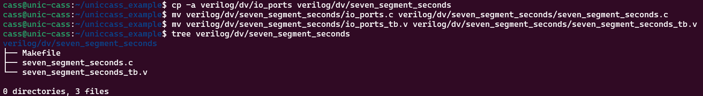
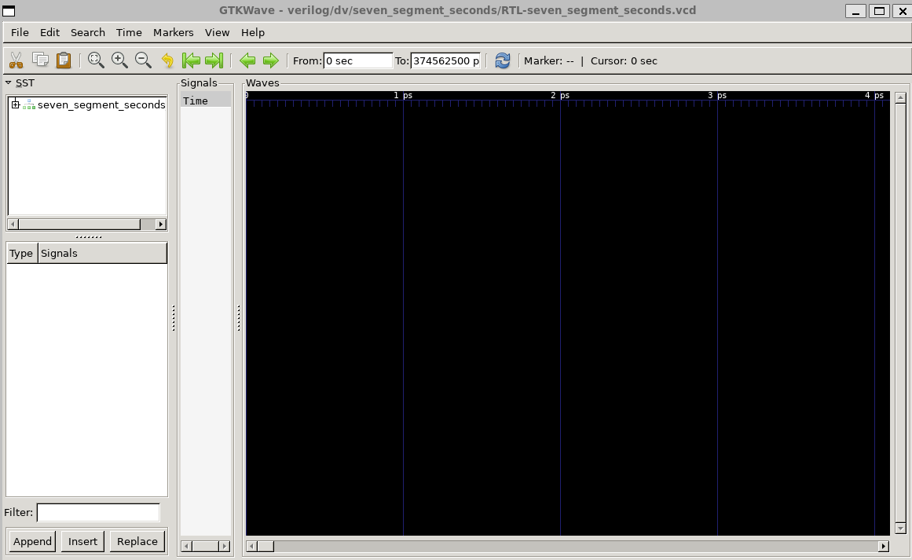
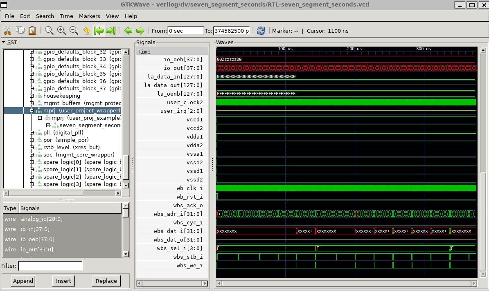

# 4.5 How to integrate your own design
<div style="width: 854px;padding:56.25% 0 0 0;position:relative;"><iframe src="https://player.vimeo.com/video/857491095?h=8c4c86acda&amp;badge=0&amp;autopause=0&amp;player_id=0&amp;app_id=58479" frameborder="0" allow="autoplay; fullscreen; picture-in-picture" style="position:absolute;top:0;left:0;width:100%;height:100%;" title="4.5 How to integrate a custom design-full-new"></iframe></div><script src="https://player.vimeo.com/api/player.js"></script>

<!-- ### Lecture notes
<iframe src="https://docs.google.com/document/d/e/2PACX-1vS-vxEHWXpZuAQE52cF6ytJ8Hhh6h0MwtNqQx9xI0iZ_2gM1Jd0raVV1UaYkAfLh0pFKXq-LN6z-g9_/pub?embedded=true" width="854" height="600"></iframe> -->

## Prerequisites

To follow up this lesson, you need to  complete [Lesson 4.3](https://docs.google.com/document/d/1AmFyddYVmLqWl37m4dEFZIfalLpjPrXB-BAZVviElKo/edit#heading=h.695pkcy4vxoz) before. You also need to set up the PDK_ROOT and OPENLANE_ROOT to the correct location as specified during the previous lesson

## Preparation

To integrate your own design, you can use `user_proj_example` as a template, then modify it to match your design. In this part, we will use the [seven_segment_seconds](https://github.com/mattvenn/seven_segment_seconds) from Mattvenn as the module to be integrated.

First we can look at the verilog directory in caravel_user_project. It is the place where the verilog source files are kept.
```
verilog
├── dv
│   ├── Makefile
│   ├── README.md
│   ├── io_ports
│   │   ├── Makefile
│   │   ├── io_ports.c
│   │   └── io_ports_tb.v
│   ├── la_test1
│   │   ├── Makefile
│   │   ├── la_test1.c
│   │   └── la_test1_tb.v
│   ├── la_test2
│   │   ├── Makefile
│   │   ├── la_test2.c
│   │   └── la_test2_tb.v
│   ├── local-install.md
│   ├── mprj_stimulus
│   │   ├── Makefile
│   │   ├── mprj_stimulus.c
│   │   └── mprj_stimulus_tb.v
│   └── wb_port
│       ├── Makefile
│       ├── wb_port.c
│       └── wb_port_tb.v
├── gl
│   ├── user_proj_example.nl.v
│   ├── user_proj_example.v
│   └── user_project_wrapper.v
├── includes
│   ├── includes.gl+sdf.caravel_user_project
│   ├── includes.gl.caravel_user_project
│   └── includes.rtl.caravel_user_project
└── rtl
    ├── defines.v
    ├── uprj_netlists.v
    ├── user_defines.v
    ├── user_proj_example.v
    └── user_project_wrapper.v
```


- The `rtl` folder contains the RTL verilog hardware description of our design.
- The `includes`  folder contains the definitions of the caravel user project. There are 3 options. One for RTL, one for gate-level (gl) simulation, and one for gate-level with delay simulation (gl+sdf).
- The `gl` directory contains the gate-level netlist of the user_project_wrapper and the caravel test harness.
- The `dv` directory contains the design verification codes including the testbench and the program to enable the io and start the design in the user project wrapper.

To integrate a new design, the easiest way is to modify user_proj_example to initiate our design. By doing this, we can reuse the openlane configuration and avoid complicated implementation setup. We also need to create a testbench for our design in the dv folder.

## Download and modify the design

Let’s start with the verilog hardware description of the design.

1. First we can download the new verilog file for ``seven_segment_seconds.v``  using the following commands:

``` bash
curl https://raw.githubusercontent.com/mattvenn/seven_segment_seconds/mpw7/src/seven_segment_seconds.v -o verilog/rtl/seven_segment_seconds.v
```


2. Next, we delete the counter design from line 125 to line 161 and delete the internal signals in `user_proj_example` design from line 72 to line 121.  This is our design after editing.

```verilog
File: user_proj_example.v
37:
38: module user_proj_example #(
39: 	parameter BITS = 32
40: )(
41: `ifdef USE_POWER_PINS
42: 	inout vccd1,    // User area 1 1.8V supply
43: 	inout vssd1,    // User area 1 digital ground
44: `endif
45:
46: 	// Wishbone Slave ports (WB MI A)
47: 	input wb_clk_i,
48: 	input wb_rst_i,
49: 	input wbs_stb_i,
50: 	input wbs_cyc_i,
51: 	input wbs_we_i,
52: 	input [3:0] wbs_sel_i,
53: 	input [31:0] wbs_dat_i,
54: 	input [31:0] wbs_adr_i,
55: 	output wbs_ack_o,
56: 	output [31:0] wbs_dat_o,
57:
58: 	// Logic Analyzer Signals
59: 	input  [127:0] la_data_in,
60: 	output [127:0] la_data_out,
61: 	input  [127:0] la_oenb,
62:
63: 	// IOs
64: 	input  [15:0] io_in,
65: 	output [15:0] io_out,
66: 	output [15:0] io_oeb,
67:
68: 	// IRQ
69: 	output [2:0] irq
70: );
71:
72: endmodule
73:
74: `default_nettype wire
```

3. Now we can initiate the seven_segment_seconds design inside `user_proj_example.v` by adding from line 72 to line xx as follows.  A new signal (wire) led_out is created to connect the output of the seven_segment_seconds instant.

```verilog
File: user_proj_example.v
37:
38: module user_proj_example #(
39: 	parameter BITS = 32
40: )(
41: `ifdef USE_POWER_PINS
42: 	inout vccd1,    // User area 1 1.8V supply
43: 	inout vssd1,    // User area 1 digital ground
44: `endif
45:
46: 	// Wishbone Slave ports (WB MI A)
47: 	input wb_clk_i,
48: 	input wb_rst_i,
49: 	input wbs_stb_i,
50: 	input wbs_cyc_i,
51: 	input wbs_we_i,
52: 	input [3:0] wbs_sel_i,
53: 	input [31:0] wbs_dat_i,
54: 	input [31:0] wbs_adr_i,
55: 	output wbs_ack_o,
56: 	output [31:0] wbs_dat_o,
57:
58: 	// Logic Analyzer Signals
59: 	input  [127:0] la_data_in,
60: 	output [127:0] la_data_out,
61: 	input  [127:0] la_oenb,
62:
63: 	// IOs
64: 	input  [15:0] io_in,
65: 	output [15:0] io_out,
66: 	output [15:0] io_oeb,
67:
68: 	// IRQ
69: 	output [2:0] irq
70: );
71:
72: 	wire [6:0] led_out;
73: 	seven_segment_seconds seven_segment_seconds(
74:     	.clk(wb_clk_i),
75:     	.reset(wb_rst_i),
76:     	.update_compare(1'b0),
77:     	.compare_in(24'h100),
78:     	.led_out(led_out)
79:     );
80:
81: endmodule
82:
83: `default_nettype wire
```

4. Finally, we connect led_out wires to the io_out and set the default mode of the GPIO port to the output mode by setting io_oeb to low (line 81-82). Led_out is assigned to io_out[14:8]. It is also corresponding to the GPIO[14:8] in the caravel test harness. This information is very important to create the testbench and to test the IC after fabrication.

```verilog
File: user_proj_example.v
37:
38: module user_proj_example #(
39: 	parameter BITS = 32
40: )(
41: `ifdef USE_POWER_PINS
42: 	inout vccd1,    // User area 1 1.8V supply
43: 	inout vssd1,    // User area 1 digital ground
44: `endif
45:
46: 	// Wishbone Slave ports (WB MI A)
47: 	input wb_clk_i,
48: 	input wb_rst_i,
49: 	input wbs_stb_i,
50: 	input wbs_cyc_i,
51: 	input wbs_we_i,
52: 	input [3:0] wbs_sel_i,
53: 	input [31:0] wbs_dat_i,
54: 	input [31:0] wbs_adr_i,
55: 	output wbs_ack_o,
56: 	output [31:0] wbs_dat_o,
57:
58: 	// Logic Analyzer Signals
59: 	input  [127:0] la_data_in,
60: 	output [127:0] la_data_out,
61: 	input  [127:0] la_oenb,
62:
63: 	// IOs
64: 	input  [15:0] io_in,
65: 	output [15:0] io_out,
66: 	output [15:0] io_oeb,
67:
68: 	// IRQ
69: 	output [2:0] irq
70: );
71:
72: 	wire [6:0] led_out;
73: 	seven_segment_seconds seven_segment_seconds(
74:     	.clk(wb_clk_i),
75:     	.reset(wb_rst_i),
76:     	.update_compare(1'b0),
77:     	.compare_in(24'h100),
78:     	.led_out(led_out)
79:     );
80:     assign io_out = {11'h0, led_out};
81:     assign io_oeb = 16'h0;
82: endmodule
83:
84: `default_nettype wire

```

5. Now, we can save and close user_proj_example.v
6. Next, we need to include the `seven_segment_seconds.v` into the design by editing verilog/includes/includes.rtl.caravel_user_project.

```bash
gedit verilog/includes/includes.rtl.caravel_user_project
```

```bash
# File: includes.rtl.caravel_user_project
1: # Caravel user project includes
2: -v $(USER_PROJECT_VERILOG)/rtl/user_project_wrapper.v
3: -v $(USER_PROJECT_VERILOG)/rtl/user_proj_example.v
4: -v $(USER_PROJECT_VERILOG)/rtl/seven_segment_seconds.v
```

## Create a testbench

7. Finally, we need to create a testbench for it. The easiest way to do this is to copy the existing test and modify it to adapt to ours.

```bash
cp -a verilog/dv/io_ports verilog/dv/seven_segment_seconds
mv verilog/dv/seven_segment_seconds/io_ports.c verilog/dv/seven_segment_seconds/seven_segment_seconds.c
mv verilog/dv/seven_segment_seconds/io_ports_tb.v verilog/dv/seven_segment_seconds/seven_segment_seconds_tb.v
tree verilog/dv/seven_segment_seconds
```



8. Now, we need to change the contents. First take a look at the Makefile


It is clear that the Makefile uses the folder name as the block name. So we don’t have to change anything because the folder name is also the module name.

9. Next, let’s look at the `seven_segment_seconds.c` which will be compiled into a hex file to run on the RISC-V processor on the management SoC.


10. We need to remove line 69 because our design uses the io from 0 to 6 as output. The changes are as follows. After that, save and close the file.

```c
File: seven_segment_seconds.c
60:     // Configure lower 7-IOs as user output
61:     // Observe counter value in the testbench
62:     reg_mprj_io_0 =  GPIO_MODE_USER_STD_OUTPUT;
63:     reg_mprj_io_1 =  GPIO_MODE_USER_STD_OUTPUT;
64:     reg_mprj_io_2 =  GPIO_MODE_USER_STD_OUTPUT;
65:     reg_mprj_io_3 =  GPIO_MODE_USER_STD_OUTPUT;
66:     reg_mprj_io_4 =  GPIO_MODE_USER_STD_OUTPUT;
67:     reg_mprj_io_5 =  GPIO_MODE_USER_STD_OUTPUT;
68:     reg_mprj_io_6 =  GPIO_MODE_USER_STD_OUTPUT;
69:
70:     /* Apply configuration */
```

11. Next, we need to modify the `seven_segment_seconds_tb.v` to match our design.

```bash
gedit verilog/dv/seven_segment_seconds/seven_segment_seconds_tb.v
```


12. Firstly, we have to change the  module name into `seven_segment_seconds_tb` at line 20

```verilog
File: seven_segment_seconds_tb.v
15:
16: `default_nettype none
17:
18: `timescale 1 ns / 1 ps
19:
20: module seven_segment_seconds_tb;
21:     reg clock;
22:     reg RSTB;
23:     reg CSB;
24:     reg power1, power2;
25:     reg power3, power4;
26:
27:     wire gpio;

```

13. Then, we have to change the wavedump file name and the module name at line 144 and line 145 respectively.

```verilog
File: seven_segment_seconds_tb.v
142:
143:     initial begin
144:    	 $dumpfile("seven_segment_seconds.vcd");
145:    	 $dumpvars(0, seven_segment_seconds_tb);
146:
147:    	 // Repeat cycles of 1000 clock edges as needed to complete testbench
148:    	 repeat (25) begin
149:    		 repeat (1000) @(posedge clock);
150:    		 // $display("+1000 cycles");
151:    	 end
152:    	 $display("%c[1;31m",27);
153:    	 `ifdef GL
154:    		 $display ("Monitor: Timeout, Test Mega-Project IO Ports (GL) Failed");
155:    	 `else
156:    		 $display ("Monitor: Timeout, Test Mega-Project IO Ports (RTL) Failed");
157:    	 `endif
158:    	 $display("%c[0m",27);
159:    	 $finish;
160:     end
```

14. It is also important to change the firmware name to match our testbench at line 256.

```verilog
File: seven_segment_seconds_tb.v
254:
255:     spiflash #(
256:    	 .FILENAME("seven_segment_seconds.hex")
257:     ) spiflash (
258:    	 .csb(flash_csb),
259:    	 .clk(flash_clk),
260:    	 .io0(flash_io0),
261:    	 .io1(flash_io1),
262:    	 .io2(),   		 // not used
263:    	 .io3()   		 // not used
264:     );
```

15. Our design uses the io_ports from 0 to 6. Therefore, we have to change the monitor  signals `mprj_io_0` to the correct io ports at line 31.

```verilog
File: seven_segment_seconds_tb.v
26:
27:     wire gpio;
28:     wire [37:0] mprj_io;
29:     wire [7:0] mprj_io_0;
30:
31:     assign mprj_io_0 = mprj_io[6:0];
32:     // assign mprj_io_0 = {mprj_io[8:4],mprj_io[2:0]};
33:
34:     assign mprj_io[3] = (CSB == 1'b1) ? 1'b1 : 1'bz;
35:     // assign mprj_io[3] = 1'b1;
```

16. The testbench will wait for the output signal to be equal to some defined value. If it is not the case, a timeout is reached. The simulation will stop with an error. Therefore, we have to modify the line from 164-175 to the correct values. The output of seven_segment_seconds can be found at line 88-97 in` seven_segment_seconds.v`. We will change the testbench to reflect those values as follows. Then, save and close the file.

```verilog
File: seven_segment_seconds_tb.v
161:
162:     initial begin
163:     	// Observe Output pins [7:0]
164:    	 wait(mprj_io_0 == 7'b0111111);
165:    	 wait(mprj_io_0 == 7'b0000110);
166:    	 wait(mprj_io_0 == 7'b1011011);
167:    	 wait(mprj_io_0 == 7'b1001111);
168:    	 wait(mprj_io_0 == 7'b1100110);
169:    	 wait(mprj_io_0 == 7'b1101101);
170:    	 wait(mprj_io_0 == 7'b1111100);
171:    	 wait(mprj_io_0 == 7'b0000111);
172:    	 wait(mprj_io_0 == 7'b1111111);
173:    	 wait(mprj_io_0 == 7'b1100111);
174:    	 
175:    	 `ifdef GL
176:    		 $display("Monitor: Test 1 Mega-Project IO (GL) Passed");
177:    	 `else
178:    	 	$display("Monitor: Test 1 Mega-Project IO (RTL) Passed");
179:    	 `endif
180:     	$finish;
181:     end
```


## Run the simulation

17. Now, we can start to run the simulation to see if there is any error. The simulation can be run like this:

```bash
make verify-seven_segment_seconds-rtl
```


18. If you see `Monitor: Test 1 Mega-Project IO (RTL) Passed`, it means that our test has passed the test. Otherwise, you will see a failed message. At this stage our design is ready for the implementation.

19. If you got a failed test or if you want to investigate the design, you can open the VCD file `RTL-seven_segment_seconds.vcd` in `verilog/dv/seven_segment_seconds` to view the simulation waveform.

```bash
gtkwave verilog/dv/seven_segment_seconds/RTL-seven_segment_seconds.vcd
```



20.  To debug the design and/or view the waveform,  we click on ‘+’ symbol next to seven_segment_seconds on the left panel and     browser to the corresponding instants. For example, in this tutorial, we select seven_segment_seconds_tb >> uut >> chip_core >>  mprj >> mprj >> seven_segment_seconds. Select all the signals in the bottom left panel and click insert. Click on zoom fit symbol  to view the full waveform.


21. Similarly we can also view the waveform of the `user_proj_example` and `user_project_wrapper`.




22. Ensuring that your design works as expected is very important. You should verify the functionality carefully.

## Commit the change to github

23. (OPTIONAL) However, we would like to record the changes by committing the new and modified file into github. You should have done the git setup in the previous lesson.

```bash
git add verilog/rtl/seven_segment_seconds.v
git add verilog/dv/seven_segment_seconds/seven_segment_seconds.c
git add verilog/dv/seven_segment_seconds/seven_segment_seconds_tb.v
git add verilog/dv/seven_segment_seconds/Makefile
git add verilog/includes/includes.rtl.caravel_user_project
git add verilog/rtl/user_proj_example.v
git status # verify if we include all the necessary changes
git commit -m 'Add seven segment seconds and its testbench'
git push
```

```bash
cass@localhost: caravel_uniccas_example$ git add verilog/rtl/seven_segment_seconds.v
cass@localhost:caravel_uniccas_example$ git add verilog/dv/seven_segment_seconds/seven_segment_seconds.c
cass@Dlocalhost:caravel_uniccas_example$ git add verilog/dv/seven_segment_seconds/seven_segment_seconds_tb.v
cass@localhost:caravel_uniccas_example$ git add verilog/dv/seven_segment_seconds/Makefile
cass@Dlocalhost:caravel_uniccas_example$ git add verilog/includes/includes.rtl.caravel_user_project
cass@localhost:caravel_uniccas_example$ git add verilog/rtl/user_proj_example.v
cass@localhost:caravel_uniccas_example$ git status
On branch unic-cas
Your branch is up to date with 'origin/unic-cas'.

Changes to be committed:
  (use "git restore --staged <file>..." to unstage)
    	new file:   verilog/dv/seven_segment_seconds/Makefile
    	new file:   verilog/dv/seven_segment_seconds/seven_segment_seconds.c
    	new file:   verilog/dv/seven_segment_seconds/seven_segment_seconds_tb.v
    	modified:   verilog/includes/includes.rtl.caravel_user_project
    	new file:   verilog/rtl/seven_segment_seconds.v
    	modified:   verilog/rtl/user_proj_example.v

Untracked files:
  (use "git add <file>..." to include in what will be committed)
    	caravel/
    	dependencies/
    	mgmt_core_wrapper/
    	venv/

cass@localhost:caravel_uniccas_example$ git commit -m 'Add seven segment secon
ds and its testbench'
[unic-cas 0f17d36] Add seven segment seconds and its testbench
 6 files changed, 481 insertions(+), 91 deletions(-)
 create mode 100644 verilog/dv/seven_segment_seconds/Makefile
 create mode 100644 verilog/dv/seven_segment_seconds/seven_segment_seconds.c
 create mode 100644 verilog/dv/seven_segment_seconds/seven_segment_seconds_tb.v
 create mode 100644 verilog/rtl/seven_segment_seconds.v
cass@Dlocalhost:~/unic-cass/caravel_tutorial/caravel_uniccas_example$ git push
Enter passphrase for key '/home/cass/.ssh/id_rsa':
Enumerating objects: 20, done.
Counting objects: 100% (20/20), done.
Delta compression using up to 16 threads
Compressing objects: 100% (13/13), done.
Writing objects: 100% (13/13), 5.12 KiB | 5.12 MiB/s, done.
Total 13 (delta 7), reused 0 (delta 0), pack-reused 0
remote: Resolving deltas: 100% (7/7), completed with 6 local objects.
To github.com:duyhieubui/caravel_uniccas_example.git
   a320102..0f17d36  unic-cas -> unic-cas
```

## Create the configurations for hardware implementation

24. The next step is to harden our design. We have to modify the `config.json` in `openlane/user_proj_example` to include the `seven_segment_seconds` design.

```bash
gedit openlane/user_proj_example/config.json
```


25. We need to add the `seven_segment_seconds.v` after line 5 as the followings:

```json
File: config.json
2: 	"DESIGN_NAME": "user_proj_example",
3: 	"DESIGN_IS_CORE": 0,
4: 	"VERILOG_FILES": [
5:     	"dir::../../verilog/rtl/defines.v",
6:     	"dir::../../verilog/rtl/seven_segment_seconds.v",
7:     	"dir::../../verilog/rtl/user_proj_example.v"
8: 	],
9: 	"CLOCK_PERIOD": 25,
```

26. Change "counter" in line 11 into "seven_segment_seconds"

```json
File: config.json
09: 	"CLOCK_PERIOD": 25,
10: 	"CLOCK_PORT": "wb_clk_i",
11: 	"CLOCK_NET": "seven_segment_seconds.clk",
12: 	"FP_SIZING": "absolute",
13: 	"DIE_AREA": "0 0 2800 1760",
```

27. We can keep the other files as it is. Now the design is ready for Implementation.

## Run the Implementation

28. Now we are ready to run the implementation by the following command:

```bash
make user_proj_example
```

Terminal output:

```bash
make -C openlane user_proj_example
make[1]: Entering directory '/home/cass/unic-cass/caravel_tutorial/caravel_uniccas_example/openlane'
# user_proj_example
mkdir -p ./user_proj_example/runs/23_08_06_15_31
rm -rf ./user_proj_example/runs/user_proj_example
ln -s $(realpath ./user_proj_example/runs/23_08_06_15_31) ./user_proj_example/runs/user_proj_example
docker run -it -v $(realpath /home/cass/unic-cass/caravel_tutorial/caravel_uniccas_example/..):$(realpath /home/cass/unic-cass/caravel_tutorial/caravel_uniccas_example/..) -v /home/cass/unic-cass/caravel_tutorial/pdks:/pdk -v /home/cass/unic-cass/caravel_tutorial/caravel_uniccas_example/caravel:/home/cass/unic-cass/caravel_tutorial/caravel_uniccas_example/caravel -v /home/cass/unic-cass/caravel_tutorial/openlane:/openlane -v /home/cass/unic-cass/caravel_tutorial/caravel_uniccas_example/mgmt_core_wrapper:/home/cass/unic-cass/caravel_tutorial/caravel_uniccas_example/mgmt_core_wrapper -e PDK_ROOT=/pdk -e PDK=sky130A -e MISMATCHES_OK=1 -e CARAVEL_ROOT=/home/cass/unic-cass/caravel_tutorial/caravel_uniccas_example/caravel -e OPENLANE_RUN_TAG=23_08_06_15_31 -e MCW_ROOT=/home/cass/unic-cass/caravel_tutorial/caravel_uniccas_example/mgmt_core_wrapper -u 1000:1000 \
    	efabless/openlane:2023.02.23 sh -c "flow.tcl -design $(realpath ./user_proj_example) -save_path $(realpath ..) -save -tag 23_08_06_15_31 -overwrite -ignore_mismatches"
OpenLane a35b64aa200c91e9eb7dde56db787d6b4c0ea12a
All rights reserved. (c) 2020-2022 Efabless Corporation and contributors.
Available under the Apache License, version 2.0. See the LICENSE file for more details.

[INFO]: Using configuration in '../home/cass/unic-cass/caravel_tutorial/caravel_uniccas_example/openlane/user_proj_example/config.json'...
[INFO]: PDK Root: /pdk
[INFO]: Process Design Kit: sky130A
[INFO]: Standard Cell Library: sky130_fd_sc_hd
[INFO]: Optimization Standard Cell Library: sky130_fd_sc_hd
[INFO]: Run Directory: /home/cass/unic-cass/caravel_tutorial/caravel_uniccas_example/openlane/user_proj_example/runs/23_08_06_15_31
[INFO]: Preparing LEF files for the nom corner...
[INFO]: Preparing LEF files for the min corner...
[INFO]: Preparing LEF files for the max corner...
[STEP 1]
[INFO]: Running Synthesis (log: ../home/cass/unic-cass/caravel_tutorial/caravel_uniccas_example/openlane/user_proj_example/runs/23_08_06_15_31/logs/synthesis/1-synthesis.log)...
[STEP 2]
[INFO]: Running Single-Corner Static Timing Analysis (log: ../home/cass/unic-cass/caravel_tutorial/caravel_uniccas_example/openlane/user_proj_example/runs/23_08_06_15_31/logs/synthesis/2-sta.log)...
[STEP 3]
[INFO]: Running Initial Floorplanning (log: ../home/cass/unic-cass/caravel_tutorial/caravel_uniccas_example/openlane/user_proj_example/runs/23_08_06_15_31/logs/floorplan/3-initial_fp.log)...
[INFO]: Floorplanned with width 2788.52 and height 1738.08.
[STEP 4]
[INFO]: Running IO Placement (log: ../home/cass/unic-cass/caravel_tutorial/caravel_uniccas_example/openlane/user_proj_example/runs/23_08_06_15_31/logs/floorplan/4-place_io.log)...
[STEP 5]
[INFO]: Running Tap/Decap Insertion (log: ../home/cass/unic-cass/caravel_tutorial/caravel_uniccas_example/openlane/user_proj_example/runs/23_08_06_15_31/logs/floorplan/5-tap.log)...
[INFO]: Power planning with power {vccd1} and ground {vssd1}...
[STEP 6]
[INFO]: Generating PDN (log: ../home/cass/unic-cass/caravel_tutorial/caravel_uniccas_example/openlane/user_proj_example/runs/23_08_06_15_31/logs/floorplan/6-pdn.log)...
[STEP 7]
[INFO]: Running Global Placement (log: ../home/cass/unic-cass/caravel_tutorial/caravel_uniccas_example/openlane/user_proj_example/runs/23_08_06_15_31/logs/placement/7-global.log)...
[STEP 8]
[INFO]: Running Placement Resizer Design Optimizations (log: ../home/cass/unic-cass/caravel_tutorial/caravel_uniccas_example/openlane/user_proj_example/runs/23_08_06_15_31/logs/placement/8-resizer.log)...
[STEP 9]
[INFO]: Running Detailed Placement (log: ../home/cass/unic-cass/caravel_tutorial/caravel_uniccas_example/openlane/user_proj_example/runs/23_08_06_15_31/logs/placement/9-detailed.log)...
[STEP 10]
[INFO]: Running Clock Tree Synthesis (log: ../home/cass/unic-cass/caravel_tutorial/caravel_uniccas_example/openlane/user_proj_example/runs/23_08_06_15_31/logs/cts/10-cts.log)...
[STEP 11]
[INFO]: Running Placement Resizer Timing Optimizations (log: ../home/cass/unic-cass/caravel_tutorial/caravel_uniccas_example/openlane/user_proj_example/runs/23_08_06_15_31/logs/cts/11-resizer.log)...
[STEP 12]
[INFO]: Running Global Routing Resizer Timing Optimizations (log: ../home/cass/unic-cass/caravel_tutorial/caravel_uniccas_example/openlane/user_proj_example/runs/23_08_06_15_31/logs/routing/12-resizer.log)...
[STEP 13]
[INFO]: Running Detailed Placement (log: ../home/cass/unic-cass/caravel_tutorial/caravel_uniccas_example/openlane/user_proj_example/runs/23_08_06_15_31/logs/routing/13-diode_legalization.log)...
[STEP 14]
[INFO]: Running Global Routing (log: ../home/cass/unic-cass/caravel_tutorial/caravel_uniccas_example/openlane/user_proj_example/runs/23_08_06_15_31/logs/routing/14-global.log)...
[INFO]: Starting OpenROAD Antenna Repair Iterations...
[STEP 15]
[INFO]: Writing Verilog (log: ../home/cass/unic-cass/caravel_tutorial/caravel_uniccas_example/openlane/user_proj_example/runs/23_08_06_15_31/logs/routing/14-global_write_netlist.log)...
[STEP 16]
[INFO]: Running Fill Insertion (log: ../home/cass/unic-cass/caravel_tutorial/caravel_uniccas_example/openlane/user_proj_example/runs/23_08_06_15_31/logs/routing/16-fill.log)...
[STEP 17]
[INFO]: Running Detailed Routing (log: ../home/cass/unic-cass/caravel_tutorial/caravel_uniccas_example/openlane/user_proj_example/runs/23_08_06_15_31/logs/routing/17-detailed.log)...
[INFO]: No DRC violations after detailed routing.
[STEP 18]
[INFO]: Checking Wire Lengths (log: ../home/cass/unic-cass/caravel_tutorial/caravel_uniccas_example/openlane/user_proj_example/runs/23_08_06_15_31/logs/routing/18-wire_lengths.log)...
[STEP 19]
[INFO]: Running SPEF Extraction at the min process corner (log: ../home/cass/unic-cass/caravel_tutorial/caravel_uniccas_example/openlane/user_proj_example/runs/23_08_06_15_31/logs/signoff/19-parasitics_extraction.min.log)...
[STEP 20]
[INFO]: Running Multi-Corner Static Timing Analysis at the min process corner (log: ../home/cass/unic-cass/caravel_tutorial/caravel_uniccas_example/openlane/user_proj_example/runs/23_08_06_15_31/logs/signoff/20-rcx_mcsta.min.log)...
[STEP 21]
[INFO]: Running SPEF Extraction at the max process corner (log: ../home/cass/unic-cass/caravel_tutorial/caravel_uniccas_example/openlane/user_proj_example/runs/23_08_06_15_31/logs/signoff/21-parasitics_extraction.max.log)...
[STEP 22]
[INFO]: Running Multi-Corner Static Timing Analysis at the max process corner (log: ../home/cass/unic-cass/caravel_tutorial/caravel_uniccas_example/openlane/user_proj_example/runs/23_08_06_15_31/logs/signoff/22-rcx_mcsta.max.log)...
[STEP 23]
[INFO]: Running SPEF Extraction at the nom process corner (log: ../home/cass/unic-cass/caravel_tutorial/caravel_uniccas_example/openlane/user_proj_example/runs/23_08_06_15_31/logs/signoff/23-parasitics_extraction.nom.log)...
[STEP 24]
[INFO]: Running Multi-Corner Static Timing Analysis at the nom process corner (log: ../home/cass/unic-cass/caravel_tutorial/caravel_uniccas_example/openlane/user_proj_example/runs/23_08_06_15_31/logs/signoff/24-rcx_mcsta.nom.log)...
[STEP 25]
[INFO]: Running Single-Corner Static Timing Analysis at the nom process corner (log: ../home/cass/unic-cass/caravel_tutorial/caravel_uniccas_example/openlane/user_proj_example/runs/23_08_06_15_31/logs/signoff/25-rcx_sta.log)...
[STEP 26]
[INFO]: Creating IR Drop Report (log: ../home/cass/unic-cass/caravel_tutorial/caravel_uniccas_example/openlane/user_proj_example/runs/23_08_06_15_31/logs/signoff/26-irdrop.log)...
[STEP 27]
[INFO]: Running Magic to generate various views...
[INFO]: Streaming out GDSII with Magic (log: ../home/cass/unic-cass/caravel_tutorial/caravel_uniccas_example/openlane/user_proj_example/runs/23_08_06_15_31/logs/signoff/27-gdsii.log)...
[INFO]: Generating MAGLEF views...
[STEP 28]
[INFO]: Streaming out GDSII with KLayout (log: ../home/cass/unic-cass/caravel_tutorial/caravel_uniccas_example/openlane/user_proj_example/runs/23_08_06_15_31/logs/signoff/28-gdsii-klayout.log)...
[STEP 29]
[INFO]: Running XOR on the layouts using KLayout (log: ../home/cass/unic-cass/caravel_tutorial/caravel_uniccas_example/openlane/user_proj_example/runs/23_08_06_15_31/logs/signoff/29-xor.log)...
[INFO]: No XOR differences between KLayout and Magic gds.
[STEP 30]
[INFO]: Running Magic Spice Export from LEF (log: ../home/cass/unic-cass/caravel_tutorial/caravel_uniccas_example/openlane/user_proj_example/runs/23_08_06_15_31/logs/signoff/30-spice.log)...
[STEP 31]
[INFO]: Writing Powered Verilog (logs: ../home/cass/unic-cass/caravel_tutorial/caravel_uniccas_example/openlane/user_proj_example/runs/23_08_06_15_31/logs/signoff/31-write_powered_def.log, ../home/cass/unic-cass/caravel_tutorial/caravel_uniccas_example/openlane/user_proj_example/runs/23_08_06_15_31/logs/signoff/31-write_powered_verilog.log)...
[STEP 32]
[INFO]: Writing Verilog (log: ../home/cass/unic-cass/caravel_tutorial/caravel_uniccas_example/openlane/user_proj_example/runs/23_08_06_15_31/logs/signoff/31-write_powered_verilog.log)...
[STEP 33]
[INFO]: Running LVS (log: ../home/cass/unic-cass/caravel_tutorial/caravel_uniccas_example/openlane/user_proj_example/runs/23_08_06_15_31/logs/signoff/33-lvs.lef.log)...
[STEP 34]
[INFO]: Running Magic DRC (log: ../home/cass/unic-cass/caravel_tutorial/caravel_uniccas_example/openlane/user_proj_example/runs/23_08_06_15_31/logs/signoff/34-drc.log)...
[STEP 35]
[INFO]: Running OpenROAD Antenna Rule Checker (log: ../home/cass/unic-cass/caravel_tutorial/caravel_uniccas_example/openlane/user_proj_example/runs/23_08_06_15_31/logs/signoff/35-antenna.log)...
[STEP 36]
[INFO]: Running Circuit Validity Checker ERC (log: ../home/cass/unic-cass/caravel_tutorial/caravel_uniccas_example/openlane/user_proj_example/runs/23_08_06_15_31/logs/signoff/36-erc_screen.log)...
[INFO]: Saving current set of views in '../home/cass/unic-cass/caravel_tutorial/caravel_uniccas_example/openlane/user_proj_example/runs/23_08_06_15_31/results/final'...
[INFO]: Saving current set of views in '../home/cass/unic-cass/caravel_tutorial/caravel_uniccas_example'...
[INFO]: Saving runtime environment...
[INFO]: Generating final set of reports...
[INFO]: Created manufacturability report at '../home/cass/unic-cass/caravel_tutorial/caravel_uniccas_example/openlane/user_proj_example/runs/23_08_06_15_31/reports/manufacturability.rpt'.
[INFO]: Created metrics report at '../home/cass/unic-cass/caravel_tutorial/caravel_uniccas_example/openlane/user_proj_example/runs/23_08_06_15_31/reports/metrics.csv'.
[WARNING]: There are max fanout violations in the design at the typical corner. Please refer to '../home/cass/unic-cass/caravel_tutorial/caravel_uniccas_example/openlane/user_proj_example/runs/23_08_06_15_31/reports/signoff/25-rcx_sta.slew.rpt'.
[INFO]: There are no hold violations in the design at the typical corner.
[INFO]: There are no setup violations in the design at the typical corner.
[SUCCESS]: Flow complete.
[INFO]: Note that the following warnings have been generated:
[WARNING]: There are max fanout violations in the design at the typical corner. Please refer to '../home/cass/unic-cass/caravel_tutorial/caravel_uniccas_example/openlane/user_proj_example/runs/23_08_06_15_31/reports/signoff/25-rcx_sta.slew.rpt'.

make[1]: Leaving directory '/home/cass/unic-cass/caravel_tutorial/caravel_uniccas_example/openlane'
```

## View the output and debug

29. View and investigate the layout.

```bash
klayout `find openlane/user_proj_example/runs -iname "*.gds" | grep 'final.*\.gds' | tail -n 1` \
-nn $PDK_ROOT/sky130A/libs.tech/klayout/tech/sky130A.lyt \
-l $PDK_ROOT/sky130A/libs.tech/klayout/tech/sky130A.lyp

```


## [OPTIONAL] Submit the changes to git

30. Now, the design has successfully integrated. We can now submit our changes to git.

```bash
git add def/user_proj_example.def
git add lef/user_proj_example.lef
git add lib/user_proj_example.lib
git add mag/user_proj_example.mag
git add maglef/user_proj_example.mag
git add openlane/user_proj_example/config.json
git add signoff/user_proj_example/OPENLANE_VERSION
git add signoff/user_proj_example/metrics.csv
git add spi/lvs/user_proj_example.spice
git add verilog/gl/user_proj_example.v
git add gds/user_proj_example.gds
git status # verify if the necessary changes is included
git commit -m "seven_segment_seconds hardened"
```

```bash
cass@localhost:caravel_uniccas_example$ git status
On branch unic-cas
Your branch is up to date with 'origin/unic-cas'.

Changes to be committed:
  (use "git restore --staged <file>..." to unstage)
    	modified:   def/user_proj_example.def
    	modified:   gds/user_proj_example.gds
    	modified:   lef/user_proj_example.lef
    	modified:   lib/user_proj_example.lib
    	modified:   mag/user_proj_example.mag
    	modified:   maglef/user_proj_example.mag
    	modified:   openlane/user_proj_example/config.json
    	modified:   signoff/user_proj_example/OPENLANE_VERSION
    	modified:   signoff/user_proj_example/metrics.csv
    	modified:   spi/lvs/user_proj_example.spice
    	modified:   verilog/gl/user_proj_example.v

Changes not staged for commit:
  (use "git add <file>..." to update what will be committed)
  (use "git restore <file>..." to discard changes in working directory)

cass@localhost:caravel_uniccas_example$ git commit -m 'seven_segment_seconds h
ardened'
[unic-cas c2c5347] seven_segment_seconds hardened
 11 files changed, 334495 insertions(+), 401394 deletions(-)
 rewrite lib/user_proj_example.lib (69%)
cass@localhost:caravel_uniccas_example$ git push
Enter passphrase for key '/home/cass/.ssh/id_rsa':
Enumerating objects: 51, done.
Counting objects: 100% (51/51), done.
Delta compression using up to 16 threads
Compressing objects: 100% (26/26), done.
Writing objects: 100% (27/27), 1.58 MiB | 329.00 KiB/s, done.
Total 27 (delta 11), reused 1 (delta 0), pack-reused 0
remote: Resolving deltas: 100% (11/11), completed with 11 local objects.
remote: warning: See https://gh.io/lfs for more information.
remote: warning: File mag/user_proj_example.mag is 83.01 MB; this is larger than GitHub's recommended maximum file size of 50.00 MB
remote: warning: GH001: Large files detected. You may want to try Git Large File Storage - https://git-lfs.github.com.
To github.com:duyhieubui/caravel_uniccas_example.git
   0f17d36..c2c5347  unic-cas -> unic-cas
```

31. It is recommended to compress the file before pushing the repository into github.com because some files are bigger than the recommended maximum size of github.com.

## Run the Implementation of the user_project_wrapper

32. Because we reuse the user_proj_example design therefore, by default it is already integrated with the user_project_wrapper. However, we need to rerun the implementation flow of the user_project_wrapper.

```bash
make user_project_wrapper
```

```bash
cass@localhost:caravel_uniccas_example$ make user_project_wrapper
make -C openlane user_project_wrapper
make[1]: Entering directory '/home/cass/unic-cass/caravel_tutorial/caravel_uniccas_example/openlane'
# user_project_wrapper
mkdir -p ./user_project_wrapper/runs/23_08_06_17_42
rm -rf ./user_project_wrapper/runs/user_project_wrapper
ln -s $(realpath ./user_project_wrapper/runs/23_08_06_17_42) ./user_project_wrapper/runs/user_project_wrapper
docker run -it -v $(realpath /home/cass/unic-cass/caravel_tutorial/caravel_uniccas_example/..):$(realpath /home/cass/unic-cass/caravel_tutorial/caravel_uniccas_example/..) -v /home/cass/unic-cass/caravel_tutorial/pdks:/pdk -v /home/cass/unic-cass/caravel_tutorial/caravel_uniccas_example/caravel:/home/cass/unic-cass/caravel_tutorial/caravel_uniccas_example/caravel -v /home/cass/unic-cass/caravel_tutorial/openlane:/openlane -v /home/cass/unic-cass/caravel_tutorial/caravel_uniccas_example/mgmt_core_wrapper:/home/cass/unic-cass/caravel_tutorial/caravel_uniccas_example/mgmt_core_wrapper -e PDK_ROOT=/pdk -e PDK=sky130A -e MISMATCHES_OK=1 -e CARAVEL_ROOT=/home/cass/unic-cass/caravel_tutorial/caravel_uniccas_example/caravel -e OPENLANE_RUN_TAG=23_08_06_17_42 -e MCW_ROOT=/home/cass/unic-cass/caravel_tutorial/caravel_uniccas_example/mgmt_core_wrapper -u 1000:1000 \
    	efabless/openlane:2023.02.23 sh -c "flow.tcl -design $(realpath ./user_project_wrapper) -save_path $(realpath ..) -save -tag 23_08_06_17_42 -overwrite -ignore_mismatches"
OpenLane a35b64aa200c91e9eb7dde56db787d6b4c0ea12a
All rights reserved. (c) 2020-2022 Efabless Corporation and contributors.
Available under the Apache License, version 2.0. See the LICENSE file for more details.

[INFO]: Using configuration in '../home/cass/unic-cass/caravel_tutorial/caravel_uniccas_example/openlane/user_project_wrapper/config.json'...
[INFO]: PDK Root: /pdk
[INFO]: Process Design Kit: sky130A
[INFO]: Standard Cell Library: sky130_fd_sc_hd
[INFO]: Optimization Standard Cell Library: sky130_fd_sc_hd
[INFO]: Run Directory: /home/cass/unic-cass/caravel_tutorial/caravel_uniccas_example/openlane/user_project_wrapper/runs/23_08_06_17_42
[INFO]: Preparing LEF files for the nom corner...
[INFO]: Preparing LEF files for the min corner...
[INFO]: Preparing LEF files for the max corner...
[STEP 1]
[INFO]: Running Synthesis (log: ../home/cass/unic-cass/caravel_tutorial/caravel_uniccas_example/openlane/user_project_wrapper/runs/23_08_06_17_42/logs/synthesis/1-synthesis.log)...
[STEP 2]
[INFO]: Running Single-Corner Static Timing Analysis (log: ../home/cass/unic-cass/caravel_tutorial/caravel_uniccas_example/openlane/user_project_wrapper/runs/23_08_06_17_42/logs/synthesis/2-sta.log)...
[INFO]: Creating a netlist with power/ground pins.
[STEP 3]
[INFO]: Running Initial Floorplanning (log: ../home/cass/unic-cass/caravel_tutorial/caravel_uniccas_example/openlane/user_project_wrapper/runs/23_08_06_17_42/logs/floorplan/3-initial_fp.log)...
[INFO]: Floorplanned with width 2908.58 and height 3497.92.
[STEP 4]
[INFO]: Running IO Placement...
[INFO]: Applying DEF template...
[STEP 5]
[INFO]: Performing Manual Macro Placement (log: ../home/cass/unic-cass/caravel_tutorial/caravel_uniccas_example/openlane/user_project_wrapper/runs/23_08_06_17_42/logs/placement/5-macro_placement.log)...
[INFO]: Power planning with power {vccd1 vccd2 vdda1 vdda2} and ground {vssd1 vssd2 vssa1 vssa2}...
[STEP 6]
[INFO]: Generating PDN (log: ../home/cass/unic-cass/caravel_tutorial/caravel_uniccas_example/openlane/user_project_wrapper/runs/23_08_06_17_42/logs/floorplan/6-pdn.log)...
[STEP 7]
[INFO]: Performing Random Global Placement (log: ../home/cass/unic-cass/caravel_tutorial/caravel_uniccas_example/openlane/user_project_wrapper/runs/23_08_06_17_42/logs/placement/7-global.log)...
[INFO]: Skipping Placement Resizer Design Optimizations.
[STEP 8]
[INFO]: Running Detailed Placement (log: ../home/cass/unic-cass/caravel_tutorial/caravel_uniccas_example/openlane/user_project_wrapper/runs/23_08_06_17_42/logs/placement/8-detailed.log)...
[INFO]: Skipping Placement Resizer Timing Optimizations.
[STEP 9]
[INFO]: Running Global Routing Resizer Timing Optimizations (log: ../home/cass/unic-cass/caravel_tutorial/caravel_uniccas_example/openlane/user_project_wrapper/runs/23_08_06_17_42/logs/routing/9-resizer.log)...
[STEP 10]
[INFO]: Running Detailed Placement (log: ../home/cass/unic-cass/caravel_tutorial/caravel_uniccas_example/openlane/user_project_wrapper/runs/23_08_06_17_42/logs/routing/10-diode_legalization.log)...
[STEP 11]
[INFO]: Running Global Routing (log: ../home/cass/unic-cass/caravel_tutorial/caravel_uniccas_example/openlane/user_project_wrapper/runs/23_08_06_17_42/logs/routing/11-global.log)...
[STEP 12]
[INFO]: Writing Verilog (log: ../home/cass/unic-cass/caravel_tutorial/caravel_uniccas_example/openlane/user_project_wrapper/runs/23_08_06_17_42/logs/routing/11-global_write_netlist.log)...
[STEP 13]
[INFO]: Running Detailed Routing (log: ../home/cass/unic-cass/caravel_tutorial/caravel_uniccas_example/openlane/user_project_wrapper/runs/23_08_06_17_42/logs/routing/13-detailed.log)...
[INFO]: No DRC violations after detailed routing.
[STEP 14]
[INFO]: Checking Wire Lengths (log: ../home/cass/unic-cass/caravel_tutorial/caravel_uniccas_example/openlane/user_project_wrapper/runs/23_08_06_17_42/logs/routing/14-wire_lengths.log)...
[STEP 15]
[INFO]: Running SPEF Extraction at the min process corner (log: ../home/cass/unic-cass/caravel_tutorial/caravel_uniccas_example/openlane/user_project_wrapper/runs/23_08_06_17_42/logs/signoff/15-parasitics_extraction.min.log)...
[STEP 16]
[INFO]: Running Multi-Corner Static Timing Analysis at the min process corner (log: ../home/cass/unic-cass/caravel_tutorial/caravel_uniccas_example/openlane/user_project_wrapper/runs/23_08_06_17_42/logs/signoff/16-rcx_mcsta.min.log)...
[STEP 17]
[INFO]: Running SPEF Extraction at the max process corner (log: ../home/cass/unic-cass/caravel_tutorial/caravel_uniccas_example/openlane/user_project_wrapper/runs/23_08_06_17_42/logs/signoff/17-parasitics_extraction.max.log)...
[STEP 18]
[INFO]: Running Multi-Corner Static Timing Analysis at the max process corner (log: ../home/cass/unic-cass/caravel_tutorial/caravel_uniccas_example/openlane/user_project_wrapper/runs/23_08_06_17_42/logs/signoff/18-rcx_mcsta.max.log)...
[STEP 19]
[INFO]: Running SPEF Extraction at the nom process corner (log: ../home/cass/unic-cass/caravel_tutorial/caravel_uniccas_example/openlane/user_project_wrapper/runs/23_08_06_17_42/logs/signoff/19-parasitics_extraction.nom.log)...
[STEP 20]
[INFO]: Running Multi-Corner Static Timing Analysis at the nom process corner (log: ../home/cass/unic-cass/caravel_tutorial/caravel_uniccas_example/openlane/user_project_wrapper/runs/23_08_06_17_42/logs/signoff/20-rcx_mcsta.nom.log)...
[STEP 21]
[INFO]: Running Single-Corner Static Timing Analysis at the nom process corner (log: ../home/cass/unic-cass/caravel_tutorial/caravel_uniccas_example/openlane/user_project_wrapper/runs/23_08_06_17_42/logs/signoff/21-rcx_sta.log)...
[STEP 22]
[INFO]: Creating IR Drop Report (log: ../home/cass/unic-cass/caravel_tutorial/caravel_uniccas_example/openlane/user_project_wrapper/runs/23_08_06_17_42/logs/signoff/22-irdrop.log)...
[STEP 23]
[INFO]: Running Magic to generate various views...
[INFO]: Streaming out GDSII with Magic (log: ../home/cass/unic-cass/caravel_tutorial/caravel_uniccas_example/openlane/user_project_wrapper/runs/23_08_06_17_42/logs/signoff/23-gdsii.log)...
[INFO]: Generating MAGLEF views...
[STEP 24]
[INFO]: Streaming out GDSII with KLayout (log: ../home/cass/unic-cass/caravel_tutorial/caravel_uniccas_example/openlane/user_project_wrapper/runs/23_08_06_17_42/logs/signoff/24-gdsii-klayout.log)...
[STEP 25]
[INFO]: Running XOR on the layouts using KLayout (log: ../home/cass/unic-cass/caravel_tutorial/caravel_uniccas_example/openlane/user_project_wrapper/runs/23_08_06_17_42/logs/signoff/25-xor.log)...
[INFO]: No XOR differences between KLayout and Magic gds.
[STEP 26]
[INFO]: Running Magic Spice Export from LEF (log: ../home/cass/unic-cass/caravel_tutorial/caravel_uniccas_example/openlane/user_project_wrapper/runs/23_08_06_17_42/logs/signoff/26-spice.log)...
[STEP 27]
[INFO]: Writing Powered Verilog (logs: ../home/cass/unic-cass/caravel_tutorial/caravel_uniccas_example/openlane/user_project_wrapper/runs/23_08_06_17_42/logs/signoff/27-write_powered_def.log, ../home/cass/unic-cass/caravel_tutorial/caravel_uniccas_example/openlane/user_project_wrapper/runs/23_08_06_17_42/logs/signoff/27-write_powered_verilog.log)...
[STEP 28]
[INFO]: Writing Verilog (log: ../home/cass/unic-cass/caravel_tutorial/caravel_uniccas_example/openlane/user_project_wrapper/runs/23_08_06_17_42/logs/signoff/27-write_powered_verilog.log)...
[STEP 29]
[INFO]: Running LVS (log: ../home/cass/unic-cass/caravel_tutorial/caravel_uniccas_example/openlane/user_project_wrapper/runs/23_08_06_17_42/logs/signoff/29-lvs.lef.log)...
[STEP 30]
[INFO]: Running Magic DRC (log: ../home/cass/unic-cass/caravel_tutorial/caravel_uniccas_example/openlane/user_project_wrapper/runs/23_08_06_17_42/logs/signoff/30-drc.log)...
[INFO]: Converting Magic DRC database to various tool-readable formats...
[INFO]: No DRC violations after GDS streaming out.
[STEP 31]
[INFO]: Running OpenROAD Antenna Rule Checker (log: ../home/cass/unic-cass/caravel_tutorial/caravel_uniccas_example/openlane/user_project_wrapper/runs/23_08_06_17_42/logs/signoff/31-antenna.log)...
[INFO]: Saving current set of views in '../home/cass/unic-cass/caravel_tutorial/caravel_uniccas_example/openlane/user_project_wrapper/runs/23_08_06_17_42/results/final'...
[INFO]: Saving current set of views in '../home/cass/unic-cass/caravel_tutorial/caravel_uniccas_example'...
[INFO]: Saving runtime environment...
[INFO]: Generating final set of reports...
[INFO]: Created manufacturability report at '../home/cass/unic-cass/caravel_tutorial/caravel_uniccas_example/openlane/user_project_wrapper/runs/23_08_06_17_42/reports/manufacturability.rpt'.
[INFO]: Created metrics report at '../home/cass/unic-cass/caravel_tutorial/caravel_uniccas_example/openlane/user_project_wrapper/runs/23_08_06_17_42/reports/metrics.csv'.
[INFO]: There are no max slew, max fanout or max capacitance violations in the design at the typical corner.
[INFO]: There are no hold violations in the design at the typical corner.
[INFO]: There are no setup violations in the design at the typical corner.
[SUCCESS]: Flow complete.
make[1]: Leaving directory '/home/cass/unic-cass/caravel_tutorial/caravel_uniccas_example/openlane'
```

33. Finally, we have the final `user_project_wrapper.gds`. We now can view it inside klayout using the following command:

```bash
klayout `find openlane/user_proj_example/runs -iname "*.gds" | grep 'final.*\.gds' | tail -n 1` \
-nn $PDK_ROOT/sky130A/libs.tech/klayout/tech/sky130A.lyt \
-l $PDK_ROOT/sky130A/libs.tech/klayout/tech/sky130A.lyp
```


34. Now, we can submit the change to the github repository.

```bash
git add  def/user_project_wrapper.def
git add gds/user_project_wrapper.gds
git add lef/user_project_wrapper.lef
git add lib/user_project_wrapper.lib
git add mag/user_project_wrapper.mag
git add maglef/user_project_wrapper.mag
git add signoff/user_project_wrapper/OPENLANE_VERSION
git add signoff/user_project_wrapper/metrics.csv
git status
git commit -m 'Add seven_segment_seconds to user_project_wrapper'
git push
```

```bash
cass@localhost:caravel_uniccas_example$ git status
On branch unic-cas
Your branch is up to date with 'origin/unic-cas'.

Changes to be committed:
  (use "git restore --staged <file>..." to unstage)
    	modified:   def/user_project_wrapper.def
    	modified:   gds/user_project_wrapper.gds
    	modified:   lef/user_project_wrapper.lef
    	modified:   lib/user_project_wrapper.lib
    	modified:   mag/user_project_wrapper.mag
    	modified:   maglef/user_project_wrapper.mag
    	modified:   signoff/user_project_wrapper/OPENLANE_VERSION
    	modified:   signoff/user_project_wrapper/metrics.csv

Untracked files:
  (use "git add <file>..." to include in what will be committed)
cass@localhost:caravel_uniccas_example$ git commit -m 'Add seven_segment_secon
ds to user_project_wrapper'
[unic-cas a1575ef] Add seven_segment_seconds to user_project_wrapper
 8 files changed, 12952 insertions(+), 13977 deletions(-)
cass@localhost:caravel_uniccas_example$ git push
Enter passphrase for key '/home/cass/.ssh/id_rsa':
Enumerating objects: 34, done.
Counting objects: 100% (34/34), done.
Delta compression using up to 16 threads
Compressing objects: 100% (18/18), done.
Writing objects: 100% (18/18), 1.40 MiB | 388.00 KiB/s, done.
Total 18 (delta 16), reused 1 (delta 0), pack-reused 0
remote: Resolving deltas: 100% (16/16), completed with 15 local objects.
remote: warning: See https://gh.io/lfs for more information.
remote: warning: File gds/user_project_wrapper.gds is 50.69 MB; this is larger than GitHub's recommended maximum file size of 50.00 MB
remote: warning: GH001: Large files detected. You may want to try Git Large File Storage - https://git-lfs.github.com.
To github.com:duyhieubui/caravel_uniccas_example.git
   c2c5347..a1575ef  unic-cas -> unic-cas
```

35.  We have not done it yet. We still need to run the precheck locally to check if there is any problem before submitting the design for tapeout. 

## What's next?

We have integrated our own project into the caravel_user_project. Next, we will have to run the precheck script to verify that it is ready for the submission to Efabless Open MPW or Chip Ignite program. Precheck script can be run locally.
