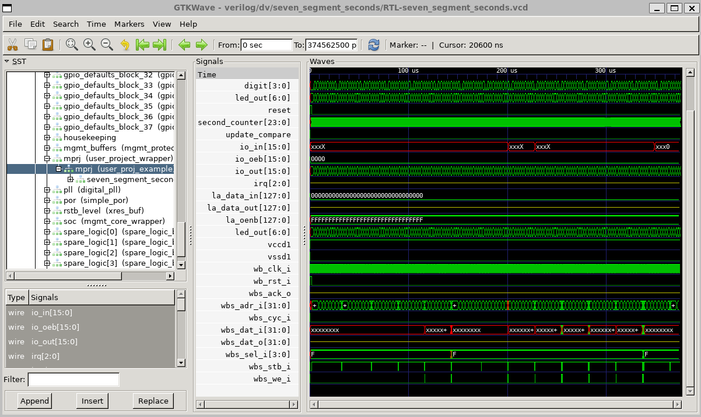

# 4.5 How to integrate your own design

{: .no_toc }

<details open markdown="block">
  <summary>
    Table of contents
  </summary>
  {: .text-delta }
- TOC
{:toc}
</details>

{: .video}
> <iframe width="700" height="360" src="https://www.youtube.com/embed/ytbOsn86wpg" title="4.5 How to integrate your own design" frameborder="0" allow="accelerometer; autoplay; clipboard-write; encrypted-media; gyroscope; picture-in-picture; web-share" referrerpolicy="strict-origin-when-cross-origin" allowfullscreen></iframe>

<!-- ### Lecture notes
<iframe src="https://docs.google.com/document/d/e/2PACX-1vS-vxEHWXpZuAQE52cF6ytJ8Hhh6h0MwtNqQx9xI0iZ_2gM1Jd0raVV1UaYkAfLh0pFKXq-LN6z-g9_/pub?embedded=true" width="854" height="600"></iframe> -->

## Prerequisites

To follow up this lesson, you need to  complete [Lesson 4.3](https://docs.google.com/document/d/1AmFyddYVmLqWl37m4dEFZIfalLpjPrXB-BAZVviElKo/edit#heading=h.695pkcy4vxoz) before. You also need to set up the PDK_ROOT and OPENLANE_ROOT to the correct location as specified during the previous lesson

## Preparation

To integrate your own design, you can use `user_proj_example` as a template, then modify it to match your design. In this part, we will use the [seven_segment_seconds](https://github.com/mattvenn/seven_segment_seconds) from Mattvenn as the module to be integrated.

First we can look at the verilog directory in caravel_user_project. It is the place where the verilog source files are kept.

```
verilog/
├── dv
│   ├── Makefile
│   ├── README.md
│   ├── cocotb
│   │   ├── README.md
│   │   ├── cocotb_tests.py
│   │   ├── design_info.yaml
│   │   ├── gpio_test
│   │   │   ├── gpio_test.c
│   │   │   └── gpio_test.py
│   │   ├── hello_world
│   │   │   ├── hello_world.c
│   │   │   ├── hello_world.py
│   │   │   └── hello_world.yaml
│   │   ├── hello_world_uart
│   │   │   ├── hello_world_uart.c
│   │   │   ├── hello_world_uart.py
│   │   │   └── hello_world_uart.yaml
│   │   └── user_proj_tests
│   │       ├── README.md
│   │       ├── counter_la
│   │       │   ├── counter_la.c
│   │       │   ├── counter_la.py
│   │       │   └── counter_la.yaml
│   │       ├── counter_la_clk
│   │       │   ├── counter_la_clk.c
│   │       │   ├── counter_la_clk.py
│   │       │   └── counter_la_clk.yaml
│   │       ├── counter_la_reset
│   │       │   ├── counter_la_reset.c
│   │       │   ├── counter_la_reset.py
│   │       │   └── counter_la_reset.yaml
│   │       ├── counter_wb
│   │       │   ├── counter_wb.c
│   │       │   ├── counter_wb.py
│   │       │   └── counter_wb.yaml
│   │       ├── user_proj_tests.yaml
│   │       └── user_proj_tests_gl.yaml
│   ├── io_ports
│   │   ├── Makefile
│   │   ├── io_ports.c
│   │   └── io_ports_tb.v
│   ├── la_test1
│   │   ├── Makefile
│   │   ├── la_test1.c
│   │   └── la_test1_tb.v
│   ├── la_test2
│   │   ├── Makefile
│   │   ├── la_test2.c
│   │   └── la_test2_tb.v
│   ├── local-install.md
│   ├── mprj_stimulus
│   │   ├── Makefile
│   │   ├── mprj_stimulus.c
│   │   └── mprj_stimulus_tb.v
│   ├── setup-cocotb.py
│   └── wb_port
│       ├── Makefile
│       ├── wb_port.c
│       └── wb_port_tb.v
├── gl
│   ├── user_proj_example.nl.v
│   ├── user_proj_example.v
│   └── user_project_wrapper.v
├── includes
│   ├── includes.gl+sdf.caravel_user_project
│   ├── includes.gl.caravel_user_project
│   └── includes.rtl.caravel_user_project
└── rtl
    ├── defines.v
    ├── uprj_netlists.v
    ├── user_defines.v
    ├── user_proj_example.v
    └── user_project_wrapper.v
```


- The `rtl` folder contains the RTL verilog hardware description of our design.
- The `includes`  folder contains the definitions of the caravel user project. There are 3 options. One for RTL, one for gate-level (gl) simulation, and one for gate-level with delay simulation (gl+sdf).
- The `gl` directory contains the gate-level netlist of the user_project_wrapper and the caravel test harness.
- The `dv` directory contains the design verification codes including the testbench and the program to enable the io and start the design in the user project wrapper.

To integrate a new design, the easiest way is to modify user_proj_example to initiate our design. By doing this, we can reuse the openlane configuration and avoid complicated implementation setup. We also need to create a testbench for our design in the dv folder.

## Download and modify the design

Let’s start with the verilog hardware description of the design.

{: .no_toc}
##### 1. Download the example design

First we can download the new verilog file for ``seven_segment_seconds.v``  using the following commands:

{: .shellcmd}
> ``` bash
> curl https://raw.githubusercontent.com/mattvenn/seven_segment_seconds/mpw7/src/seven_segment_seconds.v -o verilog/rtl/seven_segment_seconds.v
> ```

{: .cmdout}
> ```
> cass@unic-cass:~/uniccass_example$ curl https://raw.githubusercontent.com/mattvenn/seven_segment_seconds/mpw7/src/seven_segment_seconds.v -o verilog/rtl/seven_segment_seconds.v
>   % Total    % Received % Xferd  Average Speed   Time    Time     Time  Current
>                                  Dload  Upload   Total   Spent    Left  Speed
> 100  2311  100  2311    0     0   4017      0 --:--:-- --:--:-- --:--:--  4012
> ```

Then we open the file and change the value ```MAX_COUNT = 16_000_000``` into ``MAX_COUNT = 100`` in line 24. This change will speed up the simulation. 

```verilog
 File: seven_segment_seconds.v 
  3 module seven_segment_seconds (
  4     input wire clk,
  5     input wire reset,
  6     input wire [23:0] compare_in,
  7     input wire update_compare,
  8         output wire [6:0] led_out
  9 );
 10
 11     // external clock is 16MHz, so need 24 bit counter
 12     reg [23:0] second_counter;
 13     reg [3:0] digit;
 14     reg [23:0] compare;
 15
 16     `ifdef COCOTB_SIM
 17         initial begin
 18             $dumpfile ("seven_segment_seconds.vcd");
 19             $dumpvars (0, seven_segment_seconds);
 20             #1;
 21         end
 22         localparam MAX_COUNT = 100;
 23     `else
 24         localparam MAX_COUNT = 100;
 25     `endif
```

{: .no_toc}
##### 2. Modify the `user_proj_example`

Next, we delete the counter design from line 103 to line 153 and delete the internal signals in user_proj_example design from line 71 to line 101.  This is our design after editing.

```verilog
File: user_proj_example.v
 38 module user_proj_example #(
 39     parameter BITS = 16
 40 )(
 41 `ifdef USE_POWER_PINS
 42     inout vccd1,        // User area 1 1.8V supply
 43     inout vssd1,        // User area 1 digital ground
 44 `endif
 45
 46     // Wishbone Slave ports (WB MI A)
 47     input wb_clk_i,
 48     input wb_rst_i,
 49     input wbs_stb_i,
 50     input wbs_cyc_i,
 51     input wbs_we_i,
 52     input [3:0] wbs_sel_i,
 53     input [31:0] wbs_dat_i,
 54     input [31:0] wbs_adr_i,
 55     output wbs_ack_o,
 56     output [31:0] wbs_dat_o,
 57
 58     // Logic Analyzer Signals
 59     input  [127:0] la_data_in,
 60     output [127:0] la_data_out,
 61     input  [127:0] la_oenb,
 62
 63     // IOs
 64     input  [BITS-1:0] io_in,
 65     output [BITS-1:0] io_out,
 66     output [BITS-1:0] io_oeb,
 67
 68     // IRQ
 69     output [2:0] irq
 70 );
 71
 72
 73 endmodule
 74 `default_nettype wire
```

{: .no_toc}
##### 3. Initiate the seven_segment_seconds design

Now we can initiate the seven_segment_seconds design inside `user_proj_example.v` by adding from line 72 to line xx as follows.  A new signal (wire) led_out is created to connect the output of the seven_segment_seconds instant.

```verilog
File: user_proj_example.v 
 38 module user_proj_example #(
 39     parameter BITS = 16
 40 )(
 41 `ifdef USE_POWER_PINS
 42     inout vccd1,        // User area 1 1.8V supply
 43     inout vssd1,        // User area 1 digital ground
 44 `endif
 45
 46     // Wishbone Slave ports (WB MI A)
 47     input wb_clk_i,
 48     input wb_rst_i,
 49     input wbs_stb_i,
 50     input wbs_cyc_i,
 51     input wbs_we_i,
 52     input [3:0] wbs_sel_i,
 53     input [31:0] wbs_dat_i,
 54     input [31:0] wbs_adr_i,
 55     output wbs_ack_o,
 56     output [31:0] wbs_dat_o,
 57
 58     // Logic Analyzer Signals
 59     input  [127:0] la_data_in,
 60     output [127:0] la_data_out,
 61     input  [127:0] la_oenb,
 62
 63     // IOs
 64     input  [BITS-1:0] io_in,
 65     output [BITS-1:0] io_out,
 66     output [BITS-1:0] io_oeb,
 67
 68     // IRQ
 69     output [2:0] irq
 70 );
 71
      wire [6:0] led_out;
      seven_segment_seconds seven_segment_seconds(
          .clk(wb_clk_i),
          .reset(wb_rst_i),
          .update_compare(1'b0),
          .compare_in(24'h100),
          .led_out(led_out)
      );
 80
 81 endmodule
 82 `default_nettype wire
```

{: .no_toc}
##### 4. connect the output to the GPIO ports

Finally, we connect led_out wires to the io_out and set the default mode of the GPIO port to the output mode by setting io_oeb to low (line 81-82). Led_out is assigned to io_out[14:8]. It is also corresponding to the GPIO[14:8] in the caravel test harness. This information is very important to create the testbench and to test the IC after fabrication.

```verilog
File: user_proj_example.v
 38 module user_proj_example #(
 39     parameter BITS = 16
 40 )(
 41 `ifdef USE_POWER_PINS
 42     inout vccd1,        // User area 1 1.8V supply
 43     inout vssd1,        // User area 1 digital ground
 44 `endif
 45
 46     // Wishbone Slave ports (WB MI A)
 47     input wb_clk_i,
 48     input wb_rst_i,
 49     input wbs_stb_i,
 50     input wbs_cyc_i,
 51     input wbs_we_i,
 52     input [3:0] wbs_sel_i,
 53     input [31:0] wbs_dat_i,
 54     input [31:0] wbs_adr_i,
 55     output wbs_ack_o,
 56     output [31:0] wbs_dat_o,
 57
 58     // Logic Analyzer Signals
 59     input  [127:0] la_data_in,
 60     output [127:0] la_data_out,
 61     input  [127:0] la_oenb,
 62
 63     // IOs
 64     input  [BITS-1:0] io_in,
 65     output [BITS-1:0] io_out,
 66     output [BITS-1:0] io_oeb,
 67
 68     // IRQ
 69     output [2:0] irq
 70 );
 71
 72     wire [6:0] led_out;
 73     seven_segment_seconds seven_segment_seconds(
 74         .clk(wb_clk_i),
 75         .reset(wb_rst_i),
 76         .update_compare(1'b0),
 77         .compare_in(24'h100),
 78         .led_out(led_out)
 79     );
 80
 81     assign io_out = {11'h0, led_out};
 82     assign io_oeb = 16'h0;
 83
 84 endmodule
 85 `default_nettype wire

```

{: .no_toc}
##### 5. Save and close user_proj_example.v

{: .no_toc}
##### 6. Include the new design into the include files

Next, we need to include the `seven_segment_seconds.v` into the design by editing verilog/includes/includes.rtl.caravel_user_project.

{: .shellcmd}
> ```bash
> gedit verilog/includes/includes.rtl.caravel_user_project
> ```

```makefile
# File: includes.rtl.caravel_user_project
1: # Caravel user project includes
2: -v $(USER_PROJECT_VERILOG)/rtl/user_project_wrapper.v
3: -v $(USER_PROJECT_VERILOG)/rtl/user_proj_example.v
4: -v $(USER_PROJECT_VERILOG)/rtl/seven_segment_seconds.v
```

## Create a testbench

{: .no_toc}
##### 7. Create a testbench for the new design by copying an exmaple design

Finally, we need to create a testbench for it. The easiest way to do this is to copy the existing test and modify it to adapt to ours.

{: .shellcmd}
> ```bash
> cp -a verilog/dv/io_ports verilog/dv/seven_segment_seconds
> mv verilog/dv/seven_segment_seconds/io_ports.c verilog/dv/seven_segment_seconds/seven_segment_seconds.c
> mv verilog/dv/seven_segment_seconds/io_ports_tb.v verilog/dv/seven_segment_seconds/seven_segment_seconds_tb.v
> tree verilog/dv/seven_segment_seconds
> ```

{: .cmdout}
> ```
> cass@unic-cass:~/uniccass_example$ cp -a verilog/dv/io_ports verilog/dv/seven_segment_seconds
> cass@unic-cass:~/uniccass_example$ mv verilog/dv/seven_segment_seconds/io_ports.c verilog/dv/seven_segment_seconds/seven_segment_seconds.c
> cass@unic-cass:~/uniccass_example$ mv verilog/dv/seven_segment_seconds/io_ports_tb.v verilog/dv/seven_segment_seconds/seven_segment_seconds_tb.v
> cass@unic-cass:~/uniccass_example$ tree verilog/dv/seven_segment_seconds
> verilog/dv/seven_segment_seconds
> ├── Makefile
> ├── seven_segment_seconds.c
> └── seven_segment_seconds_tb.v
> 
> 0 directories, 3 files
> ```

{: .no_toc}
##### 8. Modify the testbench to match with the new design

Now, we need to change the contents. First take a look at the Makefile

{: .cmdout-title}
> File: `verilog/dv/seven_segment_seconds/Makefile`
> ```
> PWDD := $(shell pwd)
> BLOCKS := $(shell basename $(PWDD))
> 
> # ---- Include Partitioned Makefiles ----
> 
> CONFIG = caravel_user_project
> 
> 
> include $(MCW_ROOT)/verilog/dv/make/env.makefile
> include $(MCW_ROOT)/verilog/dv/make/var.makefile
> include $(MCW_ROOT)/verilog/dv/make/cpu.makefile
> include $(MCW_ROOT)/verilog/dv/make/sim.makefile
> 
> ```

It is clear that the Makefile uses the folder name as the block name. So we don’t have to change anything because the folder name is also the module name.

{: .no_toc}
##### 9. Take a look at the C program to run on the processor

Next, let’s look at the `seven_segment_seconds.c` which will be compiled into a hex file to run on the RISC-V processor on the management SoC.

{: .cmdout-title}
> File: `verilog/dv/seven_segment_seconds/seven_segment_seconds.c`
> ```c
> #include <defs.h>
> #include <stub.c>
> 
> /*
> 	IO Test:
> 		- Configures MPRJ lower 8-IO pins as outputs
> 		- Observes counter value through the MPRJ lower 8 IO pins (in the testbench)
> */
> 
> void main()
> {
> 	/* 
> 	IO Control Registers
> 	| DM     | VTRIP | SLOW  | AN_POL | AN_SEL | AN_EN | MOD_SEL | INP_DIS | HOLDH | OEB_N | MGMT_EN |
> 	| 3-bits | 1-bit | 1-bit | 1-bit  | 1-bit  | 1-bit | 1-bit   | 1-bit   | 1-bit | 1-bit | 1-bit   |
> 
> 	Output: 0000_0110_0000_1110  (0x1808) = GPIO_MODE_USER_STD_OUTPUT
> 	| DM     | VTRIP | SLOW  | AN_POL | AN_SEL | AN_EN | MOD_SEL | INP_DIS | HOLDH | OEB_N | MGMT_EN |
> 	| 110    | 0     | 0     | 0      | 0      | 0     | 0       | 1       | 0     | 0     | 0       |
> 	
> 	 
> 	Input: 0000_0001_0000_1111 (0x0402) = GPIO_MODE_USER_STD_INPUT_NOPULL
> 	| DM     | VTRIP | SLOW  | AN_POL | AN_SEL | AN_EN | MOD_SEL | INP_DIS | HOLDH | OEB_N | MGMT_EN |
> 	| 001    | 0     | 0     | 0      | 0      | 0     | 0       | 0       | 0     | 1     | 0       |
> 
> 	*/
> 
> 	/* Set up the housekeeping SPI to be connected internally so	*/
> 	/* that external pin changes don't affect it.			*/
> 
> 	// reg_spi_enable = 1;
> 	// reg_spimaster_cs = 0x10001;
> 	// reg_spimaster_control = 0x0801;
> 
> 	// reg_spimaster_control = 0xa002;	// Enable, prescaler = 2,
>                                         // connect to housekeeping SPI
> 
> 	// Connect the housekeeping SPI to the SPI master
> 	// so that the CSB line is not left floating.  This allows
> 	// all of the GPIO pins to be used for user functions.
> 
> 	// Configure lower 8-IOs as user output
> 	// Observe counter value in the testbench
> 	reg_mprj_io_0 =  GPIO_MODE_USER_STD_OUTPUT;
> 	reg_mprj_io_1 =  GPIO_MODE_USER_STD_OUTPUT;
> 	reg_mprj_io_2 =  GPIO_MODE_USER_STD_OUTPUT;
> 	reg_mprj_io_3 =  GPIO_MODE_USER_STD_OUTPUT;
> 	reg_mprj_io_4 =  GPIO_MODE_USER_STD_OUTPUT;
> 	reg_mprj_io_5 =  GPIO_MODE_USER_STD_OUTPUT;
> 	reg_mprj_io_6 =  GPIO_MODE_USER_STD_OUTPUT;
> 	reg_mprj_io_7 =  GPIO_MODE_USER_STD_OUTPUT;
> 
> 	/* Apply configuration */
> 	reg_mprj_xfer = 1;
> 	while (reg_mprj_xfer == 1);
> }
> ```

{: .no_toc}
##### 10. Modify the C program to adapt to the new design

We need to remove line 69 because our design uses the io from 0 to 6 as output. The changes are as follows. After that, save and close the file.

```c
File: seven_segment_seconds.c
60:     // Configure lower 7-IOs as user output
61:     // Observe counter value in the testbench
62:     reg_mprj_io_0 =  GPIO_MODE_USER_STD_OUTPUT;
63:     reg_mprj_io_1 =  GPIO_MODE_USER_STD_OUTPUT;
64:     reg_mprj_io_2 =  GPIO_MODE_USER_STD_OUTPUT;
65:     reg_mprj_io_3 =  GPIO_MODE_USER_STD_OUTPUT;
66:     reg_mprj_io_4 =  GPIO_MODE_USER_STD_OUTPUT;
67:     reg_mprj_io_5 =  GPIO_MODE_USER_STD_OUTPUT;
68:     reg_mprj_io_6 =  GPIO_MODE_USER_STD_OUTPUT;
69:
70:     /* Apply configuration */
```

{: .no_toc}
##### 11. Modify the testbench

Next, we need to modify the `seven_segment_seconds_tb.v` to match our design.

{: .shellcmd}
> ```bash
> gedit verilog/dv/seven_segment_seconds/seven_segment_seconds_tb.v
> ```

{: .cmdout-title}
> File: verilog/dv/seven_segment_seconds/seven_segment_seconds_tb.v
> ```
> `default_nettype none
> 
> `timescale 1 ns / 1 ps
> 
> module io_ports_tb;
> 	reg clock;
> 	reg RSTB;
> 	reg CSB;
> 	reg power1, power2;
> 	reg power3, power4;
> 
> 	wire gpio;
> 	wire [37:0] mprj_io;
> 	wire [7:0] mprj_io_0;
> 
> 	assign mprj_io_0 = mprj_io[7:0];
> 	// assign mprj_io_0 = {mprj_io[8:4],mprj_io[2:0]};
> 
> 	assign mprj_io[3] = (CSB == 1'b1) ? 1'b1 : 1'bz;
> 	// assign mprj_io[3] = 1'b1;
> 
> 	// External clock is used by default.  Make this artificially fast for the
> 	// simulation.  Normally this would be a slow clock and the digital PLL
> 	// would be the fast clock.
> 
> 	always #12.5 clock <= (clock === 1'b0);
> 
> 	initial begin
> 		clock = 0;
> 	end
> 
> 
> 	`ifdef ENABLE_SDF
> 		initial begin
> 			$sdf_annotate("../../../sdf/user_proj_example.sdf", uut.mprj) ;
> 			$sdf_annotate("../../../sdf/user_project_wrapper.sdf", uut.mprj.mprj) ;
> 			...
> 			$sdf_annotate("../../../caravel/sdf/gpio_defaults_block.sdf", uut.gpio_defaults_block_37) ;
> 		end
> 	`endif 
> 
> 	initial begin
> 		$dumpfile("io_ports.vcd");
> 		$dumpvars(0, io_ports_tb);
> 
> 		// Repeat cycles of 1000 clock edges as needed to complete testbench
> 		repeat (25) begin
> 			repeat (1000) @(posedge clock);
> 			// $display("+1000 cycles");
> 		end
> 		$display("%c[1;31m",27);
> 		`ifdef GL
> 			$display ("Monitor: Timeout, Test Mega-Project IO Ports (GL) Failed");
> 		`else
> 			$display ("Monitor: Timeout, Test Mega-Project IO Ports (RTL) Failed");
> 		`endif
> 		$display("%c[0m",27);
> 		$finish;
> 	end
> 
> 	initial begin
> 	    // Observe Output pins [7:0]
> 		wait(mprj_io_0 == 8'h01);
> 		wait(mprj_io_0 == 8'h02);
> 		wait(mprj_io_0 == 8'h03);
> 		wait(mprj_io_0 == 8'h04);
> 		wait(mprj_io_0 == 8'h05);
> 		wait(mprj_io_0 == 8'h06);
> 		wait(mprj_io_0 == 8'h07);
> 		wait(mprj_io_0 == 8'h08);
> 		wait(mprj_io_0 == 8'h09);
> 		wait(mprj_io_0 == 8'h0A);   
> 		wait(mprj_io_0 == 8'hFF);
> 		wait(mprj_io_0 == 8'h00);
> 		
> 		`ifdef GL
> 	    	$display("Monitor: Test 1 Mega-Project IO (GL) Passed");
> 		`else
> 		    $display("Monitor: Test 1 Mega-Project IO (RTL) Passed");
> 		`endif
> 	    $finish;
> 	end
> 
> 	initial begin
> 		RSTB <= 1'b0;
> 		CSB  <= 1'b1;		// Force CSB high
> 		#2000;
> 		RSTB <= 1'b1;	    	// Release reset
> 		#3_00_000;
> 		CSB = 1'b0;		// CSB can be released
> 	end
> 
> 	initial begin		// Power-up sequence
> 		power1 <= 1'b0;
> 		power2 <= 1'b0;
> 		power3 <= 1'b0;
> 		power4 <= 1'b0;
> 		#100;
> 		power1 <= 1'b1;
> 		#100;
> 		power2 <= 1'b1;
> 		#100;
> 		power3 <= 1'b1;
> 		#100;
> 		power4 <= 1'b1;
> 	end
> 
> 	always @(mprj_io) begin
> 		#1 $display("MPRJ-IO state = %b ", mprj_io[7:0]);
> 	end
> 
> 	wire flash_csb;
> 	wire flash_clk;
> 	wire flash_io0;
> 	wire flash_io1;
> 
> 	wire VDD3V3;
> 	wire VDD1V8;
> 	wire VSS;
> 	
> 	assign VDD3V3 = power1;
> 	assign VDD1V8 = power2;
> 	assign VSS = 1'b0;
> 
> 	caravel uut (
> 		.vddio	  (VDD3V3),
> 		.vddio_2  (VDD3V3),
> 		.vssio	  (VSS),
> 		.vssio_2  (VSS),
> 		.vdda	  (VDD3V3),
> 		.vssa	  (VSS),
> 		.vccd	  (VDD1V8),
> 		.vssd	  (VSS),
> 		.vdda1    (VDD3V3),
> 		.vdda1_2  (VDD3V3),
> 		.vdda2    (VDD3V3),
> 		.vssa1	  (VSS),
> 		.vssa1_2  (VSS),
> 		.vssa2	  (VSS),
> 		.vccd1	  (VDD1V8),
> 		.vccd2	  (VDD1V8),
> 		.vssd1	  (VSS),
> 		.vssd2	  (VSS),
> 		.clock    (clock),
> 		.gpio     (gpio),
> 		.mprj_io  (mprj_io),
> 		.flash_csb(flash_csb),
> 		.flash_clk(flash_clk),
> 		.flash_io0(flash_io0),
> 		.flash_io1(flash_io1),
> 		.resetb	  (RSTB)
> 	);
> 
> 	spiflash #(
> 		.FILENAME("io_ports.hex")
> 	) spiflash (
> 		.csb(flash_csb),
> 		.clk(flash_clk),
> 		.io0(flash_io0),
> 		.io1(flash_io1),
> 		.io2(),			// not used
> 		.io3()			// not used
> 	);
> 
> endmodule
> `default_nettype wire
> ```

{: .no_toc}
##### 12. Modify the module's name

Firstly, we have to change the  module name into `seven_segment_seconds_tb` at line 20

```verilog
File: seven_segment_seconds_tb.v
15:
16: `default_nettype none
17:
18: `timescale 1 ns / 1 ps
19:
20: module seven_segment_seconds_tb;
21:     reg clock;
22:     reg RSTB;
23:     reg CSB;
24:     reg power1, power2;
25:     reg power3, power4;
26:
27:     wire gpio;

```

{: .no_toc}
##### 13. Update the wavedump file

Then, we have to change the wavedump file name and the module name at line 144 and line 145 respectively.

```verilog
File: seven_segment_seconds_tb.v
142:
143:     initial begin
144:    	 $dumpfile("seven_segment_seconds.vcd");
145:    	 $dumpvars(0, seven_segment_seconds_tb);
146:
147:    	 // Repeat cycles of 1000 clock edges as needed to complete testbench
148:    	 repeat (25) begin
149:    		 repeat (1000) @(posedge clock);
150:    		 // $display("+1000 cycles");
151:    	 end
152:    	 $display("%c[1;31m",27);
153:    	 `ifdef GL
154:    		 $display ("Monitor: Timeout, Test Mega-Project IO Ports (GL) Failed");
155:    	 `else
156:    		 $display ("Monitor: Timeout, Test Mega-Project IO Ports (RTL) Failed");
157:    	 `endif
158:    	 $display("%c[0m",27);
159:    	 $finish;
160:     end
```

{: .no_toc}
##### 14. Change the hex file name to match the new testbench

It is also important to change the firmware name to match our testbench at line 256.

```verilog
File: seven_segment_seconds_tb.v
254:
255:     spiflash #(
256:    	 .FILENAME("seven_segment_seconds.hex")
257:     ) spiflash (
258:    	 .csb(flash_csb),
259:    	 .clk(flash_clk),
260:    	 .io0(flash_io0),
261:    	 .io1(flash_io1),
262:    	 .io2(),   		 // not used
263:    	 .io3()   		 // not used
264:     );
```

{: .no_toc}
##### 15. Change the io_ports to match the design

Our design uses the io_ports from 0 to 6. Therefore, we have to change the monitor  signals `mprj_io_0` to the correct io ports at line 31.

```verilog
File: seven_segment_seconds_tb.v
26:
27:     wire gpio;
28:     wire [37:0] mprj_io;
29:     wire [7:0] mprj_io_0;
30:
31:     assign mprj_io_0 = mprj_io[6:0];
32:     // assign mprj_io_0 = {mprj_io[8:4],mprj_io[2:0]};
33:
34:     assign mprj_io[3] = (CSB == 1'b1) ? 1'b1 : 1'bz;
35:     // assign mprj_io[3] = 1'b1;
```

{: .no_toc}
##### 16. Wait for the correct results in the output

The testbench will wait for the output signal to be equal to some defined value. If it is not the case, a timeout is reached. The simulation will stop with an error. Therefore, we have to modify the line from 164-175 to the correct values. The output of seven_segment_seconds can be found at line 88-97 in` seven_segment_seconds.v`. We will change the testbench to reflect those values as follows. Then, save and close the file.

```verilog
File: seven_segment_seconds_tb.v
161:
162:     initial begin
163:     	// Observe Output pins [7:0]
164:    	 wait(mprj_io_0 == 7'b0111111);
165:    	 wait(mprj_io_0 == 7'b0000110);
166:    	 wait(mprj_io_0 == 7'b1011011);
167:    	 wait(mprj_io_0 == 7'b1001111);
168:    	 wait(mprj_io_0 == 7'b1100110);
169:    	 wait(mprj_io_0 == 7'b1101101);
170:    	 wait(mprj_io_0 == 7'b1111100);
171:    	 wait(mprj_io_0 == 7'b0000111);
172:    	 wait(mprj_io_0 == 7'b1111111);
173:    	 wait(mprj_io_0 == 7'b1100111);
174:    	 
175:    	 `ifdef GL
176:    		 $display("Monitor: Test 1 Mega-Project IO (GL) Passed");
177:    	 `else
178:    	 	$display("Monitor: Test 1 Mega-Project IO (RTL) Passed");
179:    	 `endif
180:     	$finish;
181:     end
```


## Run the simulation

{: .no_toc}
##### 17. Compile and run the simulation

Now, we can start to run the simulation to see if there is any error. The simulation can be run like this:

{: .shellcmd}
> ```bash
> make verify-seven_segment_seconds-rtl
> ```

{: .cmdout}
> ```
> cass@unic-cass:~/uniccass_example$ make verify-seven_segment_seconds-rtl
> docker pull efabless/dv:latest
> latest: Pulling from efabless/dv
> 2d473b07cdd5: Already exists
> 830c1c11556a: Pull complete
> 27a216299a6b: Pull complete
> 361aa2410f76: Pull complete
> c386cf4c16f0: Pull complete 
> d83a09629f53: Pull complete
> 7669d5be8d83: Pull complete
> c9721db1c856: Pull complete
> 70046bb76055: Pull complete
> Digest: sha256:06497b070c8578fbbe87170c9f4dfa61c2c9a9d9f665a637c4d822ea98a7f1b7
> Status: Downloaded newer image for efabless/dv:latest
> docker.io/efabless/dv:latest
> docker run -u $(id -u $USER):$(id -g $USER) -v /home/cass/uniccass_example:/home/cass/uniccass_example -v /home/cass/uniccass_example/dependencies/pdks:/home/cass/uniccass_example/dependencies/pdks -v /home/cass/uniccass_example/caravel:/home/cass/uniccass_example/caravel -v /home/cass/uniccass_example/mgmt_core_wrapper:/home/cass/uniccass_example/mgmt_core_wrapper -e TARGET_PATH=/home/cass/uniccass_example -e PDK_ROOT=/home/cass/uniccass_example/dependencies/pdks -e CARAVEL_ROOT=/home/cass/uniccass_example/caravel -e TOOLS=/foss/tools/riscv-gnu-toolchain-rv32i/217e7f3debe424d61374d31e33a091a630535937 -e DESIGNS=/home/cass/uniccass_example -e USER_PROJECT_VERILOG=/home/cass/uniccass_example/verilog -e PDK=sky130A -e CORE_VERILOG_PATH=/home/cass/uniccass_example/mgmt_core_wrapper/verilog -e CARAVEL_VERILOG_PATH=/home/cass/uniccass_example/caravel/verilog -e MCW_ROOT=/home/cass/uniccass_example/mgmt_core_wrapper efabless/dv:latest sh -c "source ~/.bashrc && cd /home/cass/uniccass_example/verilog/dv/seven_segment_seconds && export SIM=RTL && make"
> /foss/tools/riscv-gnu-toolchain-rv32i/217e7f3debe424d61374d31e33a091a630535937/bin/riscv32-unknown-linux-gnu-gcc -g \
> -I/home/cass/uniccass_example/mgmt_core_wrapper/verilog/dv/firmware \
> -I/home/cass/uniccass_example/mgmt_core_wrapper/verilog/dv/generated \
> -I/home/cass/uniccass_example/mgmt_core_wrapper/verilog/dv/ \
> -I/home/cass/uniccass_example/mgmt_core_wrapper/verilog/common \
>   -march=rv32i      -mabi=ilp32 -D__vexriscv__ \
> -Wl,-Bstatic,-T,/home/cass/uniccass_example/mgmt_core_wrapper/verilog/dv/firmware/sections.lds,--strip-debug \
> -ffreestanding -nostdlib -o seven_segment_seconds.elf /home/cass/uniccass_example/mgmt_core_wrapper/verilog/dv/firmware/crt0_vex.S /home/cass/uniccass_example/mgmt_core_wrapper/verilog/dv/firmware/isr.c seven_segment_seconds.c
> In file included from /home/cass/uniccass_example/mgmt_core_wrapper/verilog/dv/firmware/isr.c:8:
> /home/cass/uniccass_example/mgmt_core_wrapper/verilog/dv/firmware/defs.h:273: warning: "reg_debug_2" redefined
>   273 | #define reg_debug_2 (*(volatile unsigned int*)(USER_SPACE_ADDR + USER_SPACE_SIZE))
>       |
> /home/cass/uniccass_example/mgmt_core_wrapper/verilog/dv/firmware/defs.h:147: note: this is the location of the previous definition
>   147 | #define reg_debug_2 (*(volatile uint32_t*)0x300FFFFC)
>       |
> /home/cass/uniccass_example/mgmt_core_wrapper/verilog/dv/firmware/defs.h:274: warning: "reg_debug_1" redefined
>   274 | #define reg_debug_1 (*(volatile unsigned int*)(USER_SPACE_ADDR + USER_SPACE_SIZE - 4))
>       |
> /home/cass/uniccass_example/mgmt_core_wrapper/verilog/dv/firmware/defs.h:146: note: this is the location of the previous definition
>   146 | #define reg_debug_1 (*(volatile uint32_t*)0x300FFFF8)
>       |
> In file included from seven_segment_seconds.c:19:
> /home/cass/uniccass_example/mgmt_core_wrapper/verilog/dv/firmware/defs.h:273: warning: "reg_debug_2" redefined
>   273 | #define reg_debug_2 (*(volatile unsigned int*)(USER_SPACE_ADDR + USER_SPACE_SIZE))
>       |
> /home/cass/uniccass_example/mgmt_core_wrapper/verilog/dv/firmware/defs.h:147: note: this is the location of the previous definition
>   147 | #define reg_debug_2 (*(volatile uint32_t*)0x300FFFFC)
>       |
> /home/cass/uniccass_example/mgmt_core_wrapper/verilog/dv/firmware/defs.h:274: warning: "reg_debug_1" redefined
>   274 | #define reg_debug_1 (*(volatile unsigned int*)(USER_SPACE_ADDR + USER_SPACE_SIZE - 4))
>       |
> /home/cass/uniccass_example/mgmt_core_wrapper/verilog/dv/firmware/defs.h:146: note: this is the location of the previous definition
>   146 | #define reg_debug_1 (*(volatile uint32_t*)0x300FFFF8)
>       |
> /foss/tools/riscv-gnu-toolchain-rv32i/217e7f3debe424d61374d31e33a091a630535937/bin/riscv32-unknown-linux-gnu-objcopy -O verilog seven_segment_seconds.elf seven_segment_seconds.hex
> # to fix flash base address
> sed -ie 's/@10/@00/g' seven_segment_seconds.hex
> iverilog -Ttyp -DFUNCTIONAL -DSIM -DUSE_POWER_PINS -DUNIT_DELAY=#1 \
>         -f/home/cass/uniccass_example/mgmt_core_wrapper/verilog/includes/includes.rtl.caravel \
>         -f/home/cass/uniccass_example/verilog/includes/includes.rtl.caravel_user_project -o seven_segment_seconds.vvp seven_segment_seconds_tb.v
> /home/cass/uniccass_example/caravel/verilog/rtl/caravel.v:236: warning: input port clock is coerced to inout.
> vvp  seven_segment_seconds.vvp
> Reading seven_segment_seconds.hex
> seven_segment_seconds.hex loaded into memory
> Memory 5 bytes = 0x6f 0x00 0x00 0x0b 0x13
> FST info: dumpfile seven_segment_seconds.vcd opened for output.
> MPRJ-IO state = zzzz1zzz
> MPRJ-IO state = zzzz1zz0
> MPRJ-IO state = zzzz1z00
> MPRJ-IO state = z0111010
> MPRJ-IO state = z0111011
> MPRJ-IO state = z0111100
> MPRJ-IO state = z0111101
> MPRJ-IO state = z0111110
> MPRJ-IO state = z0111111
> MPRJ-IO state = z1000000
> MPRJ-IO state = z1000001
> MPRJ-IO state = z1000010
> MPRJ-IO state = z1000011
> MPRJ-IO state = z1000100
> MPRJ-IO state = z1000101
> MPRJ-IO state = z1000110
> MPRJ-IO state = z1000111
> MPRJ-IO state = z1001000
> MPRJ-IO state = z1001001
> MPRJ-IO state = z1001010
> MPRJ-IO state = z1001011
> MPRJ-IO state = z1001100
> MPRJ-IO state = z1001101
> MPRJ-IO state = z1001110
> MPRJ-IO state = z1001111
> MPRJ-IO state = z1010000
> MPRJ-IO state = z1010001
> MPRJ-IO state = z1010010
> MPRJ-IO state = z1010011
> MPRJ-IO state = z1010100
> MPRJ-IO state = z1010101
> MPRJ-IO state = z1010110
> MPRJ-IO state = z1010111
> MPRJ-IO state = z1011000
> MPRJ-IO state = z1011001
> MPRJ-IO state = z1011010
> MPRJ-IO state = z1011011
> MPRJ-IO state = z1011100
> MPRJ-IO state = z1011101
> MPRJ-IO state = z1011110
> MPRJ-IO state = z1011111
> MPRJ-IO state = z1100000
> MPRJ-IO state = z1100001
> MPRJ-IO state = z1100010
> MPRJ-IO state = z1100011
> MPRJ-IO state = z1100100
> MPRJ-IO state = z1100101
> MPRJ-IO state = z1100110
> MPRJ-IO state = z1100111
> MPRJ-IO state = z1101000
> MPRJ-IO state = z1101001
> MPRJ-IO state = z1101010
> MPRJ-IO state = z1101011
> MPRJ-IO state = z1101100
> MPRJ-IO state = z1101101
> MPRJ-IO state = z1101110
> MPRJ-IO state = z1101111
> MPRJ-IO state = z1110000
> MPRJ-IO state = z1110001
> MPRJ-IO state = z1110010
> MPRJ-IO state = z1110011
> MPRJ-IO state = z1110100
> MPRJ-IO state = z1110101
> MPRJ-IO state = z1110110
> MPRJ-IO state = z1110111
> MPRJ-IO state = z1111000
> MPRJ-IO state = z1111001
> MPRJ-IO state = z1111010
> MPRJ-IO state = z1111011
> MPRJ-IO state = z1111100
> MPRJ-IO state = z1111101
> MPRJ-IO state = z1111110
> MPRJ-IO state = z1111111
> MPRJ-IO state = z0000000
> MPRJ-IO state = z0000001
> MPRJ-IO state = z0000010
> MPRJ-IO state = z0000011
> MPRJ-IO state = z0000100
> MPRJ-IO state = z0000101
> MPRJ-IO state = z0000110
> MPRJ-IO state = z0000111
> MPRJ-IO state = z0001000
> MPRJ-IO state = z0001001
> MPRJ-IO state = z0001010
> MPRJ-IO state = z0001011
> MPRJ-IO state = z0001100
> MPRJ-IO state = z0001101
> MPRJ-IO state = z0001110
> MPRJ-IO state = z0001111
> MPRJ-IO state = z0010000
> MPRJ-IO state = z0010001
> MPRJ-IO state = z0010010
> MPRJ-IO state = z0010011
> MPRJ-IO state = z0010100
> MPRJ-IO state = z0010101
> MPRJ-IO state = z0010110
> MPRJ-IO state = z0010111
> MPRJ-IO state = z0011000
> MPRJ-IO state = z0011001
> MPRJ-IO state = z0011010
> MPRJ-IO state = z0011011
> MPRJ-IO state = z0011100
> MPRJ-IO state = z0011101
> MPRJ-IO state = z0011110
> MPRJ-IO state = z0011111
> MPRJ-IO state = z0100000
> MPRJ-IO state = z0100001
> MPRJ-IO state = z0100010
> MPRJ-IO state = z0100011
> MPRJ-IO state = z0100100
> MPRJ-IO state = z0100101
> MPRJ-IO state = z0100110
> MPRJ-IO state = z0100111
> MPRJ-IO state = z0101000
> MPRJ-IO state = z0101001
> MPRJ-IO state = z0101010
> MPRJ-IO state = z0101011
> MPRJ-IO state = z0101100
> MPRJ-IO state = z0101101
> MPRJ-IO state = z0101110
> MPRJ-IO state = z0101111
> MPRJ-IO state = z0110000
> MPRJ-IO state = z0110001
> MPRJ-IO state = z0110010
> MPRJ-IO state = z0110011
> MPRJ-IO state = z0110100
> MPRJ-IO state = z0110101
> MPRJ-IO state = z0110110
> MPRJ-IO state = z0110111
> MPRJ-IO state = z0111000
> MPRJ-IO state = z0111001
> MPRJ-IO state = z0111010
> MPRJ-IO state = z0111011
> MPRJ-IO state = z0111100
> MPRJ-IO state = z0111101
> MPRJ-IO state = z0111110
> MPRJ-IO state = z0111111
> MPRJ-IO state = z1000000
> MPRJ-IO state = z1000001
> MPRJ-IO state = z1000010
> MPRJ-IO state = z1000011
> MPRJ-IO state = z1000100
> MPRJ-IO state = z1000101
> MPRJ-IO state = z1000110
> MPRJ-IO state = z1000111
> MPRJ-IO state = z1001000
> MPRJ-IO state = z1001001
> MPRJ-IO state = z1001010
> MPRJ-IO state = z1001011
> MPRJ-IO state = z1001100
> MPRJ-IO state = z1001101
> MPRJ-IO state = z1001110
> MPRJ-IO state = z1001111
> MPRJ-IO state = z1010000
> MPRJ-IO state = z1010001
> MPRJ-IO state = z1010010
> MPRJ-IO state = z1010011
> MPRJ-IO state = z1010100
> MPRJ-IO state = z1010101
> MPRJ-IO state = z1010110
> MPRJ-IO state = z1010111
> MPRJ-IO state = z1011000
> MPRJ-IO state = z1011001
> MPRJ-IO state = z1011010
> MPRJ-IO state = z1011011
> MPRJ-IO state = z1011100
> MPRJ-IO state = z1011101
> MPRJ-IO state = z1011110
> MPRJ-IO state = z1011111
> MPRJ-IO state = z1100000
> MPRJ-IO state = z1100001
> MPRJ-IO state = z1100010
> MPRJ-IO state = z1100011
> MPRJ-IO state = z1100100
> MPRJ-IO state = z1100101
> MPRJ-IO state = z1100110
> MPRJ-IO state = z1100111
> MPRJ-IO state = z1101000
> MPRJ-IO state = z1101001
> MPRJ-IO state = z1101010
> MPRJ-IO state = z1101011
> MPRJ-IO state = z1101100
> MPRJ-IO state = z1101101
> MPRJ-IO state = z1101110
> MPRJ-IO state = z1101111
> MPRJ-IO state = z1110000
> MPRJ-IO state = z1110001
> MPRJ-IO state = z1110010
> MPRJ-IO state = z1110011
> MPRJ-IO state = z1110100
> MPRJ-IO state = z1110101
> MPRJ-IO state = z1110110
> MPRJ-IO state = z1110111
> MPRJ-IO state = z1111000
> MPRJ-IO state = z1111001
> MPRJ-IO state = z1111010
> MPRJ-IO state = z1111011
> MPRJ-IO state = z1111100
> MPRJ-IO state = z1111101
> MPRJ-IO state = z1111110
> MPRJ-IO state = z1111111
> MPRJ-IO state = z0000000
> MPRJ-IO state = z0000001
> MPRJ-IO state = z0000010
> MPRJ-IO state = z0000011
> MPRJ-IO state = z0000100
> MPRJ-IO state = z0000101
> MPRJ-IO state = z0000110
> MPRJ-IO state = z0000111
> MPRJ-IO state = z0001000
> MPRJ-IO state = z0001001
> MPRJ-IO state = z0001010
> MPRJ-IO state = z0001011
> MPRJ-IO state = z0001100
> MPRJ-IO state = z0001101
> MPRJ-IO state = z0001110
> MPRJ-IO state = z0001111
> MPRJ-IO state = z0010000
> MPRJ-IO state = z0010001
> MPRJ-IO state = z0010010
> MPRJ-IO state = z0010011
> MPRJ-IO state = z0010100
> MPRJ-IO state = z0010101
> MPRJ-IO state = z0010110
> MPRJ-IO state = z0010111
> MPRJ-IO state = z0011000
> MPRJ-IO state = z0011001
> MPRJ-IO state = z0011010
> MPRJ-IO state = z0011011
> MPRJ-IO state = z0011100
> MPRJ-IO state = z0011101
> MPRJ-IO state = z0011110
> MPRJ-IO state = z0011111
> MPRJ-IO state = z0100000
> MPRJ-IO state = z0100001
> MPRJ-IO state = z0100010
> MPRJ-IO state = z0100011
> MPRJ-IO state = z0100100
> MPRJ-IO state = z0100101
> MPRJ-IO state = z0100110
> MPRJ-IO state = z0100111
> MPRJ-IO state = z0101000
> MPRJ-IO state = z0101001
> MPRJ-IO state = z0101010
> MPRJ-IO state = z0101011
> MPRJ-IO state = z0101100
> MPRJ-IO state = z0101101
> MPRJ-IO state = z0101110
> MPRJ-IO state = z0101111
> MPRJ-IO state = z0110000
> MPRJ-IO state = z0110001
> MPRJ-IO state = z0110010
> MPRJ-IO state = z0110011
> MPRJ-IO state = z0110100
> MPRJ-IO state = z0110101
> MPRJ-IO state = z0110110
> MPRJ-IO state = z0110111
> MPRJ-IO state = z0111000
> MPRJ-IO state = z0111001
> MPRJ-IO state = z0111010
> MPRJ-IO state = z0111011
> MPRJ-IO state = z0111100
> MPRJ-IO state = z0111101
> MPRJ-IO state = z0111110
> MPRJ-IO state = z0111111
> MPRJ-IO state = z1000000
> MPRJ-IO state = z1000001
> MPRJ-IO state = z1000010
> MPRJ-IO state = z1000011
> MPRJ-IO state = z1000100
> MPRJ-IO state = z1000101
> MPRJ-IO state = z1000110
> MPRJ-IO state = z1000111
> MPRJ-IO state = z1001000
> MPRJ-IO state = z1001001
> MPRJ-IO state = z1001010
> MPRJ-IO state = z1001011
> MPRJ-IO state = z1001100
> MPRJ-IO state = z1001101
> MPRJ-IO state = z1001110
> MPRJ-IO state = z1001111
> MPRJ-IO state = z1010000
> MPRJ-IO state = z1010001
> MPRJ-IO state = z1010010
> MPRJ-IO state = z1010011
> MPRJ-IO state = z1010100
> MPRJ-IO state = z1010101
> MPRJ-IO state = z1010110
> MPRJ-IO state = z1010111
> MPRJ-IO state = z1011000
> MPRJ-IO state = z1011001
> MPRJ-IO state = z1011010
> MPRJ-IO state = z1011011
> MPRJ-IO state = z1011100
> MPRJ-IO state = z1011101
> MPRJ-IO state = z1011110
> MPRJ-IO state = z1011111
> MPRJ-IO state = z1100000
> MPRJ-IO state = z1100001
> MPRJ-IO state = z1100010
> MPRJ-IO state = z1100011
> MPRJ-IO state = z1100100
> MPRJ-IO state = z1100101
> MPRJ-IO state = z1100110
> MPRJ-IO state = z1100111
> MPRJ-IO state = z1101000
> MPRJ-IO state = z1101001
> MPRJ-IO state = z1101010
> MPRJ-IO state = z1101011
> MPRJ-IO state = z1101100
> MPRJ-IO state = z1101101
> MPRJ-IO state = z1101110
> MPRJ-IO state = z1101111
> MPRJ-IO state = z1110000
> MPRJ-IO state = z1110001
> MPRJ-IO state = z1110010
> MPRJ-IO state = z1110011
> MPRJ-IO state = z1110100
> MPRJ-IO state = z1110101
> MPRJ-IO state = z1110110
> MPRJ-IO state = z1110111
> MPRJ-IO state = z1111000
> MPRJ-IO state = z1111001
> MPRJ-IO state = z1111010
> MPRJ-IO state = z1111011
> MPRJ-IO state = z1111100
> MPRJ-IO state = z1111101
> MPRJ-IO state = z1111110
> MPRJ-IO state = z1111111
> MPRJ-IO state = z0000000
> MPRJ-IO state = z0000001
> MPRJ-IO state = z0000010
> MPRJ-IO state = z0000011
> MPRJ-IO state = z0000100
> MPRJ-IO state = z0000101
> MPRJ-IO state = z0000110
> MPRJ-IO state = z0000111
> MPRJ-IO state = z0001000
> MPRJ-IO state = z0001001
> MPRJ-IO state = z0001010
> MPRJ-IO state = z0001011
> MPRJ-IO state = z0001100
> MPRJ-IO state = z0001101
> MPRJ-IO state = z0001110
> MPRJ-IO state = z0001111
> MPRJ-IO state = z0010000
> MPRJ-IO state = z0010001
> MPRJ-IO state = z0010010
> MPRJ-IO state = z0010011
> MPRJ-IO state = z0010100
> MPRJ-IO state = z0010101
> MPRJ-IO state = z0010110
> MPRJ-IO state = z0010111
> MPRJ-IO state = z0011000
> MPRJ-IO state = z0011001
> MPRJ-IO state = z0011010
> MPRJ-IO state = z0011011
> MPRJ-IO state = z0011100
> MPRJ-IO state = z0011101
> MPRJ-IO state = z0011110
> MPRJ-IO state = z0011111
> MPRJ-IO state = z0100000
> MPRJ-IO state = z0100001
> MPRJ-IO state = z0100010
> MPRJ-IO state = z0100011
> MPRJ-IO state = z0100100
> MPRJ-IO state = z0100101
> MPRJ-IO state = z0100110
> MPRJ-IO state = z0100111
> MPRJ-IO state = z0101000
> MPRJ-IO state = z0101001
> MPRJ-IO state = z0101010
> MPRJ-IO state = z0101011
> MPRJ-IO state = z0101100
> MPRJ-IO state = z0101101
> MPRJ-IO state = z0101110
> MPRJ-IO state = z0101111
> MPRJ-IO state = z0110000
> MPRJ-IO state = z0110001
> MPRJ-IO state = z0110010
> MPRJ-IO state = z0110011
> MPRJ-IO state = z0110100
> MPRJ-IO state = z0110101
> MPRJ-IO state = z0110110
> MPRJ-IO state = z0110111
> MPRJ-IO state = z0111000
> MPRJ-IO state = z0111001
> MPRJ-IO state = z0111010
> MPRJ-IO state = z0111011
> MPRJ-IO state = z0111100
> MPRJ-IO state = z0111101
> MPRJ-IO state = z0111110
> MPRJ-IO state = z0111111
> MPRJ-IO state = z1000000
> MPRJ-IO state = z1000001
> MPRJ-IO state = z1000010
> MPRJ-IO state = z1000011
> MPRJ-IO state = z1000100
> MPRJ-IO state = z1000101
> MPRJ-IO state = z1000110
> MPRJ-IO state = z1000111
> MPRJ-IO state = z1001000
> MPRJ-IO state = z1001001
> MPRJ-IO state = z1001010
> MPRJ-IO state = z1001011
> MPRJ-IO state = z1001100
> MPRJ-IO state = z1001101
> MPRJ-IO state = z1001110
> MPRJ-IO state = z1001111
> MPRJ-IO state = z1010000
> MPRJ-IO state = z1010001
> MPRJ-IO state = z1010010
> MPRJ-IO state = z1010011
> MPRJ-IO state = z1010100
> MPRJ-IO state = z1010101
> MPRJ-IO state = z1010110
> MPRJ-IO state = z1010111
> MPRJ-IO state = z1011000
> MPRJ-IO state = z1011001
> MPRJ-IO state = z1011010
> MPRJ-IO state = z1011011
> MPRJ-IO state = z1011100
> MPRJ-IO state = z1011101
> MPRJ-IO state = z1011110
> MPRJ-IO state = z1011111
> MPRJ-IO state = z1100000
> MPRJ-IO state = z1100001
> MPRJ-IO state = z1100010
> MPRJ-IO state = z1100011
> MPRJ-IO state = z1100100
> MPRJ-IO state = z1100101
> MPRJ-IO state = z1100110
> MPRJ-IO state = z1100111
> MPRJ-IO state = z1101000
> MPRJ-IO state = z1101001
> MPRJ-IO state = z1101010
> MPRJ-IO state = z1101011
> MPRJ-IO state = z1101100
> MPRJ-IO state = z1101101
> MPRJ-IO state = z1101110
> MPRJ-IO state = z1101111
> MPRJ-IO state = z1110000
> MPRJ-IO state = z1110001
> MPRJ-IO state = z1110010
> MPRJ-IO state = z1110011
> MPRJ-IO state = z1110100
> MPRJ-IO state = z1110101
> MPRJ-IO state = z1110110
> MPRJ-IO state = z1110111
> MPRJ-IO state = z1111000
> MPRJ-IO state = z1111001
> MPRJ-IO state = z1111010
> MPRJ-IO state = z1111011
> MPRJ-IO state = z1111100
> MPRJ-IO state = z1111101
> MPRJ-IO state = z1111110
> MPRJ-IO state = z1111111
> MPRJ-IO state = z0000000
> MPRJ-IO state = z0000001
> MPRJ-IO state = z0000010
> MPRJ-IO state = z0000011
> MPRJ-IO state = z0000100
> MPRJ-IO state = z0000101
> MPRJ-IO state = z0000110
> MPRJ-IO state = z0000111
> MPRJ-IO state = z0001000
> MPRJ-IO state = z0001001
> MPRJ-IO state = z0001010
> MPRJ-IO state = z0001011
> MPRJ-IO state = z0001100
> MPRJ-IO state = z0001101
> MPRJ-IO state = z0001110
> MPRJ-IO state = z0001111
> MPRJ-IO state = z0010000
> MPRJ-IO state = z0010001
> MPRJ-IO state = z0010010
> MPRJ-IO state = z0010011
> MPRJ-IO state = z0010100
> MPRJ-IO state = z0010101
> MPRJ-IO state = z0010110
> MPRJ-IO state = z0010111
> MPRJ-IO state = z0011000
> MPRJ-IO state = z0011001
> MPRJ-IO state = z0011010
> MPRJ-IO state = z0011011
> MPRJ-IO state = z0011100
> MPRJ-IO state = z0011101
> MPRJ-IO state = z0011110
> MPRJ-IO state = z0011111
> MPRJ-IO state = z0100000
> MPRJ-IO state = z0100001
> MPRJ-IO state = z0100010
> MPRJ-IO state = z0100011
> MPRJ-IO state = z0100100
> MPRJ-IO state = z0100101
> MPRJ-IO state = z0100110
> MPRJ-IO state = z0100111
> MPRJ-IO state = z0101000
> MPRJ-IO state = z0101001
> MPRJ-IO state = z0101010
> MPRJ-IO state = z0101011
> MPRJ-IO state = z0101100
> MPRJ-IO state = z0101101
> MPRJ-IO state = z0101110
> MPRJ-IO state = z0101111
> MPRJ-IO state = z0110000
> MPRJ-IO state = z0110001
> MPRJ-IO state = z0110010
> MPRJ-IO state = z0110011
> MPRJ-IO state = z0110100
> MPRJ-IO state = z0110101
> MPRJ-IO state = z0110110
> MPRJ-IO state = z0110111
> MPRJ-IO state = z0111000
> MPRJ-IO state = z0111001
> MPRJ-IO state = z0111010
> MPRJ-IO state = z0111011
> MPRJ-IO state = z0111100
> MPRJ-IO state = z0111101
> MPRJ-IO state = z0111110
> MPRJ-IO state = z0111111
> MPRJ-IO state = z1000000
> MPRJ-IO state = z1000001
> MPRJ-IO state = z1000010
> MPRJ-IO state = z1000011
> MPRJ-IO state = z1000100
> MPRJ-IO state = z1000101
> MPRJ-IO state = z1000110
> MPRJ-IO state = z1000111
> MPRJ-IO state = z1001000
> MPRJ-IO state = z1001001
> MPRJ-IO state = z1001010
> MPRJ-IO state = z1001011
> MPRJ-IO state = z1001100
> MPRJ-IO state = z1001101
> MPRJ-IO state = z1001110
> MPRJ-IO state = z1001111
> MPRJ-IO state = z1010000
> MPRJ-IO state = z1010001
> MPRJ-IO state = z1010010
> MPRJ-IO state = z1010011
> MPRJ-IO state = z1010100
> MPRJ-IO state = z1010101
> MPRJ-IO state = z1010110
> MPRJ-IO state = z1010111
> MPRJ-IO state = z1011000
> MPRJ-IO state = z1011001
> MPRJ-IO state = z1011010
> MPRJ-IO state = z1011011
> MPRJ-IO state = z1011100
> MPRJ-IO state = z1011101
> MPRJ-IO state = z1011110
> MPRJ-IO state = z1011111
> MPRJ-IO state = z1100000
> MPRJ-IO state = z1100001
> MPRJ-IO state = z1100010
> MPRJ-IO state = z1100011
> MPRJ-IO state = z1100100
> MPRJ-IO state = z1100101
> MPRJ-IO state = z1100110
> Monitor: Test 1 Mega-Project IO (RTL) Passed
> seven_segment_seconds_tb.v:180: $finish called at 363037500 (1ps)
> mv seven_segment_seconds.vcd RTL-seven_segment_seconds.vcd
> /foss/tools/riscv-gnu-toolchain-rv32i/217e7f3debe424d61374d31e33a091a630535937/bin/riscv32-unknown-linux-gnu-objdump -d -S seven_segment_seconds.elf > seven_segment_seconds.lst
> rm seven_segment_seconds.elf seven_segment_seconds.vvp
> ```


{: .no_toc}
##### 18. Check if the simulation is successful

If you see `Monitor: Test 1 Mega-Project IO (RTL) Passed`, it means that our test has passed the test. Otherwise, you will see a failed message. At this stage our design is ready for the implementation.

{: .no_toc}
##### 19. Debug the design if the simulation is unsuccessful

If you got a failed test or if you want to investigate the design, you can open the VCD file `RTL-seven_segment_seconds.vcd` in `verilog/dv/seven_segment_seconds` to view the simulation waveform.

{: .shellcmd}
> ```bash
> gtkwave verilog/dv/seven_segment_seconds/RTL-seven_segment_seconds.vcd
> ```


{: .no_toc}
##### 20. View the waveform of seven_segment_seconds design

To debug the design and/or view the waveform,  we click on ‘+’ symbol next to seven_segment_seconds on the left panel and     browser to the corresponding instants. For example, in this tutorial, we select `seven_segment_seconds_tb >> uut >> chip_core >>  mprj >> mprj >> seven_segment_seconds`. Select all the signals in the bottom left panel and click insert. Click on zoom fit symbol  to view the full waveform.


{: .no_toc}
##### 21. View the waveform of signals in `user_proj_example` and `user_project_wrapper`

Similarly we can also view the waveform of the `user_proj_example` and `user_project_wrapper`.




{: .no_toc}
##### 22. Functional verification

Ensuring that your design works as expected is very important. You should verify the functionality carefully.

## Commit the change to github

{: .no_toc}
##### 23. (OPTIONAL) Commit the design to github

However, we would like to record the changes by committing the new and modified file into github. You should have done the git setup in the previous lesson.

{: .shellcmd}
> ```bash
> git add verilog/rtl/seven_segment_seconds.v
> git add verilog/dv/seven_segment_seconds/seven_segment_seconds.c
> git add verilog/dv/seven_segment_seconds/seven_segment_seconds_tb.v
> git add verilog/dv/seven_segment_seconds/Makefile
> git add verilog/includes/includes.rtl.caravel_user_project
> git add verilog/rtl/user_proj_example.v
> git status # verify if we include all the necessary changes
> git commit -m 'Add seven segment seconds and its testbench'
> git push
> ```

{: .cmdout}
> ```bash
> cass@unic-cass:~/uniccass_example$ git add verilog/rtl/seven_segment_seconds.v
> cass@unic-cass:~/uniccass_example$ git add verilog/dv/seven_segment_seconds/seven_segment_seconds.c
> cass@unic-cass:~/uniccass_example$ git add verilog/dv/seven_segment_seconds/seven_segment_seconds_tb.v
> cass@unic-cass:~/uniccass_example$ git add verilog/dv/seven_segment_seconds/Makefile
> cass@unic-cass:~/uniccass_example$ git add verilog/includes/includes.rtl.caravel_user_project
> cass@unic-cass:~/uniccass_example$ git add verilog/rtl/user_proj_example.v
> cass@unic-cass:~/uniccass_example$ git status # verify if we include all the necessary changes
> On branch unic-cass
> Your branch is up to date with 'origin/unic-cass'.
> 
> Changes to be committed:
>   (use "git restore --staged <file>..." to unstage)
>     	new file:   verilog/dv/seven_segment_seconds/Makefile
>     	new file:   verilog/dv/seven_segment_seconds/seven_segment_seconds.c
>     	new file:   verilog/dv/seven_segment_seconds/seven_segment_seconds_tb.v
>     	modified:   verilog/includes/includes.rtl.caravel_user_project
>     	new file:   verilog/rtl/seven_segment_seconds.v
>     	modified:   verilog/rtl/user_proj_example.v
> 
> Untracked files:
>   (use "git add <file>..." to include in what will be committed)
>         .bashrc
>         sdf/
>         venv-cocotb/
>         verilog/gl/user_proj_example.nl.v
>         verilog/gl/user_project_wrapper.nl.v
> 
> cass@unic-cass:~/uniccass_example$ git commit -m 'Add seven segment seconds and its testbench'
> [unic-cass 2f924a9] Add seven segment seconds and its testbench
>  6 files changed, 486 insertions(+), 100 deletions(-)
>  create mode 100644 verilog/dv/seven_segment_seconds/Makefile
>  create mode 100644 verilog/dv/seven_segment_seconds/seven_segment_seconds.c
>  create mode 100644 verilog/dv/seven_segment_seconds/seven_segment_seconds_tb.v
>  create mode 100644 verilog/rtl/seven_segment_seconds.v
> cass@unic-cass:~/uniccass_example$ git push
> Enumerating objects: 20, done.
> Counting objects: 100% (20/20), done.
> Delta compression using up to 16 threads
> Compressing objects: 100% (13/13), done.
> Writing objects: 100% (13/13), 5.10 KiB | 5.10 MiB/s, done.
> Total 13 (delta 7), reused 0 (delta 0), pack-reused 0
> remote: Resolving deltas: 100% (7/7), completed with 6 local objects.
> To github.com:hnah004/caravel_walkthrough.git
>    53ea4e2..2f924a9  unic-cass -> unic-cass
> ```

## Create the configurations for hardware implementation

{: .no_toc}
##### 24. Modify the configuration of user_proj_example

The next step is to harden our design. Firstly , we delete the Wishbone Slave ports, Logic Analyzer Signal and IRQ in `user_project_wrapper.v` and `user_proj_example.v` , this is our design after editing:

```verilog
File: user_project_wrapper.v
 81 /*--------------------------------------*/
 82 /* User project is instantiated  here   */
 83 /*--------------------------------------*/
 84
 85 user_proj_example mprj (
 86 `ifdef USE_POWER_PINS
 87         .vccd1(vccd1),  // User area 1 1.8V power
 88         .vssd1(vssd1),  // User area 1 digital ground
 89 `endif
 90
 91     .wb_clk_i(wb_clk_i),
 92     .wb_rst_i(wb_rst_i),
 93
 94     // IO Pads
 95
 96     .io_in ({io_in[37:30],io_in[7:0]}),
 97     .io_out({io_out[37:30],io_out[7:0]}),
 98     .io_oeb({io_oeb[37:30],io_oeb[7:0]})
 99
100 );
101
102 endmodule       // user_project_wrapper
103
104 `default_nettype wire
```


```verilog
File: user_proj_example.v
 38 module user_proj_example #(
 39     parameter BITS = 16
 40 )(
 41 `ifdef USE_POWER_PINS
 42     inout vccd1,        // User area 1 1.8V supply
 43     inout vssd1,        // User area 1 digital ground
 44 `endif
 45
 46     input wb_clk_i,
 47     input wb_rst_i,
 48
 49     // IOs
 50     input  [BITS-1:0] io_in,
 51     output [BITS-1:0] io_out,
 52     output [BITS-1:0] io_oeb
 53
 54 );
 55
 56       wire [6:0] led_out;
 57       seven_segment_seconds seven_segment_seconds(
 58           .clk(wb_clk_i),
 59           .reset(wb_rst_i),
 60           .update_compare(1'b0),
 61           .compare_in(24'h100),
 62           .led_out(led_out)
 63       );
 64
 65       assign io_out = {11'h0, led_out};
 66       assign io_oeb = 16'h0;
 67
 68 endmodule
 69 `default_nettype wire
```

After that, we have to modify the `config.json` in `openlane/user_proj_example` to include the `seven_segment_seconds` design.

{: .shellcmd}
> ```bash
> gedit openlane/user_proj_example/config.json
> ```

{: .cmdout-title}
> File: `openlane/user_proj_example/config.json`
> ```
> {
>     "DESIGN_NAME": "user_proj_example",
>     "DESIGN_IS_CORE": 0,
>     "VERILOG_FILES": [
>         "dir::../../verilog/rtl/defines.v",
>         "dir::../../verilog/rtl/user_proj_example.v"
>     ],
>     "CLOCK_PERIOD": 25,
>     "CLOCK_PORT": "wb_clk_i",
>     "CLOCK_NET": "counter.clk",
>     "FP_SIZING": "absolute",
>     "DIE_AREA": "0 0 2800 1760",
>     "FP_PIN_ORDER_CFG": "dir::pin_order.cfg",
>     "MAX_TRANSITION_CONSTRAINT": 1.0,
>     "MAX_FANOUT_CONSTRAINT": 16,
>     "PL_TARGET_DENSITY": 0.55,
>     "PL_RESIZER_SETUP_SLACK_MARGIN": 0.4,
>     "GLB_RESIZER_SETUP_SLACK_MARGIN": 0.2,
>     "GLB_RESIZER_HOLD_SLACK_MARGIN": 0.2,
>     "PL_RESIZER_HOLD_SLACK_MARGIN": 0.4,
>     "MAGIC_DEF_LABELS": 0,
>     "SYNTH_BUFFERING": 0,
>     "RUN_HEURISTIC_DIODE_INSERTION": 1,
>     "HEURISTIC_ANTENNA_THRESHOLD": 110,    
>     "GRT_REPAIR_ANTENNAS": 1,
>     "VDD_NETS": [
>         "vccd1"
>     ],
>     "GND_NETS": [
>         "vssd1"
>     ],
>     "IO_SYNC": 0,
>     "BASE_SDC_FILE": "dir::base_user_proj_example.sdc",
>     "RUN_CVC": 1,
>     "pdk::sky130*": {
>         "FP_CORE_UTIL": 45,
>         "RT_MAX_LAYER": "met4",
>         "scl::sky130_fd_sc_hd": {
>             "CLOCK_PERIOD": 25
>         },
>         "scl::sky130_fd_sc_hdll": {
>             "CLOCK_PERIOD": 10
>         },
>         "scl::sky130_fd_sc_hs": {
>             "CLOCK_PERIOD": 8
>         },
>         "scl::sky130_fd_sc_ls": {
>             "CLOCK_PERIOD": 10,
>             "SYNTH_MAX_FANOUT": 5
>         },
>         "scl::sky130_fd_sc_ms": {
>             "CLOCK_PERIOD": 10
>         }
>     },
>     "pdk::gf180mcuC": {
>         "STD_CELL_LIBRARY": "gf180mcu_fd_sc_mcu7t5v0",
>         "CLOCK_PERIOD": 24.0,
>         "FP_CORE_UTIL": 40,
>         "RT_MAX_LAYER": "Metal4",
>         "SYNTH_MAX_FANOUT": 4,
>         "PL_TARGET_DENSITY": 0.45
>     }
> }
> ```

{: .no_toc}
##### 25. Add the new design's verilog file

We need to add the `seven_segment_seconds.v` after line 5 as the followings:

```json
File: config.json
2: 	"DESIGN_NAME": "user_proj_example",
3: 	"DESIGN_IS_CORE": 0,
4: 	"VERILOG_FILES": [
5:     	"dir::../../verilog/rtl/defines.v",
6:     	"dir::../../verilog/rtl/seven_segment_seconds.v",
7:     	"dir::../../verilog/rtl/user_proj_example.v"
8: 	],
9: 	"CLOCK_PERIOD": 25,
```

{: .no_toc}
##### 26. Update the clock net

Change "counter" in line 11 into "seven_segment_seconds"

```json
File: config.json
09: 	"CLOCK_PERIOD": 25,
10: 	"CLOCK_PORT": "wb_clk_i",
11: 	"CLOCK_NET": "seven_segment_seconds.clk",
12: 	"FP_SIZING": "absolute",
13: 	"DIE_AREA": "0 0 2800 1760",
```

{: .no_toc}
##### 27. No other changes is needed

We can keep the other files as it is. Now the design is ready for Implementation.

## Run the Implementation

{: .no_toc}
##### 28. Run the implementation by the following command:

{: .shellcmd}
> ```bash
> make user_proj_example
> ```

{: .cmdout}
> ```text
> make -C openlane user_proj_example
> make[1]: Entering directory '/home/cass/uniccass_example/openlane'
> /home/cass/uniccass_example/venv/bin/volare enable 78b7bc32ddb4b6f14f76883c2e2dc5b5de9d1cbc
> Version 78b7bc32ddb4b6f14f76883c2e2dc5b5de9d1cbc enabled for the sky130 PDK.
> # user_proj_example
> mkdir -p ./user_proj_example/runs/24_08_03_00_38
> rm -rf ./user_proj_example/runs/user_proj_example
> ln -s $(realpath ./user_proj_example/runs/24_08_03_00_38) ./user_proj_example/runs/user_proj_example
> docker run -it -u $(id -u $USER):$(id -g $USER) -v $(realpath /home/cass/uniccass_example/..):$(realpath /home/cass/uniccass_example/..) -v /home/cass/uniccass_example/dependencies/pdks:/home/cass/uniccass_example/dependencies/pdks -v /home/cass/uniccass_example/caravel:/home/cass/uniccass_example/caravel -v /home/cass/uniccass_example/dependencies/openlane_src:/openlane -v /home/cass/uniccass_example/mgmt_core_wrapper:/home/cass/uniccass_example/mgmt_core_wrapper -e PDK_ROOT=/home/cass/uniccass_example/dependencies/pdks -e PDK=sky130A -e MISMATCHES_OK=1 -e CARAVEL_ROOT=/home/cass/uniccass_example/caravel -e OPENLANE_RUN_TAG=24_08_03_00_38 -e MCW_ROOT=/home/cass/uniccass_example/mgmt_core_wrapper  \
>         efabless/openlane:2023.07.19-1 sh -c "flow.tcl -design $(realpath ./user_proj_example) -save_path $(realpath ..) -save -tag 24_08_03_00_38 -overwrite -ignore_mismatches"
> OpenLane 30ee1388932eb55a89ad84ee43997bfe3a386421
> All rights reserved. (c) 2020-2022 Efabless Corporation and contributors.
> Available under the Apache License, version 2.0. See the LICENSE file for more details.
> 
> [INFO]: Using configuration in '../home/cass/uniccass_example/openlane/user_proj_example/config.json'...
> [INFO]: PDK Root: /home/cass/uniccass_example/dependencies/pdks
> [INFO]: Process Design Kit: sky130A
> [INFO]: Standard Cell Library: sky130_fd_sc_hd
> [INFO]: Optimization Standard Cell Library: sky130_fd_sc_hd
> [INFO]: Run Directory: /home/cass/uniccass_example/openlane/user_proj_example/runs/24_08_03_00_38
> [INFO]: Saving runtime environment...
> [INFO]: Preparing LEF files for the nom corner...
> [INFO]: Preparing LEF files for the min corner...
> [INFO]: Preparing LEF files for the max corner...
> [INFO]: Running linter (Verilator) (log: ../home/cass/uniccass_example/openlane/user_proj_example/runs/24_08_03_00_38/logs/synthesis/linter.log)...
> [INFO]: 0 errors found by linter
> [WARNING]: 5 warnings found by linter
> [STEP 1]
> [INFO]: Running Synthesis (log: ../home/cass/uniccass_example/openlane/user_proj_example/runs/24_08_03_00_38/logs/synthesis/1-synthesis.log)...
> [STEP 2]
> [INFO]: Running Single-Corner Static Timing Analysis (log: ../home/cass/uniccass_example/openlane/user_proj_example/runs/24_08_03_00_38/logs/synthesis/2-sta.log)...
> [STEP 3]
> [INFO]: Running Initial Floorplanning (log: ../home/cass/uniccass_example/openlane/user_proj_example/runs/24_08_03_00_38/logs/floorplan/3-initial_fp.log)...
> [INFO]: Floorplanned with width 2788.52 and height 1738.08.
> [STEP 4]
> [INFO]: Running IO Placement (log: ../home/cass/uniccass_example/openlane/user_proj_example/runs/24_08_03_00_38/logs/floorplan/4-place_io.log)...
> [STEP 5]
> [INFO]: Running Tap/Decap Insertion (log: ../home/cass/uniccass_example/openlane/user_proj_example/runs/24_08_03_00_38/logs/floorplan/5-tap.log)...
> [INFO]: Power planning with power {vccd1} and ground {vssd1}...
> [STEP 6]
> [INFO]: Generating PDN (log: ../home/cass/uniccass_example/openlane/user_proj_example/runs/24_08_03_00_38/logs/floorplan/6-pdn.log)...
> [STEP 7]
> [INFO]: Running Global Placement (log: ../home/cass/uniccass_example/openlane/user_proj_example/runs/24_08_03_00_38/logs/placement/7-global.log)...
> [STEP 8]
> [INFO]: Running Single-Corner Static Timing Analysis (log: ../home/cass/uniccass_example/openlane/user_proj_example/runs/24_08_03_00_38/logs/placement/8-gpl_sta.log)...
> [STEP 9]
> [INFO]: Running Placement Resizer Design Optimizations (log: ../home/cass/uniccass_example/openlane/user_proj_example/runs/24_08_03_00_38/logs/placement/9-resizer.log)...
> [STEP 10]
> [INFO]: Running Detailed Placement (log: ../home/cass/uniccass_example/openlane/user_proj_example/runs/24_08_03_00_38/logs/placement/10-detailed.log)...
> [STEP 11]
> [INFO]: Running Single-Corner Static Timing Analysis (log: ../home/cass/uniccass_example/openlane/user_proj_example/runs/24_08_03_00_38/logs/placement/11-dpl_sta.log)...
> [STEP 12]
> [INFO]: Running Clock Tree Synthesis (log: ../home/cass/uniccass_example/openlane/user_proj_example/runs/24_08_03_00_38/logs/cts/12-cts.log)...
> [STEP 13]
> [INFO]: Running Single-Corner Static Timing Analysis (log: ../home/cass/uniccass_example/openlane/user_proj_example/runs/24_08_03_00_38/logs/cts/13-cts_sta.log)...
> [STEP 14]
> [INFO]: Running Placement Resizer Timing Optimizations (log: ../home/cass/uniccass_example/openlane/user_proj_example/runs/24_08_03_00_38/logs/cts/14-resizer.log)...
> [STEP 15]
> [INFO]: Running Global Routing Resizer Design Optimizations (log: ../home/cass/uniccass_example/openlane/user_proj_example/runs/24_08_03_00_38/logs/routing/15-resizer_design.log)...
> [STEP 16]
> [INFO]: Running Single-Corner Static Timing Analysis (log: ../home/cass/uniccass_example/openlane/user_proj_example/runs/24_08_03_00_38/logs/routing/16-rsz_design_sta.log)...
> [STEP 17]
> [INFO]: Running Global Routing Resizer Timing Optimizations (log: ../home/cass/uniccass_example/openlane/user_proj_example/runs/24_08_03_00_38/logs/routing/17-resizer_timing.log)...
> [STEP 18]
> [INFO]: Running Single-Corner Static Timing Analysis (log: ../home/cass/uniccass_example/openlane/user_proj_example/runs/24_08_03_00_38/logs/routing/18-rsz_timing_sta.log)...
> [STEP 19]
> [INFO]: Running Heuristic Diode Insertion (log: ../home/cass/uniccass_example/openlane/user_proj_example/runs/24_08_03_00_38/logs/routing/19-diodes.log)...
> [STEP 20]
> [INFO]: Running Detailed Placement (log: ../home/cass/uniccass_example/openlane/user_proj_example/runs/24_08_03_00_38/logs/routing/20-diode_legalization.log)...
> [STEP 21]
> [INFO]: Running Global Routing (log: ../home/cass/uniccass_example/openlane/user_proj_example/runs/24_08_03_00_38/logs/routing/21-global.log)...
> [INFO]: Starting OpenROAD Antenna Repair Iterations...
> [STEP 22]
> [INFO]: Writing Verilog (log: ../home/cass/uniccass_example/openlane/user_proj_example/runs/24_08_03_00_38/logs/routing/21-global_write_netlist.log)...
> [STEP 23]
> [INFO]: Running Single-Corner Static Timing Analysis (log: ../home/cass/uniccass_example/openlane/user_proj_example/runs/24_08_03_00_38/logs/routing/23-grt_sta.log)...
> [STEP 24]
> [INFO]: Running Fill Insertion (log: ../home/cass/uniccass_example/openlane/user_proj_example/runs/24_08_03_00_38/logs/routing/24-fill.log)...
> [STEP 25]
> [INFO]: Running Detailed Routing (log: ../home/cass/uniccass_example/openlane/user_proj_example/runs/24_08_03_00_38/logs/routing/25-detailed.log)...
> [INFO]: No DRC violations after detailed routing.
> [STEP 26]
> [INFO]: Checking Wire Lengths (log: ../home/cass/uniccass_example/openlane/user_proj_example/runs/24_08_03_00_38/logs/routing/26-wire_lengths.log)...
> [STEP 27]
> [INFO]: Running SPEF Extraction at the min process corner (log: ../home/cass/uniccass_example/openlane/user_proj_example/runs/24_08_03_00_38/logs/signoff/27-parasitics_extraction.min.log)...
> [STEP 28]
> [INFO]: Running Multi-Corner Static Timing Analysis at the min process corner (log: ../home/cass/uniccass_example/openlane/user_proj_example/runs/24_08_03_00_38/logs/signoff/28-rcx_mcsta.min.log)...
> [STEP 29]
> [INFO]: Running SPEF Extraction at the max process corner (log: ../home/cass/uniccass_example/openlane/user_proj_example/runs/24_08_03_00_38/logs/signoff/29-parasitics_extraction.max.log)...
> [STEP 30]
> [INFO]: Running Multi-Corner Static Timing Analysis at the max process corner (log: ../home/cass/uniccass_example/openlane/user_proj_example/runs/24_08_03_00_38/logs/signoff/30-rcx_mcsta.max.log)...
> [STEP 31]
> [INFO]: Running SPEF Extraction at the nom process corner (log: ../home/cass/uniccass_example/openlane/user_proj_example/runs/24_08_03_00_38/logs/signoff/31-parasitics_extraction.nom.log)...
> [STEP 32]
> [INFO]: Running Multi-Corner Static Timing Analysis at the nom process corner (log: ../home/cass/uniccass_example/openlane/user_proj_example/runs/24_08_03_00_38/logs/signoff/32-rcx_mcsta.nom.log)...
> [STEP 33]
> [INFO]: Running Single-Corner Static Timing Analysis at the nom process corner (log: ../home/cass/uniccass_example/openlane/user_proj_example/runs/24_08_03_00_38/logs/signoff/33-rcx_sta.log)...
> [WARNING]: Module sky130_fd_sc_hd__tapvpwrvgnd_1 blackboxed during sta
> [WARNING]: Module sky130_ef_sc_hd__decap_12 blackboxed during sta
> [WARNING]: Module sky130_fd_sc_hd__fill_1 blackboxed during sta
> [WARNING]: Module sky130_fd_sc_hd__fill_2 blackboxed during sta
> [STEP 34]
> [INFO]: Creating IR Drop Report (log: ../home/cass/uniccass_example/openlane/user_proj_example/runs/24_08_03_00_38/logs/signoff/34-irdrop.log)...
> [WARNING]: VSRC_LOC_FILES is not defined. The IR drop analysis will run, but the values may be inaccurate.
> [STEP 35]
> [INFO]: Running Magic to generate various views...
> [INFO]: Streaming out GDSII with Magic (log: ../home/cass/uniccass_example/openlane/user_proj_example/runs/24_08_03_00_38/logs/signoff/35-gdsii.log)...
> [INFO]: Generating MAGLEF views...
> [INFO]: Generating lef with Magic (/home/cass/uniccass_example/openlane/user_proj_example/runs/24_08_03_00_38/logs/signoff/35-lef.log)...
> [STEP 36]
> [INFO]: Streaming out GDSII with KLayout (log: ../home/cass/uniccass_example/openlane/user_proj_example/runs/24_08_03_00_38/logs/signoff/36-gdsii-klayout.log)...
> [STEP 37]
> [INFO]: Running XOR on the layouts using KLayout (log: ../home/cass/uniccass_example/openlane/user_proj_example/runs/24_08_03_00_38/logs/signoff/37-xor.log)...
> [INFO]: No XOR differences between KLayout and Magic gds.
> [STEP 38]
> [INFO]: Running Magic Spice Export from LEF (log: ../home/cass/uniccass_example/openlane/user_proj_example/runs/24_08_03_00_38/logs/signoff/38-spice.log)...
> [STEP 39]
> [INFO]: Writing Powered Verilog (logs: ../home/cass/uniccass_example/openlane/user_proj_example/runs/24_08_03_00_38/logs/signoff/39-write_powered_def.log, ../home/cass/uniccass_example/openlane/user_proj_example/runs/24_08_03_00_38/logs/signoff/39-write_powered_verilog.log)...
> [STEP 40]
> [INFO]: Writing Verilog (log: ../home/cass/uniccass_example/openlane/user_proj_example/runs/24_08_03_00_38/logs/signoff/39-write_powered_verilog.log)...
> [STEP 41]
> [INFO]: Running LVS (log: ../home/cass/uniccass_example/openlane/user_proj_example/runs/24_08_03_00_38/logs/signoff/41-lvs.lef.log)...
> [STEP 42]
> [INFO]: Running Magic DRC (log: ../home/cass/uniccass_example/openlane/user_proj_example/runs/24_08_03_00_38/logs/signoff/42-drc.log)...
> [INFO]: Converting Magic DRC database to various tool-readable formats...
> [INFO]: No DRC violations after GDS streaming out.
> [STEP 43]
> [INFO]: Running OpenROAD Antenna Rule Checker (log: ../home/cass/uniccass_example/openlane/user_proj_example/runs/24_08_03_00_38/logs/signoff/43-arc.log)...
> [STEP 44]
> [INFO]: Running Circuit Validity Checker ERC (log: ../home/cass/uniccass_example/openlane/user_proj_example/runs/24_08_03_00_38/logs/signoff/44-erc_screen.log)...
> [INFO]: Saving current set of views in '../home/cass/uniccass_example/openlane/user_proj_example/runs/24_08_03_00_38/results/final'...
> [INFO]: Saving current set of views in '../home/cass/uniccass_example'...
> [INFO]: Saving runtime environment...
> [INFO]: Generating final set of reports...
> [INFO]: Created manufacturability report at '../home/cass/uniccass_example/openlane/user_proj_example/runs/24_08_03_00_38/reports/manufacturability.rpt'.
> [INFO]: Created metrics report at '../home/cass/uniccass_example/openlane/user_proj_example/runs/24_08_03_00_38/reports/metrics.csv'.
> [WARNING]: There are max slew violations in the design at the typical corner. Please refer to '../home/cass/uniccass_example/openlane/user_proj_example/runs/24_08_03_00_38/reports/signoff/33-rcx_sta.checks.rpt'.
> [INFO]: There are no hold violations in the design at the typical corner.
> [INFO]: There are no setup violations in the design at the typical corner.
> [SUCCESS]: Flow complete.
> [INFO]: Note that the following warnings have been generated:
> [WARNING]: 5 warnings found by linter
> [WARNING]: Module sky130_fd_sc_hd__tapvpwrvgnd_1 blackboxed during sta
> [WARNING]: Module sky130_ef_sc_hd__decap_12 blackboxed during sta
> [WARNING]: Module sky130_fd_sc_hd__fill_1 blackboxed during sta
> [WARNING]: Module sky130_fd_sc_hd__fill_2 blackboxed during sta
> [WARNING]: VSRC_LOC_FILES is not defined. The IR drop analysis will run, but the values may be inaccurate.
> [WARNING]: There are max slew violations in the design at the typical corner. Please refer to '../home/cass/uniccass_example/openlane/user_proj_example/runs/24_08_03_00_38/reports/signoff/33-rcx_sta.checks.rpt'.
> 
> make[1]: Leaving directory '/home/cass/uniccass_example/openlane'
> ```

## View the output and debug

{: .no_toc}
##### 29. View and investigate the layout.

{: .shellcmd}
> ```bash
> klayout `find openlane/user_proj_example/runs -iname "*.gds" | grep 'final.*\.gds' | tail -n 1` \
> 	-nn $PDK_ROOT/sky130A/libs.tech/klayout/tech/sky130A.lyt \
> 	-l $PDK_ROOT/sky130A/libs.tech/klayout/tech/sky130A.lyp
> 
> ```


## [OPTIONAL] Submit the changes to git

{: .no_toc}
##### 30. Commit your design into git

Now, the design has successfully integrated. We can now submit our changes to git.

{: .shellcmd}
> ```bash
> git add def/user_proj_example.def
> git add lef/user_proj_example.lef
> git add lib/user_proj_example.lib
> git add mag/user_proj_example.mag
> git add maglef/user_proj_example.mag
> git add openlane/user_proj_example/config.json
> git add signoff/user_proj_example/OPENLANE_VERSION
> git add signoff/user_proj_example/metrics.csv
> git add spi/lvs/user_proj_example.spice
> git add verilog/gl/user_proj_example.v
> git add gds/user_proj_example.gds
> git status # verify if the necessary changes is included
> git commit -m "seven_segment_seconds hardened"
> ```

{: .cmdout}
> ```text
> cass@unic-cass:~/uniccass_example$ git status # verify if the necessary changes is included
> On branch unic-cass
> Your branch is up to date with 'origin/unic-cass'.
> 
> Changes to be committed:
>   (use "git restore --staged <file>..." to unstage)
>         modified:   def/user_proj_example.def
>         modified:   gds/user_proj_example.gds
>         modified:   lef/user_proj_example.lef
>         modified:   lib/user_proj_example.lib
>         modified:   mag/user_proj_example.mag
>         modified:   maglef/user_proj_example.mag
>         modified:   openlane/user_proj_example/config.json
>         modified:   signoff/user_proj_example/OPENLANE_VERSION
>         modified:   signoff/user_proj_example/metrics.csv
>         modified:   spi/lvs/user_proj_example.spice
>         modified:   verilog/gl/user_proj_example.v
> 
> Changes not staged for commit:
>   (use "git add <file>..." to update what will be committed)
>   (use "git restore <file>..." to discard changes in working directory)
> 
> Untracked files:
>   (use "git add <file>..." to include in what will be committed)
>         openlane/seven_segment_seconds/
>         sdf/
>         venv-cocotb/
>         verilog/gl/user_proj_example.nl.v
>         verilog/rtl/.seven_segment_seconds.v.swp
> 
> cass@unic-cass:~/uniccass_example$ git commit -m "seven_segment_seconds hardened"
> [unic-cass afa5147] seven_segment_seconds hardened
>  11 files changed, 324415 insertions(+), 387988 deletions(-)
>  rewrite lef/user_proj_example.lef (89%)
>  rewrite lib/user_proj_example.lib (94%)
>  rewrite maglef/user_proj_example.mag (87%)
> cass@unic-cass:~/uniccass_example$ git push
> Enumerating objects: 51, done.
> Counting objects: 100% (51/51), done.
> Delta compression using up to 16 threads
> Compressing objects: 100% (26/26), done.
> Writing objects: 100% (27/27), 1.51 MiB | 547.00 KiB/s, done.
> Total 27 (delta 12), reused 0 (delta 0), pack-reused 0
> remote: Resolving deltas: 100% (12/12), completed with 12 local objects.
> remote: warning: See https://gh.io/lfs for more information.
> remote: warning: File mag/user_proj_example.mag is 83.65 MB; this is larger than GitHub's recommended maximum file size of 50.00 MB
> remote: warning: GH001: Large files detected. You may want to try Git Large File Storage - https://git-lfs.github.com.
> To github.com:hnah004/caravel_walkthrough.git
>    5e574ab..afa5147  unic-cass -> unic-cass
> ```

{: .no_toc}
##### 31. Compress the big file before commit into github

It is recommended to compress the file before pushing the repository into github.com because some files are bigger than the recommended maximum size of github.com.

## Run the Implementation of the user_project_wrapper

{: .no_toc}
##### 32. Re-run user_project_wrapper

Because we reuse the user_proj_example design therefore, by default it is already integrated with the user_project_wrapper. However, we need to rerun the implementation flow of the user_project_wrapper.

{: .shellcmd}
> ```bash
> make user_project_wrapper
> ```

{: .cmdout}
> ```text
> make -C openlane user_project_wrapper
> make[1]: Entering directory '/home/cass/uniccass_example/openlane'
> /home/cass/uniccass_example/venv/bin/volare enable 78b7bc32ddb4b6f14f76883c2e2dc5b5de9d1cbc
> Version 78b7bc32ddb4b6f14f76883c2e2dc5b5de9d1cbc enabled for the sky130 PDK.
> # user_project_wrapper
> mkdir -p ./user_project_wrapper/runs/24_08_03_01_35
> rm -rf ./user_project_wrapper/runs/user_project_wrapper
> ln -s $(realpath ./user_project_wrapper/runs/24_08_03_01_35) ./user_project_wrapper/runs/user_project_wrapper
> docker run -it -u $(id -u $USER):$(id -g $USER) -v $(realpath /home/cass/uniccass_example/..):$(realpath /home/cass/uniccass_example/..) -v /home/cass/uniccass_example/dependencies/pdks/:/home/cass/uniccass_example/dependencies/pdks/ -v /home/cass/uniccass_example/caravel:/home/cass/uniccass_example/caravel -v /home/cass/uniccass_example/dependencies/openlane_src:/openlane -v /home/cass/uniccass_example/mgmt_core_wrapper:/home/cass/uniccass_example/mgmt_core_wrapper -e PDK_ROOT=/home/cass/uniccass_example/dependencies/pdks/ -e PDK=sky130A -e MISMATCHES_OK=1 -e CARAVEL_ROOT=/home/cass/uniccass_example/caravel -e OPENLANE_RUN_TAG=24_08_03_01_35 -e MCW_ROOT=/home/cass/uniccass_example/mgmt_core_wrapper  \
>         efabless/openlane:2023.07.19-1 sh -c "flow.tcl -design $(realpath ./user_project_wrapper) -save_path $(realpath ..) -save -tag 24_08_03_01_35 -overwrite -ignore_mismatches"
> OpenLane 30ee1388932eb55a89ad84ee43997bfe3a386421
> All rights reserved. (c) 2020-2022 Efabless Corporation and contributors.
> Available under the Apache License, version 2.0. See the LICENSE file for more details.
> 
> [INFO]: Using configuration in '../home/cass/uniccass_example/openlane/user_project_wrapper/config.json'...
> [INFO]: PDK Root: /home/cass/uniccass_example/dependencies/pdks/
> [INFO]: Process Design Kit: sky130A
> [INFO]: Standard Cell Library: sky130_fd_sc_hd
> [INFO]: Optimization Standard Cell Library: sky130_fd_sc_hd
> [INFO]: Run Directory: /home/cass/uniccass_example/openlane/user_project_wrapper/runs/24_08_03_01_35
> [INFO]: Saving runtime environment...
> [INFO]: Preparing LEF files for the nom corner...
> [INFO]: Preparing LEF files for the min corner...
> [INFO]: Preparing LEF files for the max corner...
> [STEP 1]
> [INFO]: Running Synthesis (log: ../home/cass/uniccass_example/openlane/user_project_wrapper/runs/24_08_03_01_35/logs/synthesis/1-synthesis.log)...
> [STEP 2]
> [INFO]: Running Single-Corner Static Timing Analysis (log: ../home/cass/uniccass_example/openlane/user_project_wrapper/runs/24_08_03_01_35/logs/synthesis/2-sta.log)...
> [INFO]: Creating a netlist with power/ground pins.
> [STEP 3]
> [INFO]: Running Initial Floorplanning (log: ../home/cass/uniccass_example/openlane/user_project_wrapper/runs/24_08_03_01_35/logs/floorplan/3-initial_fp.log)...
> [INFO]: Floorplanned with width 2908.58 and height 3497.92.
> [STEP 4]
> [INFO]: Running IO Placement...
> [INFO]: Applying DEF template...
> [STEP 5]
> [INFO]: Performing Manual Macro Placement (log: ../home/cass/uniccass_example/openlane/user_project_wrapper/runs/24_08_03_01_35/logs/placement/5-macro_placement.log)...
> [INFO]: Power planning with power {vccd1 vccd2 vdda1 vdda2} and ground {vssd1 vssd2 vssa1 vssa2}...
> [STEP 6]
> [INFO]: Generating PDN (log: ../home/cass/uniccass_example/openlane/user_project_wrapper/runs/24_08_03_01_35/logs/floorplan/6-pdn.log)...
> [STEP 7]
> [INFO]: Performing Random Global Placement (log: ../home/cass/uniccass_example/openlane/user_project_wrapper/runs/24_08_03_01_35/logs/placement/7-global.log)...
> [INFO]: Skipping Placement Resizer Design Optimizations.
> [STEP 8]
> [INFO]: Running Detailed Placement (log: ../home/cass/uniccass_example/openlane/user_project_wrapper/runs/24_08_03_01_35/logs/placement/8-detailed.log)...
> [STEP 9]
> [INFO]: Running Single-Corner Static Timing Analysis (log: ../home/cass/uniccass_example/openlane/user_project_wrapper/runs/24_08_03_01_35/logs/placement/9-dpl_sta.log)...
> [INFO]: Skipping Placement Resizer Timing Optimizations.
> [INFO]: Skipping Global Routing Resizer Design Optimizations.
> [INFO]: Skipping Global Routing Resizer Timing Optimizations.
> [STEP 10]
> [INFO]: Running Global Routing (log: ../home/cass/uniccass_example/openlane/user_project_wrapper/runs/24_08_03_01_35/logs/routing/10-global.log)...
> [STEP 11]
> [INFO]: Writing Verilog (log: ../home/cass/uniccass_example/openlane/user_project_wrapper/runs/24_08_03_01_35/logs/routing/10-global_write_netlist.log)...
> [STEP 12]
> [INFO]: Running Single-Corner Static Timing Analysis (log: ../home/cass/uniccass_example/openlane/user_project_wrapper/runs/24_08_03_01_35/logs/routing/12-grt_sta.log)...
> [STEP 13]
> [INFO]: Running Detailed Routing (log: ../home/cass/uniccass_example/openlane/user_project_wrapper/runs/24_08_03_01_35/logs/routing/13-detailed.log)...
> [INFO]: No DRC violations after detailed routing.
> [STEP 14]
> [INFO]: Checking Wire Lengths (log: ../home/cass/uniccass_example/openlane/user_project_wrapper/runs/24_08_03_01_35/logs/routing/14-wire_lengths.log)...
> [STEP 15]
> [INFO]: Running SPEF Extraction at the min process corner (log: ../home/cass/uniccass_example/openlane/user_project_wrapper/runs/24_08_03_01_35/logs/signoff/15-parasitics_extraction.min.log)...
> [STEP 16]
> [INFO]: Running Multi-Corner Static Timing Analysis at the min process corner (log: ../home/cass/uniccass_example/openlane/user_project_wrapper/runs/24_08_03_01_35/logs/signoff/16-rcx_mcsta.min.log)...
> [STEP 17]
> [INFO]: Running SPEF Extraction at the max process corner (log: ../home/cass/uniccass_example/openlane/user_project_wrapper/runs/24_08_03_01_35/logs/signoff/17-parasitics_extraction.max.log)...
> [STEP 18]
> [INFO]: Running Multi-Corner Static Timing Analysis at the max process corner (log: ../home/cass/uniccass_example/openlane/user_project_wrapper/runs/24_08_03_01_35/logs/signoff/18-rcx_mcsta.max.log)...
> [STEP 19]
> [INFO]: Running SPEF Extraction at the nom process corner (log: ../home/cass/uniccass_example/openlane/user_project_wrapper/runs/24_08_03_01_35/logs/signoff/19-parasitics_extraction.nom.log)...
> [STEP 20]
> [INFO]: Running Multi-Corner Static Timing Analysis at the nom process corner (log: ../home/cass/uniccass_example/openlane/user_project_wrapper/runs/24_08_03_01_35/logs/signoff/20-rcx_mcsta.nom.log)...
> [STEP 21]
> [INFO]: Running Single-Corner Static Timing Analysis at the nom process corner (log: ../home/cass/uniccass_example/openlane/user_project_wrapper/runs/24_08_03_01_35/logs/signoff/21-rcx_sta.log)...
> [WARNING]: Module sky130_ef_sc_hd__decap_12 blackboxed during sta
> [WARNING]: Module sky130_fd_sc_hd__fill_1 blackboxed during sta
> [WARNING]: Module sky130_fd_sc_hd__fill_2 blackboxed during sta
> [WARNING]: Module sky130_fd_sc_hd__tapvpwrvgnd_1 blackboxed during sta
> [STEP 22]
> [INFO]: Creating IR Drop Report (log: ../home/cass/uniccass_example/openlane/user_project_wrapper/runs/24_08_03_01_35/logs/signoff/22-irdrop.log)...
> [WARNING]: VSRC_LOC_FILES is not defined. The IR drop analysis will run, but the values may be inaccurate.
> [STEP 23]
> [INFO]: Running Magic to generate various views...
> [INFO]: Streaming out GDSII with Magic (log: ../home/cass/uniccass_example/openlane/user_project_wrapper/runs/24_08_03_01_35/logs/signoff/23-gdsii.log)...
> [INFO]: Generating MAGLEF views...
> [INFO]: Generating lef with Magic (/home/cass/uniccass_example/openlane/user_project_wrapper/runs/24_08_03_01_35/logs/signoff/23-lef.log)...
> [STEP 24]
> [INFO]: Streaming out GDSII with KLayout (log: ../home/cass/uniccass_example/openlane/user_project_wrapper/runs/24_08_03_01_35/logs/signoff/24-gdsii-klayout.log)...
> [STEP 25]
> [INFO]: Running XOR on the layouts using KLayout (log: ../home/cass/uniccass_example/openlane/user_project_wrapper/runs/24_08_03_01_35/logs/signoff/25-xor.log)...
> [INFO]: No XOR differences between KLayout and Magic gds.
> [STEP 26]
> [INFO]: Running Magic Spice Export from LEF (log: ../home/cass/uniccass_example/openlane/user_project_wrapper/runs/24_08_03_01_35/logs/signoff/26-spice.log)...
> [STEP 27]
> [INFO]: Writing Powered Verilog (logs: ../home/cass/uniccass_example/openlane/user_project_wrapper/runs/24_08_03_01_35/logs/signoff/27-write_powered_def.log, ../home/cass/uniccass_example/openlane/user_project_wrapper/runs/24_08_03_01_35/logs/signoff/27-write_powered_verilog.log)...
> [STEP 28]
> [INFO]: Writing Verilog (log: ../home/cass/uniccass_example/openlane/user_project_wrapper/runs/24_08_03_01_35/logs/signoff/27-write_powered_verilog.log)...
> [STEP 29]
> [INFO]: Running LVS (log: ../home/cass/uniccass_example/openlane/user_project_wrapper/runs/24_08_03_01_35/logs/signoff/29-lvs.lef.log)...
> [STEP 30]
> [INFO]: Running Magic DRC (log: ../home/cass/uniccass_example/openlane/user_project_wrapper/runs/24_08_03_01_35/logs/signoff/30-drc.log)...
> [INFO]: Converting Magic DRC database to various tool-readable formats...
> [INFO]: No DRC violations after GDS streaming out.
> [STEP 31]
> [INFO]: Running OpenROAD Antenna Rule Checker (log: ../home/cass/uniccass_example/openlane/user_project_wrapper/runs/24_08_03_01_35/logs/signoff/31-arc.log)...
> [INFO]: Saving current set of views in '../home/cass/uniccass_example/openlane/user_project_wrapper/runs/24_08_03_01_35/results/final'...
> [INFO]: Saving current set of views in '../home/cass/uniccass_example'...
> [INFO]: Saving runtime environment...
> [INFO]: Generating final set of reports...
> [INFO]: Created manufacturability report at '../home/cass/uniccass_example/openlane/user_project_wrapper/runs/24_08_03_01_35/reports/manufacturability.rpt'.
> [INFO]: Created metrics report at '../home/cass/uniccass_example/openlane/user_project_wrapper/runs/24_08_03_01_35/reports/metrics.csv'.
> [WARNING]: There are max fanout violations in the design at the typical corner. Please refer to '../home/cass/uniccass_example/openlane/user_project_wrapper/runs/24_08_03_01_35/reports/signoff/21-rcx_sta.checks.rpt'.
> [INFO]: There are no hold violations in the design at the typical corner.
> [INFO]: There are no setup violations in the design at the typical corner.
> [SUCCESS]: Flow complete.
> [INFO]: Note that the following warnings have been generated:
> [WARNING]: Module sky130_ef_sc_hd__decap_12 blackboxed during sta
> [WARNING]: Module sky130_fd_sc_hd__fill_1 blackboxed during sta
> [WARNING]: Module sky130_fd_sc_hd__fill_2 blackboxed during sta
> [WARNING]: Module sky130_fd_sc_hd__tapvpwrvgnd_1 blackboxed during sta
> [WARNING]: VSRC_LOC_FILES is not defined. The IR drop analysis will run, but the values may be inaccurate.
> [WARNING]: There are max fanout violations in the design at the typical corner. Please refer to '../home/cass/uniccass_example/openlane/user_project_wrapper/runs/24_08_03_01_35/reports/signoff/21-rcx_sta.checks.rpt'.
> 
> make[1]: Leaving directory '/home/cass/uniccass_example/openlane'
> ```

{: .no_toc}
##### 33. View the final design in klayout

Finally, we have the final `user_project_wrapper.gds`. We now can view it inside klayout using the following command:

{: .shellcmd}
> ```bash
> $ klayout `find openlane/user_project_wrapper/runs -iname "*.gds" | grep 'final.*\.gds' | tail -n 1` \
> -nn $PDK_ROOT/sky130A/libs.tech/klayout/tech/sky130A.lyt \
> -l $PDK_ROOT/sky130A/libs.tech/klayout/tech/sky130A.lyp
> ```


{: .no_toc}
##### 35. Now, we can submit the change to the github repository.

{: .shellcmd}
> ```bash
> git add  def/user_project_wrapper.def
> git add gds/user_project_wrapper.gds
> git add lef/user_project_wrapper.lef
> git add lib/user_project_wrapper.lib
> git add mag/user_project_wrapper.mag
> git add maglef/user_project_wrapper.mag
> git add signoff/user_project_wrapper/OPENLANE_VERSION
> git add signoff/user_project_wrapper/metrics.csv
> git status
> git commit -m 'Add seven_segment_seconds to user_project_wrapper'
> git push
> ```

{: .cmdout}
> ```text
> cass@unic-cass:~/uniccass_example$ git status
> On branch unic-cass
> Your branch is up to date with 'origin/unic-cass'.
> 
> Changes to be committed:
>   (use "git restore --staged <file>..." to unstage)
>         modified:   def/user_project_wrapper.def
>         modified:   gds/user_project_wrapper.gds
>         modified:   lef/user_project_wrapper.lef
>         modified:   lib/user_project_wrapper.lib
>         modified:   mag/user_project_wrapper.mag
>         modified:   maglef/user_project_wrapper.mag
>         modified:   signoff/user_project_wrapper/OPENLANE_VERSION
>         modified:   signoff/user_project_wrapper/metrics.csv
> 
> Changes not staged for commit:
>   (use "git add <file>..." to update what will be committed)
>   (use "git restore <file>..." to discard changes in working directory)
> 
> Untracked files:
>   (use "git add <file>..." to include in what will be committed)
>         openlane/seven_segment_seconds/
>         sdf/
>         venv-cocotb/
>         verilog/gl/user_proj_example.nl.v
>         verilog/gl/user_project_wrapper.nl.v
> 
> cass@unic-cass:~/uniccass_example$ git commit -m 'Add seven_segment_seconds to user_project_wrapper'
> [unic-cass 75df0d1] Add seven_segment_seconds to user_project_wrapper
>  8 files changed, 4780 insertions(+), 21363 deletions(-)
>  rewrite lib/user_project_wrapper.lib (65%)
> cass@unic-cass:~/uniccass_example$ git push
> Enumerating objects: 34, done.
> Counting objects: 100% (34/34), done.
> Delta compression using up to 16 threads
> Compressing objects: 100% (18/18), done.
> Writing objects: 100% (18/18), 1.25 MiB | 1.63 MiB/s, done.
> Total 18 (delta 16), reused 0 (delta 0), pack-reused 0
> remote: Resolving deltas: 100% (16/16), completed with 15 local objects.
> remote: warning: See https://gh.io/lfs for more information.
> remote: warning: File gds/user_project_wrapper.gds is 50.77 MB; this is larger than GitHub's recommended maximum file size of 50.00 MB
> remote: warning: GH001: Large files detected. You may want to try Git Large File Storage - https://git-lfs.github.com.
> To github.com:hnah004/caravel_walkthrough.git
>    afa5147..75df0d1  unic-cass -> unic-cass
> ```

We have not done it yet. We still need to run the precheck locally to check if there is any problem before submitting the design for tapeout. 

## What's next?

We have integrated our own project into the caravel_user_project. Next, we will have to run the precheck script to verify that it is ready for the submission to Efabless Open MPW or Chip Ignite program. Precheck script can be run locally.