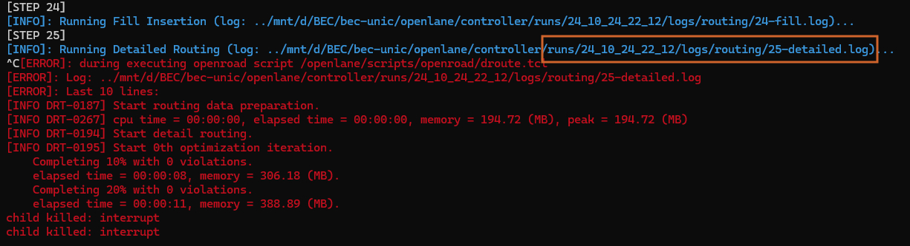
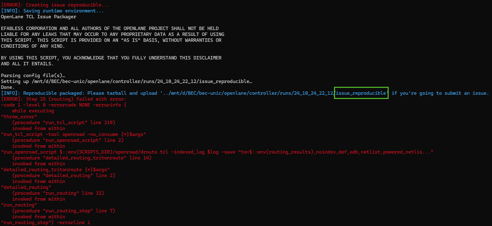
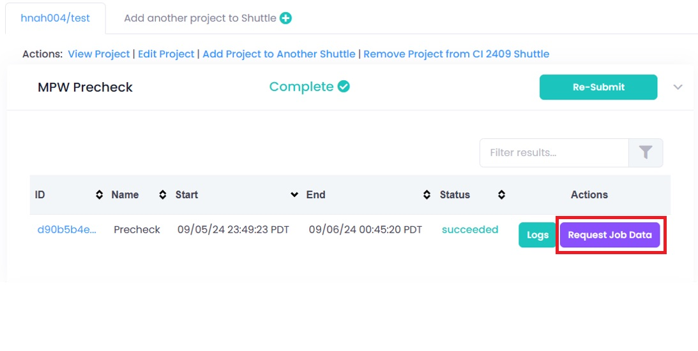
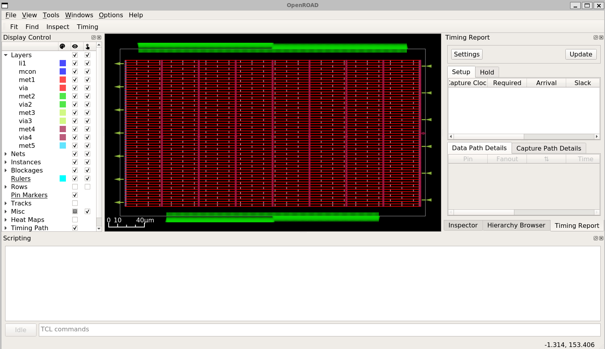

# 4.8 Debug your run

## Introduction

When you implement your design using the opensource tools. There is a high chance that you will get into the problem. At this moment, you will need to review the error, understand it and then propose a solution. 
This guide will try to show you a way to visualize the design, go to the spots that have problems and verify them.

## Handling Errors in OpenLane

When running OpenLane, any errors encountered during running the flow will appear in the log files stored within `runs` folder, tagged with the corresponding step. You can review these log files to identify the issues and debug before rerunning the process.



In case you are unsure how to debug the errors after reviewing these logs, an **`issue_reproducible` ** folder will always be generated. You can compress this folder and send it to the community to help you solve the errors. 



## Handling Errors in Efabless Platform

While submitting a project in the Efabless Platform, you may encounter errors during steps such as `Precheck Job` or `Tapeout Job`. If any issues arise during the above steps, click on `Request Job Data`. The job data, including logs and outputs files, will be sent to your email for further inspection and debugging. You can also share these files with the community to help you identify and solve the issue.



## Using OpenROAD GUI for Layout Inspection

The **OpenROAD GUI** can be used for inspecting and resolving errors during place-and-route in the digital flow. Use the following command to launch the GUI and examine your design for potential issues:

{: .shellcmd}
> ```shell
> docker run -it -u $(id -u $USER):$(id -g $USER) -v `pwd`:`pwd` \
>     -e DISPLAY=$DISPLAY -v /tmp/.X11-unix:/tmp/.X11-unix \
>     efabless/openlane:2023.07.19-1 sh -c "openroad"
> ```

Then run `read_db` command with the path to an OpenDB database file (`.odb` )  at the desired step. For example:

{: .shellcmd-title}
> Openroad Tcl Command
> ```tcl
> read_db runs/24_10_24_22_12/results/floorplan/controller.odb
> ```

After that, use this command to open the GUI feature:

{: .shellcmd-title}
> Openroad Tcl Command
> ```tcl
> gui::show
> ```

{: .cmdout}
> ```
> cass@unic-cass:/mnt/d/BEC/bec-unic$ docker run -it -u $(id -u $USER):$(id -g $USER) -v `pwd`:`pwd` -e DISPLAY=$DISPLAY -v /tmp/.X11-unix:/tmp/.X11-unix efabless/openlane:2023.07.19-1 sh -c "openroad"
> OpenROAD 41a51eaf4ca2171c92ff38afb91eb37bbd3f36da
> This program is licensed under the BSD-3 license. See the LICENSE file for details.
> Components of this program may be licensed under more restrictive licenses which must be honored.
> warning: `//.tclsh-history' is not writable.
> openroad> read_db /mnt/d/BEC/bec-unic/openlane/controller/runs/24_10_24_22_12/results/floorplan/controller.odb
> openroad> gui::show
> [WARNING GUI-0076] QStandardPaths: XDG_RUNTIME_DIR not set, defaulting to '/tmp/runtime-'
> ```

This is the Openroad GUI with the layout opened.



## References
1. Psychogenic Technologies, [" From top to Transistors: opensource Verilog to ASIC flow."](https://www.youtube.com/watch?v=Q99vxvszktI&t=935s) 
