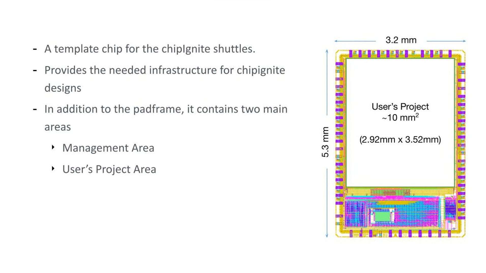
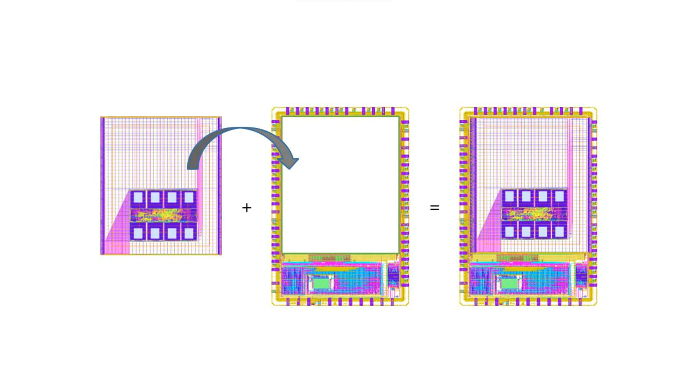
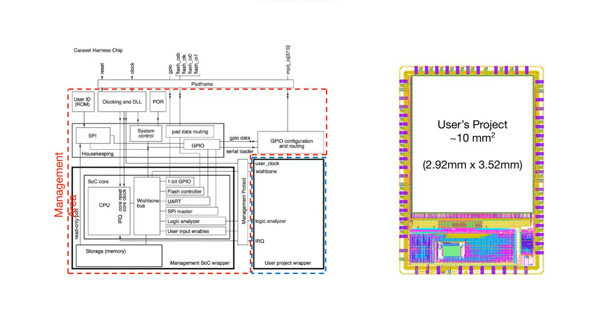
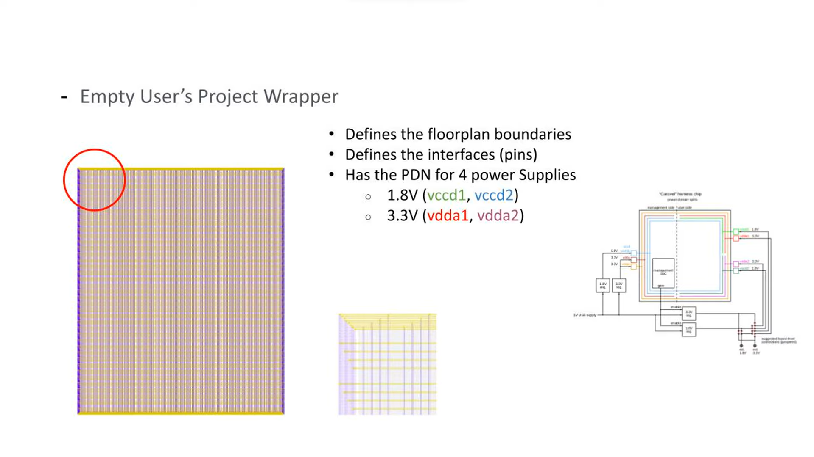
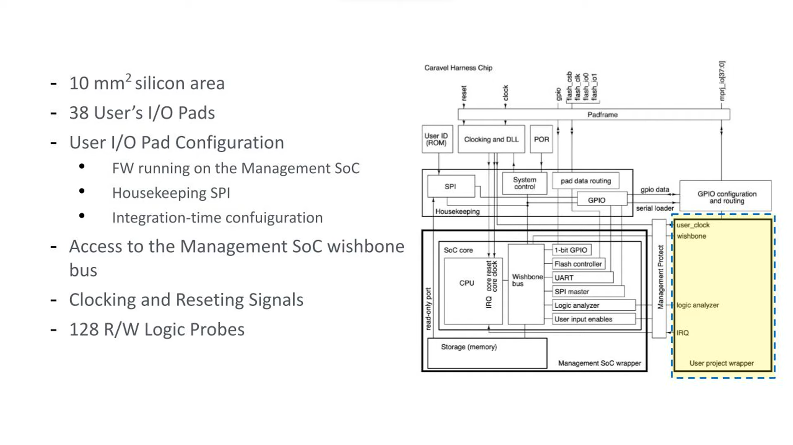

# 6.1 Caravel Overview

<iframe src="https://drive.google.com/file/d/17-GuiiVHizi6N59nA3YrrO0addBBZeG9/preview" width="854" height="480" allow="autoplay"></iframe>

<!-- ### Lecture notes
<iframe src="https://docs.google.com/document/d/e/2PACX-1vTFc8DixUTqewFt-WRKd8mIpLNoRuzmo-aX2EcC_tGknWvYYmOAgPjWoWNVeUoCmWb9q3fPfiZlHDHf/pub?embedded=true" width="854" height="480"></iframe> -->

We are going to introduce you to the pre-built SOC chip called caravel, why it is used and what are the different parts it consists of. Creating a chip from scratch is an  uneasy process and requires a lot of knowledge. Chip ignite is to simplify the process of creating a custom chip.

Users create their designs in the caravel chip. Caravel is an open source template for a system on chip or SoC which provides the needed infrastructure for designs using Chip Ignite. The caravel chip is based on the Skywater 130 nanometer open source PDK. There's a version of caravel called Caravan which provides bare IO pads for designs with high speed, high voltage or negative voltage signals. In this lesson, we're going to focus on the standard version of Caravel.

  

Caravel's architecture consists of a pad frame, a management area and a user's project area.

  

Users place their designs in the users area and use the management area in the pad frame to enable communication of their designs with the outer world.

  

Management Area implements a RISC-V based SOC that includes a number of peripherals like timers and GPIOs. The management area runs firmware that can be used to configure user project IO pads as well as observe and control user project signals through on-chip logic analyzer probes and finally control the user project power supply.

The users area which is also called user project wrapper has dimensions of 2.92x3.52 millimeters square which is approximately 10 millimeter square of silicon area. This is about two-thirds of the area of the whole chip.

  

It has access to four power supply domains as well as 38 IO pads which can be configured through firmware running on the management SOC. It also has 128 logic analyzer probes used to control and observe signals. It has a wishbone Port connection to the management SOC Wishbone bus.

If you would like to see how to implement a design using Caravel,  check out our lesson where we demonstrate how to implement a basic digital design from RTL through physical implementation and verification. The lessons show how to create a project from a template repository upload your design files and  submit your project for fabrication using the Chip Ignite shuttle.
