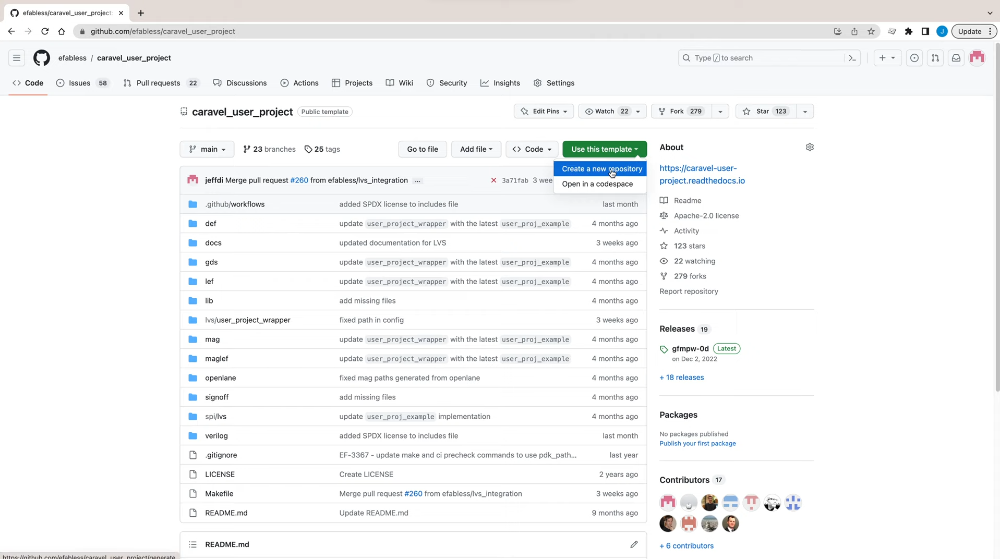
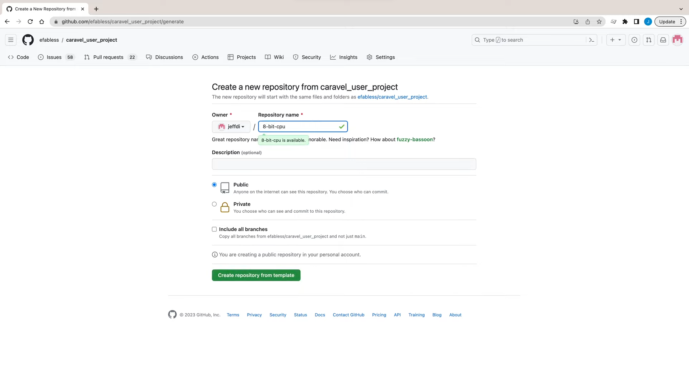

## 6.3 Creating a Repository
<iframe src="https://drive.google.com/file/d/171Q5LNPitT7PveJUau6QFMcWJugx_4c2/preview" width="854" height="480" allow="autoplay"></iframe>

<!-- ### Lecture notes
<iframe src="https://docs.google.com/document/d/e/2PACX-1vSRgmUZKbG7I4wJAsTb5H-UlNbehCVr8Vh3tIjW2nXT1c0NZ8sNe-khDl1v2MvhBFoVGxW5bK3Pmcrf/pub?embedded=true" width="854" height="480"></iframe> -->

Testing and sending your chip for manufacturing all depend on having a repository with the correct files in place. In this lesson, you'll learn how to use our caravel’s template to get started. It will take you around 5 minutes and you'll need a GitHub account. If you don't have an account already, go to [github.com](https://github.com) and sign up for a free account. Next go to the template repository. It's called the caravel user project.

You could use the template green button to create a new repository based on the template.

You'll need to fill in a name and an optional description. You should pick something that helps people know what your design is. So if you're working on an 8-bit CPU, you could call it an 8-bit CPU and click the create repository from the template button.

After a few seconds, you'll have your own repository ready to go to get the repository set up on your computer, check the next lesson, cloning and setup.
