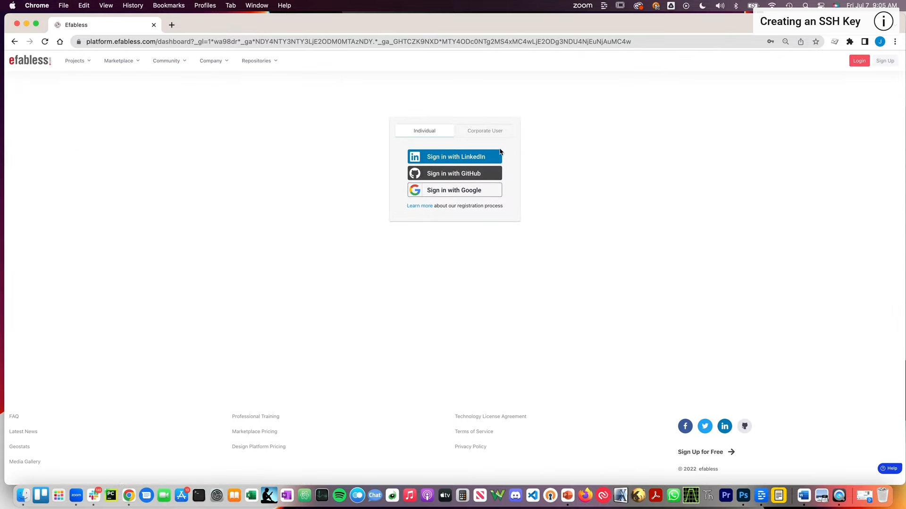
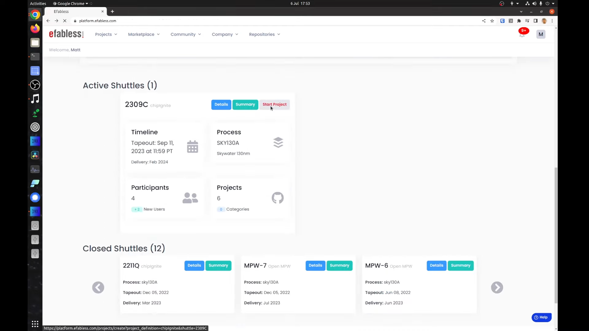
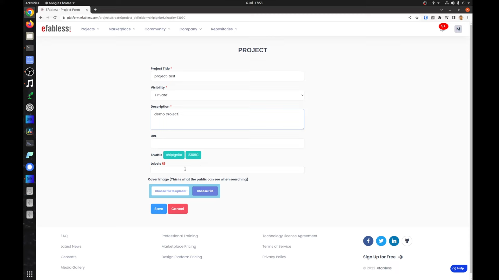
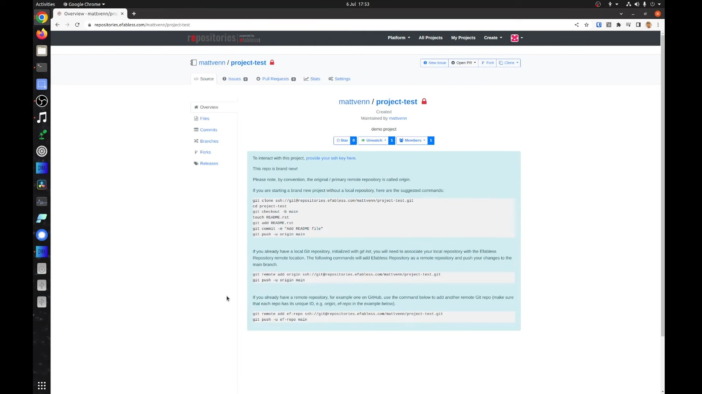

## 6.5 Uploading your Design
<iframe src="https://drive.google.com/file/d/1745-XJuXUlZSJ0nw2ibmYm6j7A1f_tOk/preview" width="854" height="480" allow="autoplay"></iframe>

<!-- ### Lecture notes
<iframe src="https://docs.google.com/document/d/e/2PACX-1vTXXsv_SnWqrDVHHzasrx5Zdwf1EvZ-5gbrAqJpCNgaUN4FPmojx8qtMIZgu_b_IddBR5dypoaOfOS9/pub?embedded=true" width="854" height="480"></iframe> -->

In this lesson, you will learn how to create a project on the Efabless platform and then upload your design.

You need to have created an SSH key to complete this step which is shown in another lesson. For authentication, you can use an existing GitHub, LinkedIn or Google account.



After logging in, scroll down the page and choose the shuttle you want to take part in. Click the start project button.



Set the name, visibility, description and any labels.



The URL field is optional and can be used to link to your projects page. You can also set up Public Image if you wish.
Then click the save button.

A new empty Efabless repository will be created for you.



If you followed the other lesson, then you will already have GitHub set as the remote origin. We will add a new remote called ef-repo and use it to push the repository to Efabless.

Open the terminal and change to your project's directory. Then copy the last command shown and paste them into the terminal.
```sh
git remote add ef-repo ssh://git@repositories.efabless.com/mattvenn/project-test.git
```
This will create the new remote and push your design there. 

In the future if you run a git push, only the GitHub remote will be updated. If you also want to update the Efabless remote you'll need to run:
```sh
git push ef-repo 
```
If you need help or support the best place to go is the open source silicon slack Community.