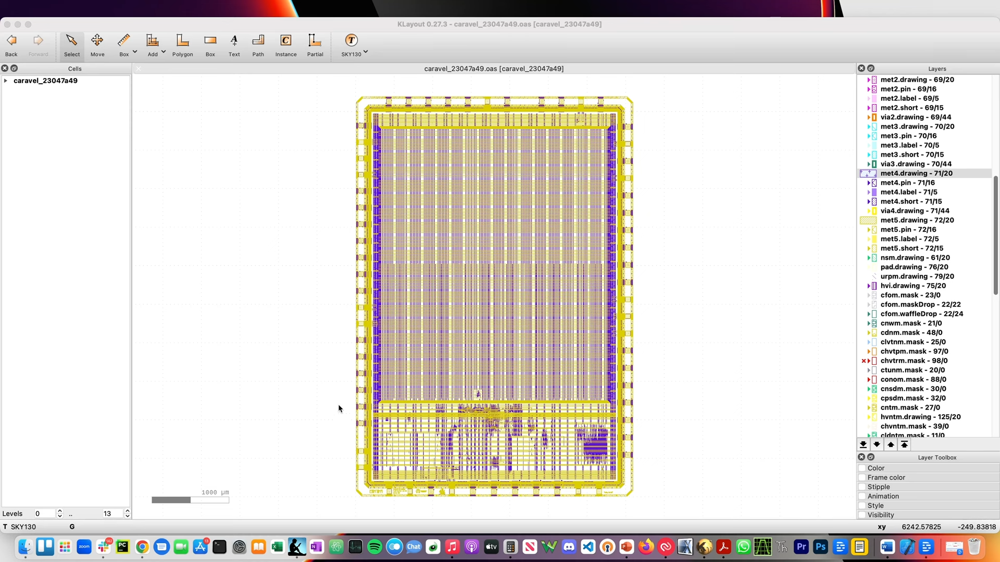
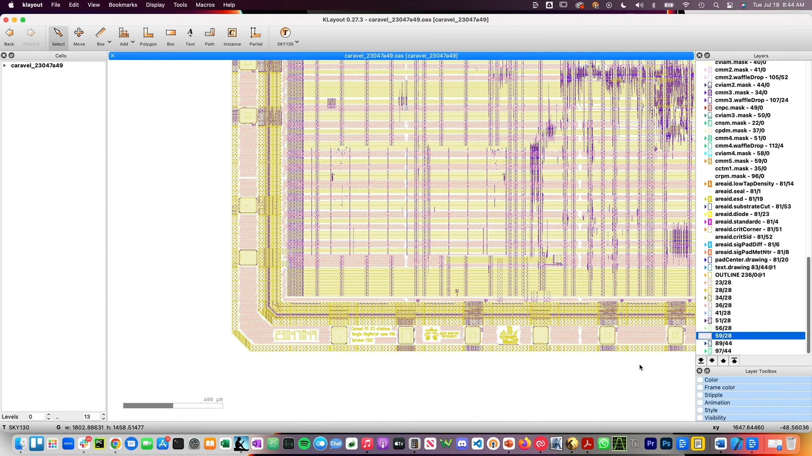
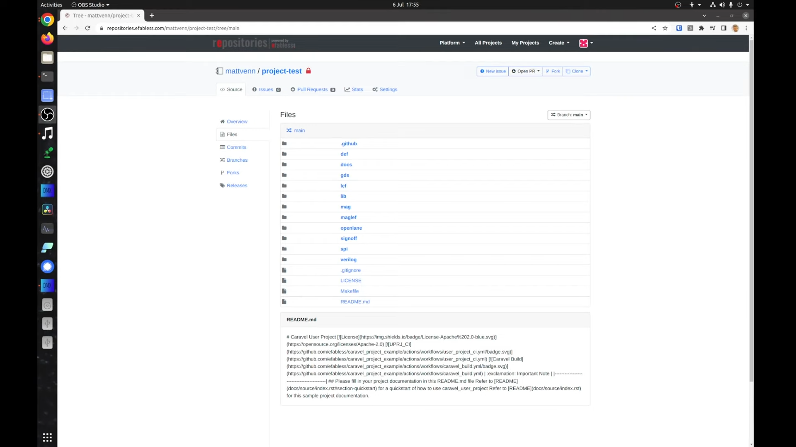
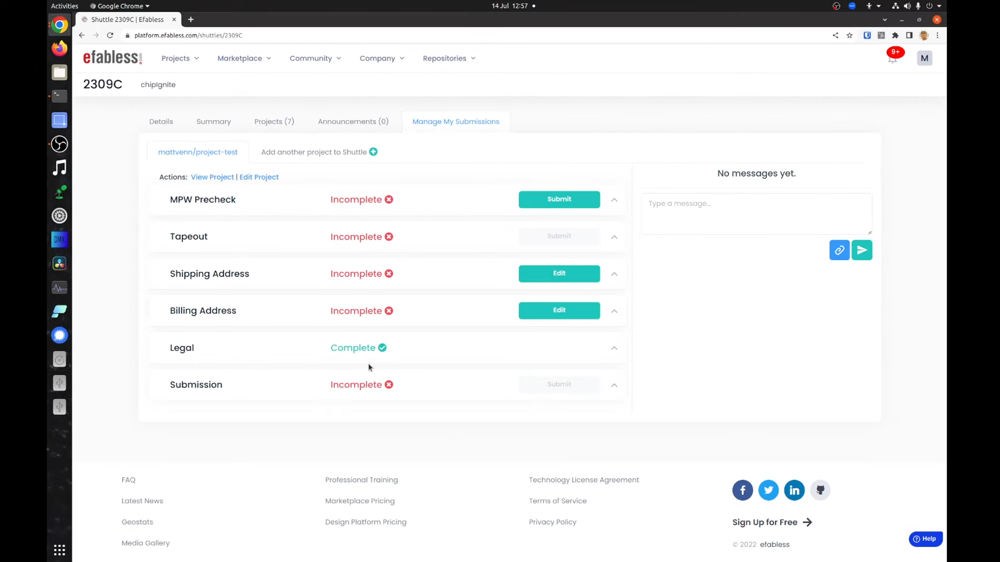
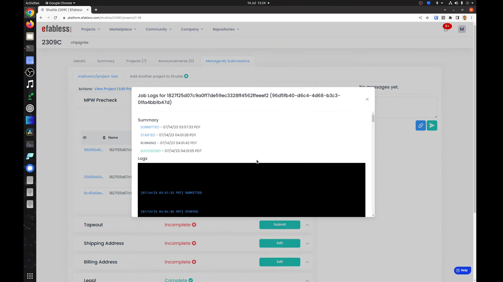
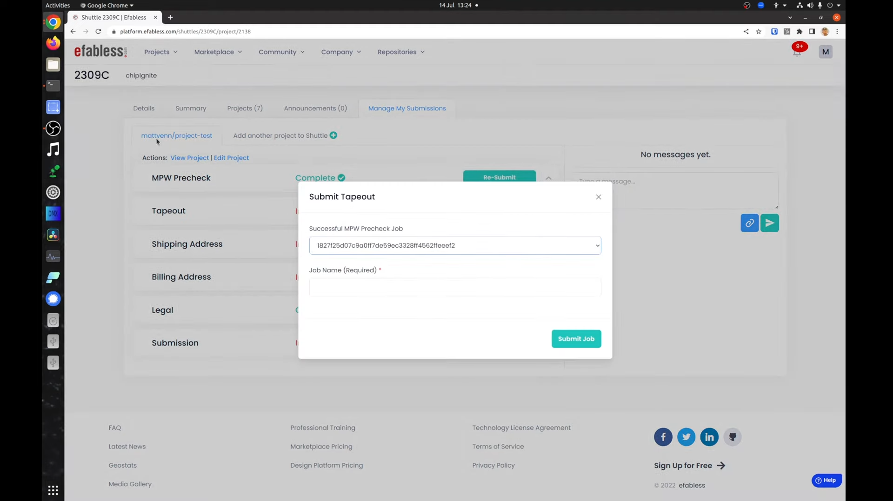
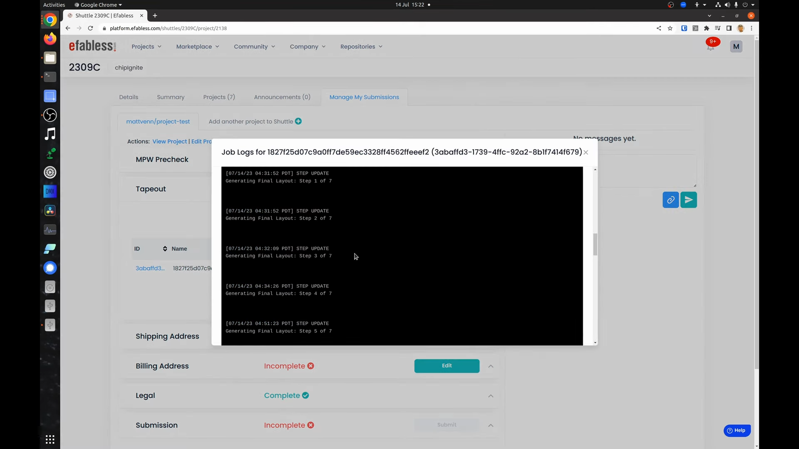

## 6.6 Submitting Precheck and Tapeout Jobs
<iframe src="https://drive.google.com/file/d/172O_DJxMndwpVwh0E2xp6wXXQGRM2Q8Q/preview" width="854" height="480" allow="autoplay"></iframe>

<!-- ### Lecture notes
<iframe src="https://docs.google.com/document/d/e/2PACX-1vRlTNfFuk7o1TnypnZvL8s78EsF9Y0b4LeSoEMvYcxrIultJEyoaj3JODnRdyZLYq3UMy_6LR75fKu9/pub?embedded=true" width="854" height="480"></iframe> -->

To be manufactured, your chip needs to pass a pre-check and a tapeout job. The pre-check tests things like licenses, documentation, DRC, ports and power connections. You can find a complete list of tests on the pre-check repository.



The tape out job runs some additional tests and also generates the metal fill. The metal fill is used to make sure that each layer of the design has a consistent density. This is important for the manufacturing process.



Pre-check takes about 10 minutes and tape out takes about two hours. We recommend running these jobs regularly as your design proceeds to make sure that you have plenty of time to resolve issues.

If your design is not yet uploaded onto the Efabless platform check the previous lesson on how to do this. Otherwise, make sure your repository is up to date before running the tests by running .
```sh
git push ef-repo
```
Go to your Efabless repository and check the last commit is what you expect. 



Navigate to your project then click manage my submission to submit your project. You need to have all these items green. 



The first job is the pre-check. Click the submit button. You will be asked for a name if you do not have a name in mind. Then it's a good idea to use the commit hash of your last commit; this will help you debug a problem if the pre-check starts failing in the future.

After about 10 minutes the job will finish and you can check the logs. click the little button to expand the jobs and you'll see all the previous jobs

Click the logs button to see the logs of the job this is where to check if you have problems you can ask for help on the pre-check channel on the open source silicon slack community.



Running the tape out is the same as the pre-check. You must first select a valid passing pre-check job to run it.



Select the previous good pre-check in the drop down and name the job again. We recommend using the git commit hash. The tape out job lasts about two hours.

note the commit ID used by the selected pre-check job is the same commit ID that the tape out job will use. If you update your design in the future you need to submit a new pre-check followed by a tape out job to pick up the change after the job is finished you can check the logs in the same way as the pre-check.



If you need help or support the best place to go is the open source silicon slack Community.
