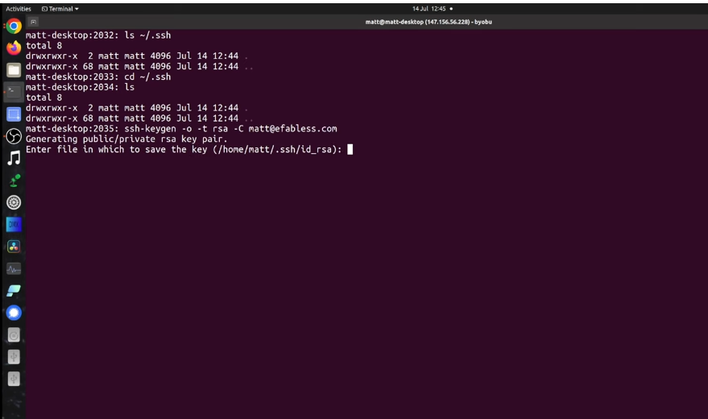
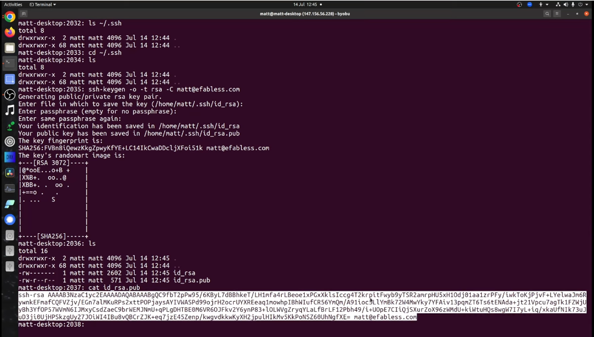
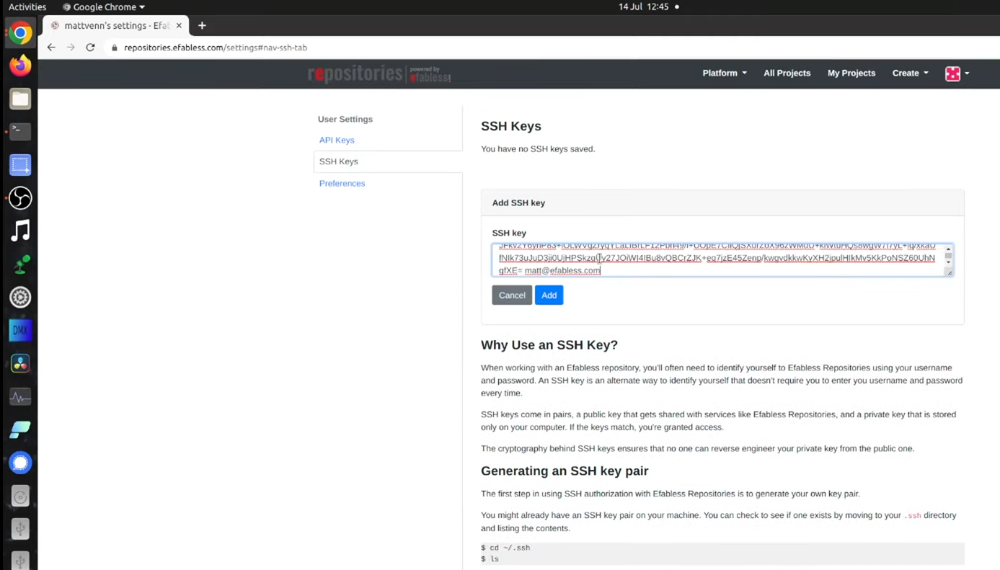

# 6.7 Creating an SSH Key
<iframe src="https://drive.google.com/file/d/174n87QewSuHTaNTm6d5SnzWUB1vxMFPN/preview" width="854" height="480" allow="autoplay"></iframe>

<!-- ### Lecture notes
<iframe src="https://docs.google.com/document/d/e/2PACX-1vTzGELkU6Z9jmi-Nb5JpPNWRDo4_7YfuYwzID4qZSGPXuu3b_LPhNLf3M5icoJzAtlVey5ThyI6TvXF/pub?embedded=true" width="854" height="480"></iframe> -->

Push your repository to the Efabless platform you need to create a local SSH key and then add it to your Efabless profile. This will take about five minutes to complete. We will follow the instructions given in the repository settings.

If you don't already have an SSH key, you can create one by following the instructions. Let's start by using SSH Keygen.

```sh
ssh-keygen -o -t RSA -c <your-email-address>
```



If you want to be extra secure you can use the password. You'll then need to enter this password every time you want to update your repository. In this lesson we'll skip the password by pressing enter twice.

We now have the SSH key. Let's take a look at it and copy the contents by highlighting everything and pressing `Ctrl + shift + C`.



Now scroll to the top of the page and press the add SSH key button. Paste in your key and press the add button. Your key has now been added to your profile.

