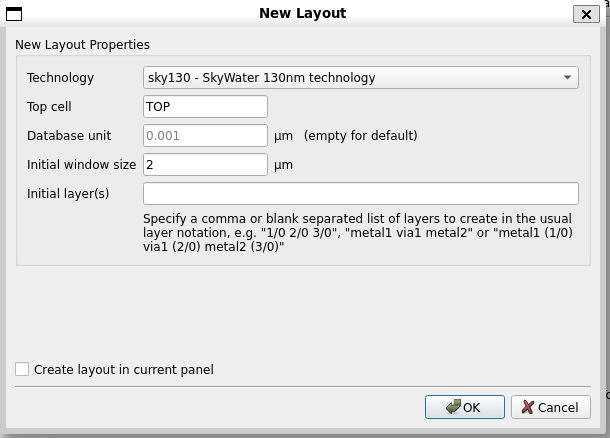

{: .no_toc }
# 3.3 Design layout using Klayout


{: .no_toc }

<details open markdown="block">
  <summary>
    Table of contents
  </summary>
  {: .text-delta }
- TOC
{:toc}
</details>

## Install the required software

##### 1. Download and install klayout with the required packages

{: .shellcmd}
> ``` bash
> wget https://www.klayout.org/downloads/Ubuntu-22/klayout_0.29.4-1_amd64.deb
> sudo apt-get install libqt5designer5 libqt5multimedia5 libqt5opengl5 libqt5multimediawidgets5 \
>     libqt5printsupport5 libqt5sql5 libqt5sql5 libqt5xmlpatterns5 libruby3.0 libgit2-1.1
> sudo dpkg -i klayout_0.29.4-1_amd64.deb
> ```

{: .cmdout}
> ```text
> cass@UNIC:~/gcd_example$ wget https://www.klayout.org/downloads/Ubuntu-22/klayout_0.29.4-1_amd64.deb
> --2024-07-23 22:00:11--  https://www.klayout.org/downloads/Ubuntu-22/klayout_0.29.4-1_amd64.deb
> Resolving www.klayout.org (www.klayout.org)... 178.77.102.107
> Connecting to www.klayout.org (www.klayout.org)|178.77.102.107|:443... connected.
> HTTP request sent, awaiting response... 200 OK
> Length: 62539776 (60M) [application/x-debian-package]
> Saving to: ‘klayout_0.29.4-1_amd64.deb’
> 
> klayout_0.29.4-1_amd64.deb                             100%[==========================================>]  59.64M  8.90MB/s    in 7.4s    
> 
> 2024-07-23 22:00:18 (8.07 MB/s) - ‘klayout_0.29.4-1_amd64.deb’ saved [62539776/62539776]
> 
> cass@UNIC:~/gcd_example$ sudo apt-get install libqt5designer5 libqt5multimedia5 libqt5opengl5 libqt5multimediawidgets5 \
>     libqt5printsupport5 libqt5sql5 libqt5sql5 libqt5xmlpatterns5 libruby3.0 libgit2-1.1
> [sudo] password for cass:
> Reading package lists... Done
> Building dependency tree... Done
> Reading state information... Done
> The following additional packages will be installed:
>   fonts-lato libdouble-conversion3 libice6 libinput-bin libinput10 libmd4c0 libmtdev1 libpcre2-16-0 libqt5core5a libqt5dbus5 libqt5gui5 libqt5network5 libqt5sql5-sqlite libqt5svg5 libqt5widgets5 libqt5xml5 libsm6      
>   libwacom-bin libwacom-common libwacom9 libxcb-icccm4 libxcb-image0 libxcb-keysyms1 libxcb-render-util0 libxcb-shape0 libxcb-util1 libxcb-xinerama0 libxcb-xinput0 libxcb-xkb1 libxkbcommon-x11-0 qt5-gtk-platformtheme  
>   qttranslations5-l10n rake ruby ruby-net-telnet ruby-rubygems ruby-webrick ruby-xmlrpc ruby3.0 rubygems-integration unzip zip
> Suggested packages:
>   qt5-image-formats-plugins qtwayland5 ri ruby-dev bundler
> The following NEW packages will be installed:
>   fonts-lato libdouble-conversion3 libice6 libinput-bin libinput10 libmd4c0 libmtdev1 libpcre2-16-0 libqt5core5a libqt5dbus5 libqt5designer5 libqt5gui5 libqt5multimedia5 libqt5multimediawidgets5 libqt5network5
>   libqt5opengl5 libqt5printsupport5 libqt5sql5 libqt5sql5-sqlite libqt5svg5 libqt5widgets5 libqt5xml5 libqt5xmlpatterns5 libruby3.0 libsm6 libwacom-bin libwacom-common libwacom9 libxcb-icccm4 libxcb-image0
>   libxcb-keysyms1 libxcb-render-util0 libxcb-shape0 libxcb-util1 libxcb-xinerama0 libxcb-xinput0 libxcb-xkb1 libxkbcommon-x11-0 qt5-gtk-platformtheme qttranslations5-l10n rake ruby ruby-net-telnet ruby-rubygems        
>   ruby-webrick ruby-xmlrpc ruby3.0 rubygems-integration unzip zip
> 0 upgraded, 50 newly installed, 0 to remove and 2 not upgraded.
> Need to get 25.6 MB of archives.
> After this operation, 101 MB of additional disk space will be used.
> Do you want to continue? [Y/n] y
> Get:1 http://archive.ubuntu.com/ubuntu jammy/main amd64 fonts-lato all 2.0-2.1 [2696 kB]
> ...
> Get:50 http://archive.ubuntu.com/ubuntu jammy/main amd64 zip amd64 3.0-12build2 [176 kB]
> Fetched 25.6 MB in 6s (4442 kB/s)
> Extracting templates from packages: 100%
> Selecting previously unselected package fonts-lato.
> (Reading database ... 51612 files and directories currently installed.)
> Preparing to unpack .../00-fonts-lato_2.0-2.1_all.deb ...
> Unpacking fonts-lato (2.0-2.1) ...
> Selecting previously unselected package libdouble-conversion3:amd64.
> ...
> Preparing to unpack .../49-zip_3.0-12build2_amd64.deb ...
> Unpacking zip (3.0-12build2) ...
> Setting up libice6:amd64 (2:1.0.10-1build2) ...
> Setting up libdouble-conversion3:amd64 (3.1.7-4) ...
> ...
> Setting up ruby-rubygems (3.3.5-2) ...
> Processing triggers for man-db (2.10.2-1) ...
> Processing triggers for udev (249.11-0ubuntu3.12) ...
> Processing triggers for fontconfig (2.13.1-4.2ubuntu5) ...
> Processing triggers for libc-bin (2.35-0ubuntu3.8) ...
> cass@UNIC:~/gcd_example$ sudo dpkg -i klayout_0.29.4-1_amd64.deb
> (Reading database ... 56045 files and directories currently installed.)
> Preparing to unpack klayout_0.29.4-1_amd64.deb ...
> Unpacking klayout (0.29.4-1) over (0.29.4-1) ...
> Setting up klayout (0.29.4-1) ...
> cass@UNIC:~/gcd_example$ klayout openlane/gcd/runs/RUN_*/results/signoff/gcd.gds -nn $PDK_ROOT/$PDK/libs.tech/klayout/tech/$PDK.lyt -l $PDK_ROOT/$PDK/libs.tech/klayout/tech/$PDK.lyp
> ```

##### 2. Install gdsfactory for the PDK

For OpenPDKs version 2024.08.17 installed with Volare, you can install the lastest version of `pydantic` and `gdsfactory 8.7.3` for Klayout:

{: .shellcmd}
> ```bash
> pip3 install gdsfactory==8.7.3
> ```

{: .cmdout}
> ```
> cass@unic-cass:~$ pip3 install gdsfactory
> Requirement already satisfied: gdsfactory in /home/cass/.local/lib/python3.10/site-packages (6.33.0)
> Requirement already satisfied: click in /home/cass/.local/lib/python3.10/site-packages (from gdsfactory) (8.1.7)
> Requirement already satisfied: flatdict in /home/cass/.local/lib/python3.10/site-packages (from gdsfactory) (4.0.1)
> Requirement already satisfied: gdstk in /home/cass/.local/lib/python3.10/site-packages (from gdsfactory) (0.9.53)
> Requirement already satisfied: loguru in /home/cass/.local/lib/python3.10/site-packages (from gdsfactory) (0.7.2)
> Requirement already satisfied: matplotlib in /home/cass/.local/lib/python3.10/site-packages (from gdsfactory) (3.9.1)
> Requirement already satisfied: numpy in /home/cass/.local/lib/python3.10/site-packages (from gdsfactory) (1.26.4)
> Requirement already satisfied: omegaconf in /home/cass/.local/lib/python3.10/site-packages (from gdsfactory) (2.3.0)
> Requirement already satisfied: orjson in /home/cass/.local/lib/python3.10/site-packages (from gdsfactory) (3.10.6)
> Requirement already satisfied: pandas in /home/cass/.local/lib/python3.10/site-packages (from gdsfactory) (2.2.2)
> Requirement already satisfied: pydantic in /home/cass/.local/lib/python3.10/site-packages (from gdsfactory) (1.10.0)
> Requirement already satisfied: pyyaml in /home/cass/eda/unic-cass/lib/python3.10/site-packages (from gdsfactory) (6.0.1)
> Requirement already satisfied: qrcode in /home/cass/.local/lib/python3.10/site-packages (from gdsfactory) (7.4.2)
> Requirement already satisfied: rectpack in /home/cass/.local/lib/python3.10/site-packages (from gdsfactory) (0.2.2)
> Requirement already satisfied: scipy in /home/cass/.local/lib/python3.10/site-packages (from gdsfactory) (1.14.0)
> Requirement already satisfied: shapely in /home/cass/.local/lib/python3.10/site-packages (from gdsfactory) (2.0.5)
> Requirement already satisfied: toolz in /home/cass/.local/lib/python3.10/site-packages (from gdsfactory) (0.12.1)
> Requirement already satisfied: tqdm in /home/cass/.local/lib/python3.10/site-packages (from gdsfactory) (4.66.5)
> Requirement already satisfied: types-PyYAML in /home/cass/.local/lib/python3.10/site-packages (from gdsfactory) (6.0.12.20240724)
> Requirement already satisfied: typing_extensions in /home/cass/.local/lib/python3.10/site-packages (from gdsfactory) (4.12.2)
> Requirement already satisfied: watchdog in /home/cass/.local/lib/python3.10/site-packages (from gdsfactory) (4.0.1)
> Requirement already satisfied: oldest-supported-numpy in /home/cass/.local/lib/python3.10/site-packages (from gdstk->gdsfactory) (0.9)
> Requirement already satisfied: contourpy>=1.0.1 in /home/cass/.local/lib/python3.10/site-packages (from matplotlib->gdsfactory) (1.2.1)
> Requirement already satisfied: cycler>=0.10 in /home/cass/.local/lib/python3.10/site-packages (from matplotlib->gdsfactory) (0.12.1)
> Requirement already satisfied: fonttools>=4.22.0 in /home/cass/.local/lib/python3.10/site-packages (from matplotlib->gdsfactory) (4.53.1)
> Requirement already satisfied: kiwisolver>=1.3.1 in /home/cass/.local/lib/python3.10/site-packages (from matplotlib->gdsfactory) (1.4.5)
> Requirement already satisfied: packaging>=20.0 in /home/cass/.local/lib/python3.10/site-packages (from matplotlib->gdsfactory) (24.1)
> Requirement already satisfied: pillow>=8 in /home/cass/.local/lib/python3.10/site-packages (from matplotlib->gdsfactory) (10.4.0)
> Requirement already satisfied: pyparsing>=2.3.1 in /home/cass/eda/unic-cass/lib/python3.10/site-packages (from matplotlib->gdsfactory) (3.1.2)
> Requirement already satisfied: python-dateutil>=2.7 in /home/cass/.local/lib/python3.10/site-packages (from matplotlib->gdsfactory) (2.9.0.post0)
> Requirement already satisfied: antlr4-python3-runtime==4.9.* in /home/cass/.local/lib/python3.10/site-packages (from omegaconf->gdsfactory) (4.9.3)
> Requirement already satisfied: pytz>=2020.1 in /home/cass/.local/lib/python3.10/site-packages (from pandas->gdsfactory) (2024.1)
> Requirement already satisfied: tzdata>=2022.7 in /home/cass/.local/lib/python3.10/site-packages (from pandas->gdsfactory) (2024.1)
> Requirement already satisfied: pypng in /home/cass/.local/lib/python3.10/site-packages (from qrcode->gdsfactory) (0.20220715.0)
> Requirement already satisfied: six>=1.5 in /home/cass/eda/unic-cass/lib/python3.10/site-packages (from python-dateutil>=2.7->matplotlib->gdsfactory) (1.16.0)
> ```

{: .note-title}
> For Open PDKs with version smaller than 2024.08.17
> 
> By default, the open PDK installation already contains the tech files for Klayout. However, they are designed with a previous version of gdsfactory and pydantic. Therefore, it is neccessary to install the old version of gdsfactory and pydantic so that the pdk can be used with the PDK.
> 
> {: .shellcmd}
> > ```bash
> > pip3 install pydantic==1.10 gdsfactory==6.33.0
> > ```
> 
> {: .cmdout}
> > ```text
> > cass@unic-cass:~$ pip3 install pydantic==1.10 gdsfactory==6.33.0
> > Defaulting to user installation because normal site-packages is not writeable
> > Collecting pydantic==1.10
> >   Downloading pydantic-1.10.0-cp310-cp310-manylinux_2_17_x86_64.manylinux2014_x86_64.whl (12.7 MB)
> >      ━━━━━━━━━━━━━━━━━━━━━━━━━━━━━━━━━━━━━━━━ 12.7/12.7 MB 19.3 MB/s eta 0:00:00
> > Collecting gdsfactory==6.33.0
> >   Downloading gdsfactory-6.33.0-py3-none-any.whl (1.0 MB)
> >      ━━━━━━━━━━━━━━━━━━━━━━━━━━━━━━━━━━━━━━━━ 1.0/1.0 MB 21.4 MB/s eta 0:00:00
> > Requirement already satisfied: typing-extensions>=4.1.0 in ./.local/lib/python3.10/site-packages (from pydantic==1.10) (4.12.2)
> > Requirement already satisfied: shapely in ./.local/lib/python3.10/site-packages (from gdsfactory==6.33.0) (2.0.5)
> > Collecting tqdm
> >   Downloading tqdm-4.66.5-py3-none-any.whl (78 kB)
> >      ━━━━━━━━━━━━━━━━━━━━━━━━━━━━━━━━━━━━━━━━ 78.4/78.4 KB 16.4 MB/s eta 0:00:00
> > Requirement already satisfied: numpy in ./.local/lib/python3.10/site-packages (from gdsfactory==6.33.0) (1.26.4)
> > Requirement already satisfied: orjson in ./.local/lib/python3.10/site-packages (from gdsfactory==6.33.0) (3.10.6)
> > Requirement already satisfied: matplotlib in ./.local/lib/python3.10/site-packages (from gdsfactory==6.33.0) (3.9.1)
> > Requirement already satisfied: types-PyYAML in ./.local/lib/python3.10/site-packages (from gdsfactory==6.33.0) (6.0.12.20240724)
> > Requirement already satisfied: watchdog in ./.local/lib/python3.10/site-packages (from gdsfactory==6.33.0) (4.0.1)
> > Requirement already satisfied: scipy in ./.local/lib/python3.10/site-packages (from gdsfactory==6.33.0) (1.14.0)
> > Requirement already satisfied: toolz in ./.local/lib/python3.10/site-packages (from gdsfactory==6.33.0) (0.12.1)
> > Requirement already satisfied: click in ./.local/lib/python3.10/site-packages (from gdsfactory==6.33.0) (8.1.7)
> > Requirement already satisfied: pandas in ./.local/lib/python3.10/site-packages (from gdsfactory==6.33.0) (2.2.2)
> > Requirement already satisfied: pyyaml in /usr/lib/python3/dist-packages (from gdsfactory==6.33.0) (5.4.1)
> > Collecting omegaconf
> >   Downloading omegaconf-2.3.0-py3-none-any.whl (79 kB)
> >      ━━━━━━━━━━━━━━━━━━━━━━━━━━━━━━━━━━━━━━━━ 79.5/79.5 KB 12.9 MB/s eta 0:00:00
> > Collecting flatdict
> >   Downloading flatdict-4.0.1.tar.gz (8.3 kB)
> >   Preparing metadata (setup.py) ... done
> > Requirement already satisfied: loguru in ./.local/lib/python3.10/site-packages (from gdsfactory==6.33.0) (0.7.2)
> > Requirement already satisfied: rectpack in ./.local/lib/python3.10/site-packages (from gdsfactory==6.33.0) (0.2.2)
> > Collecting gdstk
> >   Downloading gdstk-0.9.53-cp310-cp310-manylinux_2_28_x86_64.whl (533 kB)
> >      ━━━━━━━━━━━━━━━━━━━━━━━━━━━━━━━━━━━━━━━━ 533.9/533.9 KB 24.6 MB/s eta 0:00:00
> > Requirement already satisfied: qrcode in ./.local/lib/python3.10/site-packages (from gdsfactory==6.33.0) (7.4.2)
> > Collecting oldest-supported-numpy
> >   Downloading oldest_supported_numpy-2023.12.21-py3-none-any.whl (4.9 kB)
> > Requirement already satisfied: cycler>=0.10 in ./.local/lib/python3.10/site-packages (from matplotlib->gdsfactory==6.33.0) (0.12.1)
> > Requirement already satisfied: packaging>=20.0 in ./.local/lib/python3.10/site-packages (from matplotlib->gdsfactory==6.33.0) (24.1)
> > Requirement already satisfied: python-dateutil>=2.7 in ./.local/lib/python3.10/site-packages (from matplotlib->gdsfactory==6.33.0) (2.9.0.post0)
> > Requirement already satisfied: kiwisolver>=1.3.1 in ./.local/lib/python3.10/site-packages (from matplotlib->gdsfactory==6.33.0) (1.4.5)
> > Requirement already satisfied: contourpy>=1.0.1 in ./.local/lib/python3.10/site-packages (from matplotlib->gdsfactory==6.33.0) (1.2.1)
> > Requirement already satisfied: pillow>=8 in ./.local/lib/python3.10/site-packages (from matplotlib->gdsfactory==6.33.0) (10.4.0)
> > Requirement already satisfied: fonttools>=4.22.0 in ./.local/lib/python3.10/site-packages (from matplotlib->gdsfactory==6.33.0) (4.53.1)
> > Requirement already satisfied: pyparsing>=2.3.1 in /usr/lib/python3/dist-packages (from matplotlib->gdsfactory==6.33.0) (2.4.7)
> > Collecting antlr4-python3-runtime==4.9.*
> >   Downloading antlr4-python3-runtime-4.9.3.tar.gz (117 kB)
> >      ━━━━━━━━━━━━━━━━━━━━━━━━━━━━━━━━━━━━━━━━ 117.0/117.0 KB 18.6 MB/s eta 0:00:00
> >   Preparing metadata (setup.py) ... done
> > Requirement already satisfied: tzdata>=2022.7 in ./.local/lib/python3.10/site-packages (from pandas->gdsfactory==6.33.0) (2024.1)
> > Requirement already satisfied: pytz>=2020.1 in ./.local/lib/python3.10/site-packages (from pandas->gdsfactory==6.33.0) (2024.1)
> > Requirement already satisfied: pypng in ./.local/lib/python3.10/site-packages (from qrcode->gdsfactory==6.33.0) (0.20220715.0)
> > Requirement already satisfied: six>=1.5 in /usr/lib/python3/dist-packages (from python-dateutil>=2.7->matplotlib->gdsfactory==6.33.0) (1.16.0)
> > Collecting oldest-supported-numpy
> >   Downloading oldest_supported_numpy-2023.12.12-py3-none-any.whl (4.9 kB)
> >   Downloading oldest_supported_numpy-2023.10.25-py3-none-any.whl (4.9 kB)
> >   Downloading oldest_supported_numpy-2023.8.3-py3-none-any.whl (4.8 kB)
> >   Downloading oldest_supported_numpy-2022.11.19-py3-none-any.whl (4.9 kB)
> >   Downloading oldest_supported_numpy-2022.8.16-py3-none-any.whl (3.9 kB)
> >   Downloading oldest_supported_numpy-2022.5.28-py3-none-any.whl (3.9 kB)
> >   Downloading oldest_supported_numpy-2022.5.27-py3-none-any.whl (3.9 kB)
> >   Downloading oldest_supported_numpy-2022.4.18-py3-none-any.whl (3.9 kB)
> >   Downloading oldest_supported_numpy-2022.4.10-py3-none-any.whl (3.9 kB)
> >   Downloading oldest_supported_numpy-2022.4.8-py3-none-any.whl (3.9 kB)
> >   Downloading oldest_supported_numpy-2022.3.27-py3-none-any.whl (3.9 kB)
> >   Downloading oldest_supported_numpy-2022.1.30-py3-none-any.whl (3.9 kB)
> >   Downloading oldest_supported_numpy-0.15-py3-none-any.whl (3.8 kB)
> >   Downloading oldest_supported_numpy-0.14-py3-none-any.whl (3.8 kB)
> >   Downloading oldest_supported_numpy-0.13-py3-none-any.whl (3.8 kB)
> >   Downloading oldest_supported_numpy-0.12-py3-none-any.whl (3.8 kB)
> >   Downloading oldest_supported_numpy-0.11-py3-none-any.whl (3.8 kB)
> >   Downloading oldest_supported_numpy-0.10-py3-none-any.whl (3.8 kB)
> >   Downloading oldest_supported_numpy-0.9-py3-none-any.whl (3.8 kB)
> > Building wheels for collected packages: flatdict, antlr4-python3-runtime
> >   Building wheel for flatdict (setup.py) ... done
> >   Created wheel for flatdict: filename=flatdict-4.0.1-py3-none-any.whl size=6946 sha256=843df00b489163c7b06e16af1cd2cfb2c6bebaaf7a7a6b706e383eedeced2db6
> >   Stored in directory: /home/cass/.cache/pip/wheels/71/12/62/88c5bf37619c2d7481eedb8abd0dde6674e88dce45a7805a6f
> >   Building wheel for antlr4-python3-runtime (setup.py) ... done
> >   Created wheel for antlr4-python3-runtime: filename=antlr4_python3_runtime-4.9.3-py3-none-any.whl size=144575 sha256=6ccc789f243c1feb08ae8444af9846b70d86b5c4c4f05f553422e33b87312ab5
> >   Stored in directory: /home/cass/.cache/pip/wheels/12/93/dd/1f6a127edc45659556564c5730f6d4e300888f4bca2d4c5a88
> > Successfully built flatdict antlr4-python3-runtime
> > Installing collected packages: flatdict, antlr4-python3-runtime, tqdm, pydantic, omegaconf, oldest-supported-numpy, gdstk, gdsfactory
> >   Attempting uninstall: pydantic
> >     Found existing installation: pydantic 2.8.2
> >     Uninstalling pydantic-2.8.2:
> >       Successfully uninstalled pydantic-2.8.2
> >   Attempting uninstall: gdsfactory
> >     Found existing installation: gdsfactory 8.6.2
> >     Uninstalling gdsfactory-8.6.2:
> >       Successfully uninstalled gdsfactory-8.6.2
> > ERROR: pip's dependency resolver does not currently take into account all the packages that are installed. This behaviour is the source of the following dependency conflicts.
> > pydantic-settings 2.4.0 requires pydantic>=2.7.0, but you have pydantic 1.10.0 which is incompatible.
> > pydantic-extra-types 2.9.0 requires pydantic>=2.5.2, but you have pydantic 1.10.0 which is incompatible.
> > kfactory 0.18.4 requires pydantic<3,>=2.0.2, but you have pydantic 1.10.0 which is incompatible.
> > Successfully installed antlr4-python3-runtime-4.9.3 flatdict-4.0.1 gdsfactory-6.33.0 gdstk-0.9.53 oldest-supported-numpy-0.9 omegaconf-2.3.0 pydantic-1.10.0 tqdm-4.66.5
> > ```

## Fixing Skywater 130nm to run with `Klayout`

The current version of OpenPDK for Sky130A has a bug in the configuration file when it is used with `Klayout`. Thefore, you have to run the following command to tweak the tech files for `Klayout`:

{: .shellcmd}
> ```bash
> sed -i -e 's/sky130/sky130A/' $PDK_ROOT/$PDK/libs.tech/klayout/tech/sky130A.lyt
> ```

This command will replace the string `sky130` into the string `sky130A` in `libs.tech/klayout/tech/sky130A.lyt`

{: .note-title}

{: .shellcmd}
> ```bash
> sed -i -e '/<?xml/d' $PDK_ROOT/$PDK/libs.tech/klayout/pymacros/sky130.lym
> ```
This command will delete this line `<?xml version="1.0" encoding="utf-8"?>` in `libs.tech/klayout/pymacros/sky130.lym`


After that you can run `Klayout` without any problem.

### The problem explained

When you first run `Klayout` without the above fixes, you will have this message. The XML Parser complain about an invalid name in line 17.

{: .shellcmd}
> ```bash
> KLAYOUT_HOME=$PDK_ROOT/$PDK/libs.tech/klayout klayout -e
> ```

{: .cmdout}
> ```
> cass@unic-cass:~$ KLAYOUT_HOME=$PDK_ROOT/$PDK/libs.tech/klayout klayout -e
> ERROR: Reading /home/cass/unic-cass/pdks/sky130A/libs.tech/klayout/pymacros/sky130.lym: XML parser error: invalid name for processing instruction in line 17, column 6
> ERROR: Reading /home/cass/unic-cass/pdks/sky130A/libs.tech/klayout/pymacros/sky130.lym: XML parser error: invalid name for processing instruction in line 17, column 6
> ERROR: Reading /home/cass/unic-cass/pdks/sky130A/libs.tech/klayout/pymacros/sky130.lym: XML parser error: invalid name for processing instruction in line 17, column 6
> ```

We delete line 17 by using the following command:

{: .shellcmd}
> ```bash
> sed -i -e '/<?xml/d' $PDK_ROOT/$PDK/libs.tech/klayout/pymacros/sky130.lym 
> ```

Now run `Klayout` again in edit mode with the Skywater 130 PDK using this command:

{: .shellcmd}
> ```
> KLAYOUT_HOME=$PDK_ROOT/$PDK/libs.tech/klayout klayout -e
> ```

This time, the `Klayout` can run; however, when you create the layout with sky130 technology by selecting `File >> New Layout`. A new diaglog will open. In `New Layout` dialog, you select "sky130 - SkyWater 130nm technology" then press OK. 



A new error will appear in the terminal as followings:

{: .cmdout}
> ```text
> cass@unic-cass:~$ KLAYOUT_HOME=$PDK_ROOT/$PDK/libs.tech/klayout klayout -e
> 2024-08-13 12:06:27.171 | INFO     | gdsfactory.config:<module>:51 - Load '/home/cass/.local/lib/python3.10/site-packages/gdsfactory' 6.33.0
> 2024-08-13 12:06:27.251 | INFO     | gdsfactory.technology.layer_views:__init__:779 - Importing LayerViews from KLayout layer properties file: /home/cass/.local/lib/python3.10/site-packages/gdsfactory/generic_tech/klayout/tech/layers.lyp.
> ## Skywaters 130nm PDK loaded.
> ['/home/cass/unic-cass/pdks/sky130A/libs.tech/klayout/pymacros', '/usr/lib/klayout/pymod', '/usr/lib/python310.zip', '/usr/lib/python3.10', '/usr/lib/python3.10/lib-dynload', '/home/cass/.local/lib/python3.10/site-packages', '/usr/local/lib/python3.10/dist-packages', '/usr/lib/python3/dist-packages', '/usr/lib/python3.10/dist-packages', '/home/cass/unic-cass/pdks/volare/sky130/versions/6d4d11780c40b20ee63cc98e645307a9bf2b2ab8/sky130A/libs.tech/klayout/python']
> Warning: Initialization of layers failed: Unable to open file: /home/cass/unic-cass/pdks/volare/sky130/versions/6d4d11780c40b20ee63cc98e645307a9bf2b2ab8/sky130A/libs.tech/klayout/tech//sky130.lyp (errno=2)
> ```

Klayout is searching for `sky130.lyp` but it cannot find it. The technology configuration file in `Klayout` is `libs.tech/klayout/tech/sky130A.lyt`. Take a look at the contents of this file:

```xml
<?xml version="1.0" encoding="utf-8"?>
<technology>
 <name>sky130</name>
 <description>SkyWater 130nm technology</description>
 <group/>
 <dbu>0.001</dbu>
 <default-grids/>
 <base-path/>
 <original-base-path>/home/cass/unic-cass/pdks/volare/sky130A/versions/6d4d11780c40b20ee63cc98e645307a9bf2b2ab8/sky130A/libs.tech/klayout/tech</original-base-path>
 <layer-properties_file>sky130.lyp</layer-properties_file>
 <add-other-layers>true</add-other-layers>
 ...
</technology>
```

Obviously, the configuration file use the string `sky130` for the name and the `layer-properties_file` is `sky130.lyp`. The problem is that the files are named `sky130A.lyp` in the `libs.tech/klayout/tech` folder. This leads to our solution to change the `name` into `sky130A` and the `layer-properties_file` into `sky130A.lyp`. This can be easily done by the following command:

{: .shellcmd}
> ```
> sed -i -e 's/sky130/sky130A/' $PDK_ROOT/$PDK/libs.tech/klayout/tech/sky130A.lyt
> ```

The contents of `libs.tech/klayout/tech/sky130A.lyt` after being modified:

```xml
<?xml version="1.0" encoding="utf-8"?>
<technology>
 <name>sky130A</name>
 <description>SkyWater 130nm technology</description>
 <group/>
 <dbu>0.001</dbu>
 <default-grids/>
 <base-path/>
 <original-base-path>/home/cass/unic-cass/pdks/volare/sky130A/versions/6d4d11780c40b20ee63cc98e645307a9bf2b2ab8/sky130A/libs.tech/klayout/tech</original-base-path>
 <layer-properties_file>sky130A.lyp</layer-properties_file>
 <add-other-layers>true</add-other-layers>
 ...
</technology>
```
After these modification, we can start using Klayout to create/edit layouts.

## Layout an inverter using parametric cells

