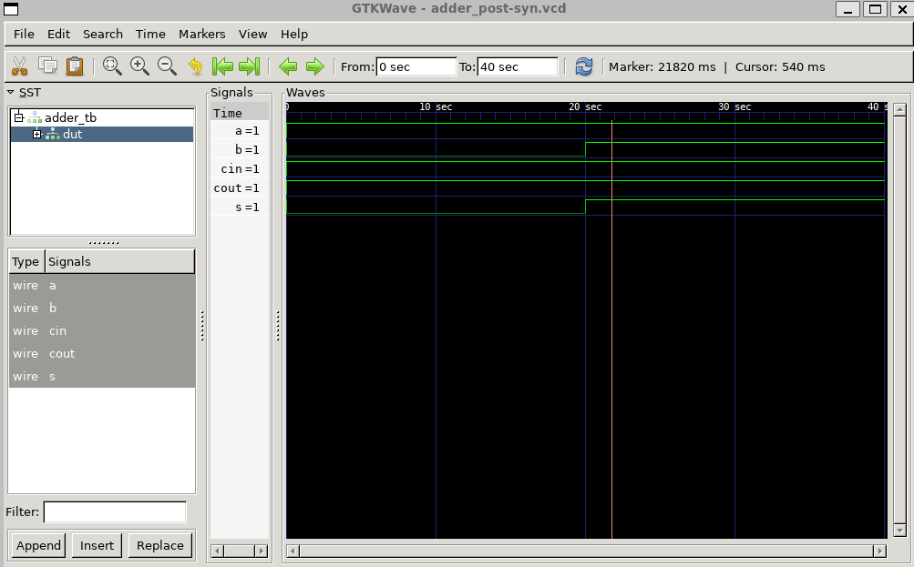

# 4.7 Synthesizing VHDL designs

## Introduction

Yosys is well-known for its Verilog synthesis capabilities; however it does not support VHDL synthesis by default. There are two solutions to synthesize VHDL designs in Yosys:
- Method 1: Convert VDHL designs into Verilog ones (this is supported in the recent version of GHDL)
- Method 2: Using GHDL-Yosys-Plugin to synthesis the design in Yosys and get the verilog netlist.

### GHDL synthesis features

Although GHDL includes a synthesis feature, it mainly serves as a front-end process. It does not perform optimizations, which can be done by ABC/Yosys. ABC is known for its logic optimization, while Yosys integrates both synthesis and functionalities.

In this method, you can get the synthesizable Verilog sourcecode. This file is not optimized and mapped into a technology. Yosys can synthesize it and optimize it.

#### GHDL docker installation

It is assumed that you already have a working docker installation. If not, please consult the environment setup lesson.

GHDL Docker image can be installed using the following command:

{: .shellcmd}
> ```
> docker pull hdlc/ghdl:latest
> ```

{: .cmdout}
> ```
> cass@unic-cass:~$ docker pull hdlc/ghdl:latest
> latest: Pulling from hdlc/ghdl
> 5de87e84afee: Pull complete
> e595ece80162: Pull complete
> f54b2949a824: Pull complete
> eacf19287f6d: Pull complete
> Digest: sha256:5972226f85a0adf5c43f4563bc3bee93710aa36bab1cf16468703a5d0d1635d8
> Status: Downloaded newer image for hdlc/ghdl:latest
> docker.io/hdlc/ghdl:latest
> ```


### GHDL-Yosys-Plugin

Yosys Open Synthesis Suite is an open source synthesis tool that primarily supports Verilog Hardware Description Language (HDL). Since it does not support VHDL by default, a separate plugin has been developed to facilitate VHDL synthesis. This plugin relies on GHDL, a widely-used VHDL simulator known for its ability to analyze and simulate VHDL code.

Using this method, you can get the Verilog gate-level netlist of your VHDL design and implement (place & route, clock tree synthesis and so on) it in Openlane. 

#### GHDL-Yosys-Plugin docker installation  

Similarly, GHDL-Yosys-Plugin docker image can be installed using the following command:

{: .shellcmd}
> ```
> docker pull hdlc/ghdl:yosys
> ```

{: .cmdout}
> ```
> cass@unic-cass:~$ docker pull hdlc/ghdl:yosys
> yosys: Pulling from hdlc/ghdl
> b7f91549542c: Pull complete
> 6bf71860a57a: Pull complete
> 9e7329d0d6f2: Pull complete
> b6cd8cf58413: Pull complete
> 125772f020f9: Pull complete
> 919cf1a24fbc: Pull complete
> 4a6097e26692: Pull complete
> 24828892270e: Pull complete
> Digest: sha256:a1e59fb42f352341957816cb6b4f3694e3985d71f59562bda01c590434d0f414
> Status: Downloaded newer image for hdlc/ghdl:yosys
> docker.io/hdlc/ghdl:yosys
> ```

## Full Adder Example

### Full Adder design in VHDL and its testbench

In this lesson, we will use a simple VHDL design of a full adder as follows. The circuit has three inputs including `a`, `b` and `cin` (carry-in). The outputs are `s` (the sum) and `cout` (carry-out).

{: .cmdout-title}
> File: `adder.vhd`
> ```vhdl
> library ieee;
> use ieee.std_logic_1164.all;
> 
> entity adder is
>         port( a: in std_logic;
>               b: in std_logic;
>               cin: in std_logic;
>               s: out std_logic;
>               cout: out std_logic);
> end;
> 
> architecture synth of adder is
> begin
>         s      <= a xor b xor cin;
>         cout   <= (a and b) or (cin and a) or (cin and b);
> end;	
> ```

A simple testbench is created to test the Full Adder design as follows:

{: .cmdout-title}
> File: adder_tb.vhd
> ```vhdl
> library ieee;
> use ieee.std_logic_1164.all;
> 
> entity adder_tb is
> end;
> 
> architecture synth of adder_tb is
> component adder
>         port( a: in std_logic;
>               b: in std_logic;
>               cin: in std_logic;
>               s: out std_logic;
>               cout: out std_logic);
> end component;
> 
> signal a: std_logic := '0';
> signal b: std_logic := '0';
> signal cin: std_logic := '0';
> signal s: std_logic;
> signal cout: std_logic;
> 
> begin
>         dut: adder port map(a, b, cin, s, cout);
>         
>         process begin
>         a <= '1'; b <= '0'; cin <= '1'; wait for 20 ns;
>           assert (s ='0' and cout = '1') report "101 failed.";
> 
>         a <= '1'; b <= '1'; cin <= '1'; wait for 20 ns;
>           assert (s ='1' and cout = '1') report "111 failed.";
> end process;
> end;	
> ```

### Simulation using GHDL

The following command can be used to simulate the Full Adder design with GHDL:

{: .shellcmd}
> ```bash
> cd $HOME  # run this command only if you are in the docker run
> ghdl -a adder.vhd
> ghdl -a adder_tb.vhd
> ghdl -e adder_tb                    # elaborate the design
> ghdl -r adder_tb --vcd=adder_tb.vcd # run simulation
> exit
> ```

{: .cmdout}
> ```
> I have no name!@8ff6d464233e:/$ cd $HOME
> I have no name!@8ff6d464233e:~$ ghdl -a adder.vhd
> I have no name!@8ff6d464233e:~$ ghdl -a adder_tb.vhd
> I have no name!@8ff6d464233e:~$ ghdl -e adder_tb
> I have no name!@8ff6d464233e:~$ ghdl -r adder_tb --vcd=adder_tb.vcd
> I have no name!@8ff6d464233e:~$ exit
> exit
> ```

### Viewing the simulation result

Open `adder_tb.vcd` using GTKwave to view the waveform of the simulation:

{: .shellcmd}
```
gtkwave adder_tb.vcd
```

It looks like this:


## Using GHDL synthesis feature

In this section, we will install GHDL docker image and perform the synthesis of the Full Adder design using GHDL.

Run the following command to start GHDL docker image:

{: .shellcmd}
> ```bash
> docker run -it -v $PWD:$PWD -u $(id -u $USER):$(id -g $USER) -e HOME=$PWD ghdl/ghdl:ubuntu22-mcode
> ```

The options of the above command is as follows:

- `-it` runs docker in an interactive mode.
- `-v $PWD:$PWD` maps the current directory ($PWD) into the same path inside docker session.
- `-u $(id -u $USER):$(id -g $USER)` maps the current user and group into the docker session.
- `-e HOME=$PWD` maps the current directory as $HOME directory inside the docker session.


{: .cmdout-title}
> ```
> groups: cannot find name for group ID 1000
> I have no name!@39b279356ad5:/$
> ```

Now we are inside the docker session and can run the following command to convert the VHDL design into Verilog:

{: .shellcmd}
> ```bash
> cd $HOME
> ghdl -a adder.vhd
> ghdl synth --out=verilog adder
> ```

{: .cmdout}
> ```
> I have no name!@39b279356ad5:/$ cd $HOME
> I have no name!@39b279356ad5:~$ ghdl -a adder.vhd
> I have no name!@39b279356ad5:~$ ghdl synth --out=verilog adder
> module adder
>   (input  a,
>    input  b,
>    input  cin,
>    output s,
>    output cout);
>   wire n2_o;
>   wire n3_o;
>   wire n4_o;
>   wire n5_o;
>   wire n6_o;
>   wire n7_o;
>   wire n8_o;
>   assign s = n3_o;
>   assign cout = n8_o;
>   /* test.vhd:14:21  */
>   assign n2_o = a ^ b;
>   /* test.vhd:14:27  */
>   assign n3_o = n2_o ^ cin;
>   /* test.vhd:15:22  */
>   assign n4_o = a & b;
>   /* test.vhd:15:37  */
>   assign n5_o = cin & a;
>   /* test.vhd:15:29  */
>   assign n6_o = n4_o | n5_o;
>   /* test.vhd:15:52  */
>   assign n7_o = cin & b;
>   /* test.vhd:15:44  */
>   assign n8_o = n6_o | n7_o;
> endmodule
> ```

You can redirect the output to a file using this command:

{: .shellcmd}
> ```
> ghdl synth --out=verilog adder > adder.v
> ```

{: .cmdout-title}
> File: `adder.v`
> ```verilog
> module adder
>   (input  a,
>    input  b,
>    input  cin,
>    output s,
>    output cout);
>   wire n2_o;
>   wire n3_o;
>   wire n4_o;
>   wire n5_o;
>   wire n6_o;
>   wire n7_o;
>   wire n8_o;
>   assign s = n3_o;
>   assign cout = n8_o;
>   /* test.vhd:14:21  */
>   assign n2_o = a ^ b;
>   /* test.vhd:14:27  */
>   assign n3_o = n2_o ^ cin;
>   /* test.vhd:15:22  */
>   assign n4_o = a & b;
>   /* test.vhd:15:37  */
>   assign n5_o = cin & a;
>   /* test.vhd:15:29  */
>   assign n6_o = n4_o | n5_o;
>   /* test.vhd:15:52  */
>   assign n7_o = cin & b;
>   /* test.vhd:15:44  */
>   assign n8_o = n6_o | n7_o;
> endmodule
> ```

## Synthesize the design using GHDL-Yosys-plugin

Running docker with the appropriate setup:

{: .shellcmd}
> ```bash
> export PDK_ROOT=$HOME/unic-cass/pdks
> export PDK=sky130A
> docker run -it -v $PWD:$PWD -u $(id -u $USER):$(id -g $USER) \
>     -e HOME=$PWD -e PDK_ROOT=$PDK_ROOT -e PDK=$PDK \
>     -v $PDK_ROOT/$PDK:$PDK_ROOT/$PDK hdlc/ghdl:yosys bash
> ```

This command assumes that you are running it in the directory which contains `adder.vhd`. The detailed of the command is as follows:
- `-it` runs docker in an interactive mode
- `-u $(id -u $USER):$(id -g $USER)` maps the current user and group into the docker image
- `-e HOME=$PWD` sets the `HOME` variable in docker into the current directory (which contains `adder.vhd`)
- `-e PDK_ROOT=$PDK_ROOT` sets `PDK_ROOT` variable in docker into the current `PDK_ROOT`
- `-e PDK=$PDK` set `PDK` variable in docker into the current `PDK`
- `-v $PDK_ROOT/$PDK:$PDK_ROOT/$PDK` maps the PDK directory into docker.

Inside the docker image, change the directory to `$HOME` and run yosys with GHDL plugin:

{: .shellcmd}
> ```bash
> cd $HOME
> yosys -m ghdl
> ```

{: .cmdout}
```
cass@unic-cass:~/test$ export PDK_ROOT=$HOME/unic-cass/pdks
cass@unic-cass:~/test$ export PDK=sky130A
cass@unic-cass:~/test$ docker run -it -v $PWD:$PWD -u $(id -u $USER):$(id -g $USER) -e HOME=$PWD -e PDK_ROOT=$PDK_ROOT -e PDK=$PDK -v $PDK_ROOT/$PDK:$PDK_ROOT/$PDK hdlc/ghdl:yosys bash
I have no name!@3605d320b7c0:/$ cd $HOME
I have no name!@3605d320b7c0:~$ yosys -m ghdl

 /----------------------------------------------------------------------------\
 |                                                                            |
 |  yosys -- Yosys Open SYnthesis Suite                                       |
 |                                                                            |
 |  Copyright (C) 2012 - 2020  Claire Xenia Wolf <claire@yosyshq.com>         |
 |                                                                            |
 |  Permission to use, copy, modify, and/or distribute this software for any  |
 |  purpose with or without fee is hereby granted, provided that the above    |
 |  copyright notice and this permission notice appear in all copies.         |
 |                                                                            |
 |  THE SOFTWARE IS PROVIDED "AS IS" AND THE AUTHOR DISCLAIMS ALL WARRANTIES  |
 |  WITH REGARD TO THIS SOFTWARE INCLUDING ALL IMPLIED WARRANTIES OF          |
 |  MERCHANTABILITY AND FITNESS. IN NO EVENT SHALL THE AUTHOR BE LIABLE FOR   |
 |  ANY SPECIAL, DIRECT, INDIRECT, OR CONSEQUENTIAL DAMAGES OR ANY DAMAGES    |
 |  WHATSOEVER RESULTING FROM LOSS OF USE, DATA OR PROFITS, WHETHER IN AN     |
 |  ACTION OF CONTRACT, NEGLIGENCE OR OTHER TORTIOUS ACTION, ARISING OUT OF   |
 |  OR IN CONNECTION WITH THE USE OR PERFORMANCE OF THIS SOFTWARE.            |
 |                                                                            |
 \----------------------------------------------------------------------------/

 Yosys 0.36+42 (git sha1 70d35314d, clang 11.0.1-2 -fPIC -Os)

 yosys>
```

Run the following commands to synthesize the Full Adder design:

{: .shellcmd-title}
> Yosys shell
> ```
> ghdl adder.vhd -e adder
> synth -top adder
> abc -liberty /home/cass/unic-cass/pdks/sky130A/libs.ref/sky130_fd_sc_hd/lib/sky130_fd_sc_hd__tt_025C_1v80.lib
> clean
> write_verilog adder_synth.v
> exit
> ```

{: .cmdout-title}
> Yosys shell outputs
> ```
> yosys> ghdl adder.vhd -e adder
> 1. Executing GHDL.
> Importing module adder.
> 
> yosys> synth -top adder
> 
> 2. Executing SYNTH pass.
> 
> 2.1. Executing HIERARCHY pass (managing design hierarchy).
> 
> 2.1.1. Analyzing design hierarchy..
> Top module:  \adder
> 
> 2.1.2. Analyzing design hierarchy..
> Top module:  \adder
> Removed 0 unused modules.
> 
> 2.2. Executing PROC pass (convert processes to netlists).
> 
> 2.2.1. Executing PROC_CLEAN pass (remove empty switches from decision trees).
> Cleaned up 0 empty switches.
> 
> 2.2.2. Executing PROC_RMDEAD pass (remove dead branches from decision trees).
> Removed a total of 0 dead cases.
> 
> 2.2.3. Executing PROC_PRUNE pass (remove redundant assignments in processes).
> Removed 0 redundant assignments.
> Promoted 0 assignments to connections.
> 
> 2.2.4. Executing PROC_INIT pass (extract init attributes).
> 
> 2.2.5. Executing PROC_ARST pass (detect async resets in processes).
> 
> 2.2.6. Executing PROC_ROM pass (convert switches to ROMs).
> Converted 0 switches.
> 
> 2.2.7. Executing PROC_MUX pass (convert decision trees to multiplexers).
> 
> 2.2.8. Executing PROC_DLATCH pass (convert process syncs to latches).
> 
> 2.2.9. Executing PROC_DFF pass (convert process syncs to FFs).
> 
> 2.2.10. Executing PROC_MEMWR pass (convert process memory writes to cells).
> 
> 2.2.11. Executing PROC_CLEAN pass (remove empty switches from decision trees).
> Cleaned up 0 empty switches.
> 
> 2.2.12. Executing OPT_EXPR pass (perform const folding).
> Optimizing module adder.
> 
> 2.3. Executing OPT_EXPR pass (perform const folding).
> Optimizing module adder.
> 
> 2.4. Executing OPT_CLEAN pass (remove unused cells and wires).
> Finding unused cells or wires in module \adder..
> Removed 0 unused cells and 2 unused wires.
> <suppressed ~1 debug messages>
> 
> 2.5. Executing CHECK pass (checking for obvious problems).
> Checking module adder...
> Found and reported 0 problems.
> 
> 2.6. Executing OPT pass (performing simple optimizations).
> 
> 2.6.1. Executing OPT_EXPR pass (perform const folding).
> Optimizing module adder.
> 
> 2.6.2. Executing OPT_MERGE pass (detect identical cells).
> Finding identical cells in module `\adder'.
> Removed a total of 0 cells.
> 
> 2.6.3. Executing OPT_MUXTREE pass (detect dead branches in mux trees).
> Running muxtree optimizer on module \adder..
>   Creating internal representation of mux trees.
>   No muxes found in this module.
> Removed 0 multiplexer ports.
> 
> 2.6.4. Executing OPT_REDUCE pass (consolidate $*mux and $reduce_* inputs).
>   Optimizing cells in module \adder.
> Performed a total of 0 changes.
> 
> 2.6.5. Executing OPT_MERGE pass (detect identical cells).
> Finding identical cells in module `\adder'.
> Removed a total of 0 cells.
> 
> 2.6.6. Executing OPT_DFF pass (perform DFF optimizations).
> 
> 2.6.7. Executing OPT_CLEAN pass (remove unused cells and wires).
> Finding unused cells or wires in module \adder..
> 
> 2.6.8. Executing OPT_EXPR pass (perform const folding).
> Optimizing module adder.
> 
> 2.6.9. Finished OPT passes. (There is nothing left to do.)
> 
> 2.7. Executing FSM pass (extract and optimize FSM).
> 
> 2.7.1. Executing FSM_DETECT pass (finding FSMs in design).
> 
> 2.7.2. Executing FSM_EXTRACT pass (extracting FSM from design).
> 
> 2.7.3. Executing FSM_OPT pass (simple optimizations of FSMs).
> 
> 2.7.4. Executing OPT_CLEAN pass (remove unused cells and wires).
> Finding unused cells or wires in module \adder..
> 
> 2.7.5. Executing FSM_OPT pass (simple optimizations of FSMs).
> 
> 2.7.6. Executing FSM_RECODE pass (re-assigning FSM state encoding).
> 
> 2.7.7. Executing FSM_INFO pass (dumping all available information on FSM cells).
> 
> 2.7.8. Executing FSM_MAP pass (mapping FSMs to basic logic).
> 
> 2.8. Executing OPT pass (performing simple optimizations).
> 
> 2.8.1. Executing OPT_EXPR pass (perform const folding).
> Optimizing module adder.
> 
> 2.8.2. Executing OPT_MERGE pass (detect identical cells).
> Finding identical cells in module `\adder'.
> Removed a total of 0 cells.
> 
> 2.8.3. Executing OPT_MUXTREE pass (detect dead branches in mux trees).
> Running muxtree optimizer on module \adder..
>   Creating internal representation of mux trees.
>   No muxes found in this module.
> Removed 0 multiplexer ports.
> 
> 2.8.4. Executing OPT_REDUCE pass (consolidate $*mux and $reduce_* inputs).
>   Optimizing cells in module \adder.
> Performed a total of 0 changes.
> 
> 2.8.5. Executing OPT_MERGE pass (detect identical cells).
> Finding identical cells in module `\adder'.
> Removed a total of 0 cells.
> 
> 2.8.6. Executing OPT_DFF pass (perform DFF optimizations).
> 
> 2.8.7. Executing OPT_CLEAN pass (remove unused cells and wires).
> Finding unused cells or wires in module \adder..
> 
> 2.8.8. Executing OPT_EXPR pass (perform const folding).
> Optimizing module adder.
> 
> 2.8.9. Finished OPT passes. (There is nothing left to do.)
> 
> 2.9. Executing WREDUCE pass (reducing word size of cells).
> 
> 2.10. Executing PEEPOPT pass (run peephole optimizers).
> 
> 2.11. Executing OPT_CLEAN pass (remove unused cells and wires).
> Finding unused cells or wires in module \adder..
> 
> 2.12. Executing ALUMACC pass (create $alu and $macc cells).
> Extracting $alu and $macc cells in module adder:
>   created 0 $alu and 0 $macc cells.
> 
> 2.13. Executing SHARE pass (SAT-based resource sharing).
> 
> 2.14. Executing OPT pass (performing simple optimizations).
> 
> 2.14.1. Executing OPT_EXPR pass (perform const folding).
> Optimizing module adder.
> 
> 2.14.2. Executing OPT_MERGE pass (detect identical cells).
> Finding identical cells in module `\adder'.
> Removed a total of 0 cells.
> 
> 2.14.3. Executing OPT_MUXTREE pass (detect dead branches in mux trees).
> Running muxtree optimizer on module \adder..
>   Creating internal representation of mux trees.
>   No muxes found in this module.
> Removed 0 multiplexer ports.
> 
> 2.14.4. Executing OPT_REDUCE pass (consolidate $*mux and $reduce_* inputs).
>   Optimizing cells in module \adder.
> Performed a total of 0 changes.
> 
> 2.14.5. Executing OPT_MERGE pass (detect identical cells).
> Finding identical cells in module `\adder'.
> Removed a total of 0 cells.
> 
> 2.14.6. Executing OPT_DFF pass (perform DFF optimizations).
> 
> 2.14.7. Executing OPT_CLEAN pass (remove unused cells and wires).
> Finding unused cells or wires in module \adder..
> 
> 2.14.8. Executing OPT_EXPR pass (perform const folding).
> Optimizing module adder.
> 
> 2.14.9. Finished OPT passes. (There is nothing left to do.)
> 
> 2.15. Executing MEMORY pass.
> 
> 2.15.1. Executing OPT_MEM pass (optimize memories).
> Performed a total of 0 transformations.
> 
> 2.15.2. Executing OPT_MEM_PRIORITY pass (removing unnecessary memory write priority relations).
> Performed a total of 0 transformations.
> 
> 2.15.3. Executing OPT_MEM_FEEDBACK pass (finding memory read-to-write feedback paths).
> 
> 2.15.4. Executing MEMORY_BMUX2ROM pass (converting muxes to ROMs).
> 
> 2.15.5. Executing MEMORY_DFF pass (merging $dff cells to $memrd).
> 
> 2.15.6. Executing OPT_CLEAN pass (remove unused cells and wires).
> Finding unused cells or wires in module \adder..
> 
> 2.15.7. Executing MEMORY_SHARE pass (consolidating $memrd/$memwr cells).
> 
> 2.15.8. Executing OPT_MEM_WIDEN pass (optimize memories where all ports are wide).
> Performed a total of 0 transformations.
> 
> 2.15.9. Executing OPT_CLEAN pass (remove unused cells and wires).
> Finding unused cells or wires in module \adder..
> 
> 2.15.10. Executing MEMORY_COLLECT pass (generating $mem cells).
> 
> 2.16. Executing OPT_CLEAN pass (remove unused cells and wires).
> Finding unused cells or wires in module \adder..
> 
> 2.17. Executing OPT pass (performing simple optimizations).
> 
> 2.17.1. Executing OPT_EXPR pass (perform const folding).
> Optimizing module adder.
> 
> 2.17.2. Executing OPT_MERGE pass (detect identical cells).
> Finding identical cells in module `\adder'.
> Removed a total of 0 cells.
> 
> 2.17.3. Executing OPT_DFF pass (perform DFF optimizations).
> 
> 2.17.4. Executing OPT_CLEAN pass (remove unused cells and wires).
> Finding unused cells or wires in module \adder..
> 
> 2.17.5. Finished fast OPT passes.
> 
> 2.18. Executing MEMORY_MAP pass (converting memories to logic and flip-flops).
> 
> 2.19. Executing OPT pass (performing simple optimizations).
> 
> 2.19.1. Executing OPT_EXPR pass (perform const folding).
> Optimizing module adder.
> 
> 2.19.2. Executing OPT_MERGE pass (detect identical cells).
> Finding identical cells in module `\adder'.
> Removed a total of 0 cells.
> 
> 2.19.3. Executing OPT_MUXTREE pass (detect dead branches in mux trees).
> Running muxtree optimizer on module \adder..
>   Creating internal representation of mux trees.
>   No muxes found in this module.
> Removed 0 multiplexer ports.
> 
> 2.19.4. Executing OPT_REDUCE pass (consolidate $*mux and $reduce_* inputs).
>   Optimizing cells in module \adder.
> Performed a total of 0 changes.
> 
> 2.19.5. Executing OPT_MERGE pass (detect identical cells).
> Finding identical cells in module `\adder'.
> Removed a total of 0 cells.
> 
> 2.19.6. Executing OPT_SHARE pass.
> 
> 2.19.7. Executing OPT_DFF pass (perform DFF optimizations).
> 
> 2.19.8. Executing OPT_CLEAN pass (remove unused cells and wires).
> Finding unused cells or wires in module \adder..
> 
> 2.19.9. Executing OPT_EXPR pass (perform const folding).
> Optimizing module adder.
> 
> 2.19.10. Finished OPT passes. (There is nothing left to do.)
> 
> 2.20. Executing TECHMAP pass (map to technology primitives).
> 
> 2.20.1. Executing Verilog-2005 frontend: /usr/local/bin/../share/yosys/techmap.v
> Parsing Verilog input from `/usr/local/bin/../share/yosys/techmap.v' to AST representation.
> Generating RTLIL representation for module `\_90_simplemap_bool_ops'.
> Generating RTLIL representation for module `\_90_simplemap_reduce_ops'.
> Generating RTLIL representation for module `\_90_simplemap_logic_ops'.
> Generating RTLIL representation for module `\_90_simplemap_compare_ops'.
> Generating RTLIL representation for module `\_90_simplemap_various'.
> Generating RTLIL representation for module `\_90_simplemap_registers'.
> Generating RTLIL representation for module `\_90_shift_ops_shr_shl_sshl_sshr'.
> Generating RTLIL representation for module `\_90_shift_shiftx'.
> Generating RTLIL representation for module `\_90_fa'.
> Generating RTLIL representation for module `\_90_lcu'.
> Generating RTLIL representation for module `\_90_alu'.
> Generating RTLIL representation for module `\_90_macc'.
> Generating RTLIL representation for module `\_90_alumacc'.
> Generating RTLIL representation for module `\$__div_mod_u'.
> Generating RTLIL representation for module `\$__div_mod_trunc'.
> Generating RTLIL representation for module `\_90_div'.
> Generating RTLIL representation for module `\_90_mod'.
> Generating RTLIL representation for module `\$__div_mod_floor'.
> Generating RTLIL representation for module `\_90_divfloor'.
> Generating RTLIL representation for module `\_90_modfloor'.
> Generating RTLIL representation for module `\_90_pow'.
> Generating RTLIL representation for module `\_90_pmux'.
> Generating RTLIL representation for module `\_90_demux'.
> Generating RTLIL representation for module `\_90_lut'.
> Successfully finished Verilog frontend.
> 
> 2.20.2. Continuing TECHMAP pass.
> Using extmapper simplemap for cells of type $xor.
> Using extmapper simplemap for cells of type $and.
> Using extmapper simplemap for cells of type $or.
> No more expansions possible.
> <suppressed ~80 debug messages>
> 
> 2.21. Executing OPT pass (performing simple optimizations).
> 
> 2.21.1. Executing OPT_EXPR pass (perform const folding).
> Optimizing module adder.
> 
> 2.21.2. Executing OPT_MERGE pass (detect identical cells).
> Finding identical cells in module `\adder'.
> Removed a total of 0 cells.
> 
> 2.21.3. Executing OPT_DFF pass (perform DFF optimizations).
> 
> 2.21.4. Executing OPT_CLEAN pass (remove unused cells and wires).
> Finding unused cells or wires in module \adder..
> 
> 2.21.5. Finished fast OPT passes.
> 
> 2.22. Executing ABC pass (technology mapping using ABC).
> 
> 2.22.1. Extracting gate netlist of module `\adder' to `<abc-temp-dir>/input.blif'..
> Extracted 7 gates and 10 wires to a netlist network with 3 inputs and 2 outputs.
> 
> 2.22.1.1. Executing ABC.
> Running ABC command: "<yosys-exe-dir>/yosys-abc" -s -f <abc-temp-dir>/abc.script 2>&1
> ABC: ABC command line: "source <abc-temp-dir>/abc.script".
> ABC:
> ABC: + read_blif <abc-temp-dir>/input.blif
> ABC: + read_library <abc-temp-dir>/stdcells.genlib
> ABC: Entered genlib library with 13 gates from file "<abc-temp-dir>/stdcells.genlib".
> ABC: + strash
> ABC: + dretime
> ABC: + map
> ABC: + write_blif <abc-temp-dir>/output.blif
> 
> 2.22.1.2. Re-integrating ABC results.
> ABC RESULTS:               XOR cells:        2
> ABC RESULTS:               AND cells:        3
> ABC RESULTS:                OR cells:        2
> ABC RESULTS:        internal signals:        5
> ABC RESULTS:           input signals:        3
> ABC RESULTS:          output signals:        2
> Removing temp directory.
> 
> 2.23. Executing OPT pass (performing simple optimizations).
> 
> 2.23.1. Executing OPT_EXPR pass (perform const folding).
> Optimizing module adder.
> 
> 2.23.2. Executing OPT_MERGE pass (detect identical cells).
> Finding identical cells in module `\adder'.
> Removed a total of 0 cells.
> 
> 2.23.3. Executing OPT_DFF pass (perform DFF optimizations).
> 
> 2.23.4. Executing OPT_CLEAN pass (remove unused cells and wires).
> Finding unused cells or wires in module \adder..
> Removed 0 unused cells and 10 unused wires.
> <suppressed ~1 debug messages>
> 
> 2.23.5. Finished fast OPT passes.
> 
> 2.24. Executing HIERARCHY pass (managing design hierarchy).
> 
> 2.24.1. Analyzing design hierarchy..
> Top module:  \adder
> 
> 2.24.2. Analyzing design hierarchy..
> Top module:  \adder
> Removed 0 unused modules.
> 
> 2.25. Printing statistics.
> 
> === adder ===
> 
>    Number of wires:                 10
>    Number of wire bits:             10
>    Number of public wires:           5
>    Number of public wire bits:       5
>    Number of memories:               0
>    Number of memory bits:            0
>    Number of processes:              0
>    Number of cells:                  7
>      $_AND_                          3
>      $_OR_                           2
>      $_XOR_                          2
> 
> 2.26. Executing CHECK pass (checking for obvious problems).
> Checking module adder...
> Found and reported 0 problems.
> 
> yosys> abc -liberty /home/cass/unic-cass/pdks/sky130A/libs.ref/sky130_fd_sc_hd/lib/sky130_fd_sc_hd__tt_025C_1v80.lib
> 
> 3. Executing ABC pass (technology mapping using ABC).
> 
> 3.1. Extracting gate netlist of module `\adder' to `<abc-temp-dir>/input.blif'..
> Extracted 7 gates and 10 wires to a netlist network with 3 inputs and 2 outputs.
> 
> 3.1.1. Executing ABC.
> Running ABC command: "<yosys-exe-dir>/yosys-abc" -s -f <abc-temp-dir>/abc.script 2>&1
> ABC: ABC command line: "source <abc-temp-dir>/abc.script".
> ABC:
> ABC: + read_blif <abc-temp-dir>/input.blif
> ABC: + read_lib -w /home/cass/unic-cass/pdks/sky130A/libs.ref/sky130_fd_sc_hd/lib/sky130_fd_sc_hd__tt_025C_1v80.lib
> ABC: Parsing finished successfully.  Parsing time =     0.09 sec
> ABC: Scl_LibertyReadGenlib() skipped cell "sky130_fd_sc_hd__decap_12" without logic function.
> ABC: Scl_LibertyReadGenlib() skipped cell "sky130_fd_sc_hd__decap_3" without logic function.
> ABC: Scl_LibertyReadGenlib() skipped cell "sky130_fd_sc_hd__decap_4" without logic function.
> ABC: Scl_LibertyReadGenlib() skipped cell "sky130_fd_sc_hd__decap_6" without logic function.
> ABC: Scl_LibertyReadGenlib() skipped cell "sky130_fd_sc_hd__decap_8" without logic function.
> ABC: Scl_LibertyReadGenlib() skipped sequential cell "sky130_fd_sc_hd__dfbbn_1".
> ABC: Scl_LibertyReadGenlib() skipped sequential cell "sky130_fd_sc_hd__dfbbn_2".
> ABC: Scl_LibertyReadGenlib() skipped sequential cell "sky130_fd_sc_hd__dfbbp_1".
> ABC: Scl_LibertyReadGenlib() skipped sequential cell "sky130_fd_sc_hd__dfrbp_1".
> ABC: Scl_LibertyReadGenlib() skipped sequential cell "sky130_fd_sc_hd__dfrbp_2".
> ABC: Scl_LibertyReadGenlib() skipped sequential cell "sky130_fd_sc_hd__dfrtn_1".
> ABC: Scl_LibertyReadGenlib() skipped sequential cell "sky130_fd_sc_hd__dfrtp_1".
> ABC: Scl_LibertyReadGenlib() skipped sequential cell "sky130_fd_sc_hd__dfrtp_2".
> ABC: Scl_LibertyReadGenlib() skipped sequential cell "sky130_fd_sc_hd__dfrtp_4".
> ABC: Scl_LibertyReadGenlib() skipped sequential cell "sky130_fd_sc_hd__dfsbp_1".
> ABC: Scl_LibertyReadGenlib() skipped sequential cell "sky130_fd_sc_hd__dfsbp_2".
> ABC: Scl_LibertyReadGenlib() skipped sequential cell "sky130_fd_sc_hd__dfstp_1".
> ABC: Scl_LibertyReadGenlib() skipped sequential cell "sky130_fd_sc_hd__dfstp_2".
> ABC: Scl_LibertyReadGenlib() skipped sequential cell "sky130_fd_sc_hd__dfstp_4".
> ABC: Scl_LibertyReadGenlib() skipped sequential cell "sky130_fd_sc_hd__dfxbp_1".
> ABC: Scl_LibertyReadGenlib() skipped sequential cell "sky130_fd_sc_hd__dfxbp_2".
> ABC: Scl_LibertyReadGenlib() skipped sequential cell "sky130_fd_sc_hd__dfxtp_1".
> ABC: Scl_LibertyReadGenlib() skipped sequential cell "sky130_fd_sc_hd__dfxtp_2".
> ABC: Scl_LibertyReadGenlib() skipped sequential cell "sky130_fd_sc_hd__dfxtp_4".
> ABC: Scl_LibertyReadGenlib() skipped cell "sky130_fd_sc_hd__diode_2" without logic function.
> ABC: Scl_LibertyReadGenlib() skipped cell "sky130_fd_sc_hd__dlclkp_1" without logic function.
> ABC: Scl_LibertyReadGenlib() skipped cell "sky130_fd_sc_hd__dlclkp_2" without logic function.
> ABC: Scl_LibertyReadGenlib() skipped cell "sky130_fd_sc_hd__dlclkp_4" without logic function.
> ABC: Scl_LibertyReadGenlib() skipped sequential cell "sky130_fd_sc_hd__dlrbn_1".
> ABC: Scl_LibertyReadGenlib() skipped sequential cell "sky130_fd_sc_hd__dlrbn_2".
> ABC: Scl_LibertyReadGenlib() skipped sequential cell "sky130_fd_sc_hd__dlrbp_1".
> ABC: Scl_LibertyReadGenlib() skipped sequential cell "sky130_fd_sc_hd__dlrbp_2".
> ABC: Scl_LibertyReadGenlib() skipped sequential cell "sky130_fd_sc_hd__dlrtn_1".
> ABC: Scl_LibertyReadGenlib() skipped sequential cell "sky130_fd_sc_hd__dlrtn_2".
> ABC: Scl_LibertyReadGenlib() skipped sequential cell "sky130_fd_sc_hd__dlrtn_4".
> ABC: Scl_LibertyReadGenlib() skipped sequential cell "sky130_fd_sc_hd__dlrtp_1".
> ABC: Scl_LibertyReadGenlib() skipped sequential cell "sky130_fd_sc_hd__dlrtp_2".
> ABC: Scl_LibertyReadGenlib() skipped sequential cell "sky130_fd_sc_hd__dlrtp_4".
> ABC: Scl_LibertyReadGenlib() skipped sequential cell "sky130_fd_sc_hd__dlxbn_1".
> ABC: Scl_LibertyReadGenlib() skipped sequential cell "sky130_fd_sc_hd__dlxbn_2".
> ABC: Scl_LibertyReadGenlib() skipped sequential cell "sky130_fd_sc_hd__dlxbp_1".
> ABC: Scl_LibertyReadGenlib() skipped sequential cell "sky130_fd_sc_hd__dlxtn_1".
> ABC: Scl_LibertyReadGenlib() skipped sequential cell "sky130_fd_sc_hd__dlxtn_2".
> ABC: Scl_LibertyReadGenlib() skipped sequential cell "sky130_fd_sc_hd__dlxtn_4".
> ABC: Scl_LibertyReadGenlib() skipped sequential cell "sky130_fd_sc_hd__dlxtp_1".
> ABC: Scl_LibertyReadGenlib() skipped three-state cell "sky130_fd_sc_hd__ebufn_1".
> ABC: Scl_LibertyReadGenlib() skipped three-state cell "sky130_fd_sc_hd__ebufn_2".
> ABC: Scl_LibertyReadGenlib() skipped three-state cell "sky130_fd_sc_hd__ebufn_4".
> ABC: Scl_LibertyReadGenlib() skipped three-state cell "sky130_fd_sc_hd__ebufn_8".
> ABC: Scl_LibertyReadGenlib() skipped sequential cell "sky130_fd_sc_hd__edfxbp_1".
> ABC: Scl_LibertyReadGenlib() skipped sequential cell "sky130_fd_sc_hd__edfxtp_1".
> ABC: Scl_LibertyReadGenlib() skipped three-state cell "sky130_fd_sc_hd__einvn_0".
> ABC: Scl_LibertyReadGenlib() skipped three-state cell "sky130_fd_sc_hd__einvn_1".
> ABC: Scl_LibertyReadGenlib() skipped three-state cell "sky130_fd_sc_hd__einvn_2".
> ABC: Scl_LibertyReadGenlib() skipped three-state cell "sky130_fd_sc_hd__einvn_4".
> ABC: Scl_LibertyReadGenlib() skipped three-state cell "sky130_fd_sc_hd__einvn_8".
> ABC: Scl_LibertyReadGenlib() skipped three-state cell "sky130_fd_sc_hd__einvp_1".
> ABC: Scl_LibertyReadGenlib() skipped three-state cell "sky130_fd_sc_hd__einvp_2".
> ABC: Scl_LibertyReadGenlib() skipped three-state cell "sky130_fd_sc_hd__einvp_4".
> ABC: Scl_LibertyReadGenlib() skipped three-state cell "sky130_fd_sc_hd__einvp_8".
> ABC: Scl_LibertyReadGenlib() skipped cell "sky130_fd_sc_hd__lpflow_bleeder_1" without logic function.
> ABC: Scl_LibertyReadGenlib() skipped cell "sky130_fd_sc_hd__lpflow_decapkapwr_12" without logic function.
> ABC: Scl_LibertyReadGenlib() skipped cell "sky130_fd_sc_hd__lpflow_decapkapwr_3" without logic function.
> ABC: Scl_LibertyReadGenlib() skipped cell "sky130_fd_sc_hd__lpflow_decapkapwr_4" without logic function.
> ABC: Scl_LibertyReadGenlib() skipped cell "sky130_fd_sc_hd__lpflow_decapkapwr_6" without logic function.
> ABC: Scl_LibertyReadGenlib() skipped cell "sky130_fd_sc_hd__lpflow_decapkapwr_8" without logic function.
> ABC: Scl_LibertyReadGenlib() skipped sequential cell "sky130_fd_sc_hd__lpflow_inputisolatch_1".
> ABC: Scl_LibertyReadGenlib() skipped sequential cell "sky130_fd_sc_hd__sdfbbn_1".
> ABC: Scl_LibertyReadGenlib() skipped sequential cell "sky130_fd_sc_hd__sdfbbn_2".
> ABC: Scl_LibertyReadGenlib() skipped sequential cell "sky130_fd_sc_hd__sdfbbp_1".
> ABC: Scl_LibertyReadGenlib() skipped sequential cell "sky130_fd_sc_hd__sdfrbp_1".
> ABC: Scl_LibertyReadGenlib() skipped sequential cell "sky130_fd_sc_hd__sdfrbp_2".
> ABC: Scl_LibertyReadGenlib() skipped sequential cell "sky130_fd_sc_hd__sdfrtn_1".
> ABC: Scl_LibertyReadGenlib() skipped sequential cell "sky130_fd_sc_hd__sdfrtp_1".
> ABC: Scl_LibertyReadGenlib() skipped sequential cell "sky130_fd_sc_hd__sdfrtp_2".
> ABC: Scl_LibertyReadGenlib() skipped sequential cell "sky130_fd_sc_hd__sdfrtp_4".
> ABC: Scl_LibertyReadGenlib() skipped sequential cell "sky130_fd_sc_hd__sdfsbp_1".
> ABC: Scl_LibertyReadGenlib() skipped sequential cell "sky130_fd_sc_hd__sdfsbp_2".
> ABC: Scl_LibertyReadGenlib() skipped sequential cell "sky130_fd_sc_hd__sdfstp_1".
> ABC: Scl_LibertyReadGenlib() skipped sequential cell "sky130_fd_sc_hd__sdfstp_2".
> ABC: Scl_LibertyReadGenlib() skipped sequential cell "sky130_fd_sc_hd__sdfstp_4".
> ABC: Scl_LibertyReadGenlib() skipped sequential cell "sky130_fd_sc_hd__sdfxbp_1".
> ABC: Scl_LibertyReadGenlib() skipped sequential cell "sky130_fd_sc_hd__sdfxbp_2".
> ABC: Scl_LibertyReadGenlib() skipped sequential cell "sky130_fd_sc_hd__sdfxtp_1".
> ABC: Scl_LibertyReadGenlib() skipped sequential cell "sky130_fd_sc_hd__sdfxtp_2".
> ABC: Scl_LibertyReadGenlib() skipped sequential cell "sky130_fd_sc_hd__sdfxtp_4".
> ABC: Scl_LibertyReadGenlib() skipped cell "sky130_fd_sc_hd__sdlclkp_1" without logic function.
> ABC: Scl_LibertyReadGenlib() skipped cell "sky130_fd_sc_hd__sdlclkp_2" without logic function.
> ABC: Scl_LibertyReadGenlib() skipped cell "sky130_fd_sc_hd__sdlclkp_4" without logic function.
> ABC: Scl_LibertyReadGenlib() skipped sequential cell "sky130_fd_sc_hd__sedfxbp_1".
> ABC: Scl_LibertyReadGenlib() skipped sequential cell "sky130_fd_sc_hd__sedfxbp_2".
> ABC: Scl_LibertyReadGenlib() skipped sequential cell "sky130_fd_sc_hd__sedfxtp_1".
> ABC: Scl_LibertyReadGenlib() skipped sequential cell "sky130_fd_sc_hd__sedfxtp_2".
> ABC: Scl_LibertyReadGenlib() skipped sequential cell "sky130_fd_sc_hd__sedfxtp_4".
> ABC: Library "sky130_fd_sc_hd__tt_025C_1v80" from "/home/cass/unic-cass/pdks/sky130A/libs.ref/sky130_fd_sc_hd/lib/sky130_fd_sc_hd__tt_025C_1v80.lib" has 334 cells (94 skipped: 63 seq; 13 tri-state; 18 no func; 0 dont_use).  Time =     0.13 sec
> ABC: Memory =   19.85 MB. Time =     0.13 sec
> ABC: Warning: Detected 9 multi-output gates (for example, "sky130_fd_sc_hd__fa_1").
> ABC: + strash
> ABC: + &get -n
> ABC: + &fraig -x
> ABC: + &put
> ABC: + scorr
> ABC: Warning: The network is combinational (run "fraig" or "fraig_sweep").
> ABC: + dc2
> ABC: + dretime
> ABC: + strash
> ABC: + &get -n
> ABC: + &dch -f
> ABC: + &nf
> ABC: + &put
> ABC: + write_blif <abc-temp-dir>/output.blif
> 
> 3.1.2. Re-integrating ABC results.
> ABC RESULTS:   sky130_fd_sc_hd__xor3_1 cells:        1
> ABC RESULTS:   sky130_fd_sc_hd__maj3_1 cells:        1
> ABC RESULTS:        internal signals:        5
> ABC RESULTS:           input signals:        3
> ABC RESULTS:          output signals:        2
> Removing temp directory.
> 
> yosys> clean
> Removed 0 unused cells and 10 unused wires.
> 
> yosys> write_verilog adder_synth.v
> 
> 4. Executing Verilog backend.
> 
> 4.1. Executing BMUXMAP pass.
> 
> 4.2. Executing DEMUXMAP pass.
> Dumping module `\adder'.
> 
> yosys> exit
> 
> End of script. Logfile hash: 31cc33b0a6, CPU: user 0.05s system 0.04s, MEM: 23.82 MB peak
> Yosys 0.36+42 (git sha1 70d35314d, clang 11.0.1-2 -fPIC -Os)
> Time spent: 79% 2x abc (0 sec), 3% 1x ghdl (0 sec), ...
> I have no name!@3605d320b7c0:~$
> ```

{: .cmdout-title}
> Full Adder Synthesized Netlist
> ```verilog
> /* Generated by Yosys 0.36+42 (git sha1 70d35314d, clang 11.0.1-2 -fPIC -Os) */
> 
> (* top =  1  *)
> module adder(a, b, cin, s, cout);
>   input a;
>   wire a;
>   input b;
>   wire b;
>   input cin;
>   wire cin;
>   output cout;
>   wire cout;
>   output s;
>   wire s;
>   sky130_fd_sc_hd__xor3_1 _0_ (
>     .A(b),
>     .B(a),
>     .C(cin),
>     .X(s)
>   );
>   sky130_fd_sc_hd__maj3_1 _1_ (
>     .A(b),
>     .B(a),
>     .C(cin),
>     .X(cout)
>   );
> endmodule
> ```

<!-- 
## Results

This part details the results of the synthesis process, comparing the synthesized netlist with the original RTL code.  

Execute the simulation using Icarus Verilog and export the waveform :

```bash
iverilog -o adder_tb synth.v adder_tb.v sky130_fd_sc_hd.v primitives.v
vpp adder_tb
gtkwave adder_post-syn.vcd
```



The above result demonstrates that the plugin for Yosys successfully translated the VHDL RTL code into a gate-level netlist, maintaining the intended functionality of the design.   -->

<!-- ## Conclusion

This section demonstrates how the GHDL-Yosys-Plugin extends Yosys Open Synthesis Suite's capabilities to include VHDL synthesis, addressing its previous limitation of supporting only Verilog. By integrating GHDL for analysis and Yosys for synthesis and optimization, users can synthesize VHDL RTL code, as illustrated with the Full Adder example. Consequently, this integration enhances the functionality of Yosys. -->
