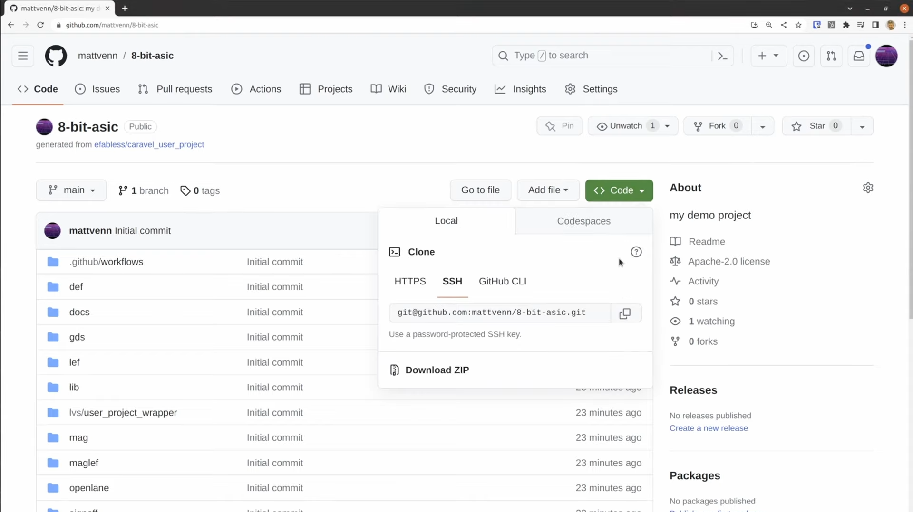
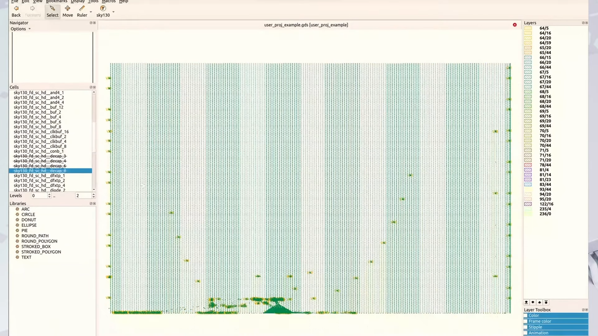

## 6.4 Cloning and Setup
<iframe src="https://drive.google.com/file/d/170Z610mlHnUuRkrmAAMxkURA9pntXxdf/preview" width="854" height="480" allow="autoplay"></iframe>

<!-- ### Lecture notes
<iframe src="https://docs.google.com/document/d/e/2PACX-1vT_D5nyG9QmsA2rHOCmo3YBy_Xn7u-5kibgnCFLGvCWnSn7l2V97UMKdAW-pTdpUsttTWmV06Qs54nT/pub?embedded=true" width="854" height="480"></iframe> -->

In this lesson, you'll get your repository set up on your own computer and install the open source design tools. You should already have a repository created on Github. If not then go to the lesson creating your repository.

The setup should take around 5 minutes and you will need about eight gigabytes of hard disk space. If you want to run the tests add another 25 minutes. We're using Ubuntu 20 but Ubuntu 22 or WSL on Windows also work. We'll start off by cloning the repository.



Go to the repository you created in the previous lesson, click the green code button with GitHub. You can either clone via https or SSH. Either will work and all it makes a difference when you want to push your changes. This will depend on the git client you use.

I use SSH keys so I'll click the SSH version. copy the URL and go to your terminal type "git clone (the name of your repo)" and press enter.
```sh
git clone git@github.com:duyhieubui/caravel_uniccas_example.git
```

After a few minutes you should have the new repository set up on your local computer. Now we're going to set up some environmental variables. An environment variable stores some information about the setup, for example where the ASIC design tools and the PDK will be installed. An environment variable is only active in one terminal and after you close the terminal they'll be lost. So make sure that you do all your work in one terminal and always start working by setting the environment variables. 
```sh
mkdir -p $HOME/asic
export OPENLANE_ROOT=$HOME/asic
export PDK_ROOT=$HOME/pdk
```

- `OPENLANE_ROOT` sets where the OpenLane Asic tools will be installed.
- `PDK_ROOT` sets where the Opensource Process Design Kit will be installed.

Now we can install Openlane and the PDK by typing:
```sh
make setup 
```
It takes about five to ten minutes.

It's a good idea to build an example project to test the tools. You can skip the following steps if you don't want to.

Try it but if you do have problems later, it's a good idea to come back here and run this test inside the Openlane directory. You will see two subdirectories. The user project example is an example project we can build it by just typing:

```sh
make user_proj_example
```

It takes about 30 minutes.

Now the project is complete and we can see that the GDS has been updated and we can load it with Klayout. I'll turn on a few of the cells so we can see more of the design inside.



If you need help or support the best place to go is the open source silicon slack community. 